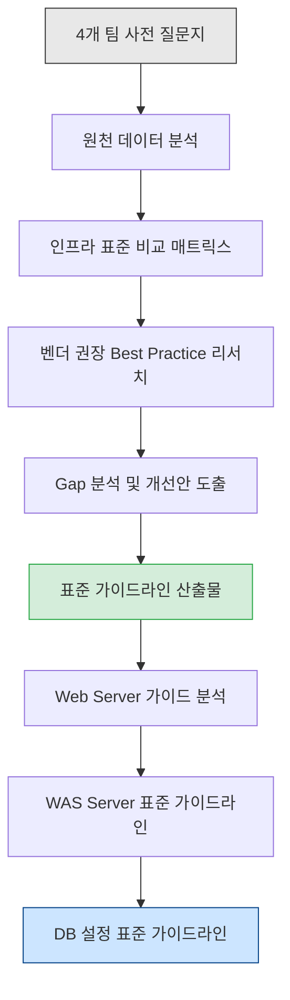
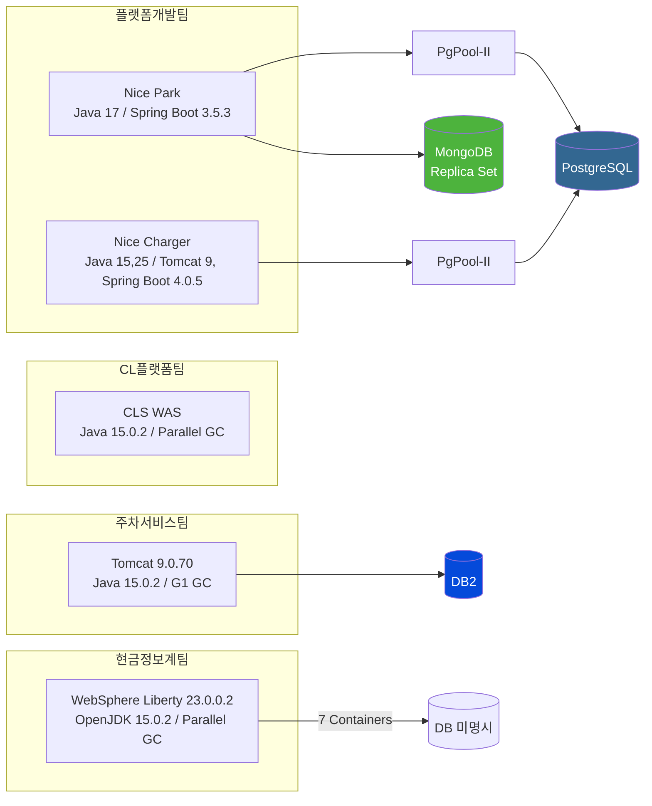

# Infrastructure Standardization Consulting Dashboard

## 1. Executive Summary & Project Overview

- 전사 Web/WAS 및 RDBMS/NoSQL 설정 파편화 해소를 위한 표준화 컨설팅 프로젝트
- 4개 팀의 사전 질문지 답변을 원천 데이터로 하여, 인프라 튜닝 권장사양 대비 Gap 분석 및 표준화 방안 도출
- 최종 산출물: 표준 설정 가이드라인 (WAS / PostgreSQL / MongoDB) 및 컨설팅사 리뷰 이메일
- **도메인 구성**: Web Server 튜닝 가이드 -> WAS Server 표준 가이드라인 -> DB 설정 표준 가이드라인 (PostgreSQL + MongoDB)

---

## 2. Agent Workflow & Governance (Harness Index)

에이전트 구동 시 실시간 컨텍스트 및 도메인별 실행 규칙은 `harness/` 하위 파일에서 관리한다.
`AGENTS.md`는 목차(Index) 역할만 수행하며, 구동 규칙은 harness 파일에서 로드한다.

### WAS Domain

- [WAS Standard Guide V3](./reports/was-standard-guide-v3.md) -- 산출물 최신본 (16GB Heap 정정, MongoDB 세션 개념 보완, somaxconn 연동 지침, Boot 2.x 호환성 정교화)
- [WAS Standard Guide V2](./reports/was-standard-guide-v2.md) -- 산출물 이전 버전 (참조용)
- [WAS Standard Guide V1](./reports/was-standard-guide.md) -- 산출물 초기 버전 (참조용)
- [WAS Domain Rules](./harness/was-rules.md) -- WAS 도메인 작업 시 에이전트 구동 규칙

### PostgreSQL Domain

- [DB Standard Guide V3](./reports/db-standard-guide-v3.md) -- 산출물 최신본 (PostgreSQL 4종 아키텍처 + MongoDB 8.3 + PgPool-II)
- [DB Standard Guide V2](./reports/db-standard-guide-v2.md) -- 산출물 이전 버전 (참조용)
- [DB Standard Guide V1](./reports/db-standard-guide.md) -- 산출물 이전 버전 (참조용)
- [PostgreSQL Domain Rules](./harness/postgresql-rules.md) -- PostgreSQL / PgPool-II 도메인 작업 시 에이전트 구동 규칙

### MongoDB Domain

- [DB Standard Guide V3](./reports/db-standard-guide-v3.md) -- 산출물 최신본 (MongoDB 8.3 기준 전면 갱신)
- [DB Standard Guide V2](./reports/db-standard-guide-v2.md) -- 산출물 이전 버전 (참조용)
- [DB Standard Guide V1](./reports/db-standard-guide.md) -- 산출물 이전 버전 (참조용)
- [MongoDB Domain Rules](./harness/mongodb-rules.md) -- MongoDB 도메인 작업 시 에이전트 구동 규칙

### 리서치

- [PostgreSQL Architecture Research](./research/postgresql/architecture-comparison.md) -- PostgreSQL 구성 아키텍처 비교 (Standalone, SR, PgPool+SR, Patroni, repmgr)
- [MongoDB Architecture Research](./research/mongodb/architecture-comparison.md) -- MongoDB 구성 아키텍처 비교 (Standalone, Replica Set, Sharded Cluster)
- [WAS-DB Integration Research](./research/was/was-db-integration.md) -- WAS-DB 연동 아키텍처별 타임아웃/커넥션 풀 산정 기준

### 공통

- [Agent Context & Token Management](./harness/agent-context.md) -- 프로젝트 상태, 팀별 메타데이터, HITL 이슈
- [Web Server Guide Analysis](./harness/webserver-standard-guide.md) -- Apache 튜닝 가이드 분석 청사진 (WAS/DB 가이드 설계 기준)
- [Vendor Research & Standards](./harness/vendor-research.md) -- 벤더별 권장 튜닝 파라미터 리서치 결과

### 커뮤니케이션

- [컨설팅사 리뷰 답변 메일](./email/re-was-guide-review.md) -- 1차 답변
- [컨설팅사 2차 답변 메일](./email/re-was-guide-review-2.md) -- 2차 답변

### 작업 관리

- [Todo Roadmap](./todo.md) -- 전체 프로젝트 로드맵 및 진행 상태
- **에이전트 규칙: 작업 완료 후 반드시 todo.md의 체크박스를 `[x]`로 갱신할 것**

---

## 3. Input Sources (Read-Only)

각 팀이 제출한 원천 데이터. 수정 금지, 읽기 전용.

| 소스 파일 | 대상 팀 | WAS | DB | 주요 특이사항 |
| :--- | :--- | :--- | :--- | :--- |
| [platform-develop-team.md](./source/platform-develop-team.md) | 플랫폼개발팀 | Apache Tomcat (Spring Boot 내장) | PostgreSQL (via PgPool-II), MongoDB (Replica Set) | 나이스파크/차저 2계계 통합 운영, RTO 10초/RPO 5초 |
| [cl-platform-team.md](./source/cl-platform-team.md) | CL플랫폼팀 | CLS 전용 WAS | 해당없음 | Old 영역 90% 임계치 도달, Parallel GC |
| [park-service-team.md](./source/park-service-team.md) | 주차서비스팀 | Apache Tomcat 9.0.70 | DB2 (PostgreSQL/MongoDB 미사용) | DB2 권한 부재로 타임아웃 설정 미확인 |
| [info-service-team.md](./source/info-service-team.md) | 현금정보계팀 | IBM WebSphere Liberty v23.0.0.2 ND | 해당없음 (WAS 정보만 제출) | 7개 컨테이너 고정/동적 메모리 이원 운영 |
| [apache-tuning-guide.md](./source/apache-tuning-guide.md) | -- | Apache HTTP Server | -- | 사내 Web Server 튜닝 가이드 V3.1, WAS/DB 가이드 설계 기준 |

---

## 4. 인프라 아키텍처 토폴로지

---

## 5. Phase Roadmap

- **Phase 1 (Completed):** 원천 소스 데이터 분석 및 인프라 표준 비교 매트릭스 도출
- **Phase 2 (Completed):** 벤더별 권장 Best Practice 알고리즘 리서치 및 Gap 분석
- **Phase 3 (Completed):** WAS Server 표준 가이드라인 최종본 작성 완료
- **Phase 4 (Completed):** DB 설정 표준 가이드라인 V3 (PostgreSQL 4종 아키텍처 + MongoDB 8.3 + PgPool-II + Patroni + Sharded Cluster)
- **Phase 5 (Pending):** MongoDB RAM/코어별 매트릭스 테이블 상세 수치 보완

---

## 6. Human-in-the-Loop: 사용자 확인 필요 이슈

| 이슈 ID | 팀 | 내용 | 상태 |
| :--- | :--- | :--- | :--- |
| `HITL-001` | 주차서비스팀 | DB2 타임아웃 설정 확인 | **Closed (Scope-out)** |
| `HITL-002` | 현금정보계팀 | DB 시스템 정보 누락 | **Closed (Scope-out)** |
| `HITL-003` | CL플랫폼팀 | Old 영역 90% 사용률에 대한 현재 대응 방안 및 GC 튜닝 이력 확인 필요 | 대기 |
| `HITL-004` | 플랫폼개발팀 | MongoDB COLLSCAN 모니터링 미수행 상태에 대한 운영 위험도 평가 필요 | 대기 |

---

## 7. 프로젝트 그라운드 룰

1. **언어:** 모든 산출물은 한국어로 작성 (시스템 설정 명칭, 파라미터, 소스 코드는 원문 유지)
2. **시각화:** 아키텍처 구조, 흐름도, 인프라 토폴로지는 Mermaid 차트로 적극 포함
3. **전문성:** 무분별한 이모지 사용 엄격 금지
4. **컨텍스트 분리:** 최상위 `AGENTS.md`는 목차(Index) 역할만 수행. 실시간 컨텍스트 및 에이전트 상태는 `harness/` 하위에서 관리
5. **점진적 연구:** 한 번에 모든 장표를 생성하지 않고, 최신 튜닝 알고리즘 및 벤더 권장사양 리서치를 병행하며 점진적 고도화
6. **Human-in-the-Loop:** 모호한 사안, 데이터 누락, 구조적 트레이드오프 발생 시 반드시 사용자(TA)에게 질문 후 진행
7. **Reports 산출물 관리:**
   - 표준 가이드라인 등의 Report 산출물은 `reports/` 폴더에서 관리
   - **파일명 규칙:** 간결한 영문 소문자 + 하이픈, 숫자 및 버전 정보는 파일명에 포함하지 않음 (예: `was-standard-guide.md`, `db-standard-guide.md`)
   - **버저닝 규칙:** 내용 갱신 시 `{기본파일명}-v{Int}.md` 형식으로 새 버전 파일을 생성하고, `AGENTS.md`의 링크는 항상 최신 버전을 가리킴. 이전 버전 파일은 히스토리 참조용으로 `reports/`에 보존
   - **Harness는 규칙 명시:** `harness/` 폴더는 에이전트 구동 규칙, 컨텍스트, 분석 결과 등 메타데이터만 관리. Report 산출물 본문은 절대 `harness/`에 작성하지 않음
8. **도메인별 구동 규칙:** 에이전트는 작업 대상 도메인(WAS / PostgreSQL / MongoDB)에 따라 해당 harness 규칙 파일을 필수로 로드 후 작업 시작
9. **리서치 관리:**
   - 모든 리서치 결과는 `research/` 폴더에 도메인별 하위 폴더(`postgresql/`, `mongodb/`, `was/`)로 분류하여 저장
   - **파일명 규칙:** 간결한 영문 소문자 + 하이픈 (예: `architecture-comparison.md`, `was-db-integration.md`)
   - **의무:** 에이전트는 리서치 수행 시 반드시 `research/`에 결과를 기록. harness/에 리서치 본문을 작성하지 않음
   - **출처 명시:** 모든 리서치 문서는 말미에 출처(Source)를 명시
   - **AGENTS.md 인덱스:** 새로운 리서치 파일 생성 시 AGENTS.md의 리서치 섹션에 링크를 추가
