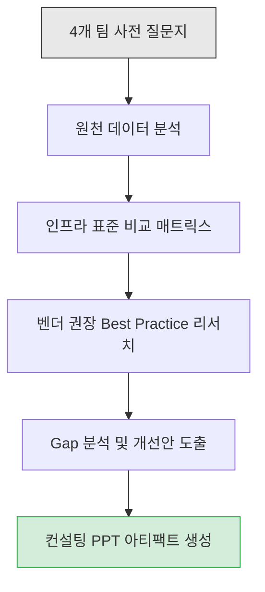
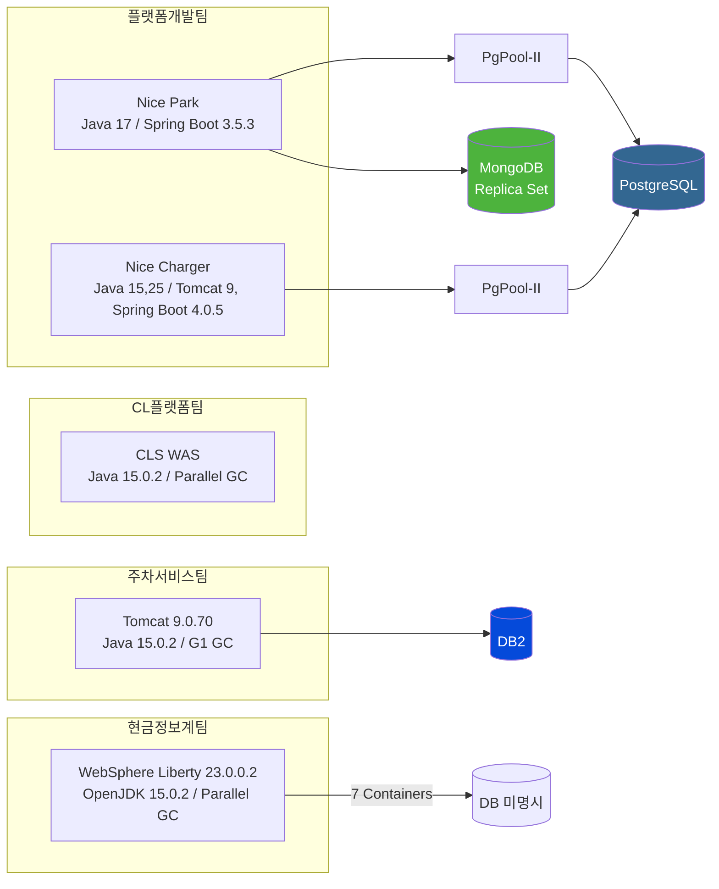
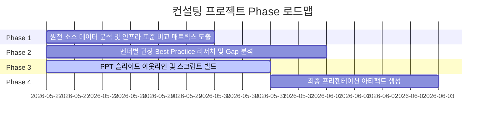

# Infrastructure Standardization Consulting Dashboard

## 1. Executive Summary & Project Overview

- 전사 Web/WAS 및 RDBMS/NoSQL 설정 파편화 해소를 위한 표준화 컨설팅 PPT 빌드업 프로젝트
- 4개 팀의 사전 질문지 답변을 원천 데이터로 하여, 인프라 튜닝 권장사양 대비 Gap 분석 및 표준화 방안 도출
- 최종 산출물: 경영진/실무진 대상 컨설팅 보고서 PPT (장표 + 스크립트)

---

## 2. Agent Workflow & Governance (Harness Index)

에이전트 구동 시 실시간 컨텍스트 및 상세 실행 가이드는 아래 Harness 파일에서 관리한다.

- [Agent Context & Token Management](./harness/agent-context.md)
  - 현재 에이전트 상태, Phase 진행 상황, 팀별 메타데이터 요약
- [PPT Structure & Research Specification](./harness/ppt-structure-spec.md)
  - PPT 장표 구성 명세, 벤더별 리서치 로그, 표준화 연구 기록

---

## 3. Input Sources (Read-Only)

각 팀이 제출한 원천 데이터. 수정 금지, 읽기 전용.

| 소스 파일 | 대상 팀 | WAS | DB | 주요 특이사항 |
| :--- | :--- | :--- | :--- | :--- |
| [platform-develop-team.md](./source/platform-develop-team.md) | 플랫폼개발팀 | Apache Tomcat (Spring Boot 내장) | PostgreSQL (via PgPool-II), MongoDB (Replica Set) | 나이스파크/차저 2계계 통합 운영, RTO 10초/RPO 5초 |
| [cl-platform-team.md](./source/cl-platform-team.md) | CL플랫폼팀 | CLS 전용 WAS | 해당없음 | Old 영역 90% 임계치 도달, Parallel GC |
| [park-service-team.md](./source/park-service-team.md) | 주차서비스팀 | Apache Tomcat 9.0.70 | DB2 (PostgreSQL/MongoDB 미사용) | DB2 권한 부재로 타임아웃 설정 미확인 |
| [info-service-team.md](./source/info-service-team.md) | 현금정보계팀 | IBM WebSphere Liberty v23.0.0.2 ND | 해당없음 (WAS 정보만 제출) | 7개 컨테이너 고정/동적 메모리 이원 운영 |

---

## 4. 인프라 아키텍처 토폴로지

---

## 5. Phase Roadmap

- **Phase 1 (Completed):** 원천 소스 데이터 분석 및 인프라 표준 비교 매트릭스 도출
- **Phase 2 (Completed):** 벤더별 권장 Best Practice 알고리즘 리서치 및 Gap 분석
- **Phase 3 (Completed):** 컨설팅사 피드백 유도형 PPT 슬라이드 덱 전수 완성 (A/B/C/D/E 5개 섹션, 19장 슬라이드, Mermaid 12개, 발표 스크립트 15개)
- **Phase 4:** 최종 OpenCode 기반 프리젠테이션 아티팩트 생성

---

## 6. Human-in-the-Loop: 사용자 확인 필요 이슈

| 이슈 ID | 팀 | 내용 | 상태 |
| :--- | :--- | :--- | :--- |
| `HITL-001` | 주차서비스팀 | DB2 타임아웃 설정 확인 | **Closed (Scope-out: DB2 전담 DBA 관리 영역)** |
| `HITL-002` | 현금정보계팀 | DB 시스템 정보 누락 | **Closed (Scope-out: WAS/JVM 분석으로 한정)** |
| `HITL-003` | CL플랫폼팀 | Old 영역 90% 사용률에 대한 현재 대응 방안 및 GC 튜닝 이력 확인 필요 | 대기 |
| `HITL-004` | 플랫폼개발팀 | MongoDB COLLSCAN 모니터링 미수행 상태에 대한 운영 위험도 평가 필요 | 대기 |

---

## 7. 프로젝트 그라운드 룰

1. **언어:** 모든 산출물은 한국어로 작성 (시스템 설정 명칭, 파라미터, 소스 코드는 원문 유지)
2. **시각화:** 아키텍처 구조, 흐름도, 인프라 토폴로지는 Mermaid 차트로 적극 포함
3. **전문성:** 무분별한 이모지 사용 엄격 금지
4. **컨텍스트 분리:** 최상위 `AGENTS.md`는 목차(Index) 역할만 수행. 실시간 컨텍스트 및 에이전트 상태는 `harness/` 하위에서 관리
5. **점진적 연구:** 한 번에 모든 장표를 생성하지 않고, 최신 튜닝 알고리즘 및 벤더 권장사양 리서치를 병행하며 점진적 고도화
6. **Human-in-the-Loop:** 모호한 사안, 데이터 누락, 구조적 트레이드오프 발생 시 반드시 사용자(TA)에게 질문 후 진행
