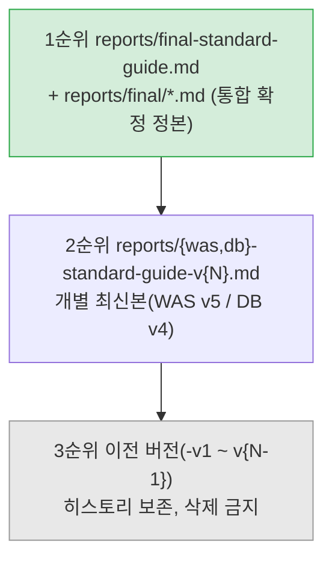

# 인프라 표준화 컨설팅 — TA 지식 베이스

## 프로젝트 정체성

전사 Web/WAS 및 RDBMS/NoSQL **설정 표준화 컨설팅** 산출물 저장소. 애플리케이션 코드가 없는 **문서 프로젝트**다. 4개 팀 사전 질문지(`source/`)를 원천 데이터로 표준 설정 가이드라인을 도출하며, 최종 수령자는 IT기획실 -> 전 사업팀. TA(의사결정권자)와의 HITL(Human-in-the-Loop) 게이트가 핵심 운영 방식이다.

## 하네스: 전사 인프라 튜닝 TA

**목표:** Web(Apache)/WAS(JVM)/PostgreSQL/PgPool-II/MongoDB/Linux 커널 튜닝 작업을 전문 에이전트 + 검증 스킬로 수행하고, 표준 가이드라인의 정합성(불변량)과 시효성을 보장한다.

**트리거:** 인프라 튜닝·표준값 산정·Gap 분석·가이드 갱신·커널 파라미터 작업 요청 시 `ta-infra-orchestrator` 스킬을 사용한다(라우팅 매트릭스가 도메인 에이전트/스킬을 지정). 단순 사실 질문은 직접 응답. 에이전트 정의는 `.claude/agents/`, 스킬은 `.claude/skills/`에 있다.

**변경 이력:**
| 날짜 | 변경 내용 | 대상 | 사유 |
|------|----------|------|------|
| 2026-08-21 | OpenCode 하네스 → Claude 하네스 전환. 에이전트 6종·스킬 9종 신규 구축, AGENTS.md·`.opencode/` 삭제, CLAUDE.md 신설 | 전체 | Claude Code 전환 + TA 튜닝 도메인(Web/커널) 확장 |

## 산출물 정본과 권위 계층

- 통합 확정본: `reports/final-standard-guide.md`
- 서버별 실무 배포본(정본): `reports/final/{web,was,postgresql,pgpool-ii,mongodb}.md`
- 정본 변경 시: 개별 최신본(-v{N}) 동기 갱신 + 본 파일 링크 최신화(절차는 `update-guide` 스킬)

## 디렉토리 지도

| 경로 | 역할 | 비고 |
| :--- | :--- | :--- |
| `.claude/` | Claude 하네스(에이전트/스킬) | 진입점: `ta-infra-orchestrator` |
| `harness/` | 지식 베이스 — 도메인 산정 규칙·불변량·팀 메타·리서치 로그 | 스킬들이 참조하는 정본 지식 |
| `reports/` | 표준 가이드라인 산출물 본문 | 본문은 항상 여기만 |
| `study/` | TA 기본 소양 학습 문서(Explanation). Linux 심화 6장 + 도메인 4장 | 설정값 정본 아님 |
| `research/` | 아키텍처 비교 리서치 | 출처 명시 의무 |
| `source/` | 4개 팀 질문지 + 사내 Apache 튜닝 가이드 | **읽기 전용, 수정 금지** |
| `email/` | 컨설팅사/DBA 리뷰 답변 | |
| `todo.md` | 작업 로드맵 | 작업 완료 시 체크박스 `[x]` 갱신 의무 |

### harness/ 핵심 파일 (스킬이 참조하는 지식 정본)

| 파일 | 역할 |
| :--- | :--- |
| `harness/was-rules.md` | WAS 산정 공식(Thread/Heap/GC/Pool) + 검증 체크리스트 |
| `harness/postgresql-rules.md` | PostgreSQL + PgPool-II 산정 공식 + 70% Ceiling + 체크리스트 |
| `harness/mongodb-rules.md` | MongoDB 산정 공식(WiredTiger/PSS/ESR) + Write Concern + 체크리스트 |
| `harness/gotchas.md` | 절대 금지 10종 + 도메인 공통 불변량(방화벽 30min, 70% Ceiling, 타임아웃 캐스케이드) |
| `harness/team-profiles.md` | 4개 팀 현재 설정 정규화(Gap 분석 기준) |
| `harness/vendor-research.md` | 벤더별 권장 튜닝값 리서치 로그 + 표준값 도출 근거 |
| `harness/webserver-standard-guide.md` | Apache 튜닝 가이드 분석 청사 |
| `harness/{overview,structure,workflow,conventions,commands}.md` | 프로젝트 메타(스코프/구조/HITL/산출 규칙) |

## 절대 금지 (요약 — 전체 목록은 harness/gotchas.md)

1. `source/` 하위 파일 수정 금지
2. `harness/`에 Report 본문 작성 금지
3. TA 승인 전 HITL 이슈 확정/변경 금지(활성: HITL-003 CL플랫폼 Old 영역, HITL-004 MongoDB COLLSCAN — `harness/workflow.md`)
4. 이전 버전 Report 파일 삭제 금지
5. 타임아웃 캐스케이드에 등호(`<=`) 사용 금지 — 엄격 부등호(`<`)
6. 정산/결제 도메인 PSA 구성 금지(반드시 PSS)
7. `autovacuum = off` 금지 / WAS `maxThreads = -1` 금지 / Metaspace `Max < Min` 금지
8. 일반 블로그·커뮤니티 글 출처 인용 금지(공식 문서·소스 코드·JIRA·release notes만)
9. PostgreSQL과 MongoDB 8.0 동일 호스트 병설 금지(overcommit/THP 충돌)

## 산출 규칙 (요약 — 전체는 harness/conventions.md)

한국어(시스템 용어는 원어). 이모지 금지, 구조는 mermaid. 수치는 단위 병기(예: `1,620,000ms (27min)`). 커밋 메시지 기존 형식(`#add`, `#fix`, `#change`) 유지.

## 버전 히스토리 (참조용)

- WAS: [V5](./reports/was-standard-guide-v5.md) | [V4](./reports/was-standard-guide-v4.md) | [V3](./reports/was-standard-guide-v3.md) | [V2](./reports/was-standard-guide-v2.md) | [V1](./reports/was-standard-guide.md)
- DB: [V4](./reports/db-standard-guide-v4.md) | [V3](./reports/db-standard-guide-v3.md) | [V2](./reports/db-standard-guide-v2.md) | [V1](./reports/db-standard-guide.md)
- 학습: [TA 커리큘럼](./study/README.md) | [Linux 심화](./study/linux/README.md)

## 리서치 (research/)

- [PostgreSQL 아키텍처 비교](./research/postgresql/architecture-comparison.md) — Standalone/SR/PgPool+SR/Patroni/repmgr
- [MongoDB 아키텍처 비교](./research/mongodb/architecture-comparison.md) — Standalone/Replica Set/Sharded Cluster
- [WAS-DB 연동 연구](./research/was/was-db-integration.md) — 아키텍처별 타임아웃/커넥션 풀 산정 기준

> 신규 리서치 추가 시 이 섹션에 링크를 추가한다(출처 명시 의무).
