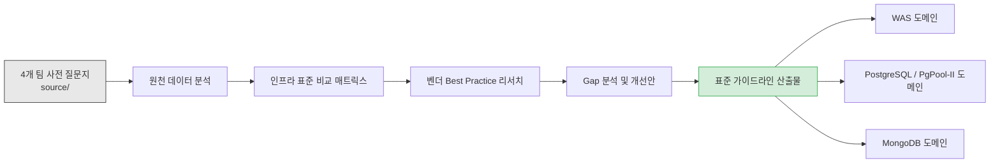

# 프로젝트 개요

> 본 파일은 Explanation(맥락/왜)을 담당한다. 사실(Reference)은 commands.md / conventions.md / 각 도메인 rules를 본다.

## 정체성

전사 Web/WAS 및 RDBMS/NoSQL **설정 표준화 컨설팅** 산출물 저장소.
애플리케이션 코드가 아닌 **문서 프로젝트(document)**.

## 목적

4개 팀이 제출한 사전 질문지를 원천 데이터로 삼아, 인프라 튜닝 권장 사양 대비 Gap을 분석하고 **표준 설정 가이드라인**을 도출한다. 최종 수령자: IT기획실 -> 전 사업팀.

## 도메인 구성

## 핵심 기술 영역 (스코프 내)

- WAS 환경: Tomcat(독립형/내장), WebSphere Liberty, CLS 전용 WAS
- JVM: Heap/Metaspace, GC 알고리즘(Parallel/G1/ZGC), Java 버전 표준화
- WAS 레벨 Connection Pool: HikariCP, Liberty ConnectionManager
- PostgreSQL: Streaming Replication + PgPool-II 연계
- MongoDB: Replica Set(PSS), WiredTiger, Profiling/인덱스 전략

## 스코프 외 (제외 영역)

- DB2 내부 파라미터 (별도 전담 DBA 관리) -- HITL-001 Closed
- 현금정보계팀 DB 시스템 (WAS/JVM 분석으로 한정) -- HITL-002 Closed

## 현재 상태 (Phase)

| Phase | 내용 | 상태 |
| :--- | :--- | :--- |
| 1 | 원천 데이터 분석 및 표준 비교 매트릭스 | Completed |
| 2 | 벤더 Best Practice 리서치 및 Gap 분석 | Completed |
| 3 | WAS 표준 가이드라인 작성 | Completed |
| 4 | DB 표준 가이드라인 V3 (PostgreSQL 4종 + MongoDB 8.3 + PgPool-II) | Completed |
| 5 | MongoDB RAM/코어별 매트릭스 상세 수치 보완 | Pending |

> 활성 HITL 2건 (HITL-003 CL플랫폼 Old 영역, HITL-004 MongoDB COLLSCAN). 상세는 workflow.md.

## 산출물 정본(canonical) 위치

- 통합 확정본: `reports/final-standard-guide.md`
- 서버별 실무 배포본: `reports/final/{was,postgresql,pgpool-ii,mongodb}.md`
- 히스토리(참조용): `reports/{was,db}-standard-guide*.md` (V1~V3)
