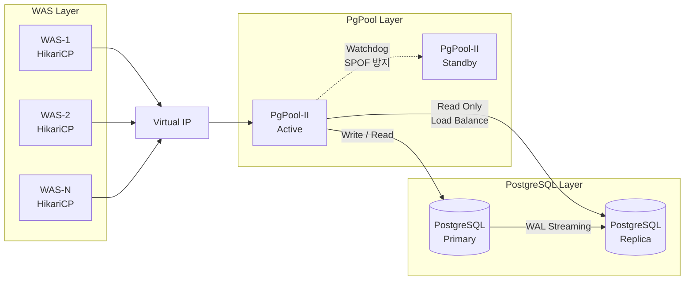

# PgPool-II 서버 설정 가이드

> **기준 문서**: `reports/final-standard-guide.md`
> **적용 범위**: PgPool-II (커넥션 풀링 + 로드 밸런싱 + 자동 페일오버)
> **연동**: PostgreSQL Streaming Replication (Primary / Replica)

---

## 1. OS 커널 설정

### 1.1 공통 파라미터 (모든 서버 적용)

```ini
# /etc/sysctl.d/99-infra-common.conf -- 모든 서버 공통
fs.file-max = 2097152
net.core.somaxconn = 4096
net.ipv4.tcp_max_syn_backlog = 4096
net.ipv4.tcp_keepalive_time = 300
net.ipv4.tcp_keepalive_intvl = 30
net.ipv4.tcp_keepalive_probes = 5
```

```bash
# /etc/security/limits.d/99-infra-common.conf -- 모든 서버 공통 (PAM 기반 적용)
*  soft  nofile  1048576
*  hard  nofile  1048576
*  soft  nproc   65536
*  hard  nproc   65536
```

> **systemd 서비스 필수 추가 설정**: 위 limits.conf는 PAM 기반 세션 접속에만 적용되며, **systemd가 관리하는 서비스 데몬에는 적용되지 않음**. 아래 systemd drop-in override를 반드시 추가 적용해야 함.

```ini
# /etc/systemd/system/pgpool.service.d/override.conf
# 서비스명은 설치 방법에 따라 pgpool-II.service 일 수 있음
[Service]
LimitNOFILE=1048576
LimitNPROC=65536
```

```bash
# systemd 적용
systemctl daemon-reload
systemctl restart pgpool
```

| 파라미터 | 값 | 역할 |
|:---|:---|:---|
| fs.file-max | 2,097,152 | 시스템 전체 FD 상한. 대규모 동시 접속 시 Too many open files 방지 |
| net.core.somaxconn | 4,096 | OS 커널 TCP Listen Backlog. 트래픽 스파이크 시 패킷 Drop 방지 |
| net.ipv4.tcp_max_syn_backlog | 4,096 | SYN Queue 상한. somaxconn과 세트로 설정 |
| net.ipv4.tcp_keepalive_time | 300 (5분) | TCP Keepalive 최초 대기 시간. 기본 7,200초 단축 |
| net.ipv4.tcp_keepalive_intvl | 30 | Keepalive 프로브 재전송 간격 |
| net.ipv4.tcp_keepalive_probes | 5 | 연속 실패 시 dead 판정. 300+30x5=450초 내 확정 |
| ulimit -n (nofile) | 1,048,576 | 프로세스당 FD 한도. infinity 시 커널 ~8.6GB 할당 (Bug 2394600) |
| ulimit -u (nproc) | 65,536 | 프로세스/스레드 수 상한. Fork Bomb 방지 |

### 1.2 PgPool-II 서버 전용 파라미터

```ini
# /etc/sysctl.d/99-pgpool-tuning.conf -- PgPool-II 서버 전용
vm.swappiness = 10
kernel.sem = 250 32000 250 128
net.ipv4.tcp_fin_timeout = 15
net.ipv4.tcp_tw_reuse = 1
net.ipv4.ip_local_port_range = 32768 65535
```

| 파라미터 | 값 | 역할 |
|:---|:---|:---|
| kernel.sem | 250 32000 250 128 | child 프로세스당 System V 세마포어. SEMOPM(3번째) 32->250 상향. num_init_children=120 구동 시 세마포어 병목 해소. 형식: SEMMSL SEMMNS SEMOPM SEMMNI |
| vm.swappiness | 10 | PgPool은 WAS와 유사한 네트워크 프록시 역할. JVM과 동일한 수준 적용 |
| tcp_fin_timeout | 15 | PgPool->PostgreSQL 연결 종료 후 TIME_WAIT 소켓 신속 정리 |
| tcp_tw_reuse | 1 | TIME_WAIT 소켓 재사용으로 포트 고갈 방지 |
| ip_local_port_range | 32768~65535 | PgPool이 WAS로부터 커넥션 받아 PostgreSQL로 아웃바운드 연결. WAS와 동일 적용 |

> **PgPool-II + PostgreSQL 병설 서버**: 양쪽 파라미터 모두 적용 필요. 단, vm.swappiness는 충돌하므로 DB 서버 기준인 1을 우선 적용.
>
> **4GB RAM 독립 서버**: num_init_children=120 구동 시 프로세스 메모리 점유율(약 1GB)은 안정 범위이나, kernel.sem 설정이 선행되어야 함.

### 1.3 적용 명령어

```bash
sysctl --load /etc/sysctl.d/99-infra-common.conf
sysctl --load /etc/sysctl.d/99-pgpool-tuning.conf
systemctl daemon-reload
systemctl restart pgpool
```

---

## 2. PgPool-II 설정

### 2.1 아키텍처



### 2.2 PgPool-II 전용 파라미터

| 파라미터 | 표준값 | 역할 |
|:---|:---|:---|
| num_init_children | 120 | 동시 클라이언트 연결(프로세스) 수. PgPool 연결 풀링으로 실제 백엔드 동시 연결은 100 이하 유지. 초과 클라이언트는 Listen Queue에서 대기 |
| max_pool | 1 (단일 DB/계정) | child 프로세스당 DB 연결 수. 불필요한 상향 시 백엔드 연결 기하급수적 증가 |
| child_life_time | 1,680 (28min) | child 프로세스 최대 생존 시간. DB idle_session_timeout(30min)보다 짧게 설정 |
| connection_life_time | 1,680 (28min) | PgPool->PostgreSQL 백엔드 연결 최대 수명. DB 세션 타임아웃(30min)보다 짧게 |
| client_idle_limit | 600 (10min) | 클라이언트(WAS) 유휴 최대 시간. 좀비 커넥션이 PgPool 프로세스 점유 방지 |
| reserved_connections | 1 | PgPool 관리자 접속 예약 슬롯. 장애 시 DBA 접속 불가 상황 방지 |
| load_balance_mode | on | 읽기 쿼리(SELECT)를 Replica로 자동 분산. INSERT/UPDATE/DELETE는 항상 Primary |
| backend_clustering_mode | 'streaming_replication' | v4.x+ 스트리밍 복제 모드. 기존 master_slave_mode는 폐지 |
| backend_weight0 / weight1 | Primary 1 / Replica 3 | 읽기 쿼리 분산 비율. Primary는 쓰기 전담 + 최소 읽기, Replica에 읽기 부하 집중 (1:3 = 25%:75%) |

> num_init_children=120은 PgPool 공식 권고 공식(max_pool x num_init_children <= max_connections - superuser_reserved)을 초과(1x120 > 97). 단, 연결 풀링으로 실제 동시 백엔드 연결은 100 이하 유지됨. **피크 타임 SHOW POOL_PROCESSES 모니터링 필수**.

### 2.3 pgpool.conf 전문

```conf
# -------------------------------------------------------
# Connection Pooling
# -------------------------------------------------------
num_init_children = 120           # DBA 운영 권장값 (PgPool 연결 풀링으로 백엔드 100 이하 유지)
max_pool = 1                     # 단일 DB/단일 계정
child_life_time = 1680           # 28min
connection_life_time = 1680      # 28min
client_idle_limit = 600          # 10min
reserved_connections = 1         # 관리 접속 보장

# -------------------------------------------------------
# Load Balancing
# -------------------------------------------------------
load_balance_mode = on
backend_clustering_mode = 'streaming_replication'
backend_weight0 = 1              # Primary (쓰기 전담 + 최소 읽기)
backend_weight1 = 3              # Replica (읽기 부하 집중)

# -------------------------------------------------------
# Health Check
# -------------------------------------------------------
health_check_period = 30
health_check_timeout = 10
health_check_max_retries = 3

# -------------------------------------------------------
# Watchdog (SPOF 방지)
# -------------------------------------------------------
use_watchdog = on
wd_hostname = 'pgpool-node1'
wd_vip = '10.0.0.100'

# -------------------------------------------------------
# Auto Failover
# -------------------------------------------------------
failover_command = '/etc/pgpool-II/failover.sh'
```

---

## 3. 커넥션 풀 & 타임아웃 설정

### 3.1 타임아웃 캐스케이드 (WAS -> PgPool -> PostgreSQL)

```
WAS HikariCP maxLifetime (1,620,000ms = 27min)
     |
     |  maxLifetime < child_life_time < idle_session_timeout
     v
PgPool-II child_life_time (1,680s = 28min)
     |
     |  child_life_time < idle_session_timeout
     v
PostgreSQL idle_session_timeout (1,800,000ms = 30min)
```

> 엄격한 부등호(<)로 계층 간 타임아웃 격리. HikariCP가 PgPool보다 1분, PgPool이 DB보다 2분 먼저 커넥션 폐기.

### 3.2 PgPool-II 경유 커넥션 풀 가이드

```
PgPool-II 공식 권고 (참고):
  max_pool x num_init_children <= (max_connections - superuser_reserved_connections)
  -> 공식 준수 시: 1 x 97 <= (100 - 3) = 97

DBA 운영 권장 (적용값):
  num_init_children = 120
  -> 공식 초과(1 x 120 > 97)이나, PgPool-II 연결 풀링(커넥션 캐싱 및 재사용)으로
     실제 동시 백엔드 연결은 100 이하로 유지됨

WAS -> PgPool 계층:
  WAS 전체 풀 합산(80~100) <= num_init_children(120)
  -> 초과 클라이언트는 PgPool Listen Queue에서 대기 후 순차 처리
```

> PgPool-II 환경에서는 직접 연결의 70% Ceiling Rule이 PgPool-II의 연결 풀링으로 대체됨. WAS 풀 합산이 num_init_children을 초과해도 PgPool Listen Queue가 초과분을 안전하게 흡수.

### 3.3 PgPool 산출 예시 (플랫폼개발팀 나이스M 기준)

| 항목 | 산출 수치 | 비고 |
|:---|:---|:---|
| 대상 서비스 | 나이스M (Nice M) | PostgreSQL(via PgPool-II) + MongoDB 운영 |
| 총 WAS 인스턴스 수 | 4개 (이중화) | WAS 표준 설정 기준 |
| 전체 WAS 풀 합산 | 80~100개 | 인스턴스당 20~25 |
| PgPool num_init_children | 120 | DBA 운영 권장값. 연결 풀링으로 백엔드 동시 연결 100 이하 유지 |
| PgPool max_pool | 1 | 단일 DB/단일 계정 |
| PgPool -> PG 최대 백엔드 연결 | 100개 (이론적 상한) | 연결 풀링으로 실제 동시 점유는 100 이하 |
| PG max_connections | 100 | OOM 예방 100 고정 |
| WAS 풀(80~100) <= num_init_children(120) | 정상 | 초과 클라이언트는 Listen Queue 대기 후 순차 처리 |

---

## 4. 모니터링 체크리스트

| 모니터링 항목 | 조회 방법 | 경고(Warning) | 위험(Critical) | 조치 |
|:---|:---|:---|:---|:---|
| PgPool 커넥션 사용률 | `SHOW POOL_NODES` + `SHOW POOL_PROCESSES` | 사용률 > 80% | 사용률 > 95% | num_init_children 증설 검토 |
| 피크 활성 백엔드 연결 수 | `SHOW POOL_PROCESSES` | 80+ 동시 활성 | 100 도달 | "too many clients already" 위험. 트래픽 분산 또는 num_init_children 조정 |

> 피크 타임 백엔드 연결 수 주기적 모니터링 필수. 120개 child 프로세스가 동시에 백엔드 연결을 요구하는 극단적 피크 시 PostgreSQL이 "too many clients already" 반환 + failover 트리거 가능.

---

## 5. 검증 체크리스트

- [ ] SHOW POOL_PROCESSES 피크 활성 연결 < 100 -- 최악 시나리오 방지 (위반 시: "too many clients already" + failover 트리거)
- [ ] reserved_connections >= 1 -- 관리 접속 보장 (위반 시: 장애 시 DBA 접속 불가)
- [ ] max_pool = 1 (단일 DB/계정) -- 불필요한 커넥션 폭증 방지 (위반 시: 백엔드 연결 기하급수적 증가)
- [ ] Watchdog 활성화 (use_watchdog = on) -- SPOF 방지 (위반 시: PgPool 단일 구성 시 전체 장애)
- [ ] WAS maxLifetime < PgPool child_life_time < DB idle_session_timeout -- 엄격 부등호 (위반 시: 레이스 컨디션)
- [ ] kernel.sem = "250 32000 250 128" -- 세마포어 병목 해소 (위반 시: PgPool 기동 시 "could not create semaphore set" 에러)
- [ ] load_balance_mode = on -- 읽기 분산 활성화 (위반 시: 모든 읽기가 Primary로 집중되어 과부하)
- [ ] backend_clustering_mode = 'streaming_replication' -- v4.x+ 표준 모드 (위반 시: 기존 master_slave_mode는 폐지됨)
- [ ] failover_command 지정 -- 자동 페일오버 스크립트 (위반 시: Primary 다운 시 수동 개입 필요)
- [ ] child_life_time < DB idle_session_timeout -- 타임아웃 캐스케이드 준수 (위반 시: DB 강제 차단 전 PgPool이 먼저 회수 불가)
- [ ] systemd 서비스 LimitNOFILE/LimitNPROC override 설정 -- 서비스 데몬 ulimit 적용 (미적용 시: limits.conf 무시되어 기본값 1024로 동작)
