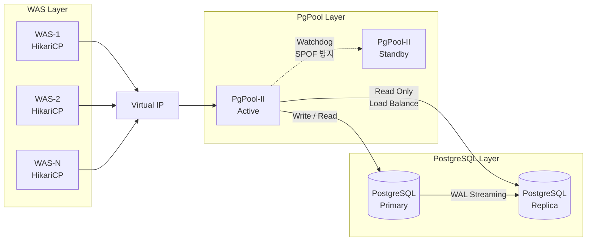
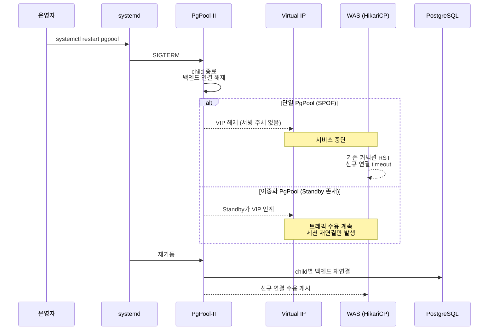
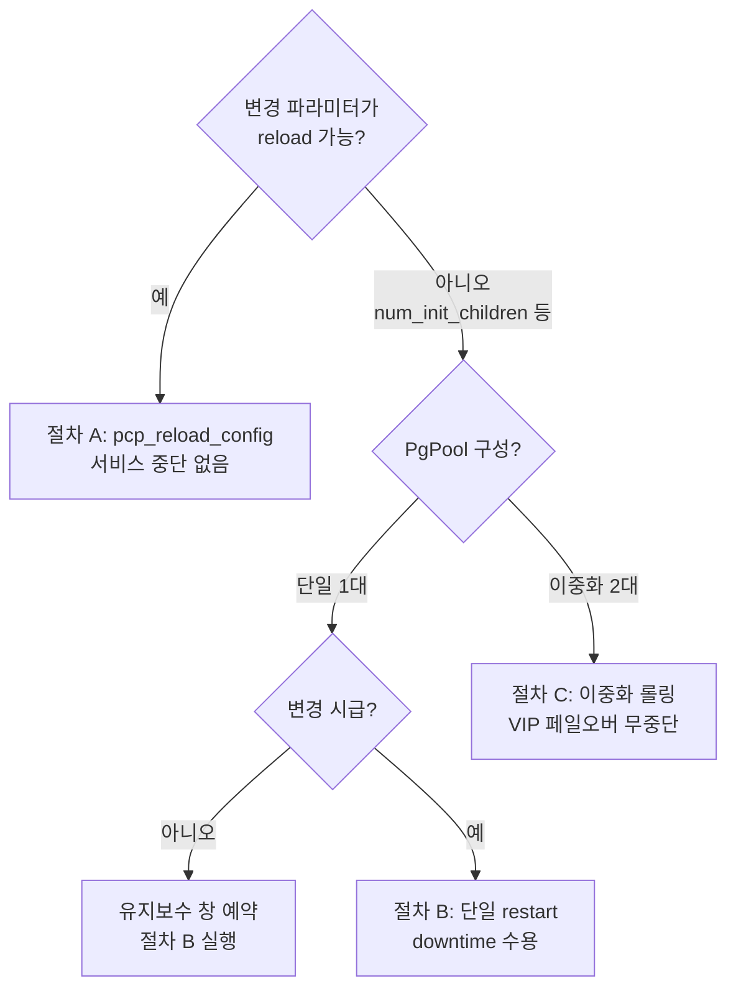

# PgPool-II 서버 설정 가이드

> **기준 문서**: `reports/final-standard-guide.md`
> **적용 범위**: PgPool-II (커넥션 풀링 + 로드 밸런싱 + 자동 페일오버)
> **연동**: PostgreSQL Streaming Replication (Primary / Replica)

---

## 0. 적용 전제

PgPool-II는 WAS의 비싼 DB 커넥션을 다중화하고, 읽기 분산·HA를 담당한다. 아래 토폴로지와 전제를 반드시 함께 확인한다.



- **커넥션 풀링으로 70% Ceiling 대체**: PgPool 환경에서는 직접 연결의 70% Ceiling Rule이 PgPool-II의 연결 풀링으로 대체됨. WAS 풀 합산이 num_init_children을 초과해도 PgPool Listen Queue가 초과분을 안전하게 흡수
- **타임아웃 캐스케이드**: `WAS maxLifetime(27min) < PgPool child_life_time(28min) < PG idle_session_timeout(30min) <= 방화벽 최단(30min)` (방화벽은 30~60min 범위, 최단 30min 기준 설계. keepalive 60s로 잔여 레이스 방어)
- **kernel.sem 선행 필수**: `num_init_children=120` 구동 시 세마포어 상한 필수. 미설정 시 구동 실패
- **이중화 의무 (표준 2대)**: PgPool-II 단일 구성은 SPOF. 표준은 Active+Standby 2대(Watchdog VIP 이중화). **1대 운영 중인 곳은 2대로 증설 필수**. 서비스 규모가 작아 오버엔지니어링 우려 시 **IT기획실 문의** (예외 승인 후 단일 유지 가능). 상세 절차는 §6.7

---

## 1. OS 커널 설정

### 1.1 공통 파라미터 (모든 서버 적용)

```ini
# /etc/sysctl.d/99-infra-common.conf -- 모든 서버 공통
fs.file-max = 2097152
net.core.somaxconn = 4096
net.ipv4.tcp_max_syn_backlog = 4096
net.ipv4.tcp_keepalive_time = 300
net.ipv4.tcp_keepalive_intvl = 30
net.ipv4.tcp_keepalive_probes = 5
```

```bash
# /etc/security/limits.d/99-infra-common.conf -- 모든 서버 공통 (PAM 기반 적용)
*  soft  nofile  1048576
*  hard  nofile  1048576
*  soft  nproc   65536
*  hard  nproc   65536
```

> **systemd 서비스 필수 추가 설정**: 위 limits.conf는 PAM 기반 세션 접속에만 적용되며, **systemd가 관리하는 서비스 데몬에는 적용되지 않음**. 아래 systemd drop-in override를 반드시 추가 적용해야 함.

```ini
# /etc/systemd/system/pgpool.service.d/override.conf
# 서비스명은 설치 방법에 따라 pgpool-II.service 일 수 있음
[Service]
LimitNOFILE=1048576
LimitNPROC=65536
```

```bash
# systemd 적용
systemctl daemon-reload
systemctl restart pgpool
```

| 파라미터 | 값 | 역할 |
|:---|:---|:---|
| fs.file-max | 2,097,152 | 시스템 전체 FD 상한. 대규모 동시 접속 시 Too many open files 방지 |
| net.core.somaxconn | 4,096 | OS 커널 TCP Listen Backlog. 트래픽 스파이크 시 패킷 Drop 방지 |
| net.ipv4.tcp_max_syn_backlog | 4,096 | SYN Queue 상한. somaxconn과 세트로 설정 |
| net.ipv4.tcp_keepalive_time | 300 (5분) | TCP Keepalive 최초 대기 시간. 기본 7,200초 단축 |
| net.ipv4.tcp_keepalive_intvl | 30 | Keepalive 프로브 재전송 간격 |
| net.ipv4.tcp_keepalive_probes | 5 | 연속 실패 시 dead 판정. 300+30x5=450초 내 확정 |
| ulimit -n (nofile) | 1,048,576 | 프로세스당 FD 한도. infinity 시 커널 ~8.6GB 할당 (Bug 2394600) |
| ulimit -u (nproc) | 65,536 | 프로세스/스레드 수 상한. Fork Bomb 방지 |

### 1.2 PgPool-II 서버 전용 파라미터

```ini
# /etc/sysctl.d/99-pgpool-tuning.conf -- PgPool-II 서버 전용
vm.swappiness = 10
kernel.sem = 250 32000 250 128
net.ipv4.tcp_fin_timeout = 15
net.ipv4.tcp_tw_reuse = 1
net.ipv4.ip_local_port_range = 32768 65535
```

| 파라미터 | 값 | 역할 |
|:---|:---|:---|
| kernel.sem | 250 32000 250 128 | child 프로세스당 System V 세마포어. SEMOPM(3번째) 32->250 상향. num_init_children=120 구동 시 세마포어 병목 해소. 형식: SEMMSL SEMMNS SEMOPM SEMMNI |
| vm.swappiness | 10 | PgPool은 WAS와 유사한 네트워크 프록시 역할. JVM과 동일한 수준 적용 |
| tcp_fin_timeout | 15 | PgPool->PostgreSQL 연결 종료 후 TIME_WAIT 소켓 신속 정리 |
| tcp_tw_reuse | 1 | TIME_WAIT 소켓 재사용으로 포트 고갈 방지 |
| ip_local_port_range | 32768~65535 | PgPool이 WAS로부터 커넥션 받아 PostgreSQL로 아웃바운드 연결. WAS와 동일 적용 |

> **PgPool-II + PostgreSQL 병설 서버**: 양쪽 파라미터 모두 적용 필요. 단, vm.swappiness는 충돌하므로 DB 서버 기준인 1을 우선 적용.
>
> **4GB RAM 독립 서버**: num_init_children=120 구동 시 프로세스 메모리 점유율(약 1GB)은 안정 범위이나, kernel.sem 설정이 선행되어야 함.

### 1.3 적용 명령어

```bash
sysctl --load /etc/sysctl.d/99-infra-common.conf
sysctl --load /etc/sysctl.d/99-pgpool-tuning.conf
systemctl daemon-reload
systemctl restart pgpool
```

---

## 2. PgPool-II 설정

### 2.1 PgPool-II 전용 파라미터

| 파라미터 | 표준값 | 역할 |
|:---|:---|:---|
| num_init_children | 120 | 동시 클라이언트 연결(프로세스) 수. PgPool 연결 풀링으로 실제 백엔드 동시 연결은 100 이하 유지. 초과 클라이언트는 Listen Queue에서 대기 |
| max_pool | 1 (단일 DB/계정) | child 프로세스당 DB 연결 수. 불필요한 상향 시 백엔드 연결 기하급수적 증가 |
| child_life_time | 1,680 (28min) | child 프로세스 최대 생존 시간. DB idle_session_timeout(30min)보다 짧게 설정 |
| connection_life_time | 1,680 (28min) | PgPool->PostgreSQL 백엔드 연결 최대 수명. DB 세션 타임아웃(30min)보다 짧게 |
| client_idle_limit | 600 (10min) | 클라이언트(WAS) 유휴 최대 시간. 좀비 커넥션이 PgPool 프로세스 점유 방지 |
| reserved_connections | 1 | PgPool 관리자 접속 예약 슬롯. 장애 시 DBA 접속 불가 상황 방지 |
| load_balance_mode | on | 읽기 쿼리(SELECT)를 Replica로 자동 분산. INSERT/UPDATE/DELETE는 항상 Primary |
| backend_clustering_mode | 'streaming_replication' | v4.x+ 스트리밍 복제 모드. 기존 master_slave_mode는 폐지 |
| backend_weight0 / weight1 | Primary 1 / Replica 3 | 읽기 쿼리 분산 비율. Primary는 쓰기 전담 + 최소 읽기, Replica에 읽기 부하 집중 (1:3 = 25%:75%) |

> num_init_children=120은 PgPool 공식 권고 공식(max_pool x num_init_children <= max_connections - superuser_reserved)을 초과(1x120 > 97). 단, 연결 풀링으로 실제 동시 백엔드 연결은 100 이하 유지됨.
>
> **쿼리 취소(cancellation) 시 연결 2배 소모 주의**: PgPool 공식은 쿼리 취소 발생 시 max_pool x num_init_children x 2 <= max_connections - superuser_reserved 를 요구. 피크 + 쿼리 취소 겹칠 시 PostgreSQL "too many clients already" → failover 트리거 위험.
>
> **운영 가드 (2026-07-02 TA 확정, 120 유지 조건)**: (1) 피크 타임 `SHOW POOL_PROCESSES` 모니터링 필수 (2) 쿼리 취소 빈도 추적 — statement_timeout/lock_timeout 가드레일로 취소 최소화 (3) "too many clients already" 발생 시 failover 트리거될 수 있음을 운영 Runbook에 명시.

### 2.2 pgpool.conf 전문

```conf
# -------------------------------------------------------
# Connection Pooling
# -------------------------------------------------------
num_init_children = 120           # DBA 운영 권장값 (PgPool 연결 풀링으로 백엔드 100 이하 유지)
max_pool = 1                     # 단일 DB/단일 계정
child_life_time = 1680           # 28min
connection_life_time = 1680      # 28min
client_idle_limit = 600          # 10min
reserved_connections = 1         # 관리 접속 보장

# -------------------------------------------------------
# Load Balancing
# -------------------------------------------------------
load_balance_mode = on
backend_clustering_mode = 'streaming_replication'
backend_weight0 = 1              # Primary (쓰기 전담 + 최소 읽기)
backend_weight1 = 3              # Replica (읽기 부하 집중)

# -------------------------------------------------------
# Health Check
# -------------------------------------------------------
health_check_period = 30
health_check_timeout = 10
health_check_max_retries = 3

# -------------------------------------------------------
# Watchdog (SPOF 방지)
# -------------------------------------------------------
use_watchdog = on
wd_hostname = 'pgpool-node1'
wd_vip = '10.0.0.100'

# -------------------------------------------------------
# Auto Failover
# -------------------------------------------------------
failover_command = '/etc/pgpool-II/failover.sh'
```

---

## 3. 타임아웃 & 커넥션 캐스케이드

### 3.1 타임아웃 캐스케이드 (WAS -> PgPool -> PostgreSQL)

```
WAS HikariCP maxLifetime (1,620,000ms = 27min)
     |
     |  maxLifetime < child_life_time < idle_session_timeout
     v
PgPool-II child_life_time (1,680s = 28min)
     |
     |  child_life_time < idle_session_timeout
     v
PostgreSQL idle_session_timeout (1,800,000ms = 30min)
```

> 엄격한 부등호(<)로 계층 간 타임아웃 격리. HikariCP가 PgPool보다 1분, PgPool이 DB보다 2분 먼저 커넥션 폐기.

### 3.2 PgPool-II 경유 커넥션 풀 가이드

```
PgPool-II 공식 권고 (참고):
  max_pool x num_init_children <= (max_connections - superuser_reserved_connections)
  -> 공식 준수 시: 1 x 97 <= (100 - 3) = 97

DBA 운영 권장 (적용값):
  num_init_children = 120
  -> 공식 초과(1 x 120 > 97)이나, PgPool-II 연결 풀링(커넥션 캐싱 및 재사용)으로
     실제 동시 백엔드 연결은 100 이하로 유지됨

WAS -> PgPool 계층:
  WAS 전체 풀 합산(80~100) <= num_init_children(120)
  -> 초과 클라이언트는 PgPool Listen Queue에서 대기 후 순차 처리
```

> PgPool-II 환경에서는 직접 연결의 70% Ceiling Rule이 PgPool-II의 연결 풀링으로 대체됨. WAS 풀 합산이 num_init_children을 초과해도 PgPool Listen Queue가 초과분을 안전하게 흡수.

---

## 4. 검증 체크리스트

- [ ] SHOW POOL_PROCESSES 피크 활성 연결 < 100 -- 최악 시나리오 방지 (위반 시: "too many clients already" + failover 트리거)
- [ ] reserved_connections >= 1 -- 관리 접속 보장 (위반 시: 장애 시 DBA 접속 불가)
- [ ] max_pool = 1 (단일 DB/계정) -- 불필요한 커넥션 폭증 방지 (위반 시: 백엔드 연결 기하급수적 증가)
- [ ] Watchdog 활성화 (use_watchdog = on) -- SPOF 방지 (위반 시: PgPool 단일 구성 시 전체 장애)
- [ ] WAS maxLifetime < PgPool child_life_time < DB idle_session_timeout -- 엄격 부등호 (위반 시: 레이스 컨디션)
- [ ] kernel.sem = "250 32000 250 128" -- 세마포어 병목 해소 (위반 시: PgPool 기동 시 "could not create semaphore set" 에러)
- [ ] load_balance_mode = on -- 읽기 분산 활성화 (위반 시: 모든 읽기가 Primary로 집중되어 과부하)
- [ ] backend_clustering_mode = 'streaming_replication' -- v4.x+ 표준 모드 (위반 시: 기존 master_slave_mode는 폐지됨)
- [ ] failover_command 지정 -- 자동 페일오버 스크립트 (위반 시: Primary 다운 시 수동 개입 필요)
- [ ] child_life_time < DB idle_session_timeout -- 타임아웃 캐스케이드 준수 (위반 시: DB 강제 차단 전 PgPool이 먼저 회수 불가)
- [ ] systemd 서비스 LimitNOFILE/LimitNPROC override 설정 -- 서비스 데몬 ulimit 적용 (미적용 시: limits.conf 무시되어 기본값 1024로 동작)

---

## 5. 모니터링 체크리스트

| 모니터링 항목 | 조회 방법 | 경고(Warning) | 위험(Critical) | 조치 |
|:---|:---|:---|:---|:---|
| PgPool 커넥션 사용률 | `SHOW POOL_NODES` + `SHOW POOL_PROCESSES` | 사용률 > 80% | 사용률 > 95% | num_init_children 증설 검토 |
| 쿼리 취소 빈도 | `SHOW POOL_PROCESSES` + PgPool 로그(cancellation) | 빈발 시 | 피크 + 취소 겹침 | statement_timeout/lock_timeout 가드레일 점검. "too many clients already" → failover 위험 |
| 피크 활성 백엔드 연결 수 | `SHOW POOL_PROCESSES` | 80+ 동시 활성 | 100 도달 | "too many clients already" 위험. 트래픽 분산 또는 num_init_children 조정 |

> 피크 타임 백엔드 연결 수 주기적 모니터링 필수. 120개 child 프로세스가 동시에 백엔드 연결을 요구하는 극단적 피크 시 PostgreSQL이 "too many clients already" 반환 + failover 트리거 가능.

---

## 6. 운영서버 적용 가이드: 무중단 롤링 restart 절차

> **검증 기준**: PgPool-II 공식 문서 (config-setting.html, pcp-reload-config.html, server-temporarily-shutdown.html).
> **전제 아키텍처**: §0의 PgPool-II + Streaming Replication. 단일/이중화 구성별 절차 분리.
> **대칭 문서**: `reports/final/postgresql.md` §6 (PostgreSQL 노드 롤링 restart).

`systemctl restart pgpool`은 PgPool 마스터 프로세스와 모든 child 프로세스를 종료 후 재기동한다. 종료 시점에 WAS→PgPool 커넥션과 PgPool→PostgreSQL 백엔드 연결이 모두 단절된다. **단일 PgPool 구성에서는 VIP 서빙 주체가 사라져 서비스 중단이 불가피**하며, 이중화(Active+Standby) 구성에서만 VIP 페일오버로 무중단 restart가 가능하다.

### 6.1 restart 시 서비스 영향



- 단일 구성 downtime: PgPool 종료 + 재기동 + 백엔드 재연결 = 수 초 ~ 1분
- 이중화 구성: Standby VIP 인계로 downtime 없음 (수 초의 세션 재연결 가능)
- PostgreSQL은 계속 실행 중 (failover 트리거되지 않음)

### 6.2 파라미터 reload vs restart 분류

PgPool-II는 `pcp_reload_config`(SIGHUP)로 대부분의 파라미터를 reload 한다. 단, 일부 파라미터는 full restart가 필요하다.

§2.1 표준 파라미터의 reload/restart 분류:

| 파라미터 | 표준값 | reload 가능? | 비고 |
|:---|:---|:---:|:---|
| `num_init_children` | 120 | 아니오 | fork된 child 프로세스 수. 전체 child 재생성 필요 |
| `max_pool` | 1 | 아니오 | child당 DB 연결 수. 구조적 변경 |
| `use_watchdog` | on | 아니오 | Watchdog 구조 변경 |
| `wd_hostname` / `wd_vip` | 노드 정보 | 아니오 | Watchdog 네트워크 설정 |
| `listen_addresses` / `port` | - | 아니오 | 리스닝 소켓 |
| `child_life_time` | 1,680 | 예 | child 생명주기 |
| `connection_life_time` | 1,680 | 예 | 백엔드 연결 수명 |
| `client_idle_limit` | 600 | 예 | 클라이언트 유휴 |
| `reserved_connections` | 1 | 예 | 예약 슬롯 |
| `load_balance_mode` | on | 예 | 읽기 분산 토글 |
| `backend_clustering_mode` | 'streaming_replication' | 예 | 복제 모드 |
| `backend_weight0` / `weight1` | 1 / 3 | 예 | 읽기 분산 비율 |
| `health_check_period` | 30 | 예 | 헬스체크 주기 |
| `health_check_timeout` | 10 | 예 | 헬스체크 타임아웃 |
| `health_check_max_retries` | 3 | 예 | 헬스체크 재시도 |
| `failover_command` | 스크립트 | 예 | 페일오버 스크립트 |

> 핵심: `num_init_children`, `max_pool`, Watchdog/리스닝 구조 파라미터만 restart 필요. 타임아웃, 로드밸런싱 비율, 헬스체크, failover 스크립트는 reload로 변경 가능.

### 6.3 의사결정 플로우



### 6.4 절차 A: Reload (서비스 영향 없음) — 1순위

`num_init_children`, `max_pool`이 아닌 변경은 모두 reload로 해결한다. 대표적으로 타임아웃 조정, `backend_weight` 비율 변경, 헬스체크 튜닝, `failover_command` 교체 등.

```bash
# 1. pgpool.conf 수정

# 2. reload (PCP 명령 권장 - systemd ExecReload 미지원 시 대비)
pcp_reload_config -h <pgpool_host> -p 9898 -U pgpool
# 단일 노드: -s local (기본값), 클러스터 전체: -s cluster (이중화 구성 시)

# 또는 SIGHUP 시그널 (pgpool 프로세스에 직접)
sudo kill -HUP $(cat /var/run/pgpool/pgpool.pid)

# 3. 적용 확인
pcp_node_info -h <pgpool_host> -p 9898 -U pgpool
psql -h <pgpool_vip> -p 9999 -U pgpool -c "SHOW POOL_NODES;"
```

- 서비스 영향: 없음. 기존 커넥션 유지, 신규 설정은 child 교체 시점부터 반영.
- 단일/이중화 구성 모두 안전.

### 6.5 절차 B: 단일 PgPool restart (downtime 수용)

`num_init_children`, `max_pool`, Watchdog 구조 변경 등 restart 필요. 단일 구성에서는 서비스 중단이 불가피하므로 **반드시 유지보수 시간대에 실행**한다.

```bash
# 사전 준비 (downtime 최소화)
# 1. 현재 PgPool 상태 스냅샷 (재기동 후 비교용)
pcp_node_info -h <pgpool_host> -p 9898 -U pgpool
psql -h <pgpool_vip> -p 9999 -U pgpool -c "SHOW POOL_NODES;"
psql -h <pgpool_vip> -p 9999 -U pgpool -c "SHOW POOL_PROCESSES;" | wc -l

# 2. PostgreSQL 백엔드 연결 수 확인 (재기동 후 급증 대비)
sudo -u postgres psql -c "SELECT count(*) FROM pg_stat_activity;"

# 3. WAS 트래픽 최소 시간대 확인, HikariCP connectionTimeout 확인

# restart 실행
sudo systemctl restart pgpool

# 재기동 확인 (VIP 획득, child 기동, 백엔드 연결)
pcp_node_info -h <pgpool_host> -p 9898 -U pgpool
psql -h <pgpool_vip> -p 9999 -U pgpool -c "SHOW POOL_NODES;"
# status=up, role=primary/standby 올바른지 확인

# PostgreSQL 백엔드 연결 수 재확인 (too many clients 방지)
sudo -u postgres psql -c "SELECT count(*) FROM pg_stat_activity;"
```

- 서비스 영향: WAS가 DB에 연결할 수 없는 downtime (수 초~1분).
- 복구: PgPool 재기동 후 WAS HikariCP가 자동 재연결 (`connectionTimeout` 내).
- failover 위험: 없음. PostgreSQL은 계속 실행 중이고 PgPool 재기동 후 원래 Primary/Replica 재인식.

downtime 완화 팁:

| 조치 | 효과 |
|:---|:---|
| restart 직전 WAS 트래픽 임시 감소/차단 | 에러 로그 최소화 |
| WAS HikariCP `connectionTimeout` >= PgPool 예상 downtime | 애플리케이션 에러 전파 방지 |
| 새벽 피크 회피 시간대 실행 | 영향 최소화 |
| restart 후 `SHOW POOL_PROCESSES`로 child 기동 완료 대기 후 트래픽 개방 | 커넥션 폭주 방지 |

### 6.6 절차 C: 이중화 PgPool 롤링 restart (무중단)

Active+Standby 2대 구성에서 VIP 페일오버로 무중단 restart. PostgreSQL §6 노드별 롤링과 동일한 패턴.

```bash
# 1. Active PgPool에서 VIP 해제 (Standby가 인계)
#    Watchdog VIP 우선순위 조정 또는 Active PgPool 일시 중지
sudo systemctl stop pgpool   # Active 서버에서 (Standby가 VIP 인계)

# 2. Standby가 VIP 인수, WAS 트래픽 수용 확인
pcp_watchdog_info -h <standby_host> -p 9898 -U pgpool
psql -h <pgpool_vip> -p 9999 -U pgpool -c "SHOW POOL_NODES;"

# 3. 구 Active PgPool restart (pgpool.conf 변경 이미 반영됨)
sudo systemctl restart pgpool   # 구 Active 서버에서

# 4. 재기동 후 클러스터 재편입 (Standby로 합류)
pcp_node_info -h <standby_host> -p 9898 -U pgpool

# 5. (필요 시) 원래 VIP 우선순위로 복귀 — Standby를 다시 Active로
#    또는 현재 구성 유지 (새 Active가 계속 서빙)
```

- 서비스 영향: 없음 (Standby가 VIP 인계).
- 사전 조건: Watchdog Active+Standby 2대 구성 필수 (§6.7 참조).
- 주의: 두 PgPool의 `pgpool.conf`가 동기화되어 있어야 변경이 양쪽에 적용됨.

### 6.7 이중화 운영 정책 (향후 2대 의무화)

PgPool-II 단일 구성은 SPOF로, PgPool 서버 장애 시 전체 서비스 중단으로 이어진다. 따라서:

- **표준: PgPool-II 2대 (Active+Standby, Watchdog VIP 이중화)**
- **1대 운영 중인 곳은 2대로 증설 필수**
- **서비스 규모가 작아 오버엔지니어링 우려 시 IT기획실 문의** (예외 승인 후 단일 유지 가능)

이중화 도입 효과:

| 항목 | 단일 (1대) | 이중화 (2대) |
|:---|:---|:---|
| PgPool 서버 장애 | 전체 서비스 중단 (수동 복구) | Standby 자동 VIP 인계 (RTO 수 초) |
| PgPool 유지보수 restart | downtime 불가피 (절차 B) | 무중단 롤링 가능 (절차 C) |
| SPOF | 존재 | 제거 |
| `num_init_children` 변경 | 유지보수 창 downtime 수용 | VIP 페일오버로 무중단 |

> 단일 구성에서 이중화로 전환 시: Standby PgPool 서버 추가 + Watchdog 설정(`use_watchdog=on`, `wd_hostname`, `wd_vip`) + 양쪽 `pgpool.conf` 동기화. 전환 후 절차 C로 무중단 유지보수 가능.

### 6.8 절차 요약표

| 상황 | 절차 | 서비스 중단 | 사전 조건 |
|:---|:---|:---:|:---|
| reload 가능 파라미터 | A (`pcp_reload_config`) | 없음 | - |
| 단일 PgPool restart | B (유지보수 창) | 수 초~1분 | - |
| 이중화 PgPool restart | C (VIP 페일오버 롤링) | 없음 | Watchdog 2대 구성 (§6.7) |

> 핵심: PgPool 파라미터 변경 시 reload로 해결되는지 먼저 확인 (대부분 reload 가능). restart가 필요한 변경(`num_init_children`, `max_pool`)은 이중화 구성에서 롤링(절차 C), 단일 구성에서는 유지보수 창 downtime 수용(절차 B). 단일 구성은 향후 2대로 증설 필수 (§6.7).

---

## 부록. PgPool 산출 예시 (플랫폼개발팀 나이스M 기준)

> 특정 팀 사례로, 산정 방법론의 참고용. 전사 표준값은 본문 §2 참조.

| 항목 | 산출 수치 | 비고 |
|:---|:---|:---|
| 대상 서비스 | 나이스M (Nice M) | PostgreSQL(via PgPool-II) + MongoDB 운영 |
| 총 WAS 인스턴스 수 | 4개 (이중화) | WAS 표준 설정 기준 |
| 전체 WAS 풀 합산 | 80~100개 | 인스턴스당 20~25 |
| PgPool num_init_children | 120 | DBA 운영 권장값. 연결 풀링으로 백엔드 동시 연결 100 이하 유지 |
| PgPool max_pool | 1 | 단일 DB/단일 계정 |
| PgPool -> PG 최대 백엔드 연결 | 100개 (이론적 상한) | 연결 풀링으로 실제 동시 점유는 100 이하 |
| PG max_connections | 100 | OOM 예방 100 고정 |
| WAS 풀(80~100) <= num_init_children(120) | 정상 | 초과 클라이언트는 Listen Queue 대기 후 순차 처리 |
