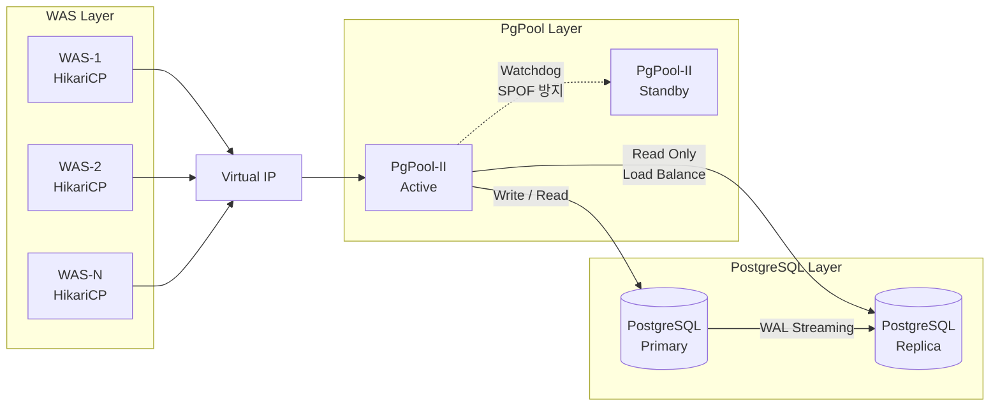

# PostgreSQL 서버 설정 가이드

> **기준 문서**: `reports/final-standard-guide.md`
> **적용 범위**: PostgreSQL (Primary / Replica)
> **프로덕션 표준**: PgPool-II + Streaming Replication
> **개발/테스트**: Standalone

---

## 0. 적용 전제

프로덕션 표준 아키텍처는 PgPool-II + Streaming Replication. 아래 토폴로지와 전제를 반드시 함께 확인한다.



- **max_connections=100 고정은 PgPool-II 연결 풀링 전제**. WAS 직접 연결 시에는 70% Ceiling 산정 공식(`max_connections >= Sum(WAS maxPoolSize) * 1.5`)을 따를 것
- **방화벽 TCP 30min**: 모든 타임아웃의 최상위. WAS maxLifetime(27min) < PgPool child_life_time(28min) < PG idle_session_timeout(30min) < 방화벽(30min)
- **PostgreSQL과 MongoDB는 동일 호스트 병설 금지**: `vm.overcommit_memory` 설정이 PostgreSQL(2)과 MongoDB 8.0(1)에서 서로 충돌. 반드시 물리적으로 분리된 서버에서 운영

---

## 1. OS 커널 설정

### 1.1 공통 파라미터 (모든 서버 적용)

```ini
# /etc/sysctl.d/99-infra-common.conf -- 모든 서버 공통
fs.file-max = 2097152
net.core.somaxconn = 4096
net.ipv4.tcp_max_syn_backlog = 4096
net.ipv4.tcp_keepalive_time = 300
net.ipv4.tcp_keepalive_intvl = 30
net.ipv4.tcp_keepalive_probes = 5
```

```bash
# /etc/security/limits.d/99-infra-common.conf -- 모든 서버 공통 (PAM 기반 적용)
*  soft  nofile  1048576
*  hard  nofile  1048576
*  soft  nproc   65536
*  hard  nproc   65536
```

> **systemd 서비스 필수 추가 설정**: 위 limits.conf는 PAM 기반 세션 접속에만 적용되며, **systemd가 관리하는 서비스 데몬에는 적용되지 않음**. 아래 systemd drop-in override를 반드시 추가 적용해야 함.

```ini
# /etc/systemd/system/postgresql.service.d/override.conf
# 서비스명은 설치 방법에 따라 postgresql-<version>.service 일 수 있음
[Service]
LimitNOFILE=1048576
LimitNPROC=65536
```

```bash
# systemd 적용
systemctl daemon-reload
systemctl restart postgresql
```

| 파라미터 | 값 | 역할 |
|:---|:---|:---|
| fs.file-max | 2,097,152 | 시스템 전체 FD 상한. 대규모 동시 접속 시 Too many open files 방지 |
| net.core.somaxconn | 4,096 | OS 커널 TCP Listen Backlog. DB는 min(backlog, somaxconn)으로 실제 Backlog 결정 |
| net.ipv4.tcp_max_syn_backlog | 4,096 | SYN Queue 상한. somaxconn과 세트로 설정 |
| net.ipv4.tcp_keepalive_time | 300 (5분) | TCP Keepalive 최초 대기 시간. 기본 7,200초 단축. WAS→DB 죽은 커넥션 조기 감지 |
| net.ipv4.tcp_keepalive_intvl | 30 | Keepalive 프로브 재전송 간격 |
| net.ipv4.tcp_keepalive_probes | 5 | 연속 실패 시 dead 판정. 300+30x5=450초 내 확정 |
| ulimit -n (nofile) | 1,048,576 | 프로세스당 FD 한도. infinity 시 커널 ~8.6GB 할당 (Bug 2394600) |
| ulimit -u (nproc) | 65,536 | 프로세스/스레드 수 상한. Fork Bomb 방지 |

### 1.2 PostgreSQL 서버 전용 파라미터

```ini
# /etc/sysctl.d/99-postgresql-tuning.conf -- PostgreSQL 서버 전용
vm.swappiness = 1
vm.overcommit_memory = 2
vm.overcommit_ratio = 90
vm.dirty_background_ratio = 5
vm.dirty_ratio = 10
vm.min_free_kbytes = 102400
vm.zone_reclaim_mode = 0
```

```bash
# THP (Transparent Huge Pages) 비활성화 -- OS 리부팅 시 초기화되는 1회성 명령임.
# 영구 설정은 root 권한이 필요하므로 IT ONE을 통해 IT 운영실에 변경 요청할 것.
#
# [참고: 영구 설정 방법 -- IT 운영실 적용용]
# 방법 1 (권장): GRUB 커널 파라미터 (리부팅 필요)
#   grubby --update-kernel=ALL --args="transparent_hugepage=never"
#
# 방법 2: TuneD 프로파일
#   /etc/tuned/<profile>/tuned.conf 에 [vm] transparent_hugepages=never 설정
```

| 파라미터 | 값 | 역할 |
|:---|:---|:---|
| vm.swappiness | 1 | shared_buffers가 디스크로 내려가면 쿼리 성능 급감. 스왑 거의 허용 안 함 |
| vm.overcommit_memory | 2 | 엄격 모드. fork 기반 백엔드 생성 시 OOM Killer가 postmaster 종료 → 전체 장애 방지 |
| vm.overcommit_ratio | 90 | overcommit_memory=2 전용. 커밋 한도 = Swap + (RAM x 90%). 기본 50%는 너무 낮음 |
| Transparent Huge Pages | disabled (never) | OLTP 희소 접근 패턴에서 THP compaction이 수백 ms 지연 스파이크 유발 |
| vm.dirty_background_ratio | 5 | 더티 페이지 5% 도달 시 백그라운드 플러시. WAL/체크포인트 I/O 버스트 분산 |
| vm.dirty_ratio | 10 | 더티 페이지 10% 도달 시 동기 플러시 강제. 기본(20~30)은 DB 쓰기 부하에서 I/O 마비 |
| vm.min_free_kbytes | 102400 (100MB) | 커널 최소 여유 RAM. 대량 정렬/해시조인 시 Direct Reclaim(전체 일시정지) 방지 |
| vm.zone_reclaim_mode | 0 | NUMA 환경에서 다른 노드 메모리 회수 금지. shared_buffers 공유 접근 시 성능 급감 방지 |

> **PostgreSQL과 MongoDB는 동일 호스트 병설 금지**: vm.overcommit_memory 설정이 PostgreSQL(2)과 MongoDB 8.0(1)에서 서로 충돌. 반드시 물리적으로 분리된 서버에서 운영.

### 1.3 적용 명령어

```bash
sysctl --load /etc/sysctl.d/99-infra-common.conf
sysctl --load /etc/sysctl.d/99-postgresql-tuning.conf
# THP 영구 설정은 IT ONE을 통해 IT 운영실에 변경 요청 (상세는 1.2절 참조)
systemctl daemon-reload
systemctl restart postgresql
```

---

## 2. PostgreSQL 설정

### 2.1 Primary / Replica 핵심 파라미터

| 파라미터 | Primary | Replica | 역할 |
|:---|:---:|:---:|:---|
| wal_level | replica | (상속) | WAL에 복제에 필요한 충분한 정보 포함. minimal 시 복제 불가 |
| max_wal_senders | 5 | 5 | WAL 스트리밍 연결 최대 개수. 장애 시 승격 후 백업 연결 즉시 허용 |
| hot_standby | (해당 없음) | on | Replica 읽기 쿼리 수용. PgPool-II 읽기 분산 동작 필수 |
| hot_standby_feedback | (해당 없음) | on | Replica 읽기 분산 시 Primary Vacuum에 의한 쿼리 취소(Conflict) 방지 |
| archive_mode | always | always | WAL 아카이빙. Primary+Replica 모두 수행. Replica에서 직접 백업/계층형 복제 가능 |
| max_connections | 100 | 100 | 최대 동시 클라이언트 연결. OOM 예방을 위해 100 고정 (PgPool 연결 풀링 전제) |

### 2.2 RAM별 파라미터 매트릭스 (프로덕션 PgPool+SR)

**Memory 그룹**

| DB 서버 RAM | shared_buffers | effective_cache_size | work_mem | maintenance_work_mem | wal_buffers |
|:---:|:---:|:---:|:---:|:---:|:---:|
| 8 GB | 2 GB | 6 GB | 8 MB | 384 MB | 16 MB |
| 16 GB | 4 GB | 12 GB | 16 MB | 1 GB | 16 MB |
| 32 GB | 8 GB | 24 GB | 32 MB | 2 GB | 16 MB |
| 64 GB | 16 GB | 48 GB | 64 MB | 4 GB | 16 MB |

**WAL & Connections 그룹**

| DB 서버 RAM | max_wal_size | min_wal_size | max_wal_senders | max_connections | superuser_reserved |
|:---:|:---:|:---:|:---:|:---:|:---:|
| 8 GB | 2 GB | 1 GB | 5 | 100 | 3 |
| 16 GB | 4 GB | 1 GB | 5 | 100 | 3 |
| 32 GB | 16 GB | 1 GB | 5 | 100 | 3 |
| 64 GB | 32 GB | 1 GB | 5 | 100 | 3 |

> work_mem 산정 상한(이론 참고치): `(RAM - shared_buffers) / (max_connections * 3)` (kofemann/pgtune). PostgreSQL 공식은 명시 공식이 없으나 "complex query = multiple concurrent operations" 경고에 근거. **위 매트릭스(8/16/32/64MB)는 운영 적용 표준값**으로, 이론 상한보다 보수적(OLTP/PgPool 환경 최적화). (2026-07-02 TA 결정, *8 폐기)
> effective_cache_size는 실제 할당 아님(플래너 참고값, OS page cache 포함 추정치).

### 2.3 postgresql.conf 전문 (프로덕션, 8GB 기준)

```conf
# -------------------------------------------------------
# Memory (8GB DB 전용 서버 기준)
# -------------------------------------------------------
shared_buffers = 2GB                # RAM * 0.25
effective_cache_size = 6GB          # RAM * 0.75
work_mem = 8MB                     # 운영 표준값 (이론 상한: (RAM-shared_buffers)/(max_conn*3), kofemann/pgtune)
maintenance_work_mem = 384MB        # RAM * 0.047~0.0625 (PGTune 기준)
wal_buffers = 16MB                  # 고정

# -------------------------------------------------------
# WAL & Checkpoint
# -------------------------------------------------------
wal_level = replica
max_wal_size = 2GB
min_wal_size = 1GB
checkpoint_completion_target = 0.9
max_wal_senders = 5                 # Replica + 여유

# -------------------------------------------------------
# Connections
# -------------------------------------------------------
max_connections = 100               # OOM 예방 100 고정, PgPool 연결 풀링으로 백엔드 연결 제어
superuser_reserved_connections = 3
hot_standby = on
hot_standby_feedback = on           # Replica: Vacuum 충돌 방지
archive_mode = always               # WAL 아카이빙 (승격 대비)
listen_addresses = '*'

# -------------------------------------------------------
# Timeouts
# -------------------------------------------------------
statement_timeout = 30000                       # 30s
lock_timeout = 10000                            # 10s
idle_in_transaction_session_timeout = 60000     # 60s
idle_session_timeout = 1800000                  # 30min (캐스케이드 최하위)

# -------------------------------------------------------
# Autovacuum
# -------------------------------------------------------
autovacuum = on
autovacuum_max_workers = 3
autovacuum_naptime = 1min
autovacuum_vacuum_scale_factor = 0.1
autovacuum_vacuum_cost_limit = 2000

# -------------------------------------------------------
# Query Planner (SSD)
# -------------------------------------------------------
random_page_cost = 1.1
effective_io_concurrency = 200
```

> 각 RAM 스펙별로 Memory 섹션의 값만 2.2절 매트릭스에 맞게 변경. 나머지 설정은 모든 RAM 공통.

### 2.4 개발/테스트: Standalone

> 본 구성은 개발 및 테스트 환경에 한해서만 허용. 프로덕션에서는 PgPool-II + Streaming Replication 구성(0절 아키텍처) 적용 필수.

#### 핵심 파라미터 차이 (PgPool+SR 대비)

| 파라미터 | Standalone | PgPool+SR 대비 | 역할 |
|:---|:---:|:---:|:---|
| wal_level | replica | 동일 | 기본 표준 replica (PITR/아카이브 백업 허용). minimal은 순수 개발계만 |
| max_wal_senders | 0 | PgPool+SR: 5 | 복제 연결 불필요 |
| hot_standby | off | PgPool+SR: on (Replica) | Standby 노드 없음 |
| archive_mode | off | PgPool+SR: always | 아카이빙 불필요한 개발 환경 |
| max_connections | 100 | 동일 | 단일/소수 WAS 연결이므로 100 충분 |

#### RAM별 파라미터 매트릭스 (Standalone)

| DB 서버 RAM | shared_buffers | effective_cache_size | work_mem | maintenance_work_mem | wal_buffers | max_connections |
|:---:|:---:|:---:|:---:|:---:|:---:|:---:|
| 8 GB | 2 GB | 6 GB | 8 MB | 384 MB | 16 MB | 100 |
| 16 GB | 4 GB | 12 GB | 16 MB | 768 MB | 16 MB | 100 |
| 32 GB | 8 GB | 24 GB | 32 MB | 1.5 GB | 16 MB | 100 |
| 64 GB | 16 GB | 48 GB | 64 MB | 3 GB | 16 MB | 100 |

> max_wal_size는 기본값(1GB) 사용 가능, 쓰기 빈도에 따라 2GB까지 상향 허용.

---

## 3. 타임아웃 & 커넥션 캐스케이드

### 3.1 PostgreSQL 내부 타임아웃 Guardrails

각 파라미터는 서로 다른 시점에 동작하는 독립적인 가드레일.

| 파라미터 | 표준값 | 역할 |
|:---|:---|:---|
| statement_timeout | 30,000ms (30s) | 실행 중인 쿼리(Active Query) 최대 지속 시간. 장기 실행 쿼리 리소스 독점 방지 |
| lock_timeout | 10,000ms (10s) | Lock 획득 대기 최대 시간. 10초 초과 시 쿼리 자동 취소. lock_timeout < statement_timeout 유지 필수 |
| idle_in_transaction_session_timeout | 60,000ms (60s) | BEGIN 후 쿼리 완료 후 유휴 상태 최대 시간. COMMIT/ROLLBACK 없이 방치 시 Lock 점유로 전파 장애 |
| idle_session_timeout | 1,800,000ms (30min) | 클라이언트 유휴 세션 강제 종료. 연결 누수 및 좀비 세션으로부터 DB 자원 보호 |

```
PostgreSQL Session Timeout Guardrails
  |
  |-- statement_timeout (30s)
  |     쿼리 실행 중 상태의 최대 지속 시간 제어.
  |     |
  |     +-- lock_timeout (10s)
  |            statement_timeout 도중 Lock 대기 시간에만 관여.
  |            Lock 획득 대기 10초 초과 시 자동 취소 (교착 방지).
  |
  |-- idle_in_transaction_session_timeout (60s)
        트랜잭션 시작 후 쿼리 완료 후 유휴 상태 최대 시간.
        BEGIN 이후 COMMIT/ROLLBACK 없이 방치되는 세션 방지.
```

### 3.2 타임아웃 캐스케이드 (WAS -> PgPool -> PostgreSQL)

```
WAS HikariCP maxLifetime (1,620,000ms = 27min)
     |
     |  maxLifetime < child_life_time < idle_session_timeout
     v
PgPool-II child_life_time (1,680s = 28min)
     |
     |  child_life_time < idle_session_timeout
     v
PostgreSQL idle_session_timeout (1,800,000ms = 30min)
```

> WAS 직접 연결 시: HikariCP maxLifetime(27min) < PG idle_session_timeout(30min) < 방화벽(30min)

### 3.3 공유 DB 커넥션 풀 가이드 (직접 연결 시)

PgPool-II 없이 WAS가 DB에 직접 연결하는 환경:

```
DB max_connections = 100 (DB 서버 설정)
      |
      +-- 30 예약: 관리자 세션(superuser_reserved=3), 모니터링, 긴급 접속
      |
      +-- 70 가용: 애플리케이션 커넥션 풀 전체 합산 상한 (max_connections * 0.7)
```

> 절대 제약 (직접 연결 시): 모든 애플리케이션의 maxPoolSize 합산값은 max_connections * 0.7 (=70)을 초과 불가.

---

## 4. 검증 체크리스트

- [ ] shared_buffers <= RAM * 0.25 -- PostgreSQL 공식 권장 (위반 시: OOM, 커널 페이지 캐시 부족)
- [ ] max_connections = 100 고정 -- OOM 예방 (위반 시: OOM 발생, DB 서버 다운)
- [ ] autovacuum = on -- 필수 (위반 시: Dead Tuple 누적, 성능 점진 저하)
- [ ] autovacuum_vacuum_cost_limit >= 1000 -- 기본값(200) 대비 상향 (위반 시: VACUUM 처리 지연)
- [ ] idle_in_transaction_session_timeout 설정 -- 교착 방지 (위반 시: Lock 점유로 인한 전파 장애)
- [ ] WAS maxLifetime < PgPool child_life_time < DB idle_session_timeout -- 엄격 부등호 (위반 시: 레이스 컨디션)
- [ ] random_page_cost = 1.1 (SSD 환경) -- SSD 환경 필수 (위반 시: 비효율적 실행 계획)
- [ ] Replication Slot 구성 확인 -- pg_replication_slots (위반 시: Slot 누적 시 디스크 Full 위험)
- [ ] vm.swappiness = 1 (PostgreSQL 서버) -- DB 서버 안정성 (위반 시: 스와핑 시 쿼리 성능 급감)
- [ ] vm.overcommit_memory = 2 (PostgreSQL 서버) -- OOM Killer 방지 (위반 시: postmaster 강제 종료 → 전체 장애)
- [ ] vm.overcommit_ratio = 90 (PostgreSQL 서버) -- overcommit_memory=2 시 커밋 한도 보장 (위반 시: "Cannot allocate memory" 장애)
- [ ] THP = disabled (PostgreSQL 서버) -- OLTP 지연 스파이크 방지 (위반 시: 간헐적 수백 ms 쿼리 지연)
- [ ] THP 영구 설정 적용 -- IT ONE 변경 요청 완료 여부 확인 (미적용 시: 리부팅 후 THP 활성화로 성능 저하)
- [ ] systemd 서비스 LimitNOFILE/LimitNPROC override 설정 -- 서비스 데몬 ulimit 적용 (미적용 시: limits.conf 무시되어 기본값 1024로 동작)
- [ ] Sum(maxPoolSize) <= DB max_conn * 0.7 (직접 연결 시) -- 70% Ceiling Rule (위반 시: 타 서비스 커넥션 고갈)

---

## 5. 모니터링 체크리스트

| 모니터링 항목 | 조회 방법 | 경고(Warning) | 위험(Critical) | 조치 |
|:---|:---|:---|:---|:---|
| Active Sessions | `SELECT count(*) FROM pg_stat_activity WHERE state = 'active'` | max_connections 70% | max_connections 85% | 커넥션 풀 설정 재검토 |
| Slow Query | `pg_stat_statements` (>= 1s) | 발생 시 | 빈발 시 | 인덱스 추가 / 쿼리 튜닝 |
| Replication Lag | `SELECT now() - pg_last_xact_replay_timestamp() FROM pg_stat_replication` | > 5s | > 30s | 네트워크/부하 점검, Replica 증설 검토 |
| Dead Tuples | `SELECT n_dead_tup FROM pg_stat_user_tables` | 테이블 크기 10% | 테이블 크기 20% | VACUUM 강제 실행, autovacuum 조정 |
| Cache Hit Ratio | `SELECT sum(blks_hit)::float / NULLIF(sum(blks_hit + blks_read), 0) FROM pg_stat_database` | < 99% | < 95% | shared_buffers 증설 검토 |
| Lock Wait | `SELECT * FROM pg_locks WHERE NOT granted` | 대기 > 1s | 대기 > 5s | 트랜잭션 분석, lock_timeout 확인 |
| Autovacuum 진행 상태 | `SELECT * FROM pg_stat_progress_vacuum` | 장시간 미실행 | Dead Tuple 누적 | autovacuum_vacuum_cost_limit 상향 |
