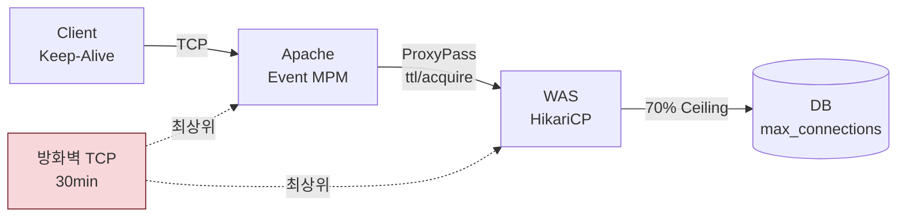

# Web 서버(Apache HTTP Server) 설정 가이드

> **기준 문서**: `source/apache-tuning-guide.md`(사내 Apache 성능 튜닝 가이드 V3.1) + 본 규정 도메인 공통 불변량
> **적용 범위**: Apache HTTP Server 2.4.x (Event / Worker / Prefork MPM)
> **기준 인프라**: 4 Core CPU / 4~32 GB RAM
> **정본 우선**: 본 파일이 운영 배포 정본. 원천(`source/apache-tuning-guide.md`)과 충돌 시 본 파일 기준. 원본의 오류/누락 정정은 §8 참조.

---

## 0. 적용 전제

Web 서버(Apache)는 클라이언트 연결을 종단하고 백엔드(WAS)로 역방향 프록시(reverse proxy)하는 접착 계층이다. WAS/DB 가이드와 동일한 도메인 불변량(방화벽 TCP 30min, 70% Ceiling, 타임아웃 엄격 부등호)을 공유한다.



- **방화벽 TCP 30~60min(범위, 최단 30min=1,800초 기준 설계)**: Apache→WAS 역방향 프록시 커넥션 풀(`ProxyPass keepalive`, `ttl`)도 이 한계 내에서 수명 설계. 상회 시 방화벽 silent drop → 간헐 502/504 발생.
- **타임아웃 캐스케이드(역방향 프록시 기준)**: `ProxyPass ttl < 방화벽(30min)`. WAS 단 maxLifetime(27min)과 정렬 권장. 단, 동일 호스트 loopback 프록시는 방화벽 경유 안 함(§8.2).
- **70% Ceiling Rule**: Apache 자체는 DB 커넥션을 맺지 않으므로 직접 대상 아님. 단, Apache에 임베드된 모듈(`mod_php`, `mod_dbd`, `mod_security` DB backend 등)이 DB 연결을 맺으면 WAS와 동일 취급하여 합산해야 함.

---

## 1. OS 커널 설정

### 1.1 공통 파라미터 (모든 서버 적용)

```ini
# /etc/sysctl.d/99-infra-common.conf -- 모든 서버 공통(WAS/DB 가이드와 정렬)
fs.file-max = 2097152
net.core.somaxconn = 4096
net.ipv4.tcp_max_syn_backlog = 4096
net.ipv4.tcp_keepalive_time = 300
net.ipv4.tcp_keepalive_intvl = 30
net.ipv4.tcp_keepalive_probes = 5
```

> **원본 정정**: 사내 Apache 가이드 V3.1의 `fs.file-max = 100000`은 동시 커넥션 대역에서 과소. WAS 가이드 정본(2,097,152)과 정렬. `somaxconn` 역시 원본 2,048에서 4,096으로 상향(SYN/accept 큐 일관성).

```bash
# /etc/security/limits.d/99-infra-common.conf -- PAM 기반 세션용
*  soft  nofile  1048576
*  hard  nofile  1048576
*  soft  nproc   65536
*  hard  nproc   65536
```

> **systemd 서비스 필수 추가 설정**: 위 limits.conf는 PAM 기반 로그인 세션에만 적용되며, **systemd가 관리하는 httpd/apache2 데몬에는 적용되지 않음**. 다음 drop-in override를 반드시 추가해야 Limits가 실제 프로세스에 반영됨.

```ini
# /etc/systemd/system/httpd.service.d/override.conf
# (Ubuntu/Debian: apache2.service.d/override.conf)
[Service]
LimitNOFILE=1048576
LimitNPROC=65536
```

```bash
systemctl daemon-reload
systemctl restart httpd   # 또는 apache2
```

### 1.2 Web 서버 전용 파라미터

```ini
# /etc/sysctl.d/99-web-tuning.conf -- Web 서버 전용
vm.swappiness = 1
net.ipv4.tcp_fin_timeout = 15
net.ipv4.tcp_tw_reuse = 1
# 기본: WAS/DB 정본과 정렬(혼합 용도 안전). Web 단독 대형 역방향 프록시·다중 인스턴스(§6)에서
# 포트 고갈 시에만 1024 65535로 확장. 단, Web+WAS/DB 혼합 서버는 서비스 포트 충돌 주의(§8.2.1)
net.ipv4.ip_local_port_range = 32768 65535
```

| 파라미터 | 값 | 역할 |
|:---|:---|:---|
| fs.file-max | 2,097,152 | 시스템 전체 FD 상한. Apache `MaxRequestWorkers` 확장 시 Too many open files 방지 |
| net.core.somaxconn | 4,096 | 커널 Listen Backlog 상한. **실제 accept 큐 = min(somaxconn, ListenBacklog 지시어)**. 한쪽만 올리면 튜닝 무의미(§8.1) |
| net.ipv4.tcp_max_syn_backlog | 4,096 | SYN Queue 상한. somaxconn과 세트 |
| net.ipv4.tcp_keepalive_time | 300 (5min) | TCP Keepalive 최초 대기. 기본 7,200s(2h) 단축. 역방향 프록시 커넥션 staleness 감지 |
| net.ipv4.tcp_keepalive_intvl | 30 | Keepalive 프로브 재전송 간격 |
| net.ipv4.tcp_keepalive_probes | 5 | 연속 실패 시 dead 판정. 300 + 30×5 = 450초 내 확정 |
| vm.swappiness | 1 | Web 서버는 커널 page cache가 응답 지연에 직결. swap 최소화(WAS는 10, DB는 1) |
| tcp_fin_timeout | 15 | TIME_WAIT 소켓 유지 단축. 단기 클라이언트 커넥션 빈번 → 누적 방지 |
| tcp_tw_reuse | 1 | TIME_WAIT 소켓 재사용 허용. **아웃바운드(역방향 프록시)에만 효과**. NAT/L4 환경 주의(§8.3) |
| ip_local_port_range | 기본 32768~65535 / 확장 1024~65535 | **기본값은 WAS/DB 정본과 정렬**(약 33,000개 가용, 혼합 용도 안전). Web 단독 대형 역방향 프록시·다중 인스턴스(§6)에서 포트 고갈 시에만 1024~65535로 확장(약 63,000개). 단, Web+WAS/DB 혼합 서버에서 확장 시 Tomcat(8080)/Redis(6379) 등 서비스 포트와 충돌 위험(§8.2.1) |
| ulimit -n (nofile) | 1,048,576 | 프로세스당 FD 한도. infinity 시 커널이 과할당(Red Hat Bug 2394600) |
| ulimit -u (nproc) | 65,536 | 프로세스/스레드 수 상한. Event MPM 다중 스레드 시 필수 |

### 1.3 적용 명령어

```bash
sysctl --load /etc/sysctl.d/99-infra-common.conf
sysctl --load /etc/sysctl.d/99-web-tuning.conf
systemctl daemon-reload
systemctl restart httpd
```

---

## 2. MPM 선택 & 핵심 원칙

### 2.1 MPM 선택 기준

| MPM | 구조 | 적용 조건 | 비고 |
|:---|:---|:---|:---|
| **Event** (권장) | Worker + Listener Thread가 KeepAlive 연결 관리 | **기본 선택**. Apache 2.4 정식 | 동일 스레드로 Worker 대비 2~5배 연결 수용 |
| Worker | 프로세스×스레드. KeepAlive가 worker 스레드 점유 | 레거시/Event 호환성 이슈 시 | 8 GB 이상에서 Event 전환 권장 |
| Prefork | 1프로세스=1요청 | PHP `mod_php` 등 스레드-안전하지 않은 모듈 필수 시만 | **8 GB 이상 비효율**. RAM 많아도 4 Core에서 200프로세스 한계 |

### 2.2 핵심 원칙

- **RAM 90% 활용**: `가용_RAM = Total_RAM × 0.9` (10%는 OS/커널 예약). 단, 혼합 용도 서버는 §8.2에서 재산정.
- **ServerLimit ≤ 200**: 4 Core CPU 컨텍스트 스위칭 한계. 다중 인스턴스 합산도 동일.
- **ThreadsPerChild ≤ 128 (안전)**: 외부 모듈(`mod_security`, DB 드라이버, `mod_dbd`) 환경은 락 경합 방지.
- **ThreadsPerChild > 128 (극대화)**: 순수 리버스 프록시/SSL 종단 환경만 허용.
- **Event가 기본**: KeepAlive를 Listener가 관리 → Worker 대비 2~5배 연결 수용.
- **KeepAliveTimeout = 3**: HTTP/1.1 평균 요청 간격(2~4초) 하한선. 유휴 연결 빠른 정리 → worker 즉시 회수. 트레이드오프는 §8.1.

### 2.3 핵심 공식

```
가용_RAM            = Total_RAM × 0.9
MaxRequestWorkers   = 가용_RAM / 프로세스당_비용(AVG_RSS + ThreadStackSize × TPC)
ServerLimit         ≤ 200 (4 Core 제약)
ThreadsPerChild     ≤ 128 (안전) / > 128 (극대화, 순수 프록시 한정)
MaxSpareThreads     = min(MinSpareThreads × 3, 2000)   (4 Core cap)
Thrashing 방지      : (MaxSpareThreads - MinSpareThreads) > ThreadsPerChild  [필수]
Event ThreadLimit   = ceil(ThreadsPerChild × (1 + AsyncRequestWorkerFactor))
Event 총 연결 한계  = (AsyncRequestWorkerFactor + 1) × MaxRequestWorkers
Scoreboard 검증     : ServerLimit × ThreadLimit ≥ Event 총 연결 한계  [필수]
```

> **원본 정정**: 사내 가이드의 `Thrashing 방지: (MaxSpare - MinSpare) > TPC` 정의는 맞으나, 다중 인스턴스 절에서 `> TPC×2`로 표기한 부분은 모순. 본 규정은 일관되게 `> TPC` 적용(§8.1).

---

## 3. MPM Event 표준 매트릭스

> Event MPM(AVG_RSS=8MB, ThreadStackSize=1MB, AsyncRequestWorkerFactor=3).
> `MaxConnectionsPerChild = 0`(Event는 Listener 안정성을 위해 프로세스 교체 최소화). 누수 모니터링은 §10 필수.

### 3.1 전략 A: 자원 극대화 (순수 리버스 프록시 / SSL 종단)

| RAM | ServerLimit | ThreadLimit | ThreadsPerChild | MaxRequestWorkers | AsyncFactor | 총 연결 한계 | Scoreboard(SL×TL) | StartServers | MinSpare | MaxSpare | MaxConnPerChild |
|:---:|:---:|:---:|:---:|:---:|:---:|:---:|:---:|:---:|:---:|:---:|:---:|
| 4 GB | 102 | 128 | 28 | 2,856 | 3 | 11,424 | 13,056 | 8 | 224 | 672 | 0 |
| 8 GB | 153 | 192 | 40 | 6,120 | 3 | 24,480 | 29,376 | 10 | 400 | 1,200 | 0 |
| 16 GB | 150 | 384 | 90 | 13,500 | 3 | 54,000 | 57,600 | 10 | 900 | 2,000 (cap) | 0 |
| 32 GB | 150 | 768 | 188 | 28,200 | 3 | 112,800 | 115,200 | 8 | 1,504 | 2,000 (cap) | 0 |

### 3.2 전략 B: 안전 (DB 드라이버 / mod_security / 외부 라이브러리 사용)

> **권장 기본값**. 대부분의 사내 Web 서버는 WAS 연동 또는 `mod_security`를 사용하므로 전략 B 적용.

| RAM | ServerLimit | ThreadLimit | ThreadsPerChild | MaxRequestWorkers | AsyncFactor | 총 연결 한계 | Scoreboard(SL×TL) | StartServers | MinSpare | MaxSpare | MaxConnPerChild |
|:---:|:---:|:---:|:---:|:---:|:---:|:---:|:---:|:---:|:---:|:---:|:---:|
| 4 GB | 102 | 128 | 28 | 2,856 | 3 | 11,424 | 13,056 | 8 | 224 | 672 | 0 |
| 8 GB | 153 | 192 | 40 | 6,120 | 3 | 24,480 | 29,376 | 10 | 400 | 1,200 | 0 |
| 16 GB | 150 | 256 | 64 | 9,600 | 3 | 38,400 | 38,400 | 10 | 640 | 1,920 | 0 |
| 32 GB | 200 | 512 | 128 | 25,600 | 3 | 102,400 | 102,400 | 13 | 1,664 | 2,000 (cap) | 0 |

### 3.3 설정 예시 (8 GB, 전략 B — 표준 권장)

```apache
# /etc/httpd/conf.modules.d/00-mpm.conf  (또는 Ubuntu: /etc/apache2/mods-enabled/mpm_event.load)
LoadModule mpm_event_module modules/mod_mpm_event.so

# /etc/httpd/conf.d/mpm.conf
ServerLimit              153
ThreadLimit              192
ThreadsPerChild          40
ThreadStackSize          1048576
MaxRequestWorkers        6120
AsyncRequestWorkerFactor 3
StartServers             10
MinSpareThreads          400
MaxSpareThreads          1200
MaxConnectionsPerChild   0
KeepAliveTimeout         3
ListenBacklog            1024
```

> **적용 전 Scoreboard 검증 의무**: `ServerLimit × ThreadLimit ≥ 총 연결 한계` 위반 시 연결 수용 불가. 위 매트릭스는 모두 검증 통과(✓).

---

## 4. MPM Worker / Prefork 매트릭스 (참고)

### 4.1 MPM Worker (AVG_RSS=8MB, ThreadStackSize=1MB)

**전략 A: 자원 극대화**

| RAM | ServerLimit | ThreadLimit | ThreadsPerChild | MaxRequestWorkers | StartServers | MinSpare | MaxSpare | MaxConnPerChild |
|:---:|:---:|:---:|:---:|:---:|:---:|:---:|:---:|:---:|
| 4 GB | 102 | 64 | 28 | 2,856 | 8 | 224 | 672 | 10000 |
| 8 GB | 153 | 64 | 40 | 6,120 | 8 | 320 | 960 | 10000 |
| 16 GB | 150 | 256 | 90 | 13,500 | 10 | 900 | 2,000 (cap) | 10000 |
| 32 GB | 150 | 384 | 188 | 28,200 | 8 | 1,504 | 2,000 (cap) | 10000 |

**전략 B: 안전**

| RAM | ServerLimit | ThreadLimit | ThreadsPerChild | MaxRequestWorkers | StartServers | MinSpare | MaxSpare | MaxConnPerChild |
|:---:|:---:|:---:|:---:|:---:|:---:|:---:|:---:|:---:|
| 4 GB | 102 | 64 | 28 | 2,856 | 8 | 224 | 672 | 10000 |
| 8 GB | 153 | 64 | 40 | 6,120 | 8 | 320 | 960 | 10000 |
| 16 GB | 150 | 192 | 64 | 9,600 | 10 | 640 | 1,920 | 10000 |
| 32 GB | 200 | 192 | 128 | 25,600 | 12 | 1,536 | 2,000 (cap) | 10000 |

> Worker는 `MaxConnectionsPerChild = 10000` 권장(미세 누수 방지). Event와의 차이점.

### 4.2 MPM Prefork (AVG_RSS=12MB)

> 1프로세스=1요청. **8 GB 이상에서 Worker/Event 전환 필수.** `mod_php` 등 스레드-안전하지 않은 모듈이 임베드된 환경에서만 잔존 허용.

| RAM | ServerLimit | MaxRequestWorkers | StartServers | MinSpareServers | MaxSpareServers | MaxConnPerChild | KeepAliveTimeout | ListenBacklog |
|:---:|:---:|:---:|:---:|:---:|:---:|:---:|:---:|:---:|
| 4 GB | 200 (cap) | 200 | 8 | 8 | 16 | 10000 | 3 | 1024 |
| 8 GB | 200 (cap) | 200 | 8 | 8 | 16 | 10000 | 3 | 1024 |
| 16 GB | 200 (cap) | 200 | 10 | 10 | 20 | 10000 | 3 | 1024 |
| 32 GB | 200 (cap) | 200 | 10 | 10 | 20 | 10000 | 3 | 1024 |

> 4 Core에서 프로세스 수 200이 컨텍스트 스위칭 한계. RAM 증설과 무관하게 MRW=200 고정. RAM이 남아도 Worker/Event 전환이 정답.

---

## 5. 공통 설정 (MPM 무관)

| 파라미터 | Worker | Event | Prefork | 비고 |
|:---|:---:|:---:|:---:|:---|
| ThreadStackSize | 1048576 (1MB) | 1048576 (1MB) | 미사용 | 플랫폼 기본값(보통 8MB, 컴파일 타임 의존)은 과다. **restart 필요** |
| KeepAliveTimeout | **3** | **3** | **3** | HTTP/1.1 평균 요청 간격 하한선. **reload 가능**. 트레이드오프는 §8.1 |
| ListenBacklog | 1024 | 1024 | 1024 | 커널 기본 somaxconn(511)과 정렬 필수(§1.2, §8.1). **restart 필요** |
| MaxConnectionsPerChild | 10000 | 0 | 10000 | Event는 Listener 안정성 위해 0. Worker/Prefork는 누수 방지 10000. **reload 가능** |
| KeepAlive | On | On | On | HTTP/1.1 기본 |
| MaxKeepAliveRequests | 100 | 100 | 100 | 단일 커넥션 최대 요청 수. 0(무제한) 금지(메모리 누적) |

---

## 6. 다중 인스턴스 환경 (4 Parent Processes)

> 1대 물리 서버(4 Core / 32 GB+ RAM)에서 4개 독립 Apache 인스턴스가 각각 다른 서비스 담당.
> RAM 풍족하므로 **TPC=128 고정 할당**, CPU(ServerLimit ≤ 50)만 엄격 제한.

### 6.1 자원 분할 원칙

```
가용_RAM_인스턴스   = (Total_RAM × 0.9) / 4
ServerLimit_인스턴스 ≤ 50   (4 Core 총합 ≤ 200 유지)
ThreadsPerChild     = 128   (RAM 풍족 → 안전 상한 고정)
MaxSpareThreads     ≤ 800   (4 인스턴스 합산 유휴 ~3,200 수준 제한)
```

| Total RAM | 전체 가용 RAM | 인스턴스당 RAM | SL (RAM 한계) | SL (CPU cap) | 실제 SL |
|:---:|:---:|:---:|:---:|:---:|:---:|
| 4 GB | 3,686 MB | 921 MB | 6 | 50 | **6** (RAM 한계) |
| 8 GB | 7,373 MB | 1,843 MB | 13 | 50 | **13** (RAM 한계) |
| 16 GB | 14,746 MB | 3,686 MB | 27 | 50 | **27** (RAM 한계) |
| 32 GB | 29,491 MB | 7,373 MB | 54 | 50 | **50** (CPU cap) |

> 16 GB 이하에서는 RAM이 TPC=128×SL을 감당 못해 SL이 50 미만. **32 GB에서만 CPU cap(50) 도달.**

### 6.2 MPM Event — 인스턴스당 설정 (TPC=128, AsyncFactor=3, TL=512)

| RAM | SL | TL | TPC | MRW | AsyncFactor | 인스턴스당 총 연결 | Scoreboard(SL×TL) | SS | MinSpare | MaxSpare | MaxConnPerChild |
|:---:|:---:|:---:|:---:|:---:|:---:|:---:|:---:|:---:|:---:|:---:|:---:|
| 4 GB | 6 | 512 | 128 | 768 | 3 | 3,072 | 3,072 ✓ | 4 | 512 | 800 (cap) | 0 |
| 8 GB | 13 | 512 | 128 | 1,664 | 3 | 6,656 | 6,656 ✓ | 4 | 512 | 800 (cap) | 0 |
| 16 GB | 27 | 512 | 128 | 3,456 | 3 | 13,824 | 13,824 ✓ | 4 | 512 | 800 (cap) | 0 |
| 32 GB | 50 | 512 | 128 | 6,400 | 3 | 25,600 | 25,600 ✓ | 4 | 512 | 800 (cap) | 0 |

> Thrashing Guard: `(MaxSpare − MinSpare) = 800 − 512 = 288 > TPC(128)` ✓ (원본 `> TPC×2` 표기는 오류, §8.1)

### 6.3 네트워크 포트 고갈(Port Exhaustion) 경고

```
단일 IP 최대 포트 = 65,535 (TCP 명세)
32 GB 4인스턴스 총 연결 = 4 × 25,600 = 102,400 > 65,535  [위반]
16 GB 4인스턴스 총 연결 = 4 × 13,824 = 55,296  < 65,535  (아웃바운드 고려 시 위험)
```

**해결책(32 GB 필수)**:

| 방안 | 내용 | 적용 |
|:---|:---|:---|
| **IP Aliasing** | 인스턴스별 독립 IP → IP마다 65,535 포트 확보 | `eth0:1 10.0.0.101`, `eth0:2 10.0.0.102`, ... |
| tcp_tw_reuse | TIME_WAIT 소켓 즉시 재사용 | §1.2에 포함 |
| ip_local_port_range 확장 | 임시 포트 범위 최대화 | `net.ipv4.ip_local_port_range="1024 65535"` (Web 단독 다중 인스턴스 전제. 혼합 용도 서버는 §8.2.1 서비스 포트 충돌 주의) |

```bash
# IP Aliasing — 인스턴스별 Listen IP 분리
sudo ip addr add 10.0.0.101/24 dev eth0
sudo ip addr add 10.0.0.102/24 dev eth0
sudo ip addr add 10.0.0.103/24 dev eth0
sudo ip addr add 10.0.0.104/24 dev eth0
```

### 6.4 인스턴스 간 충돌 방지 체크리스트

각 인스턴스는 독립 설정 파일·포트·PID·로그·Lock을 사용해야 함.

```apache
# 인스턴스 1: /etc/httpd/conf/httpd-instance1.conf
Listen 10.0.0.101:80
PidFile /var/run/httpd/httpd-instance1.pid
ErrorLog /var/log/httpd/instance1-error.log
CustomLog /var/log/httpd/instance1-access.log combined
Mutex file:/var/run/httpd/instance1-lock default
ScoreBoardFile /var/run/httpd/instance1-scoreboard
```

```bash
# 개별 인스턴스 시작
httpd -f /etc/httpd/conf/httpd-instance1.conf
# systemd 템플릿 권장: httpd@instance1.service
```

| 체크 항목 | 필수 | 비고 |
|:---|---:|:---|
| Listen IP+Port 분리 | 필수 | IP Aliasing으로 인스턴스별 독립 IP(Port Exhaustion 방지) |
| PidFile 분리 | 필수 | 시그널 충돌 방지 |
| ErrorLog / CustomLog 분리 | 필수 | 장애 추적 시 인스턴스 식별 |
| LockFile / Mutex 분리 | 필수 | 크로스 인스턴스 락 경합 방지 |
| ScoreBoardFile 분리 | 권장 | 공유 메모리 충돌 회피 |
| systemd 유닛 분리 | 권장 | `httpd@instance1.service` 템플릿 |
| ip_local_port_range 확장 | 32 GB 필수 | §1.2 |
| tcp_tw_reuse 활성화 | 권장 | §1.2에 포함 |

---

## 7. reload vs restart

| 분류 | 파라미터 | 적용 방법 |
|:---|:---|:---|
| **restart 필요** | ServerLimit, ThreadLimit, ThreadStackSize, ListenBacklog, MPM 전환 | 프로세스/스레드 구조 변경 → 완전 재시작 |
| **reload 가능** | MaxRequestWorkers(TL 이내), ThreadsPerChild(TL 이내), StartServers, Min/MaxSpare, MaxConnectionsPerChild, KeepAliveTimeout, AsyncRequestWorkerFactor | 기존 연결 유지하면서 새 child에 적용 |

```bash
# RHEL/CentOS
sudo systemctl restart httpd
sudo systemctl reload  httpd
# Ubuntu/Debian
sudo systemctl restart apache2
sudo systemctl reload  apache2
```

---

## 8. 주의사항 (원본 정정 + 혼합 용도 서버)

### 8.1 사내 가이드 V3.1 대비 정정/보강 항목

본 규정은 원천(`source/apache-tuning-guide.md`)을 기반으로 하되, 아래 항목을 정정·보강했다. 운영 적용 시 본 규정을 우선한다.

| # | 항목 | 원본 V3.1 | 본 규정 | 사유 |
|:---:|:---|:---|:---|:---|
| 1 | `fs.file-max` | 100000 | **2,097,152** | 동시 커넥션 대역에서 과소. WAS/DB 가이드 정본과 정렬 |
| 2 | `somaxconn` | 2048 | **4,096** | `tcp_max_syn_backlog`와 세트 일관성. `ListenBacklog(1024)`와 정렬 |
| 3 | Thrashing Guard(다중 인스턴스) | `> TPC×2` | **`> TPC`** | 원본 §2 핵심 공식과 다중 인스턴스 절이 서로 모순. 공식 정의(`> TPC`)가 맞음 |
| 4 | ThreadStackSize "기본 8MB 낭비" | 단정 표기 | "플랫폼/컴파일 타임 의존(보통 8MB)" | Linux x86-64 기본값은 빌드에 따라 2~8MB. 환경 미확인 시 `ulimit -s`/`httpd -V`로 실측 권장 |
| 5 | systemd LimitNOFILE/LimitNPROC | 누락 | **필수 추가** | `limits.conf`는 PAM 세션만 적용. systemd 데몬은 drop-in override 없으면 기본 1024로 동작 |
| 6 | `MaxConnectionsPerChild=0` (Event) | 권장만 | 권장 + **누수 모니터링 의무** | 프로세스 재활용 안 함 → 메모리 누수 추적 불가. `server-status` RSS 추적 필수(§10) |
| 7 | ListenBacklog vs somaxconn | 별도 언급 없음 | **정렬 의무화** | `실제 accept 큐 = min(somaxconn, ListenBacklog)`. 어느 한쪽만 올리면 튜닝 무의미 |
| 8 | 역방향 프록시 타임아웃 | 누락 | **§0·§8.4 추가** | `ProxyPass ttl/acquire/timeout`과 방화벽 30min·WAS keepAliveTimeout 정렬 필수. 원본은 프론트(클라이언트→Apache)만 다룸 |

### 8.2 혼합 용도 서버 (Web 전용이 아닌 경우)

Web 서버 전용이 아닌 경우, 아래 지침을 추가 적용한다. **가급적 역할 분리(전용 서버화)를 원칙**으로 하고, 불가피한 경우에만 아래 조치 후 혼용한다.

#### 8.2.1 Web + WAS 동일 호스트

> 사내 소형 서비스에서 Apache와 Tomcat/Spring Boot를 한 서버에 같이 구동하는 케이스.

- **RAM 재산정**: `가용_RAM(Apache) = Total_RAM × 0.9 − WAS_JVM_Heap − WAS_Metaspace − WAS_Native`. WAS Heap은 호스트 RAM × 0.625 / 인스턴스 수(`reports/final/was.md` §2.2). 단순 `Total_RAM × 0.9` 적용 시 Apache MRW 과대 산정 → OOM-Killer 위험.
- **CPU 경합**: WAS GC 스레드와 Apache worker가 동일 코어 경합. ServerLimit을 전용 서버 기준의 **70% 수준**으로 축소 권장.
- **역방향 프록시 loopback**: `ProxyPass http://127.0.0.1:8080/`. 방화벽 경유 안 함 → 방화벽 30min 캐스케이드 제외. 단, **`ip_local_port_range` 소모 빠름** (loopback 도 아웃바운드 포트 사용). `tcp_tw_reuse=1` 필수. **`ip_local_port_range`는 기본 32768~65535 유지 권장**(WAS 8080/9080 포트와 충돌 방지). 포트 고갈 시 모니터링 기반 점진 확장.
- **systemd Limits 충돌**: `httpd.service`와 `tomcat.service`에 각각 독립 `LimitNOFILE` 설정. 전역 limits.conf에 의존 금지.

#### 8.2.2 Web + DB 동일 호스트

> **비권장**. PostgreSQL/MongoDB는 RAM 대량 점유 및 I/O 집약적이어 Apache 성능 직타. 불가피한 경우:

- **70% Ceiling Rule 직접 적용**: Apache에 `mod_dbd`/임베디드 DB 드라이버가 있으면 WAS와 동일 취급. `Sum(Apache 커넥션 + WAS maxPoolSize) ≤ DB max_connections × 0.7`.
- **WiredTiger/shared_buffers RAM 확보**: DB 전용 서버 기준 공식 적용 불가. `cacheSizeGB`/`shared_buffers`를 명시적으로 할당 후 남은 RAM에서 Apache MRW 산정.
- **I/O 스케줄러**: DB가 `deadline`/`mq-deadline` 선호, Apache page cache는 `bfq`/`kyber` 무관. DB 우선 `mq-deadline` 고정.
- **모니터링 분리**: DB slow query와 Apache `server-status`를 같은 서버에서 수집 → I/O 부하 시 어느 쪽이 원인인지 즉시 구분 안 됨. 메트릭 라벨로 역할 분리 필수.

#### 8.2.3 Web + 캐시(Memcached/Redis) 동일 호스트

- 캐시 프로세스 RSS를 Apache 가용 RAM에서 **선차감**. Redis `maxmemory` 명시 설정 없으면 Apache와 경합 → OOM.
- Redis `tcp-backlog 511`과 Apache `ListenBacklog 1024` 정렬 권장(캐시 호출 버스트 대응).

#### 8.2.4 L4 로드밸런서 / NAT 환경

- **`tcp_tw_reuse=1` 주의**: 아웃바운드(역방향 프록시)에는 안전. 단, L4가 DSR(Direct Server Return)이 아니라 NAT 모드인 경우, **동일 5-tuple 충돌** 가능성 존재. NAT 환경에서는 `tcp_tw_reuse` 효과가 제한적일 수 있으니 L4 health check 주기와 `MaxConnectionsPerChild`로 회수 보조.
- **L4 health check 빈도**: 5초 미만 health check는 Apache access log 폭증. 전용 health check endpoint(``/healthz`) + `CustomLog`에서 제외(`SetEnvIf Request_URI "/healthz$" dontlog`).
- **X-Forwarded-For 신뢰**: `RemoteIPHeader X-Forwarded-For` + `RemoteIPInternalProxy <L4_IP>` 설정 없으면 클라이언트 IP가 L4로 기록 → 감사/차단 무력화.

### 8.3 역방향 프록시(ProxyPass) 타임아웃 정렬

Apache가 WAS로 역방향 프록시 시, 커넥션 풀(`mod_proxy`)의 수명 파라미터가 방화벽/WAS와 정렬되어야 간헐 502/504를 방지한다.

| 파라미터 | 권장값 | 역할 |
|:---|:---|:---|
| `ProxyPass ... ttl=` | `1800` (30min) 미만, 권장 `1500`(25min) | 백엔드 풀 커넥션 최대 수명. 방화벽 30min 미만 |
| `ProxyPass ... acquire=` | `3000` (3s) | 풀에서 커넥션 획득 대기 상한. WAS 응답 지연 시 Fail-Fast |
| `ProxyPass ... timeout=` | `60` (60s) | 백엔드 요청/응답 타임아웃. WAS `connectionTimeout(20s)` + 여유 |
| `ProxyPass ... keepalive=` | `On` | 풀 커넥션 재사용. `Off` 시 매 요청 새 커넥션 → 포트 고갈 |
| `ProxyPass ... retry=` | `5` (5s) | 백엔드 장애 시 재시도 간격. 기본 60s는 너무 김(장애 전이 지연) |

```apache
# 예시: WAS로 역방향 프록시
ProxyPass        /api/  http://was-backend:8080/api/  ttl=1500 acquire=3000 timeout=60 keepalive=On retry=5
ProxyPassReverse /api/  http://was-backend:8080/api/
```

> WAS `keepAliveTimeout(15s)`와 `ProxyPass ttl`은 다른 계층(프록시 풀 수명 vs HTTP Keep-Alive). 둘 다 방화벽 30min 이하여야 한다(엄격 부등호).

### 8.4 보안 기본 설정 (운영 필수)

사내 가이드 V3.1이 다루지 않으나 운영 적용 시 필수인 항목. 본 규정이 보강.

```apache
# /etc/httpd/conf.d/security.conf
ServerTokens      Prod        # 응답 헤더 "Apache"만 노출(버전/OS 미공개)
ServerSignature   Off         # 에러 페이지 서명 숨김
TraceEnable       Off         # HTTP TRACE 메서드 차단(XST 방어)

# 파일 접근 제한
<Directory "/">
    Options -Indexes          # 디렉토리 리스팅 차단
    AllowOverride None
    Require all denied
</Directory>

# DocumentRoot만 명시 허용
<Directory "/var/www/html">
    Require all granted
</Directory>

# 서버 설정 파일 접근 차단
<FilesMatch "^\.ht">
    Require all denied
</FilesMatch>
```

> SSL/TLS: `Protocols all -SSLv3 -TLSv1 -TLSv1.1`, `SSLCipherSuite`로 PFS 미지원 암호화 제외. WAS 가이드 범주 외 상세는 사내 보안 가이드 준용.

---

## 9. 검증 체크리스트

- [ ] MPM = Event(`LoadModule mpm_event_module`) -- Worker/Prefork 잔존 시 전환 사유 문서화 (위반 시: 8GB+ 환경에서 연결 수용량 2~5배 저하)
- [ ] `ServerLimit × ThreadLimit ≥ Event 총 연결 한계` -- Scoreboard 검증 (위반 시: 연결 수용 불가, 대기 폭증)
- [ ] `(MaxSpareThreads − MinSpareThreads) > ThreadsPerChild` -- Thrashing 방지 (위반 시: spare 스레드 churning)
- [ ] `MaxSpareThreads ≤ 2,000` -- 4 Core 캡 (위반 시: 컨텍스트 스위칭 과부하)
- [ ] `ServerLimit ≤ 200` (단일) / `≤ 50 × N` (다중) -- CPU 제약 (위반 시: 4 Core 컨텍스트 스위칭 한계 초과)
- [ ] `ListenBacklog ≤ net.core.somaxconn` -- accept 큐 정렬 (위반 시: 커널이 min()으로 잘라 튜닝 무의미)
- [ ] `ThreadStackSize = 1048576` (1MB) -- 기본값(8MB) 과다 회피 (위반 시: 스레드당 8MB → MRW 급감)
- [ ] `MaxConnectionsPerChild`: Event=0, Worker/Prefork=10000 -- 누수/Listener 안정성 (위반 시: Worker/Prefork 미세 누적, Event Listener 불안정)
- [ ] `KeepAliveTimeout = 3` -- 유휴 연결 빠른 정리 (위반 시: worker 점유로 동시 처리량 저하)
- [ ] systemd `LimitNOFILE=1048576` / `LimitNPROC=65536` drop-in 설정 -- 데몬 ulimit 적용 (미적용 시: limits.conf 무시, 기본 1024로 동작)
- [ ] `fs.file-max = 2097152`, `somaxconn = 4096` -- 시스템 전체 FD/백로그 (위반 시: 대규모 접속 시 Too many open files)
- [ ] `tcp_tw_reuse = 1` + `ip_local_port_range` 기본 32768~65535 (Web 단독 다중 인스턴스/대형 역방향 프록시만 1024~65535 확장) -- 아웃바운드 포트 확보 (위반 시: 역방향 프록시 포트 고갈). 혼합 용도에서 무조건 1024~65535 확장 시 Tomcat(8080) 등 서비스 포트와 충돌
- [ ] 다중 인스턴스: Listen IP/PidFile/ErrorLog/Mutex 분리 -- 충돌 방지 (위반 시: 시그널/락 충돌로 전 인스턴스 장애)
- [ ] 다중 인스턴스 32GB: IP Aliasing 적용 -- Port Exhaustion 방지 (위반 시: 65,535 포트 한계 초과로 신규 연결 실패)
- [ ] 역방향 프록시: `ProxyPass ttl < 1800` (방화벽 30min 미만) -- silent drop 방지 (위반 시: 간헐 502/504)
- [ ] 혼합 용도(Web+WAS): WAS Heap/RAM 선차감 후 Apache MRW 산정 -- OOM 방지 (위반 시: Apache가 과점유 → WAS OOM-Kill)
- [ ] 혼합 용도(Web+DB): 70% Ceiling 합산 검증 -- DB 커넥션 고갈 방지 (위반 시: 타 서비스 커넥션 고갈)
- [ ] 보안: `ServerTokens Prod`, `ServerSignature Off`, `TraceEnable Off`, `Options -Indexes` -- 정보 누출 차단

---

## 10. 모니터링 체크리스트

| 모니터링 항목 | 조회 방법 | 경고(Warning) | 위험(Critical) | 조치 |
|:---|:---|:---|:---|:---|
| Worker 사용률 | `mod_status` (`server-status`) | `BusyWorkers > 70% MRW` | `BusyWorkers > 90% MRW` | 트래픽 확인, MRW/TPC 상향 검토 |
| accept 큐 적체 | `ss -ltn` (Recv-Q) | Recv-Q > 100 지속 | Recv-Q > 1000 | somaxconn/ListenBacklog 점검, 백엔드 응답 지연 확인 |
| TIME_WAIT 누적 | `ss -tan \| grep TIME-WAIT \| wc -l` | > 10,000 | > 30,000 | tcp_tw_reuse 적용, MaxConnPerChild 점검 |
| 포트 고갈 임박 | `/proc/sys/net/ipv4/ip_local_port_range` 대비 ESTABLISHED | 가용 포트 < 5,000 | < 1,000 | 다중 인스턴스 IP Aliasing, 역방향 프록시 `keepalive=On` |
| 프로세스 RSS | `ps -o pid,rss,cmd -C httpd` | RSS > AVG_RSS × 1.5 | RSS > AVG_RSS × 2 | 메모리 누수, `MaxConnectionsPerChild` 축소(Event은 0 → 10000 전환 검토) |
| 백엔드 장애 전이 | `mod_status` `proxy` worker 상태 | `ERR` worker 발생 | `ERR` 지속 | WAS 건강도 확인, `retry=5` 적용 여부 |
| 역방향 프록시 5xx | access log | 5xx > 1% | 5xx > 5% | `ProxyPass timeout/ttl` 점검, WAS GC/스레드 상태 |
| GC 연동(혼합 서버) | JVM GC 로그(동일 호스트) | STW > 500ms | STW > 2s | WAS GC 튜닝(`reports/final/was.md` §2.3) |

### 10.1 모니터링 구축 순서

| 단계 | 구축 항목 | 완료 기준 |
|:---:|:---|:---|
| 1 | `mod_status` 활성화 + 접근 제한(`Require ip 127.0.0.1`) | `server-status` 페이지 정상 출력 |
| 2 | `BusyWorkers`/`IdleWorkers` 시계열 수집 | MRW 대비 사용률 그래프 출력 |
| 3 | access log 5xx율 + 백엔드 응답 시간(p95) 추이 | > 1% 시 알림 수신 확인 |
| 4 | ESTABLISHED/TIME_WAIT 소켓 카운트 수집 | 포트 고갈 임계 알림(가용 < 5,000) |
| 5 | 다중 인스턴스: 인스턴스별 `server-status` 분리 수집 | 인스턴스별 BusyWorkers 차트 분리 |
| 6 | 혼합 용도(Web+WAS): WAS GC 로그와 동일 타임라인 매핑 | GC Pause와 5xx spike 상관관계 가시화 |

> `MaxConnectionsPerChild=0`(Event) 환경에서는 단계 3 이후 프로세스 RSS 추적을 **반드시** 추가. 프로세스 재활용이 없으므로 누수 감지 유일 수단.
