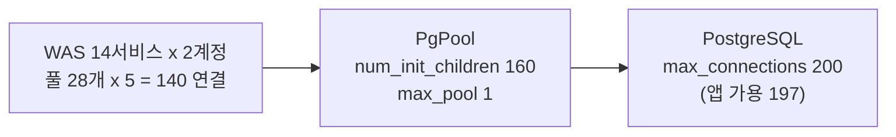

# 플랫폼개발팀 WAS/PgPool/PostgreSQL 연결 설정 안내

작성 2026-08-21. 대상: WAS 14개 서비스(계정 읽기/쓰기 각 1개), PgPool 4core/8GB, PostgreSQL 4core/32GB.

## 개요

마이크로서비스 14개 x 계정 2개 구조에서 커넥션이 표준 대비 과다하게 운영되고 있어 아래 값으로 정리한다. 참고로 확인 시점 DB 연결 254개 중 쿼리를 실행 중인 것은 2개(active)였고 243개는 유휴 상태였다. 연결이 부족한 상태가 아니므로 max_connections를 늘리는 방향은 취소하고, 유휴 연결이 쌓이는 구조적 원인부터 제거한다.

최종 연결 구조:



## 적용 순서

반드시 아래 순서로 진행한다. 현재 DB에 240여 개가 붙어 있는 상태에서 2, 3단계를 먼저 하면 연결이 거부되며 서비스 장애가 발생한다. 각 설정 파일은 변경 전 백업을 남긴다.

| 단계 | 대상 | 작업 | 재시작 |
|:---:|:---|:---|:---|
| 0 | 확인 | 아래 세 가지 사전 확인 | - |
| 1 | WAS | HikariCP fixed-size 전환 | 서비스별 롤링 (DB 무관) |
| 2 | PgPool | max_pool 1, num_init_children 160 | PgPool 재시작 |
| 3 | PostgreSQL | max_connections 200 | PgPool detach/attach 롤링 |

## 0단계: 사전 확인

1. PgPool 현재 num_init_children, max_pool 값 (변경 전 확정 및 백업)
2. WAS 서비스당 인스턴스(레플리카) 수. 레플리카가 N배면 풀 합계도 N배가 되므로 2, 3단계 값을 배율만큼 올린다 (num_init_children 약 160 x N, max_connections 200 x N)
3. PgPool 서버 세마포어가 250 32000 250 128 이상인지. 미만이면 자식 160개 구동이 실패할 수 있다

```bash
cat /proc/sys/kernel/sem
```

## 1단계: WAS (HikariCP)

서비스 공통. 읽기/쓰기 계정 풀 모두 동일하게 적용한다.

| 항목 | 현재 | 확정 | 이유 |
|:---|:---|:---|:---|
| maximum-pool-size | 5 | 5 (유지) | 28개 풀 구조에서 합리적 크기 |
| minimum-idle | 2 | 5 | fixed-size 전환. 풀 크기 변동 제거 |
| idle-timeout | 30000 (30s) | 삭제 | min = max이면 적용되지 않는 값. 30초마다 연결을 만들고 끊는 것이 PgPool 쪽 유휴 연결 누적의 원인 |
| max-lifetime | 1800000 (30min) | 1620000 (27min) | 방화벽 TCP 유휴 정리 30분과 시각이 겹치지 않게 |
| keepalive-time | 미설정 | 60000 (60s) | 상시 연결을 방화벽에서 보호 |
| connection-timeout | 30000 (30s) | 유지 | |

```yaml
spring:
  datasource:
    hikari:
      maximum-pool-size: 5
      minimum-idle: 5
      max-lifetime: 1620000      # 27min
      keepalive-time: 60000      # 60s
      connection-timeout: 30000  # 30s
```

서비스별 롤링 재시작으로 적용하며 DB와 무관하게 진행 가능하다. 이 단계만으로 DB 쪽 유휴 연결 증가가 멈춘다.

## 2단계: PgPool

| 항목 | 확정 | 설명 |
|:---|:---|:---|
| max_pool | 1 | 풀마다 계정이 고정이라 캐시 곱셈이 불필요. 자식당 백엔드 1개로 고정 |
| num_init_children | 160 | WAS 연결 140 + 관리/모니터링 여유 20 |
| child_life_time | 1680 (28min) | 타임아웃 캐스케이드: WAS 27min < PgPool 28min < DB 30min |

```conf
# pgpool.conf
num_init_children = 160
max_pool = 1
child_life_time = 1680
```

세 값 모두 재시작해야 반영된다 (reload 불가). PgPool 재시작으로 백엔드 캐시가 정리되어 DB 연결이 140 수준으로 떨어진다. 이 상태가 확인된 뒤 3단계를 진행한다. 그 외 PgPool 항목은 현재 운영값을 유지한다.

참고로 운영 표준은 PgPool 2대 이중화 + Watchdog 구성이다. 현재 단독으로 운영 중이라면 이번 작업과 별도로 검토할 과제로 남긴다.

## 3단계: PostgreSQL

이번에 확정하는 두 항목 외에는 운영 표준값을 그대로 쓴다.

| 항목 | 현재 | 확정 | 비고 |
|:---|:---|:---|:---|
| max_connections | 400 | 200 | 앱 가용 197 (superuser_reserved 3). WAS 연결 140 = 200 x 0.7 |
| max_wal_senders | 10 | 10 (유지) | |

postmaster 파라미터이므로 PgPool detach/attach 롤링 절차로 재시작해 반영한다.

32GB 서버 기준 전체 설정 (운영 표준과 동일, 참고용):

```conf
# Memory (32GB DB 전용 서버 기준)
shared_buffers = 8GB
effective_cache_size = 24GB
work_mem = 32MB
maintenance_work_mem = 2GB
wal_buffers = 16MB

# WAL & Checkpoint
wal_level = replica
max_wal_size = 16GB
min_wal_size = 1GB
checkpoint_completion_target = 0.9
max_wal_senders = 10

# Connections
max_connections = 200
superuser_reserved_connections = 3
hot_standby = on
hot_standby_feedback = on
archive_mode = always

# Timeouts
statement_timeout = 30000                       # 30s
lock_timeout = 10000                            # 10s
idle_in_transaction_session_timeout = 60000     # 60s
idle_session_timeout = 1800000                  # 30min

# Autovacuum
autovacuum = on
autovacuum_max_workers = 3
autovacuum_naptime = 1min
autovacuum_vacuum_scale_factor = 0.1
autovacuum_vacuum_cost_limit = 2000

# Query Planner (SSD)
random_page_cost = 1.1
effective_io_concurrency = 200
```

## 적용 후 확인 (1주일 관측)

1. 연결 수 안정. idle이 140~160에서 머무는지 확인한다. 계속 상승하면 1단계가 빠진 서비스가 있는 것이다.

```sql
SELECT state, count(*) FROM pg_stat_activity GROUP BY state;
```

2. WAS 에러 소멸. Connection is not available, request timed out after 30000ms 로그가 더 발생하지 않는지 확인한다.

3. 슬로우 쿼리 점검 착수. 이번 증상의 원인이 느린 쿼리였는지는 pg_stat_statements로 확인한다. 재시작이 필요하므로 3단계와 함께 켜는 것이 편하다 (postgresql.conf에 shared_preload_libraries = 'pg_stat_statements' 추가).

```sql
CREATE EXTENSION IF NOT EXISTS pg_stat_statements;

SELECT calls, round(mean_exec_time::numeric, 1) AS mean_ms, query
FROM pg_stat_statements
ORDER BY total_exec_time DESC
LIMIT 20;
```

## 값의 근거

- WAS 연결 합계는 28풀 x 5 = 140. 관리/모니터링/긴급 접속 예약분 30%를 남기려면 DB는 200이 최소다 (140 = 200 x 0.7).
- 관측 당시 쿼리 실행 중 연결은 2개였고, 4코어에서 동시 실행 가능한 쿼리는 10여 개 수준이다. 200이면 완충이 충분하다.
- 유휴 연결의 원인은 30초 단위 풀 확장축소와 PgPool의 계정별 백엔드 캐시다. 원인 제거 후에는 상한을 필요치로 내려도 무리가 없다.
