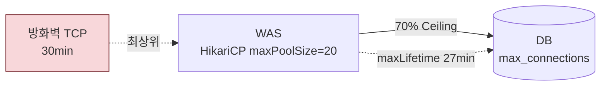

# WAS 서버 설정 가이드

> **기준 문서**: `reports/final-standard-guide.md`
> **적용 범위**: Apache Tomcat 9.x, Spring Boot 내장 Tomcat, IBM WebSphere Liberty 23.x
> **기준 인프라**: 4 Core CPU / 4~32 GB RAM

---

## 0. 적용 전제

WAS는 커넥션과 메모리를 소비하는 주체다. WAS 설정은 DB 설정(70% Ceiling, 타임아웃 캐스케이드)을 역산하는 출발점이므로, 아래 전제를 반드시 함께 확인한다.



- **70% Ceiling**: `Sum(모든 WAS 인스턴스 maxPoolSize) <= DB max_connections * 0.7`
- **방화벽 TCP 30min**: 모든 타임아웃의 최상위. WAS maxLifetime(27min)은 방화벽(30min)보다 짧아야 함
- **타임아웃 캐스케이드**: `WAS maxLifetime(27) < DB idle_session(30) < 방화벽(30)` (PgPool 경유 시 28min 단계 추가 — §3.2)

---

## 1. OS 커널 설정

### 1.1 공통 파라미터 (모든 서버 적용)

```ini
# /etc/sysctl.d/99-infra-common.conf -- 모든 서버 공통
fs.file-max = 2097152
net.core.somaxconn = 4096
net.ipv4.tcp_max_syn_backlog = 4096
net.ipv4.tcp_keepalive_time = 300
net.ipv4.tcp_keepalive_intvl = 30
net.ipv4.tcp_keepalive_probes = 5
```

```bash
# /etc/security/limits.d/99-infra-common.conf -- 모든 서버 공통 (PAM 기반 적용)
# 또는 기동 스크립트에 적용
*  soft  nofile  1048576
*  hard  nofile  1048576
*  soft  nproc   65536
*  hard  nproc   65536
```

> **systemd 서비스 필수 추가 설정**: 위 limits.conf는 PAM 기반 세션 접속에만 적용되며, **systemd가 관리하는 서비스 데몬에는 적용되지 않음**. 아래 systemd drop-in override를 반드시 추가 적용해야 함.

```ini
# /etc/systemd/system/tomcat.service.d/override.conf
# 서비스명은 설치 방법에 따라 상이 (tomcat9.service, springboot-app.service 등)
[Service]
LimitNOFILE=1048576
LimitNPROC=65536
```

```bash
# systemd 적용
systemctl daemon-reload
systemctl restart tomcat
```

| 파라미터 | 값 | 역할 |
|:---|:---|:---|
| fs.file-max | 2,097,152 | 시스템 전체 FD 상한. 대규모 동시 접속 시 Too many open files 방지 |
| net.core.somaxconn | 4,096 | OS 커널 TCP Listen Backlog. 트래픽 스파이크 시 패킷 Drop 방지 |
| net.ipv4.tcp_max_syn_backlog | 4,096 | SYN Queue 상한. somaxconn과 세트로 설정 |
| net.ipv4.tcp_keepalive_time | 300 (5분) | TCP Keepalive 최초 대기 시간. 기본 7,200초(2시간) 단축 |
| net.ipv4.tcp_keepalive_intvl | 30 | Keepalive 프로브 재전송 간격. 기본 75초 단축 |
| net.ipv4.tcp_keepalive_probes | 5 | 연속 실패 시 dead 판정. 300+30x5=450초 내 확정 |
| ulimit -n (nofile) | 1,048,576 | 프로세스당 FD 한도. infinity 시 커널이 ~8.6GB 할당 (Red Hat Bug 2394600) |
| ulimit -u (nproc) | 65,536 | 프로세스/스레드 수 상한. unlimited 시 Fork Bomb 무방비 |

### 1.2 WAS 서버 전용 파라미터

```ini
# /etc/sysctl.d/99-was-tuning.conf -- WAS 서버 전용
vm.swappiness = 10
net.ipv4.tcp_fin_timeout = 15
net.ipv4.tcp_tw_reuse = 1
net.ipv4.ip_local_port_range = 32768 65535
```

| 파라미터 | 값 | 역할 |
|:---|:---|:---|
| vm.swappiness | 10 | JVM Heap과 격돌하는 빈번한 GC Pause 방지. DB(1)보다 높게 허용 (JVM이 자체 Heap으로 메모리 관리) |
| tcp_fin_timeout | 15 | TIME_WAIT 소켓 유지 시간 단축. WAS 단기 커넥션 빈번 → 누적 방지 |
| tcp_tw_reuse | 1 | TIME_WAIT 소켓 재사용 허용. 대량 아웃바운드 시 포트 고갈(Ephemeral Port Exhaustion) 차단 |
| ip_local_port_range | 32768~65535 | 아웃바운드 임시 포트 범위 확장. 약 33,000개 가용 포트 확보 |

### 1.3 적용 명령어

```bash
sysctl --load /etc/sysctl.d/99-infra-common.conf
sysctl --load /etc/sysctl.d/99-was-tuning.conf
systemctl daemon-reload
systemctl restart tomcat
```

---

## 2. WAS 설정

### 2.1 핵심 파라미터 산정 기준

| 파라미터 | 표준값 | 산정 공식 | 역할 |
|:---|:---|:---|:---|
| maxThreads | 200 (4 Core) | `min(CPU_cores * 50, 500)` | 동시 요청 처리 스레드 최대 개수. 초과 시 acceptCount 대기 |
| minSpareThreads | 25 | `maxThreads / 8` | 항상 대기하는 최소 스레드 수. 초기 응답 지연 방지 |
| acceptCount | 100 (고정) | -- | 모든 스레드 처리 중일 때 OS TCP 대기 큐. 포화 시 Connection Refused |
| maxConnections | 8,192 (고정) | -- | NIO 커넥터 동시 TCP 소켓 상한. Keep-Alive 유휴 소켓을 스레드 없이 대기 |
| maxPoolSize (DB) | 20 | `(DB_Cores * 2) + 여유량` | WAS→DB 상시 TCP 커넥션 최대. **DB 서버 스펙 기준으로 독립 산정** |

### 2.2 인프라 스펙별 표준 설정값 매트릭스

| 호스트 RAM | 인스턴스 수 | 인스턴스당 Heap (Xms=Xmx) | GC 전략 | 인스턴스당 maxPoolSize |
|:---:|:---:|:---|:---|:---:|
| 4 GB | 1 | 2,048m | Parallel GC | 20 |
| 8 GB | 2 | 2,560m | Parallel GC | 20 |
| 16 GB | 3 | 3,413m | Parallel GC | 20 |
| 32 GB | 4 | 5,120m | G1 GC | 20 |

> Heap 분할 공식: `floor(호스트_RAM * 0.625) / 인스턴스_수`. 4 GB 단일 인스턴스는 OS 가용량 확보를 위해 50% 할당.
> Metaspace (공통): Min `256m` / Max `512m` 고정 (역전 현상 방지).

### 2.3 GC 전략 결정 기준

| 기준 | Parallel GC | G1 GC | ZGC (Java 21+) |
|:---|:---|:---|:---|
| 적용 조건 | Heap <= 4 GB | Heap > 4 GB | Heap > 4 GB + Java 21+ |
| 적용 스펙 | 4/8/16 GB 호스트 | 32 GB 이상 | 32 GB 이상 + Java 21+ |
| 선택 사유 | 소형 힙에서 최고 처리량(TPS). G1 Region 오버헤드 회피 | Heap 5 GB+에서 STW 시간 제어 | 대규모 Heap에서 STW 1ms 이하 |

### 2.4 엔진별 설정

#### Apache Tomcat 9.x (독립형)

**server.xml -- Connector 설정 (4 Core / 8 GB 호스트 기준)**

```xml
<Connector port="8080" protocol="org.apache.coyote.http11.Http11NioProtocol"
           maxThreads="200"
           minSpareThreads="25"
           acceptCount="100"
           maxConnections="8192"
           connectionTimeout="20000"
           keepAliveTimeout="15000"
           maxKeepAliveRequests="100"
           enableLookups="false"
           compression="on"
           compressionMinSize="2048" />
```

**setenv.sh -- JVM 옵션 (8 GB 호스트 / 인스턴스당 Heap 2.5 GB 기준)**

```bash
JAVA_OPTS="-Xms2560m -Xmx2560m \
           -XX:MetaspaceSize=256m -XX:MaxMetaspaceSize=512m \
           -XX:+UseParallelGC \
           -XX:+HeapDumpOnOutOfMemoryError \
           -XX:HeapDumpPath=/var/log/tomcat/heapdump.hprof \
           -Xlog:gc*:file=/var/log/tomcat/gc.log:time,uptime,level,tags:filecount=10,filesize=50M"
```

#### Spring Boot 내장 Tomcat

**application.yml (Spring Boot 3.x)**

```yaml
server:
  tomcat:
    threads:
      max: 200
      min-spare: 25
    max-connections: 8192
    accept-count: 100
    connection-timeout: 20s
    keep-alive-timeout: 15s
    max-keep-alive-requests: 100
```

**JVM 옵션 (8 GB 호스트 / 인스턴스당 Heap 2.5 GB 기준)**

```bash
JAVA_OPTS="-Xms2560m -Xmx2560m \
           -XX:MetaspaceSize=256m -XX:MaxMetaspaceSize=512m \
           -XX:+UseParallelGC \
           -XX:+HeapDumpOnOutOfMemoryError \
           -Xlog:gc*:file=/var/log/app/gc.log:time,uptime,level,tags:filecount=10,filesize=50M"
```

**Spring Boot 2.x 하위 호환성 매핑**

> **Spring Boot 3.0 Breaking Change**: 구 프로퍼티 키(`server.tomcat.max-threads` 등)가 제거되고 `threads.*` 네임스페이스로 단일화. 단, `threads.max`/`threads.min-spare`는 **Boot 2.0부터 이미 사용 가능**했으며, Boot 2.x에서는 구 키와 신 키가 deprecated 병존 상태였음. (2026-07-02 정정 — 기존 "2.4 Breaking Change" 표기는 사실 오류)

| Boot 3.x (본 규정) | Boot 2.x (2.0~2.7) | Boot 1.x | 비고 |
|:---|:---|:---|:---|
| server.tomcat.threads.max | server.tomcat.threads.max | server.tomcat.max-threads | `threads.*` 네임스페이스는 Boot 2.0 도입. 구 키는 Boot 3.0에서 제거 |
| server.tomcat.threads.min-spare | server.tomcat.threads.min-spare | server.tomcat.min-spare-threads | 동일 |
| server.tomcat.connection-timeout: 20s | 20000 (ms 정수) | 20000 (ms 정수) | Boot 3.x는 Duration, Boot 2.x는 ms 정수 |
| server.tomcat.keep-alive-timeout: 15s | 15000 (ms, Boot 2.5.0+) | Bean 오버라이드 필요 | 프로퍼티 지원은 **Boot 2.5.0**부터 (기존 "2.3.0" 표기 정정) |
| server.tomcat.max-keep-alive-requests: 100 | 100 (Boot 2.4.0+) | Bean 오버라이드 필요 | 프로퍼티 지원은 Boot 2.4.0부터 |

> Spring (Non-Boot) / 전자정부프레임워크: `application.yml` 대신 `server.xml` 또는 `TomcatServletWebServerFactory` Bean으로 직접 제어. 2.4절의 server.xml 설정 참조.

#### IBM WebSphere Liberty 23.x

**server.xml (4 Core / 8 GB 호스트 / 인스턴스당 2,560m)**

```xml
<httpEndpoint id="defaultHttpEndpoint" host="*" httpPort="9080" httpsPort="9443">
  <httpOptions keepAliveTimeout="15s" />
</httpEndpoint>

<executor id="defaultExecutor" coreThreads="8" maxThreads="200" />

<connectionManager id="defaultConnectionManager"
                   maxPoolSize="20"
                   minPoolSize="20"
                   connectionTimeout="30s"
                   maxIdleTime="900s"
                   agedTimeout="1620s"
                   reapTime="60s"
                   purgePolicy="FailingConnectionOnly" />
```

**방화벽 임계치(TCP 30분 / 1,800초) 검증 결과 반영**

| 파라미터 | 변경 전 | 변경 후 | 설계 근거 |
|:---|:---|:---|:---|
| maxIdleTime | 1800s | 900s | 방화벽 타임아웃(1800s)의 50%로 단축. 유휴 커넥션 방화벽 Drop 전 안전 제거 |
| agedTimeout | (미설정) | 1620s | PG idle_session_timeout(1800s)보다 180초 짧게. DB 강제 차단 방지 |
| reapTime | 300s | 60s | 풀 정리 주기 단축. 만료 커넥션 신속 회수 |

**jvm.options -- JVM 옵션 (8 GB 호스트 / 인스턴스당 Heap 2.5 GB 기준)**

```text
-Xms2560m
-Xmx2560m
-XX:MetaspaceSize=256m
-XX:MaxMetaspaceSize=512m
-XX:+UseParallelGC
-XX:+HeapDumpOnOutOfMemoryError
-Xlog:gc*:file=/var/log/wlp/gc.log:time,uptime,level,tags:filecount=10,filesize=50M
```

**JVM 벤더(배포판)별 GC 옵션 호환성**

| 항목 | HotSpot (Temurin 등) | OpenJ9 (IBM Semeru) |
|:---|:---|:---|
| GC 정책 | -XX:+UseParallelGC | -Xgcpolicy:gencon (Gencon 권장) |
| GC 로그 | -Xlog:gc*:file=... | -Xverbosegclog:/var/log/wlp/gc.log |
| Heap Dump | -XX:+HeapDumpOnOutOfMemoryError | -XX:+HeapDumpOnOutOfMemoryError (호환) |

> 본 규정의 JVM 옵션은 HotSpot 엔진 기준. IBM Semeru Runtime(OpenJ9) 환경에서는 GC 옵션이 인식되지 않으므로 해당 벤더 스펙에 맞게 변환 필요.

---

## 3. 타임아웃 & 커넥션 캐스케이드

### 3.1 HikariCP 공통 설정 (모든 DB 연동)

| 파라미터 | 표준값 | 역할 |
|:---|:---|:---|
| maxLifetime | 1,620,000ms (27분) | 풀 내 커넥션 최대 수명. DB 유휴 세션(30분) 및 방화벽(30분)보다 3분 먼저 폐기하여 Connection reset 원천 차단 |
| connectionTimeout | 30,000ms (30초) | 풀 커넥션 획득 대기 상한. 스레드 무한 대기 방지 (Fail-Fast) |
| minimumIdle | = maxPoolSize | Fixed-size pool. 풀 축소/확장 오버헤드 제거 |
| keepaliveTime | 60,000ms (1분) | 유휴 커넥션 생존 신호(Ping) 주기. 방화벽 Silent Drop 예방, Stale Connection 1분 내 감지 |
| leakDetectionThreshold | 60,000ms (권장) | 커넥션 누수 감지 임계값. 누수 발생 시 스택 트레이스 출력 |

### 3.2 WAS -> DB 타임아웃 캐스케이드

**PostgreSQL 경유 (PgPool-II 연동 시) — 3단계**

```
WAS HikariCP maxLifetime (27min)
      |  maxLifetime < PgPool child_life_time < DB 유휴 세션 제한 < 방화벽
      v
PgPool-II child_life_time (28min)
      |  child_life_time < DB 유휴 세션 제한
      v
DB 유휴 세션 제한 (30min)
      |-- PostgreSQL: idle_session_timeout
      |
      v
방화벽 TCP Established Timeout (30min / 1,800s)
```

**직접 연결 / MongoDB 경유 — 2단계**

```
WAS HikariCP maxLifetime (27min)
      |  maxLifetime < DB 유휴 세션 제한 (30min) < 방화벽 (30min)
      v
DB 유휴 세션 제한 (30min)
      |-- PostgreSQL: idle_session_timeout
      |-- MongoDB: localLogicalSessionTimeoutMinutes
      v
방화벽 TCP Established Timeout (30min / 1,800s)
```

> 핵심 제약: `WAS maxLifetime(27min) < DB 유휴 세션(30min) < 방화벽(30min)`. PgPool 경유 시 `child_life_time(28min)`이 중간에 추가됨(자세한 캐스케이드는 `reports/final/pgpool-ii.md` §3 참조).

---

## 4. 검증 체크리스트

- [ ] `Xms` = `Xmx` -- 프로덕션 고정 할당 (위반 시: Heap 리사이즈 GC Pause)
- [ ] Heap < Container RAM * 0.7 -- OOM 방지 (위반 시: Metaspace, Thread Stack, Native Memory 부족)
- [ ] 인스턴스당 Heap = 호스트 RAM * 0.625 / N -- 다중 인스턴스 분할 원칙 (위반 시: 단일 인스턴스 과점유)
- [ ] maxPoolSize = 20 -- 인스턴스당 상한 (위반 시: DB 리소스 고갈, Lock 경합)
- [ ] Sum(maxPoolSize) <= DB max_conn * 0.7 -- 공유 DB 70% Ceiling Rule (위반 시: 타 서비스 커넥션 고갈)
- [ ] minimumIdle = maxPoolSize -- Fixed-size pool 유지 (위반 시: 풀 축소/확장 오버헤드)
- [ ] ProxyPass ttl < WAS keepAliveTimeout -- 프록시 레이스 컨디션 방지 (위반 시: 간헐적 502/503)
- [ ] maxLifetime < 각 DB별 유휴 세션 제한값 -- 커넥션 무효화 방지 (위반 시: Connection reset 예외)
- [ ] GC 로그 활성화 -- 모든 WAS 인스턴스 필수 (미설정 시: 장애 원인 분석 불가)
- [ ] Metaspace Max >= Min -- 역전 현상 방지 (위반 시: 메모리 설정 오류)
- [ ] maxThreads > 0 -- 무제한(-1) 설정 금지 (위반 시: Backpressure 부재, 리소스 고갈)
- [ ] leakDetectionThreshold 활성화 (권장 60,000ms) -- 커넥션 누수 감지 (미설정 시: 누수 무감지)
- [ ] vm.swappiness = 10 (WAS 서버) -- JVM 환경 안정성 (위반 시: 기본값 60에서 GC Pause 빈발)
- [ ] ip_local_port_range = 32768~65535 (WAS 서버) -- 아웃바운드 포트 확보 (위반 시: 포트 고갈)
- [ ] systemd 서비스 LimitNOFILE/LimitNPROC override 설정 -- 서비스 데몬 ulimit 적용 (미적용 시: limits.conf 무시되어 기본값 1024로 동작)

---

## 5. 모니터링 체크리스트

| 모니터링 항목 | 조회 방법 | 경고(Warning) | 위험(Critical) | 조치 |
|:---|:---|:---|:---|:---|
| Heap 사용률 | GC 로그 / APM (JMX) | Old Gen > 70% | Old Gen > 85% | Heap 덤프 분석, 메모리 누수 의심 |
| GC Pause Time | GC 로그 (-Xlog:gc*) | STW > 500ms 빈발 | STW > 2s | GC 전략 재검토 (Parallel -> G1) |
| Active Thread 수 | APM / JMX | maxThreads 70% | maxThreads 85% | 스레드 덤프 분석, 병목 구간 식별 |
| 커넥션 풀 대기 | HikariCP 메트릭 (JMX / Micrometer) | 대기 발생 | 대기 > 5s | maxPoolSize 증설 검토 또는 DB 병목 확인 |
| 에러율 (5xx) | APM / Access Log | > 1% | > 5% | 원인 분석 (DB 타임아웃 / 스레드 고갈) |
| 커넥션 누수 | HikariCP leakDetectionThreshold | 감지 시 | -- | 누수 발생 지점(스택 트레이스) 분석 |

### 모니터링 구축 순서

| 단계 | 구축 항목 | 완료 기준 |
|:---:|:---|:---|
| 1 | GC 로그 활성화 (-Xlog:gc*) | 로그 파일 생성 및 정상 순환 확인 |
| 2 | HikariCP 메트릭 노출 (JMX / Micrometer) | 커넥션 풀 사용률 및 대기 시간 그래프 출력 |
| 3 | 에러율 (5xx) 추이 모니터링 | > 1% 시 알림 수신 확인 |
| 4 | 커넥션 누수 감지 (leakDetectionThreshold=60000) | 누수 감지 시 알림 수신 확인 |
