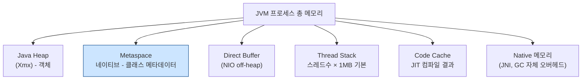
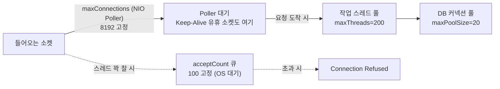
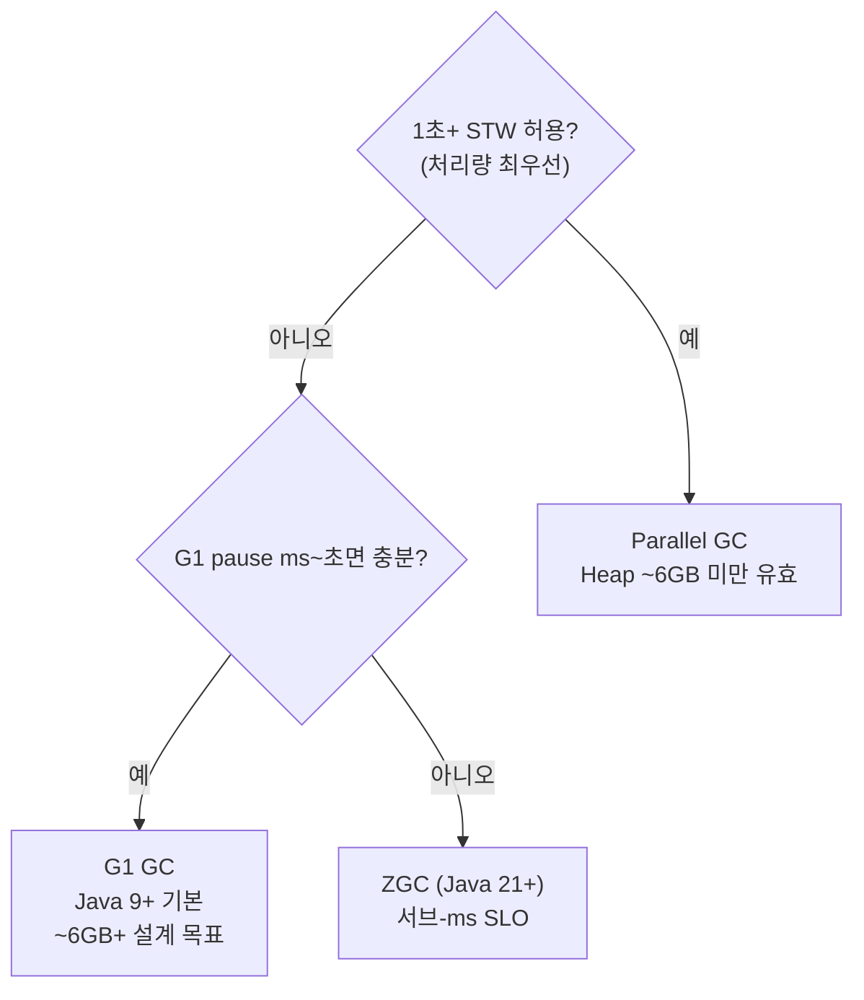
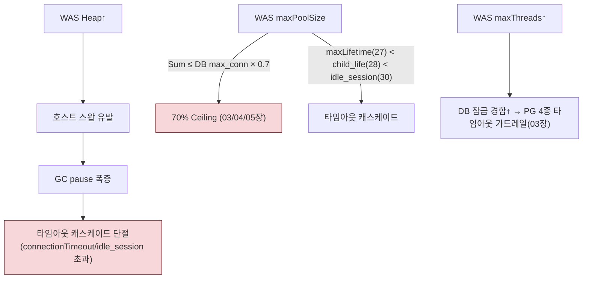

# 02. WAS / JVM — 커넥션과 메모리의 소비자

> WAS는 DB 커넥션과 메모리를 "소비"하는 주체다. WAS의 GC·스레드·풀 설정은 DB 설정(70% Ceiling, 타임아웃 캐스케이드)을 **역산**하는 출발점이다.
> 기준 산출물: `reports/final/was.md` §2-3.

---

## 1단계: 왜 이 메커니즘이 존재하는가 (선수 근본 개념)

### 1.1 세대별 가설(generational hypothesis) + Young/Old 분할

- **약한 세대별 가설**: "대부분의 객체는 생성 직후 곧 죽는다." 이 관찰이 Heap을 **Young(Eden, Survivor 0/1) / Old**로 나누는 이유다.
- Young이 가득 차면 **Minor GC**(빠름, 살아남은 객체를 Survivor로 복사). 여러 번 살아남으면 Old로 승격. Old가 가득 차면 **Major/Full GC**(느림).
- 이 가설이 맞으면 세대 분할이 이득(작은 Young을 자주 청소). 틀리면(오래 사는 객체가 많으면) 승격 폭주 → Old 압박 → 잦은 Full GC.

### 1.2 GC 알고리즘 분류: 처리량 vs region vs 동시

GC는 "언제 멈추고(stop-the-world), 어떻게 회수하느냐"로 나뉜다.

| 분류 | 언제 동작 | 회수 방식 | 대표 |
|:---|:---|:---|:---|
| 처리량(Throughput) | STW 중에 병렬 | 전체 compaction | **Parallel GC** |
| Region 기반 | 짧은 STW + 동시 표시 | Region 단위 이동(evacuation) | **G1 GC** |
| 동시(Concurrent) | 거의 STW 없음 | 착색 포인터 + read/load barrier | **ZGC** |

- **STW(Stop-The-World)**: GC 동안 애플리케이션 스레드가 모두 멈추는 구간. 이 시간이 서비스 지연의 원인.
- 트레이드오프 축: **총 GC 시간(처리량)** vs **개별 STW 길이(지연)**. 둘 다 최적은 불가능.

### 1.3 JVM 프로세스 메모리 ≠ Heap

- **핵심**: `Xmx`는 전체가 아니다. Heap만 키우고 나머지를 무시하면 **컨테이너 OOM(Killed)**은 나는데 **Heap OOM**은 안 난다(원인 분석 혼란).
- **Metaspace는 네이티브 영역**(Heap 밖). 클래스 메타데이터 저장. Java 8에서 고정 PermGen을 없애고 도입(§1.4).
- 따라서 `Xms=Xmx` 고정 + Heap < 컨테이너 RAM × 0.7(나머지를 off-heap에 예약)이 안전 원칙.

### 1.4 Metaspace의 역사적 배경 (PermGen 제거)

- **이전(PermGen)**: Java Heap 내 고정 영역(`-XX:MaxPermSize`, 기본 64MB). 클래스 메타데이터 + 인턴드 String + static 변수 저장. **고정 크기**라 classloader 누수 시 `OutOfMemoryError: PermGen space` 빈번(특히 hot deploy).
- **Java 8 (JEP 122)**: PermGen 제거. 클래스 메타데이터는 **네이티브 메모리(Metaspace)**로, 인턴드 String/static은 **Java Heap**으로 이동. Metaspace는 기본 **무제한 자동 확장**.
- **의미**: PermGen OOM은 사라졌지만, classloader 누수 자체는 여전 → 무제한 네이티브 소모 가능 → `MaxMetaspaceSize` 설정 + 모니터링 필수.

### 1.5 NIO Reactor: accept 큐 vs maxConnections vs maxThreads의 분리

- **maxConnections**: NIO Poller가 잡고 있는 소켓 상한(8,192). **스레드 없이** Keep-Alive 유휴 소켓을 대기시킨다(BIO 시대와의 결정적 차이).
- **maxThreads**: 실제 요청을 처리하는 작업 스레드 수(200).
- **acceptCount**: 스레드·커넥션이 꽉 찼을 때 OS가 잠시 대기시키는 큐(100).
- 세 값이 **분리되어 있다**는 것이 핵심. "스레드 수 = 동시 연결 수"가 아니다.

### 1.6 커넥션 풀 경제학: Little's Law

- **Little's Law**: `L = λ × W`(시스템 내 평균 객체 수 = 도착률 × 체류 시간).
- 커넥션 풀에 적용: 필요한 풀 크기 ≈ **(초당 요청 수) × (쿼리 평균 소요 시간)**.
- HikariCP 권장식: `(코어 수 × 2) + 유효 스풀들`. **이 이상 올려도 DB만 압박**하고 처리량은 안 오른다(DB가 병목이 되기 때문).
- **고정 풀**(`minimumIdle = maxPoolSize`)이 권장되는 이유: 풀 축소/확장 시 생성·소멸 비용·지터. 고정하면 이 오버헤드 제거.

---

## 2단계: GC 알고리즘 작동 원리

### 2.1 G1 GC — Region과 Humongous Object

- Heap을 **동일 크기 Region**(1MB~32MB, 약 2,048개 목표)으로 분할. 각 Region은 시점에 따라 비었거나 Young(eden/survivor) 또는 Old.
- **가비지가 많은 Region부터 우선 회수**(Garbage-First) → 예측 가능한 짧은 STW(`MaxGCPauseMillis` 기본 200ms).
- **Humongous Object**: Region 크기의 절반 이상인 거대 객체. 항상 **연속 Old Region 시퀀스**로 할당, 마지막 Region 남은 공간은 **낭비(dead space)**. 보통 Cleanup/Full GC에서만 회수.

**소형 Heap에서 G1이 불리한 이유**:
- Heap이 작으면 Region 크기가 1MB까지 떨어져도, 각 Region마다 **Remembered Set(참조 추적 메타데이터)**를 유지해야 함.
- 메타데이터 유지 비용(공간 + write barrier)이 실제 회수 이득을 상쇄.
- **Oracle 공식**: G1 원 설계 목표는 **"약 6GB 이상, 0.5초 미만 예측 가능 pause"**(Java 8 G1 가이드).

> **정확성 주석 (중요)**: 본 프로젝트 규정은 `Heap ≤ 4096m → Parallel GC` 분기를 쓴다. 이는 실무/커뮤니티 기준이며 **Oracle 공식 설계 목표("6GB 이상")보다 보수적**이다. TA 문서에는 이 차이를 명시할 것. 둘 다 "소형 힙에서는 G1의 Region 오버헤드가 손해"라는 같은 결론이지만, 분기점 수치가 다르다.

### 2.2 Parallel GC vs ZGC

- **Parallel GC**: STW 중 여러 스레드로 병렬 회수. Old는 **전체 compaction** → 긴 STW(수 초~수십 초). 처리량 최우선, 1초+ pause 허용 시 적합.
- **ZGC**: **착색 포인터(colored pointer) + load barrier**로 객체 이동을 애플리케이션 실행 중에 동시 수행. STW < 1ms, **Heap 크기와 무관**(수백 MB~16TB). 단 처리량 오버헤드 최대. Java 21부터 **세대형 ZGC**(`-XX:+ZGenerational`)로 Young/Old 분리.

### 2.3 공식 GC 선택 트리

> 출처: Oracle Java 9 Available Collectors(선택 기준), Java 8 G1 가이드(6GB 목표), JEP 333/377/439(ZGC).

---

## 3단계: 핵심 파라미터 + 표준값

### 3.1 스레드/커넥터

| 파라미터 | 표준값 | 산정 | 역할 |
|:---|:---|:---|:---|
| `maxThreads` | 200 (4 Core) | `min(CPU_cores × 50, 500)` | 동시 요청 처리 스레드 최대. 초과 시 acceptCount 대기 |
| `minSpareThreads` | 25 | `maxThreads / 8` | 항상 대기 최소 스레드. 초기 응답 지연 방지 |
| `acceptCount` | 100 (고정) | — | 스레드 꽉 찼을 때 OS 대기 큐. 포화 시 Connection Refused |
| `maxConnections` | 8,192 (고정) | — | NIO 동시 소켓 상한. Keep-Alive 유휴 소켓을 스레드 없이 대기 |

### 3.2 JVM 메모리

| 파라미터 | 표준값 | 산정 | 비고 |
|:---|:---|:---|:---|
| Heap (Xms=Xmx) | 인스턴스당 | `floor(호스트_RAM × 0.625) / N` | 4GB 단일은 예외: `RAM × 0.50`(OS 가용량) |
| MetaspaceSize (Min) | 256m | 고정 | 네이티브 영역. high-water mark |
| MaxMetaspaceSize | 512m | 고정 | 역전(Max<Min) 금지 |

**Heap 매트릭스**:

| 호스트 RAM | 인스턴스 | 인스턴스당 Heap | GC |
|:---:|:---:|:---|:---|
| 4 GB | 1 | 2,048m | Parallel |
| 8 GB | 2 | 2,560m | Parallel |
| 16 GB | 3 | 3,413m | Parallel |
| 32 GB | 4 | 5,120m | G1 |

> GC 분기(프로젝트): `Heap ≤ 4096m → Parallel`, `> 4096m → G1`. (Oracle 공식은 ~6GB 기준 — §2.1 주석 참조)

### 3.3 HikariCP (모든 DB 연동)

| 파라미터 | 표준값 | 역할 |
|:---|:---|:---|
| `maxPoolSize` | 20 | WAS→DB 상시 TCP 커넥션 최대. DB 스펙 기준 독립 산정 |
| `minimumIdle` | = maxPoolSize | 고정 풀(fixed-size). 축소/확장 오버헤드 제거 |
| `maxLifetime` | 1,620,000ms (27min) | 풀 내 커넥션 최대 수명. DB 유휴세션(30min)·방화벽(30min)보다 3분 먼저 폐기 |
| `connectionTimeout` | 30,000ms (30s) | 풀 획득 대기 상한. 무한 대기 방지(Fail-Fast) |
| `keepaliveTime` | 60,000ms (1min) | 유휴 커넥션 Ping 주기. 방화벽 Silent Drop 예방 |
| `leakDetectionThreshold` | 60,000ms (권장) | 커넥션 누수 감지. 누수 시 스택 트레이스 출력 |

---

## 4단계: 트레이드오프 매트리스 (올리면? / 낮추면?)

### 4.1 Heap 크기

| 방향 | 효과 | 위험 |
|:---|:---|:---|
| **키운다** | GC 빈도↓. 단일 인스턴스 처리량↑ | STW 길어짐, off-heap(Metaspace/Stack/Direct) 부족 → **컨테이너 OOM** |
| **줄인다** | 개별 GC pause↓, off-heap 여유↑ | GC 빈도↑, OOM 위험 |

> **TA 판단**: `Xms=Xmx` 고정(리사이즈 pause 방지), `Heap < 컨테이너 RAM × 0.7`. 다중 인스턴스는 `RAM × 0.625 / N` 분할.

### 4.2 maxThreads

| 방향 | 효과 | 위험 |
|:---|:---|:---|
| **높인다** | 동시 처리 상한↑ | 컨텍스트 스위치 비용↑. **DB가 병목이면 처리량은 안 오르고 DB만 압박**(Little's Law) |
| **낮춘다** | 스레드 경합↓ | 트래픽 버스트 시 acceptCount 대기 증가 |

> **TA 판단**: `maxThreads ↑ ≠ 처리량 ↑`. DB 커넥션 풀(20)과의 균형이 핵심. `maxThreads = -1`(무제한)은 backpressure 부재로 **절대 금지**.

### 4.3 maxPoolSize (DB 커넥션 풀)

| 방향 | 효과 | 위험 |
|:---|:---|:---|
| **높인다** | WAS 대기 감소, 처리량↑(DB 여유 시) | **DB 커넥션·Lock 경합↑** → 타 서비스 고갈(70% Ceiling 위반) |
| **낮춘다** | DB 보호 | WAS 대기 증가, `connectionTimeout` 도달 시 Fail-Fast |

> **TA 판단**: `(코어×2)+스풀들` 근처가 최적. 20/인스턴스 상한은 **DB max_connections의 70%** 안에서 역산.

### 4.4 GC 전략

| 워크로드 | 권장 | 사유 |
|:---|:---|:---|
| 배치/오프라인 | Parallel | 처리량 최대, 긴 pause 감수 |
| 범용 웹 (기본) | G1 | 짧은 예측 pause. 단 ~6GB+에서 유효(소형은 Parallel) |
| 실시간/금융 (Java 21+) | ZGC | 서브-ms pause. 처리량 오버헤드 감수 |

---

## 5단계: 오개념·함정 + 도메인 간 연결

### 5.1 흔한 오개념

| 오해 | 정정 |
|:---|:---|
| "`maxThreads`를 높이면 항상 처리량이 오른다" | **거짓**. DB·커넥션 풀이 병목이면 컨텍스트 스위치 비용만 증가(Little's Law) |
| "Heap을 크게 잡으면 무조건 좋다" | **거짓**. pause 증가 + off-heap 무시 → 컨테이너 OOM. `RAM×0.625/N` 분할 |
| "`minimumIdle`을 낮추면 자원 절약" | **거짓**. 리사이즈 비용·지터. 고정 풀(`min=max`)이 HikariCP 권장 |
| "G1/ZGC는 항상 Parallel보다 낫다" | **거짓**. 소형 힙(≤4~6GB)에서는 G1의 Region/Humongous 오버헤드 → Parallel이 유리 |
| "Metaspace는 Heap이라 Xmx 안에 든다" | **거짓**. 네이티브 영역. 역전(Max<Min) 금지, 별도 모니터링 필요 |

### 5.2 도메인 간 연결

- **Heap ↔ OS**: Heap이 호스트를 스왑으로 몰면 GC pause 폭증 → 연쇄적으로 타임아웃 캐스케이드 단결(01장 swappiness와 결합).
- **maxPoolSize ↔ DB**: WAS 풀 하나가 DB max_connections의 70%를 잠식 → 타 서비스 고갈(03·05장 70% Ceiling).
- **maxLifetime ↔ DB 타임아웃**: `maxLifetime(27min) < DB idle_session(30min) < 방화벽(30min)` 엄격 부등호. 위반 시 Connection reset(01장 TCP keepalive와 결합).
- **maxThreads ↔ DB**: 스레드를 늘리면 DB 잠금 경합이 늘어, 03장 PG 타임아웃 가드레일이 강제됨.

### TA 점검 포인트

1. 8GB 호스트에 Heap 6GB 단일 인스턴스를 잡으려 한다. 두 가지 위험을 지적하라.
2. GC 로그에서 STW 2초가 빈발한다. Parallel GC, Heap 3GB. 전략 수정안을 제시하라(단, "G1으로 바꿔라" 이상의 근거 포함).
3. HikariCP `maxPoolSize=100`인 WAS 4개가 동일 PG(100커넥션)를 공유한다. 계산상 문제와 결과를 서술하라.
4. CL플랫폼팀 `maxThreads=-1`이 왜 위험한지 backpressure 관점으로 설명하라.

> 근거: Oracle Java 21 GC Tuning Guide, JEP 122/333/377/439, HikariCP Wiki, Tomcat/Spring Boot/Open Liberty 공식 문서. 상세 출처는 `harness/vendor-research.md`.
