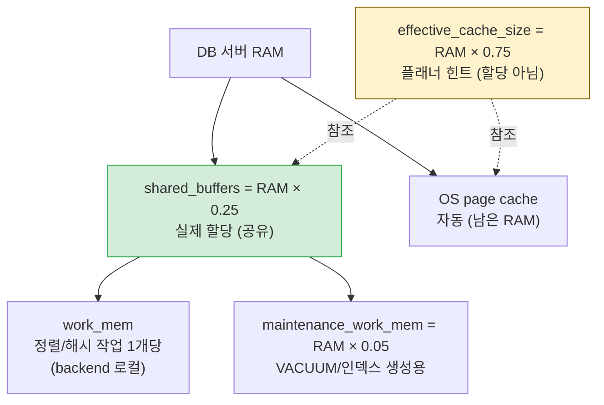
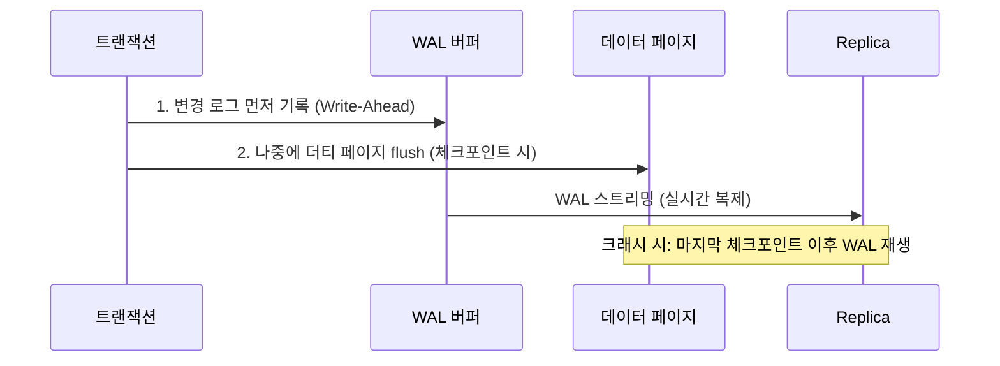
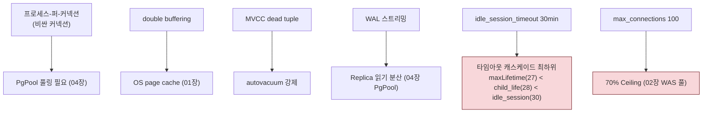

# 03. PostgreSQL 내부 — 프로세스 기반 MVCC DB

> PostgreSQL은 "왜 이 값인가"를 물으면 **MVCC·WAL·프로세스 구조**로 답이 내려온다. 이 장은 그 세 축을 먼저 세운 뒤 파라미터로 내려간다.
> 기준 산출물: `reports/final/postgresql.md` §2-3.

---

## 1단계: 왜 이 메커니즘이 존재하는가 (선수 근본 개념)

### 1.1 프로세스-퍼-커넥션(process-per-connection)

- PostgreSQL은 클라이언트 연결마다 **OS 프로세스(backend)**를 fork한다(스레드가 아님). postmaster가 자식 backend를 관리.
- **결과 1**: 커넥션 생성 비용이 비싸다(fork 비용 + 프로세스당 메모리). → PgPool-II 같은 외부 풀러가 존재하는 근본 이유.
- **결과 2**: `work_mem`이 **정렬/해시 작업 1개당** 할당된다. `max_connections × 동시작업 × work_mem`으로 메모리가 기하급증. 그래서 `max_connections`을 무한정 올릴 수 없다(프로젝트는 100 고정).

### 1.2 double buffering: shared_buffers vs OS page cache


- **double buffering**: 같은 데이터가 PG `shared_buffers`와 OS page cache **두 군데** 존재. 중복이지만 PG는 자체 버퍼 제어(교체 정책, 더티 플러시)를 위해 감수.
- **`shared_buffers`** = 실제 할당(PG 공유 메모리). RAM × 0.25.
- **`effective_cache_size`** = **할당 아님**. 플래너에게 "OS 캐시까지 합쳐서 대략 이만큼 캐시될 것"이라 알려주는 **추정치(힌트)**. RAM × 0.75.
- 이 둘의 차이를 모르면 **"ECS를 올리면 메모리를 더 할당한다"**는 최대 오해에 빠진다.

### 1.3 MVCC + Dead Tuple + Bloat (왜 autovacuum이 필수인가)

- PostgreSQL은 **UPDATE를 덮어쓰지 않는다**. 새 버전을 INSERT하고 옛 버전에 **삭제 표시(dead tuple)**만 남긴다. DELETE도 즉시 회수가 아니라 표시만.
- 이것이 **동시성(MVCC)**의 근간: 읽는 트랜잭션은 자신의 스냅샷 시점의 버전을 보므로, 쓰는 트랜잭션과 충돌 없이 동시 실행.
- **부작용**: dead tuple이 쌓여 테이블이 **bloat(부풀음)**. 디스크·메모리 낭비, 스캔 비용 증가.
- **해결**: `VACUUM`이 dead tuple을 회수(공간을 OS에 반환하거나 재사용 표시). 이를 자동화한 것이 **`autovacuum`**. → `autovacuum=off`는 bloat 폭발·성능 붕괴로 이어져 **절대 금지**.

### 1.4 WAL(Write-Ahead Log) + Checkpoint + Crash Recovery

- **WAL 원칙**: 데이터 페이지를 디스크에 쓰기 **전에**, 그 변경을 기술한 **로그 레코드를 먼저** WAL에 기록한다.
- **왜**: 디스크에 페이지를 매번 fsync하면 느리다. 대신 로그만 순차적으로 쓰고(빠름), 크래시 시 **WAL을 재생(replay)**해 데이터를 복구. 내구성 + 성능을 동시에.
- **Checkpoint**: "이 시점까지의 변경은 모두 디스크에 반영됨"이라는 **복구 기준점**. 크래시 후 복구는 **마지막 체크포인트 이후의 WAL**만 재생하면 된다.
- **Checkpoint 간격과 I/O**: 간격이 짧으면 체크포인트마다 더티 페이지를 디스크에 몰아쓰기 → I/O 스파이크. `checkpoint_completion_target=0.9`는 "다음 체크포인트까지 남은 시간의 90% 동안 평탄하게 분산 flush"하여 스파이크를 평탄화.
- **스트리밍 복제**: Primary가 WAL 스트림을 Replica로 전송, Replica가 replay → 거의 실시간 복제. HA의 근간.

### 1.5 비용 기반 옵티마이저(CBO) + 통계

- PostgreSQL 플래너는 **통계**(ANALYZE가 만든 데이터 분포)와 **비용 모델**(각 연산의 추정 비용)로 "인덱스 vs 순차 스캔"을 선택한다.
- **`random_page_cost`**: 임의 페이지 읽기 비용. HDD는 4.0(디스크 헤드 이동 비싸), **SSD는 1.1**(순차·임의 비용이 비슷). SSD에서 4.0을 그대로 두면 플래너가 인덱스를 "비싸다"고 오판해 순차 스캔을 선택 → 비효율.
- **`effective_io_concurrency`**: SSD는 200(동시 I/O 가능). HDD는 2.
- **통계 주기**: 데이터 분포가 바뀌면 ANALYZE가 새로고침되어야 정확. autovacuum이 통계 갱신도 담당.

### 1.6 잠금·블로킹 + idle-in-transaction의 위험

- 트랜잭션이 잠금을 잡은 채 `BEGIN` 후 **COMMIT/ROLLBACK 없이 방치**되면(idle-in-transaction):
  1. 다른 쿼리가 그 잠금을 기다리며 **블로킹** → 전파 장애
  2. 그 트랜잭션은 자신의 스냅샷을 유지해, 다른 트랜잭션의 dead tuple을 VACUUM하지 못하게 함 → **bloat 가속**
- 이것이 4종 타임아웃 가드레일이 각각 다른 장애를 막도록 분업된 이유다.

---

## 2단계: 작동 원리 (내부 메커니즘)

### 2.1 메모리 계층과 산정



**산정 공식 (DB 전용 서버)**:

| 파라미터 | 공식 | 비고 |
|:---|:---|:---|
| `shared_buffers` | `RAM × 0.25` | 실제 할당 |
| `effective_cache_size` | `RAM × 0.75` | 힌트(할당 X) |
| `work_mem` | `(RAM - shared_buffers) / (max_conn × 3)` | 상한선 |
| `maintenance_work_mem` | `RAM × 0.03 ~ 0.05` | VACUUM/CREATE INDEX |
| `wal_buffers` | 16MB 고정 | 자동 계산 시 최대 16MB 캡 |

### 2.2 WAL + Checkpoint + 복제 흐름



### 2.3 4종 타임아웃 가드레일 분업

```
PostgreSQL Session Timeout Guardrails
  |
  |-- statement_timeout (30s)        쿼리 "실행 중" 상태 최대. 장기 쿼리 자원 독점 방지
  |     |
  |     +-- lock_timeout (10s)       statement 도중 "Lock 대기"만 관여. 10s 초과 시 자동 취소(교착 회피)
  |
  |-- idle_in_transaction_session_timeout (60s)  BEGIN 후 쿼리 완료 후 "유휴" 최대. 잠금 점유 + bloat 방지
  |
  |-- idle_session_timeout (30min)   클라이언트 "세션 유휴" 강제 종료. 연결 누수·좀비 세션 방어
```

각 타임아웃이 **방어하는 장애가 다르다**는 것이 학습 핵심. 한 값으로 통합 불가(목적이 상이).

---

## 3단계: 핵심 파라미터 + 표준값 (RAM별 매트릭스)

### 3.1 RAM별 매트릭스 (프로덕션 PgPool+SR)

| DB RAM | shared_buffers | effective_cache_size | work_mem | maintenance_work_mem | wal_buffers | max_wal_size |
|:---:|:---:|:---:|:---:|:---:|:---:|:---:|
| 8 GB | 2 GB | 6 GB | 8 MB | 384 MB | 16 MB | 2 GB |
| 16 GB | 4 GB | 12 GB | 16 MB | 1 GB | 16 MB | 4 GB |
| 32 GB | 8 GB | 24 GB | 32 MB | 2 GB | 16 MB | 16 GB |
| 64 GB | 16 GB | 48 GB | 64 MB | 4 GB | 16 MB | 32 GB |

### 3.2 복제/HA

| 파라미터 | Primary | Replica | 역할 |
|:---|:---:|:---:|:---|
| `wal_level` | replica | (상속) | WAL에 복제 정보 포함. minimal 시 복제 불가 |
| `max_wal_senders` | 5 | 5 | WAL 스트리밍 연결 최대 |
| `hot_standby` | — | on | Replica 읽기 수용. PgPool 읽기 분산 필수 |
| `hot_standby_feedback` | — | on | Primary Vacuum에 의한 Replica 쿼리 취소(conflict) 방지 |
| `archive_mode` | always | always | WAL 아카이빙. 승격 대비 백업 |

### 3.3 autovacuum (절대 비활성화 금지)

| 파라미터 | 표준값 | 역할 |
|:---|:---|:---|
| `autovacuum` | on | 비활성화 절대 금지 |
| `autovacuum_max_workers` | 3 ~ 5 | 5 이하 유지, 무작정 증설 금지 |
| `autovacuum_naptime` | 1 min | 점검 주기 |
| `autovacuum_vacuum_scale_factor` | 0.1 | Dead Tuple 10% 도달 시 VACUUM |
| `autovacuum_vacuum_cost_limit` | 1,000 ~ 2,000 | 기본값(200) 대비 상향 |

### 3.4 타임아웃 가드레일 + 플래너

| 파라미터 | 표준값 | 방어 대상 |
|:---|:---|:---|
| `statement_timeout` | 30,000ms (30s) | 장기 실행 쿼리 자원 독점 |
| `lock_timeout` | 10,000ms (10s) | Lock 대기 교착 (statement_timeout보다 작게) |
| `idle_in_transaction_session_timeout` | 60,000ms (60s) | 잠금 점유 + bloat |
| `idle_session_timeout` | 1,800,000ms (30min) | 세션 누수 (캐스케이드 최하위) |
| `random_page_cost` | 1.1 (SSD) | 플래너 인덱스 선택 유도 |
| `effective_io_concurrency` | 200 (SSD) | SSD 동시 I/O |

---

## 4단계: 트레이드오프 매트리스 (올리면? / 낮추면?)

### 4.1 shared_buffers

| 방향 | 효과 | 위험 |
|:---|:---|:---|
| **높인다** | PG 자체 캐시 통제↑ | double buffering 증가. 너무 올리면 OS page cache 축소 → **역효과** |

> **TA 판단**: RAM × 0.25가 공식 권장. 그 이상은 OS 캐시와의 균형이 깨짐.

### 4.2 work_mem

| 방향 | 효과 | 위험 |
|:---|:---|:---|
| **높인다** | 정렬/해그가 메모리에서 처리 → 빠름 | **`conn × 동시작업 × work_mem` 폭발** → OOM |
| **낮춘다** | 메모리 안전 | 디스크 spill(느림) |

> **TA 판단**: 상한 `(RAM - shared_buffers) / (max_conn × 3)`. "세션당 1회"가 아니라 **"작업 1개당"**임이 핵심.

### 4.3 max_connections

| 방향 | 효과 | 위험 |
|:---|:---|:---|
| **높인다** | 더 많은 동시 클라이언트 | 프로세스당 메모리 × N. work_mem 폭발. **OOM 위험** |
| **낮춘다** | 자원 안전 | 커넥션 고갈 |

> **TA 판단**: 100 고정(프로젝트). 늘려야 하면 **PgPool 풀링**(04장)으로 백엔드 연결을 줄이는 것이 정석. `max_connections` 직접 증설은 최후.

### 4.4 체크포인트 간격 (max_wal_size)

| 방향 | 효과 | 위험 |
|:---|:---|:---|
| **길게 (max_wal_size↑)** | 체크포인트 빈도↓, I/O 평탄 | 크래시 복구 시 리두(replay)할 WAL이 길어짐 |
| **짧게** | 복구 빠름 | 체크포인트마다 I/O 스파이크 |

> **TA 판단**: `checkpoint_completion_target=0.9`로 평탄화. 복구 시간과 I/O 평탄의 균형.

---

## 5단계: 오개념·함정 + 도메인 간 연결

### 5.1 흔한 오개념

| 오해 | 정정 |
|:---|:---|
| "`effective_cache_size`를 올리면 메모리를 더 할당한다" | **거짓**. 플래너 **힌트**(할당 아님). shared_buffers와 혼동이 최대 함정 |
| "`work_mem`은 세션당 1회 할당이다" | **거짓**. **정렬/해시 작업 1개당**. `conn × 동시작업 × work_mem`으로 폭발 |
| "`autovacuum`이 느려서 끄면 빨라진다" | **거짓**. bloat 폭발·성능 붕괴. 절대 금지. `cost_limit` 상향으로 해결 |
| "HDD의 `random_page_cost=4.0`을 SSD에서도 그대로" | **거짓**. SSD는 1.1. 안 올리면 인덱스 안 쓰는 잘못된 계획 |
| "`max_connections`를 늘리면 동시성이 해결된다" | **거짓**. 프로세스·work_mem 폭증 → OOM. PgPool 풀링이 정답(04장) |

### 5.2 도메인 간 연결



- **비싼 커넥션 → PgPool**: 프로세스 기반 구조라 커넥션이 비싸 → PgPool이 백엔드 연결을 다중화(04장).
- **double buffering → OS**: shared_buffers와 OS page cache의 이중 구조는 01장 page cache 개념과 결합.
- **WAL → 복제 → 읽기 분산**: WAL 스트리밍이 Replica를 만들고, PgPool이 그 Replica로 읽기를 분산(04장).
- **idle_session_timeout → 캐스케이드**: 30min은 방화벽(30min) 바로 아래. WAS maxLifetime(27)·PgPool child_life(28)가 먼저 폐기(02·04장).
- **max_connections → 70% Ceiling**: 100의 70% = 70이 WAS 풀 합산 상한. 직접 연결 시 핵심 제약(02장).

### TA 점검 포인트

1. 운영자가 "쿼리가 느려서 `effective_cache_size`를 48GB에서 64GB로 올려달라"고 한다. 이 요청의 오해를 설명하고, 진짜 조치를 제안하라.
2. `work_mem=64MB`, `max_connections=200` 서버가 OOM을 겪었다. 계산으로 원인을 보여라.
3. `autovacuum=off`로 설정된 레거시 서버. 3개월 후 발생할 현상을 시나리오로 서술하라.
4. SSD인데 `random_page_cost`가 기본(4.0)인 서버. 실행 계획에 나타날 증상을 설명하라.
5. WAS 직접 연결 환경에서 WAS 인스턴스 5개(각 maxPoolSize=20)가 max_connections=100인 PG를 공유. 70% Ceiling 관점에서 평가하라.

> 근거: PostgreSQL 16 공식 문서, PostgreSQL wiki(Tuning), PGTune. 상세 출처는 `harness/vendor-research.md`.
