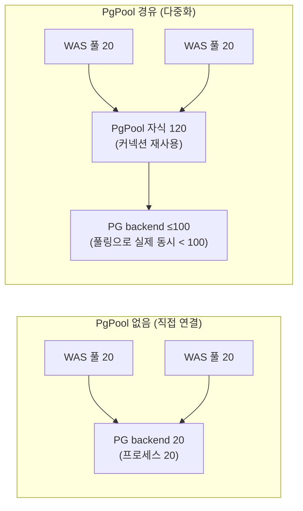
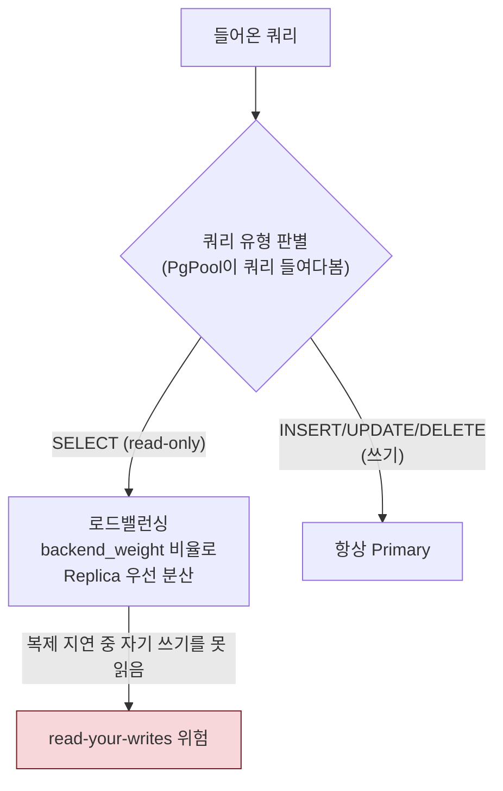
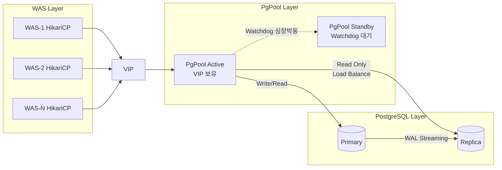
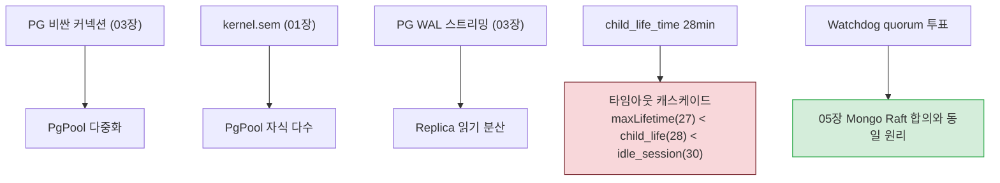

# 04. PgPool-II — PostgreSQL 다중화 계층

> PgPool-II는 PostgreSQL의 "비싼 커넥션" 문제(03장 프로세스 기반)를 풀고, 읽기 분산·HA까지 담당한다. 이 장은 **다중화 모델**과 **합의(quorum)**가 핵심이다.
> 기준 산출물: `reports/final/pgpool-ii.md` §2-3.

---

## 1단계: 왜 이 메커니즘이 존재하는가 (선수 근본 개념)

### 1.1 왜 PgPool이 필요한가 — 커넥션 다중화



- PostgreSQL은 커넥션마다 프로세스를 fork(03장). 커넥션이 많으면 메모리·CPU 폭증 + max_connections 한계.
- **PgPool의 가치**: WAS 여러 개의 풀을 **백엔드 PG 연결보다 적게 다중화(multiplexing)**. 클라이언트 커넥션을 PgPool 자식이 받고, **자식이 백엔드 연결을 재사용**해 PG 부하를 줄인다.
- 단, 다중화는 "항상" 유리하진 않다(§1.2 폭발 함정). WAS가 단일이거나 풀이 작으면 오히려 계층만 늘어남.

### 1.2 풀링 다중화 모델: `num_init_children × max_pool` 폭발

- PgPool 자식 프로세스 1개는 **(DB, 사용자) 조합마다** 백엔드 연결을 따로 풀링한다.
- 따라서 **백엔드 PG 연결 수 = `num_init_children × max_pool`**.
- **함정**: `max_pool`을 부주의하게 올리면 백엔드 연결이 **기하급수적**으로 증가. 단일 DB·단일 계정이면 `max_pool=1`이 정답(불필요한 상향이 최대 위험).
- 공식 권고: `max_pool × num_init_children ≤ (max_connections - superuser_reserved)`. 본 프로젝트는 `1 × 120 > 97`으로 공식을 **초과**하지만, 풀링(재사용)으로 실제 동시 백엔드 연결은 100 이하로 유지됨 → 피크 모니터링이 필수.

### 1.3 프로세스 기반 자식 + 세마포어 결합

- PgPool도 **프로세스 기반**(PostgreSQL처럼). 자식 1개 = 프로세스 1개 = 메모리 + 세마포어 소모.
- `num_init_children=120` 구동 시 프로세스 메모리 약 1GB(4GB 서버 기준). **kernel.sem** 상한을 안 올리면 구동 자체 실패("could not create semaphore set").
- 이것이 `kernel.sem = 250 32000 250 128`이 PgPool 전용 설정인 이유(01장 세마포어 개념과 결합).

### 1.4 문 단위 로드밸런싱 + 읽기/쓰기 라우팅 + read-your-writes



- PgPool은 **SQL 문을 파싱**해 read-only면 Replica로, 쓰기면 Primary로 라우팅. `backend_weight`로 분산 비율 제어(프로젝트: Primary 1 / Replica 3 = 25%:75%).
- **read-your-writes 정합성 문제**: 방금 쓴 데이터를 읽을 때, 복제 지연 중이면 **과거 데이터**를 읽음. 정산/결제 등 정합성 필수 도메인은 Replica 읽기 금지(Primary 고정).

### 1.5 스플릿 브레인 + Quorum + VIP + Watchdog

- PgPool이 단일(SPOF)이면 PgPool이 죽었을 때 전체 단절. 그래서 **Watchdog + VIP**로 HA 구성.
- **VIP(Virtual IP)**: 클라이언트는 VIP로 접속. Active PgPool이 VIP를 잡고, 장애 시 Standby가 VIP를 인계. 단일 접점 보장.
- **스플릿 브레인**: Active·Standby가 둘 다 자신이 Active라고 착각 → VIP가 양쪽에 붙어 충돌. **Watchdog 심장박동 + 과반수 투표(quorum)**로 방지.
- 이 원리는 **05장 MongoDB Replica Set 합의(Raft 유사)와 동일한 "과반수 투표로 단일성 보장"** 원리. 도메인이 달라도 핵심이 같다.

### 1.6 Failover + Fencing (구주 Primary 격리)

- Primary PG 장애 시 Replica를 승격(failover_command). 단, **옛 Primary가 살아나면 dual-primary**가 되어 데이터 분기(무결성 파꽰).
- **Fencing**: 승격 전/후 옛 Primary를 확실히 격리(STONITH류). fencing 없는 자동 페일오버는 위험.

---

## 2단계: 작동 원리 (내부 메커니즘)

### 2.1 PgPool-II 아키텍처



### 2.2 커넥션 사슬 산출 예시 (플랫폼개발팀)

```
WAS 4 인스턴스 × maxPoolSize 20~25 = 풀 합산 80~100
    ↓
PgPool num_init_children = 120 (WAS 풀합 + 여유)
    max_pool = 1 (단일 DB/계정)
    → 백엔드 연결 = 120 × 1 = 120 (이론 상한)
    → 단, 풀링(재사용)으로 실제 동시 점유는 100 이하
    ↓
PostgreSQL max_connections = 100
```

> PgPool 환경에서는 직접 연결의 **70% Ceiling이 풀링으로 대체**됨. WAS 풀 합산이 num_init_children을 초과해도 PgPool Listen Queue가 초과분을 안전 흡수. 단, 피크 시 백엔드 동시 연결이 100에 도달하면 "too many clients already" → 모니터링 필수.

---

## 3단계: 핵심 파라미터 + 표준값

### 3.1 커넥션 풀링

| 파라미터 | 표준값 | 역할 |
|:---|:---|:---|
| `num_init_children` | 120 | 동시 클라이언트 연결(프로세스) 수. 초과 클라이언트는 Listen Queue 대기 |
| `max_pool` | 1 (단일 DB/계정) | 자식당 DB 연결 수. **불필요 상향 시 백엔드 기하급증** |
| `child_life_time` | 1,680 (28min) | 자식 프로세스 최대 생존. DB idle_session_timeout(30min)보다 짧게 |
| `connection_life_time` | 1,680 (28min) | PgPool→PG 백엔드 연결 수명. DB 세션 타임아웃(30min)보다 짧게 |
| `client_idle_limit` | 600 (10min) | 클라이언트(WAS) 유휴 최대. 좀비 커넥션이 자식 점유 방지 |
| `reserved_connections` | 1 | PgPool 관리자 접속 예약 슬롯. 장애 시 DBA 접속 보장 |

### 3.2 로드밸런싱 / HA

| 파라미터 | 표준값 | 역할 |
|:---|:---|:---|
| `load_balance_mode` | on | 읽기 쿼리를 Replica로 분산 |
| `backend_clustering_mode` | 'streaming_replication' | v4.x+ 표준 모드(구 master_slave_mode는 폐지) |
| `backend_weight0` / `weight1` | 1 / 3 | Primary(쓰기+최소 읽기) : Replica(읽기 집중) = 25%:75% |
| `use_watchdog` | on | VIP 기반 SPOF 방지 |
| `failover_command` | '/etc/pgpool-II/failover.sh' | Primary 다운 시 Replica 승격 스크립트 |

### 3.3 OS 커널 (PgPool 전용)

| 파라미터 | 표준값 | 역할 |
|:---|:---|:---|
| `kernel.sem` | 250 32000 250 128 | 자식 프로세스 세마포어. 형식: SEMMSL SEMMNS SEMOPM SEMMNI |
| `vm.swappiness` | 10 | WAS와 유사한 네트워크 프록시 역할 |

> kernel.sem 형식: `SEMMSL`(세트당 최대 세마포어) `SEMMNS`(전체 최대) `SEMOPM`(opm 호출당 최대 op) `SEMMNI`(세마포어 세트 최대 수).

---

## 4단계: 트레이드오프 매트리스 (올리면? / 낮추면?)

### 4.1 num_init_children

| 방향 | 효과 | 위험 |
|:---|:---|:---|
| **높인다** | 동시 클라이언트 수용↑ | 프로세스·메모리·세마포어 소모↑. 4GB 서버에서 120 구동 시 약 1GB |
| **낮춘다** | 자원 절약 | WAS 풀 합산이 초과 시 클라이언트 대기(Listen Queue) → 응답 지연 |

> **TA 판단**: WAS 풀 합산 + 여유(최소 120). PgPool+PG 병설 시 메모리 균형 주의.

### 4.2 max_pool

| 방향 | 효과 | 위험 |
|:---|:---|:---|
| **높인다** | 복수 DB/계정 지원 | **백엔드 연결 기하급증**(`num_init_children × max_pool`) |

> **TA 판단**: 단일 DB/계정이면 **1 고정**. 올릴 명분이 없으면 올리지 말 것.

### 4.3 읽기 분산 (backend_weight)

| 방향 | 효과 | 위험 |
|:---|:---|:---|
| **Replica 비중↑** | Primary 읽기 부하↓, 처리량↑ | 복제 지연 중 과거 데이터 읽음(read-your-writes 위험) |
| **Primary 비중↑** | 최신 데이터 보장 | Primary 과부하 |

> **TA 판단**: 정산/결제·read-your-writes 필수 도메인은 Primary 고정. 조회성만 Replica.

### 4.4 자동 페일오버

| 방향 | 효과 | 위험 |
|:---|:---|:---|
| **빠른 전환** | 가용성↑(RTO↓) | fencing 없으면 **dual-primary** → 데이터 분기 |
| **수동 전환** | 안전 | RTO 악화 |

> **TA 판단**: Watchdog quorum + fencing이 전제된 자동 페일오버만 허용.

---

## 5단계: 오개념·함정 + 도메인 간 연결

### 5.1 흔한 오개념

| 오해 | 정정 |
|:---|:---|
| "`max_pool`을 크게 하면 풀링 효율이 좋아진다" | **거짓**. `num_init_children × max_pool`로 백엔드 연결 기하급증. 단일 DB는 1 고정 |
| "Replica 읽기 분산은 항상 이득" | **거짓**. 복제 지연 중 자기 쓰기를 못 읽음. 정산/결제는 Primary 고정 |
| "Watchdog만 켜면 HA 보장" | **거짓**. fencing(구주 Primary 격리) 없으면 dual-primary로 데이터 분기 |
| "PgPool이 있으니 max_connections를 무한정 늘려도 된다" | **거짓**. 풀링으로 실제 동시는 줄지만, 극단 피크 시 100 도달 가능 → 모니터링 필수 |
| "PgPool+PG 병설 시 swappiness는 아무 값이나" | **거짓**. 충돌 시 DB 기준(1) 우선 |

### 5.2 도메인 간 연결



- **PG 커넥션 비용 → PgPool**: 03장 프로세스 기반 구조가 PgPool 존재 이유(다중화).
- **세마포어 → PgPool**: 01장 kernel.sem이 PgPool 자식 다수의 전제.
- **WAL 복제 → 읽기 분산**: 03장 WAL 스트리밍이 Replica를 만들고, PgPool이 그 Replica로 읽기를 분산.
- **타임아웃 캐스케이드**: `child_life_time(28)`은 WAS maxLifetime(27)과 PG idle_session(30) 사이. 엄격 부등호.
- **합의 원리의 동일성**: PgPool Watchdog quorum과 05장 MongoDB PSS 합의는 **"과반수 투표로 단일성 보장"**이라 같은 원리. 도메인 대칭 학습 추천.
- **fencing ↔ PSA**: PgPool fencing 없는 페일오버(dual-primary 위험)와 05장 Mongo PSA(w:majority stall)는 모두 **"단일성 위반 시 데이터 무결성 파괴"**라 같은 맥락.

### TA 점검 포인트

1. `max_pool=4`로 올린 PgPool이 `num_init_children=120`으로 구동 중. 백엔드 PG 연결의 이론 상한과 위험을 계산하라.
2. 조회성 서비스에 `backend_weight1=0`(Replica 안 쓰음)으로 설정된 경우. 효율 문제를 지적하고, 단 정산 서비스는 그대로 둬야 하는 이유를 설명하라.
3. Watchdog 없이 `failover_command`만 설정된 PgPool. Primary 장애 후 옛 Primary 복구 시 발생할 일을 서술하라.
4. WAS 5개(각 20) → PgPool(120) → PG(100). 피크 시 "too many clients already" 가능 시나리오와 모니터링 방법을 설명하라.
5. PgPool Watchdog quorum과 MongoDB Replica Set 과반수 합의의 공통점을 한 문장으로 설명하라.

> 근거: PgPool-II 공식 매뉴얼, kernel.org 세마포어 문서. 상세 출처는 `harness/vendor-research.md`.
