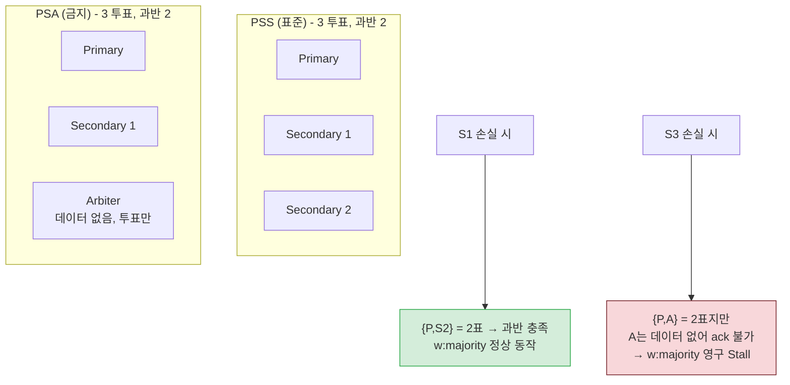
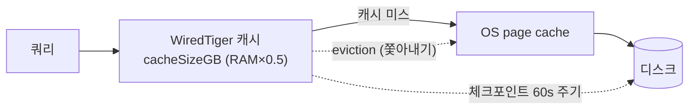
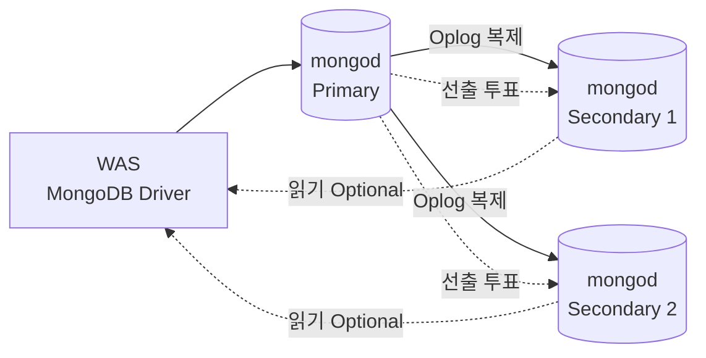
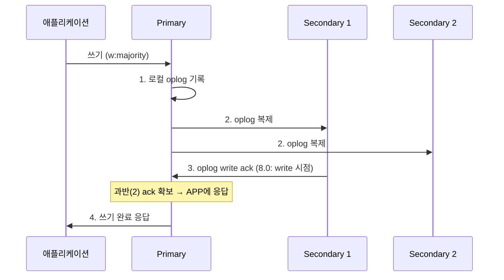
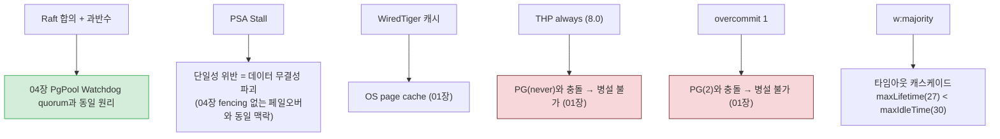
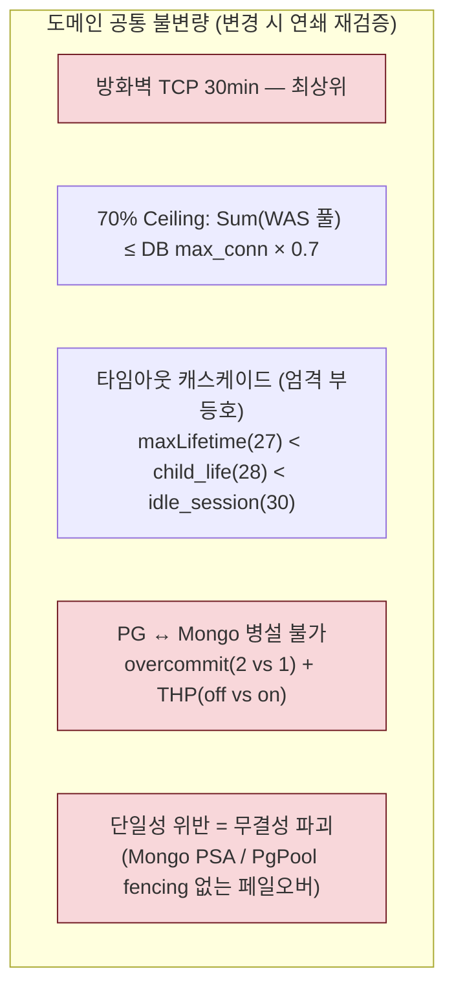

# 05. MongoDB 8.0 — 합의와 WiredTiger

> MongoDB의 모든 설정값은 **합의(Replica Set)**와 **WiredTiger 엔진**으로 설명된다. 이 장의 핵심은 "왜 PSS인가, PSA는 왜 위험한가"를 quorum으로 이해하는 것이다.
> 기준 산출물: `reports/final/mongodb.md` §2-3.

---

## 1단계: 왜 이 메커니즘이 존재하는가 (선수 근본 개념)

### 1.1 Replica Set 합의(Raft 유사) + Quorum

- MongoDB Replica Set은 **리더 선출(election) + 복제(oplog)**로 HA·내구성을 동시에 제공. 합의 알고리즘은 **Raft 유사**.
- **Quorum(과반수)**: 결정(선출, 쓰기 ack)은 **과반수 투표**로 확정. `majority = floor(N/2) + 1`.
  - 3노드(PSS): 과반수 = 2
  - 5노드: 과반수 = 3
- 과반수가 안 나오면 Primary를 선출/유지 못해 **쓰기 정지**. 이것이 노드 수(홀수)를 정하는 근본 원리.

### 1.2 PSS vs PSA — 왜 PSA가 위험한가 (정확한 메커니즘)

**PSA Stall의 정확한 이유**:
- **Arbiter**는 투표권은 있지만 **데이터를 보관하지 않는다**. 따라서 쓰기를 ack할 수 없다.
- PSA에서 Secondary 1대가 손실되면 남은 것은 {Primary, Arbiter}. 투표는 2표(과반 충족)지만, `w:majority`는 **데이터를 보관한 노드의 과반 ack**가 필요 → Arbiter는 ack 불가 → **Primary 혼자만 ack 가능 = majority 불가 = 영구 Stall**.
- 복구하려면 `w:1`로 강등(데이터 유실 위험)하거나 Secondary 복구를 기다려야. 정산/결제 도메인에서는 치명적 → **PSA 절대 금지**.

PSS는 Secondary 1대 손실 시 {Primary, 남은 Secondary}로 과반(2)을 **데이터 ack로** 충족 가능 → 정상 동작. 이것이 3노드 PSS가 표준인 이유.

### 1.3 WiredTiger 엔진: 캐시 + MVCC 스냅샷 + 체크포인트 + eviction

- WiredTiger는 자체 **버퍼 캐시**(PG shared_buffers와 유사) + **MVCC 스냅샷**으로 동시성 제공.
- **`cacheSizeGB`** = 자체 캐시 크기. **`0.5 × (RAM - 1)`**: DB 전용 서버에서 RAM의 약 50%.
  - 왜 100%가 아닌가: OS page cache·커넥션당 스레드 스택·WT 자체 오버헤드에 나머지 50% 예약(double buffer 의도적 수용).
  - 32GB+는 하향 조정(OS page cache 마진 확보).
- **체크포인트**: 기본 60s 주기로 디스크에 일관된 스냅샷 기록(크래시 복구 기준점). PG의 checkpoint와 유사.
- **eviction**: 캐시가 가득 차면 오래된 페이지를 쫓아냄. eviction이 처리를 못 따라가면 **지연 스파이크**. 그래서 캐시를 너무 작게 잡으면 위험.

### 1.4 Write Concern + 저널링(j) + ack 계층

| Write Concern | ack 시점 | 내구성 | 지연 |
|:---|:---|:---|:---|
| `w: 1` | Primary 메모리/journal ack | 낮음(Primary 장애 시 유실 가능) | 빠름 |
| `w: majority` | 과반 노드가 저널에 기록(8.0부터 oplog write 시점) | 높음(선출 시 롤백 방지) | 느림 |
| `j: true` | 저널 fsync까지 보장 | 최고 | 가장 느림 |

- **내구성 vs 지연** 트레이드오프의 핵. 정산/결제 = `w: majority`(유실 불가), 일반 = `w: 1`(빠름).
- **MongoDB 8.0 변경**: `w: majority` ack 시점이 "majority 노드가 **oplog 엔트리를 write**한 시점"으로 당겨짐(기존: 적용 완료 후). 성능 향상.

### 1.5 Read Preference + 복제 지연 + read-your-writes

| Read Preference | 읽는 곳 | 정합성 | 적합 |
|:---|:---|:---|:---|
| `primary` (기본) | 항상 Primary | 최신 보장 | 정산/결제 |
| `primaryPreferred` | Primary 우선, 불가 시 Secondary | 최선 | Primary 장애 대비 |
| `secondary` | 항상 Secondary | 과거 가능 | 대시보드/통계 |
| `secondaryPreferred` | Secondary 우선, 불가 시 Primary | 과거 가능 | 조회성 |

- Secondary 읽기는 **복제 지연(lag)만큼 과거 데이터**. 방금 쓴 데이터를 못 읽을 수 있음(read-your-writes 위반).
- 정산/결제는 반드시 `primary`. R:W=6:4 환경에서도 조회성만 `secondaryPreferred`.

### 1.6 인덱싱(ESR) + CBR(8.3) + COLLSCAN

- **"스키마가 없다 ≠ 인덱스가 안 중요하다"** (최대 오개념). MongoDB도 B-Tree 인덱스를 쓰며, 인덱스 없는 쿼리는 **COLLSCAN(전체 스캔)** → 치명적.
- **ESR 규칙**: 복합 인덱스 순서 = **Equality(정확 일치) → Sort(정렬) → Range(범위)**. 선행 컬럼 배치가 B-Tree 효율 결정.
- **CBR(Cost-Based Ranker, 8.3+)**: PG 옵티마이저와 유사한 비용 기반 쿼리 플랜 선택. 이전 버전은 휴리스틱 위주.
- **COLLSCAN Zero-Tolerance**: 발생 시 즉시 인덱스 추가. 이것이 Profiling을 필수로 만드는 이유.

### 1.7 TCMalloc per-CPU cache(7.1+/8.0) + THP 전환

- MongoDB 8.0은 **TCMalloc을 per-CPU cache 버전으로 업그레이드**(기존 per-thread). 단편화·락 경합 감소.
- **THP 지침 역전**: per-CPU cache가 THP를 적극 활용하도록 설계 → MongoDB 8.0은 **THP 활성화(always) 권장**(7.0 이하는 disable).
  - 조건: 커널 4.18+, THP 활성화, **glibc rseq 비활성**(`GLIBC_TUNABLES=glibc.pthread.rseq=0`).
- **PostgreSQL(THP off)과 충돌** → 병설 불가의 두 번째 축(01장 참조).

---

## 2단계: 작동 원리 (내부 메커니즘)

### 2.1 Replica Set PSS 아키텍처

### 2.2 Write Concern 동작 (w:majority)

> 8.0 변경: ack 시점이 "oplog write"로 당겨짐(기존: 적용 완료). 빈번한 w:majority 쓰기에서 지연 개선.

### 2.3 WiredTiger 캐시 산정

| DB RAM | cacheSizeGB | 계산 | 비고 |
|:---:|:---:|:---|:---|
| 8 GB | 3.5 GB | 0.5×(8-1) | 공식 적용 |
| 16 GB | 7.5 GB | 0.5×(16-1) | 표준 프로덕션 |
| 32 GB | 12.0 GB | 하향 | OS page cache 마진 |
| 64 GB | 24.0 GB | 하향 | 대량 커넥션 + page cache |

> 공유 환경(WAS/DB 혼합): 25% 수준으로 명시적 제한.

---

## 3단계: 핵심 파라미터 + 표준값

### 3.1 WiredTiger + 쿼리

| 파라미터 | 표준값 | 역할 |
|:---|:---|:---|
| `cacheSizeGB` | `0.5×(RAM-1)`, 32GB+ 하향 | WT 내부 캐시. 과다 시 OS 메모리 부족 → 스와핑 |
| `replSetName` | rs0 | Replica Set 식별자. 전 노드 동일 |
| Profiling Level | 1 (slowms: 100) | 슬로우 쿼리·COLLSCAN 감지 |
| `defaultMaxTimeMS` | 60,000 (권장) | 8.0 신규. 개별 읽기 기본 시간 제한 |
| `maxIncomingConnections` | RAM별 1,000~10,000 | 최대 동시 연결. 커넥션당 1MB 스택. 기본 65,536은 소형 서버 OOM 위험 |
| `internalQueryMaxBlockingSortMemoryUsageBytes` | **100MB (8.0 기본값)** | 인덱스 없는 정렬 시 세션당 메모리 상한. 6.0+ allowDiskUse 기본 true → 초과 시 자동 disk spill. 구이름 `internalQueryExecMaxBlockingSortBytes`는 [SERVER-44053](https://jira.mongodb.org/browse/SERVER-44053) rename/deprecated |

### 3.2 Write Concern / Read Preference 의사결정

| 서비스 유형 | writeConcern | readPreference | 사유 |
|:---|:---|:---|:---|
| 정산/결제 (정합성 필수) | w: majority | primary | 유실 불가, 최신 보장 |
| 일반 상용 (HA 필요) | w: 1 | primary | 기본 안정성 |
| 조회성 (Lag 허용) | w: 1 | secondaryPreferred | 읽기 분산 |
| 대시보드/통계 | w: 1 | secondary | Primary 부하 제로화 |

> 정산/결제는 **반드시** `primary` readPreference.

### 3.3 OS 커널 (MongoDB 8.0 전용)

| 파라미터 | 표준값 | PG와 비교 | 역할 |
|:---|:---|:---|:---|
| `vm.swappiness` | 1 | 같음 | WT 캐시 스왑 시 성능 급감 |
| `vm.overcommit_memory` | **1** | **PG(2)와 충돌** | TCMalloc per-CPU cache 정상 동작 |
| THP | **always** | **PG(never)와 충돌** | TCMalloc per-CPU cache 활용 |
| `vm.dirty_background_ratio` | 5 | 같음 | WT 체크포인트와 커널 플러시 충돌 완화 |
| `vm.dirty_ratio` | 15 | PG(10)보다 높음 | WT 자체 쓰기 스케줄링 존재 |

> **PG와 Mongo는 동일 호스트 병설 금지**(overcommit + THP 두 충돌).

---

## 4단계: 트레이드오프 매트리스 (올리면? / 낮추면?)

### 4.1 cacheSizeGB

| 방향 | 효과 | 위험 |
|:---|:---|:---|
| **높인다** | 캐시 적중↑, eviction 감소 | OS page cache·커넥션 여유 부족 → OOM/스와핑 |
| **낮춘다** | 시스템 여유 | 캐시 미스↑, eviction 지연 스파이크 |

> **TA 판단**: DB 전용 `0.5×(RAM-1)`, 공유 25%. 32GB+는 OS 마진 위해 하향.

### 4.2 Write Concern (내구성 vs 지연)

| 방향 | 효과 | 위험 |
|:---|:---|:---|
| `w: majority`↑ | 유실·롤백 방어 | 쓰기 지연 증가(과반 대기) |
| `w: 1`↓ | 빠름 | Primary 장애 시 유실 |

> **TA 판단**: 정산/결제 = majority 강제. 일반 = 1. 도메인별 분류 필수.

### 4.3 Read Preference (정합성 vs 읽기 처리량)

| 방향 | 효과 | 위험 |
|:---|:---|:---|
| Secondary 읽기↑ | Primary 부하↓, 처리량↑ | 과거 데이터(Lag만큼) |
| Primary 고정 | 최신 보장 | Primary 부하 |

> **TA 판단**: read-your-writes 필요 시 primary. R:W=6:4라도 조회성만 secondary.

### 4.4 가용성(PSS) vs 비용(PSA)

| 구성 | 효과 | 위험 |
|:---|:---|:---|
| PSS (3노드) | S 손실에도 w:majority 정상 | 비용 3노드 |
| PSA (3노드) | 비용 절감(데이터 2복제) | **S 손실 시 w:majority 영구 Stall** |

> **TA 판단**: 정산/결제 PSA 절대 금지. 하드웨어 제약 시에도 PSS.

---

## 5단계: 오개념·함정 + 도메인 간 연결

### 5.1 흔한 오개념

| 오해 | 정정 |
|:---|:---|
| "MongoDB는 스키마가 없어 인덱스가 덜 중요하다" | **거짓**. 반대. 스키마 유연성일 뿐 인덱스는 동일 필수. COLLSCAN Zero-Tolerance |
| "PSA가 PSS와 같은 가용성" | **거짓**. S 손실 시 Arbiter가 ack 불가 → w:majority 영구 Stall. 정산/결제 PSA 금지 |
| "`secondaryPreferred`면 항상 빠르다" | **거짓**. 복제 지연 허용 서비스만. 과거 데이터 읽음 |
| "`w:1`이면 디스크에 안전히 써진다" | **거짓**. Primary ack만. 선출 시 롤백/유실 가능. 강내구성은 w:majority |
| "WiredTiger 캐시를 RAM 가까이 올리면 좋다" | **거짓**. OS page cache·커넥션 여유 필요. `0.5×(RAM-1)` 상한 |
| "THP는 항상 꺼야 한다(MongoDB도)" | **거짓**. 8.0은 TCMalloc per-CPU cache로 THP **on 권장**(7.0 이하는 off). PG와 충돌 |

### 5.2 도메인 간 연결

- **합의 원리의 동일성**: Mongo PSS 과반수 합의와 04장 PgPool Watchdog quorum은 **"과반수 투표로 단일성 보장"**이라 같은 원리. 대칭 학습으로 개념 강화.
- **단일성 위반 = 무결성 파괴**: PSA Stall(데이터 ack 불가)과 04장 fencing 없는 페일오버(dual-primary)는 모두 "단일성이 깨지면 데이터가 망가진다"는 같은 교훈.
- **캐시 → OS**: WiredTiger 캐시와 OS page cache의 관계는 01장·03장(double buffering)과 동일 구조.
- **THP/overcommit → 병설 불가**: 01장에서 배운 커널 전역값 충돌이 05장에서 PG·Mongo 분리의 근거로 재등장.
- **Write Concern → 캐스케이드**: `w:majority`는 과반 노드 ack 대기 → 지연. 이 지연이 WAS maxLifetime(27min)·Mongo maxIdleTime(30min) 캐스케이드와 결합.

### TA 점검 포인트

1. PSA 구성에서 Secondary 1대가 다운됐다. `w:majority` 쓰기가 왜 멈추는지 Arbiter의 역할로 설명하라.
2. 정산 서비스의 Read Preference가 `secondaryPreferred`로 설정돼 있다. 발생할 수 있는 사고 시나리오를 서술하라.
3. 8GB 서버에서 `cacheSizeGB=7`로 설정된 Mongo. 위험을 지적하고 올바른 값을 계산하라.
4. PostgreSQL과 MongoDB를 같은 호스트에 올리려 한다. 두 가지 커널 충돌과 해결책을 설명하라.
5. PgPool Watchdog quorum과 MongoDB Replica Set 합의의 공통점을 한 문장으로 설명하라(04장과 연결).
6. COLLSCAN이 system.profile에서 발견됐다. 즉시 취해야 할 조치와 ESR 규칙 적용 순서를 설명하라.

> 근거: MongoDB 8.0 공식 매뉴언, WiredTiger 문서, MongoDB 8.0 release notes(THP/TCMalloc/Write Concern 변경). 상세 출처는 `harness/vendor-research.md`.

---

## 전 장 통합: 도메인 간 불변량 최종 점검

본 장까지 5개 도메인을 모두 배웠다. 이제 **한 도메인의 값을 바꾸면 연쇄 재검증**해야 할 전체 불변량을 정리한다(`harness/gotchas.md`와 정합).

이 불변량들을 한 번에 외우지 말고, 각 장의 **근본 개념**에서 도출할 수 있어야 TA로서 독자적 판단이 가능하다. 본 학습 문서의 목표는 그 "도출 능력"을 기르는 것이다.
