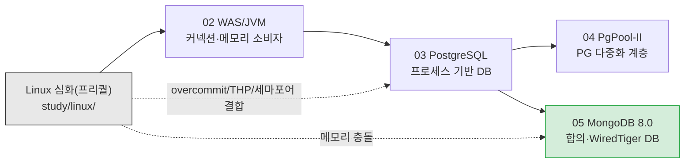
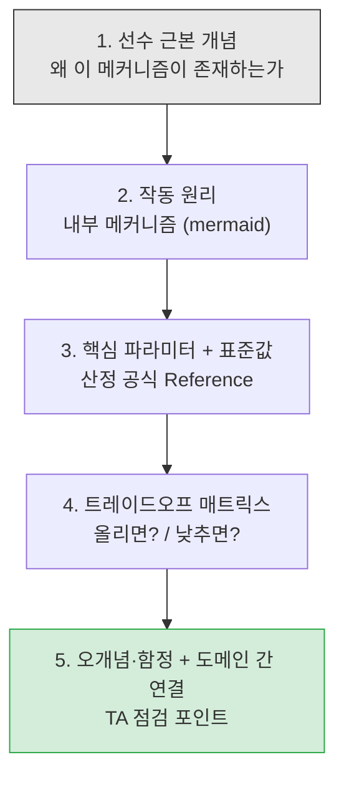
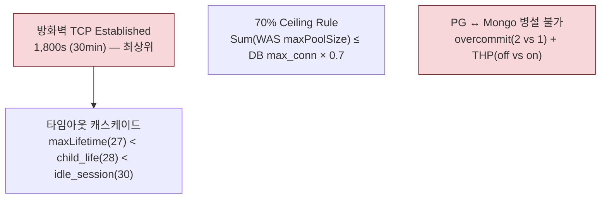

# TA 인프라 기본 소양 학습 커리큘럼

> 본 폴더는 전사 인프라 표준 설정 가이드라인(`reports/final/`)을 운영·검토하는 **Technical Advisor(TA) 후보자**가 각 설정값의 의미와 트레이드오프를 스스로 판단할 수 있도록 돕는 학습 문서다.
> 설정값 사전이 아니다. **"왜 이 값을 쓰는가, 바꾸면 어떤 일이 일어나는가"**를 묻는 학습 자료다.

## 학습 대상과 전제

- 인프라 표준 규정(`reports/final-standard-guide.md`)의 **설정값에 담긴 의사결정 근거**를 이해하려는 TA/운영자/DBA
- Linux·JVM·RDBMS·NoSQL 기초 지식 보유 가정. 각 장은 **근본 개념**부터 시작하므로 심화 학습 가능.

## 커리큘럼 구성

### Linux OS 심화 (프리퀄 — 도메인 장보다 먼저 읽을 것)

WAS·DB 도메인 장을 읽기 전에, 그 아래에 있는 운영체제를 먼저 읽는다. `study/linux/` 하위 6장 시리즈.

| 장 | 도메인 | 핵심 질문 |
|:---:|:---|:---|
| linux/01 | 아키텍처/실행 모델 | 부팅은 어떻게 진행되며, systemd가 서비스 한계를 왜 결정하는가? |
| linux/02 | 프로세스/스케줄링 | EEVDF(6.6+)는 왜 CFS를 대체했으며, fork 비용·세마포어는 왜 중요한가? |
| linux/03 | 메모리 관리(핵심) | page cache·OOM·overcommit·THP가 왜 DB 튜닝의 심장인가? |
| linux/04 | 파일시스템/I/O | fd 3계층 함정·저널링·fsync가 DB 내구성과 어떻게 연결되는가? |
| linux/05 | 네트워킹 스택 | TCP 상태머신·TIME_WAIT·keepalive가 방화벽 30분과 어떻게 싸우는가? |
| linux/06 | 통합 튜닝/체크리스트 | 모든 OS 개념을 인프라 튜닝값으로 종합하는 결론장 |

> [Linux 심화 커리큘럼 인덱스](./linux/README.md) -- 학습 경로 + 깊이 경계 + 도메인 다리

### 도메인 심화 (Linux 프리퀄 이후)

| 장 | 도메인 | 핵심 질문 | 산출물 연결 |
|:---:|:---|:---|:---|
| 02 | WAS/JVM | GC는 왜 여러 종류인가? Heap을 키우면 왜 항상 좋지 않은가? 스레드를 늘린다고 처리량이 오르는가? | `reports/final/was.md` §2-3 |
| 03 | PostgreSQL | shared_buffers와 effective_cache_size는 왜 다른가? autovacuum은 왜 끄면 안 되는가? WAL은 무엇을 지키는가? | `reports/final/postgresql.md` §2-3 |
| 04 | PgPool-II | PgPool은 왜 DB 커넥션을 줄여주는가? max_pool을 올리면 왜 폭발하는가? 스플릿 브레인을 어떻게 막는가? | `reports/final/pgpool-ii.md` §2-3 |
| 05 | MongoDB 8.0 | PSS는 왜 3노드인가? PSA는 왜 위험한가? w:majority는 무엇을 보장하는가? WiredTiger 캐시는 왜 RAM의 절반인가? | `reports/final/mongodb.md` §2-3 |

## 각 장의 학습 구조 (5단계 퍼널)

모든 장이 동일한 흐름으로 구성된다. 이유: "값"을 외우기 전에 **"왜"**를 세우고, **"바꾸면"**을 연습해야 TA가 독자적 판단을 할 수 있다.

## 권장 학습 경로

1. **Linux 심화(`study/linux/`)부터** — page cache·fd·overcommit·세마포어·TCP가 모든 도메인의 기반. 이해 없이 도메인 장은 공중부실. 특히 `linux/03`(메모리 관리)이 핵심.
2. **02 WAS/JVM** — 커넥션·메모리 "소비자" 관점. DB 설정(70% Ceiling, 타임아웃 캐스케이드)을 역산하는 주체.
3. **03 PostgreSQL** → **04 PgPool-II** — PgPool은 PG에 의존. 같이 학습.
4. **05 MongoDB** — PostgreSQL과 **병설 불가**(overcommit·THP 충돌)를 강조하며 `linux/03`으로 회귀.
5. **통합**: 모든 장의 "도메인 간 연결" 절과 `linux/06`(통합 튜닝)을 모으면 전체 아키텍처 불변량(70% Ceiling, 방화벽 30min, 타임아웃 캐스케이드)이 완성된다.

## 산출물과의 관계

- 본 학습 문서는 `reports/final/*.md`(운영자 배포 정본)의 **"왜"를 보충**하는 Explanation 자료.
- 값의 정확성·시효성은 `harness/vendor-research.md`(리서치 근거)와 `.claude/skills/verify-standards`(검증 절차)가 담당.
- 본 문서가 권위 있는 산출물은 아니다. 설정 적용 시에는 항상 `reports/final/` 정본을 따를 것.

## 핵심 도메인 간 불변량 (전 장에 등장)

이 네 가지는 한 도메인의 값을 바꾸면 **다른 도메인까지 연쇄 재검증**해야 하는 불변량이다(`harness/gotchas.md` 참조).
