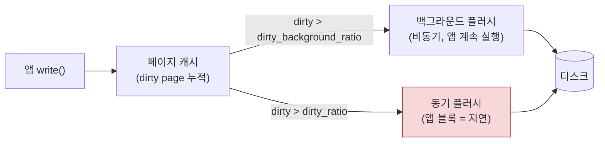
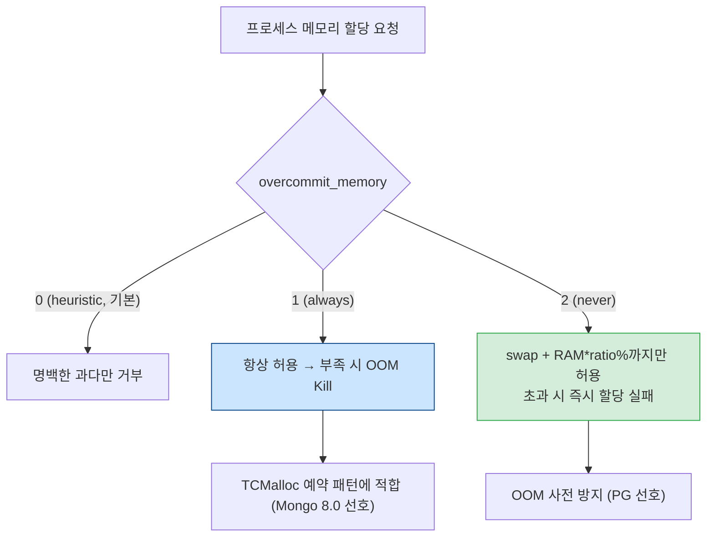
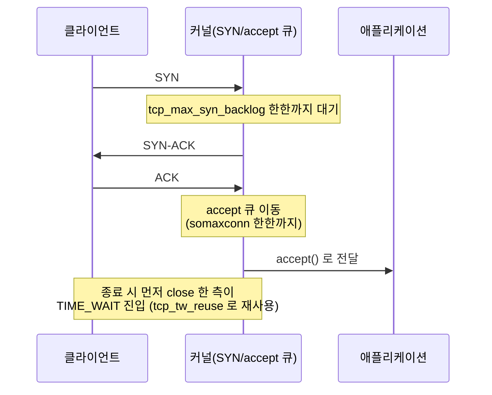
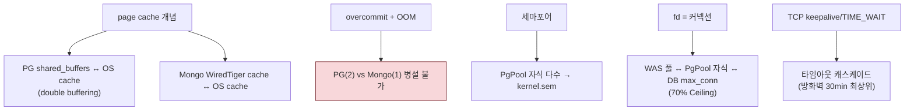

# 01. Linux 커널 / ulimit — 모든 도메인의 토대

> WAS·PostgreSQL·MongoDB·PgPool의 모든 설정은 Linux 커널 위에서 동작한다. 이 장은 표면적 sysctl 값 너머에 있는 **커널 메커니즘**을 이해하는 것을 목표로 한다.
> 기준 산출물: `reports/final/{was,postgresql,pgpool-ii,mongodb}.md` §1.

---

## 1단계: 왜 이 메커니즘이 존재하는가 (선수 근본 개념)

커널 파라미터를 외우기 전에, 커널이 **무엇을 관리하는가**를 먼저 본다.

### 1.1 가상 메모리 + 페이지 캐시 + writeback

- Linux는 파일 내용을 **페이지 캐시(OS page cache)**에 올려두고 디스크 I/O를 줄인다. 수정된 페이지는 **dirty page**가 되어, 일정 조건에서 디스크로 **writeback(플러시)**된다.
- 이 writeback을 언제·얼마나 할지가 `vm.dirty_*` 파라미터다. 플러시가 한 번에 몰리면 **I/O 스파이크(지연 버스트)**가 발생한다. DB는 자체 쓰기 스케줄링(WAL, checkpoint)이 있어 커널의 대량 writeback이 예측성을 해친다.

### 1.2 fork() + copy-on-write(CoW) + OOM Killer

- `fork()`는 부모 프로세스의 가상 주소 공간을 자식에게 복사하지만, **물리 페이지는 당장 복사하지 않고 쓰기 발생 시(copy-on-write)만 복사**한다.
- 덕분에 **가상 메모리 합 > 물리 메모리**가 가능(overcommit). 하지만 실제 사용량이 물리 메모리를 넘기면 커널이 **OOM Killer**로 프로세스를 강제 종료한다.
- 이것이 `vm.overcommit_memory` 정책과 OOM Killer의 근원이다. **PostgreSQL(2) vs MongoDB 8.0(1) 병설 불가**도 여기서 비롯된다.

### 1.3 fd(파일 디스크립터) 테이블 = 커넥션

- Linux에서 **"네트워크 소켓 1개 = fd 1개"**다. 커넥션 수가 곧 fd 사용량.
- fd 한계는 **두 단계**로 존재한다:
  - 시스템 전체: `fs.file-max`(그리고 상한 `fs.nr_open`)
  - 프로세스 단위: `RLIMIT_NOFILE`(`ulimit -n`)
- 둘 다 올려야 의미가 있다. 한쪽만 올리면 다른 쪽에서 막힌다.
- **함정**: `/etc/security/limits.conf`의 `ulimit`은 **PAM 로그인 세션에만 적용**. systemd가 관리하는 서비스 데몬(tomcat/postgres/mongod/pgpool)에는 **적용되지 않는다**. 반드시 `systemd` drop-in(`LimitNOFILE`/`LimitNPROC`)을 별도로 설정해야 한다.

### 1.4 TCP 상태 머신 + accept 큐 + TIME_WAIT

- TCP 연결은 상태 머신을 따른다. 서버 소켓에는 두 단계 큐가 있다:
  - **SYN 큐**(SYN_RECV): 3-way handshake 완료 전 요청 대기 — `tcp_max_syn_backlog`
  - **accept 큐**(ESTABLISHED, 미수락): 완료됐지만 앱이 `accept()` 안 한 연결 — `somaxconn`과 앱 `backlog`의 `min`
- 먼저 연결을 끊는 측은 **TIME_WAIT** 상태로 진입(약 60~120초 유지). 클라이언트 역할(WAS→DB 호출)이 많은 서버에서 **ephemeral port 고갈**의 주원인.
- **half-open**: 상대방이 단절했는데 이쪽은 모르는 상태. 방화벽 idle drop 후에도 커넥션이 살아있는 것처럼 보임. 이것이 TCP keepalive가 존재하는 이유.

### 1.5 THP(Transparent Huge Pages) + 동기 디플래그

- 기본 페이지 4KB 대신 2MB **huge page**를 써 TLB 미스를 줄이는 기능. `khugepaged` 데몬이 백그라운드에서 4KB 페이지들을 2MB로 병합(collapse)하려 한다.
- 병합하려면 **2MB 정렬 연속 물리 영역**이 필요 → 단편화 시 **compaction(조각모음)** 발생 → 이 작업이 STW급 **수십~수백 ms 지연 스파이크** 유발.
- **핵심**: THP는 **시스템 전역 설정**(`always`/`madvise`/`never`)이며, DB마다 요구가 **정반대**다.

### 1.6 System V 세마포어

- PostgreSQL·PgPool-II는 **프로세스 기반** 구조라, 공유 메모리 접근 동기화에 System V 세마포어를 쓴다.
- 세마포어는 커널 자원으로 **상한**이 있다(`kernel.sem`). 자식 프로세스를 많이 띄우면 세마포어 소모가 늘어, 상한 위반 시 **구동 자체 실패**("could not create semaphore set").

---

## 2단계: 작동 원리 (내부 메커니즘)

### 2.1 페이지 캐시와 writeback 임계값

### 2.2 overcommit_memory 모드와 OOM Killer

**충돌 본질**: `overcommit_memory`는 **커널 전역값**이라 한 호스트에서 한 가지만 선택 가능 → PG(2)와 Mongo 8.0(1)은 양립 불가 → 물리 호스트 분리가 표준.

### 2.3 TCP 연결 수락과 종료 흐름

---

## 3단계: 핵심 파라미터 + 표준값

### 3.1 공통 (모든 서버)

| 파라미터 | 표준값 | 역할 | 출처 |
|:---|:---|:---|:---|
| `fs.file-max` | 2,097,152 | 시스템 전체 fd 상한. 대규모 동시 접속 시 "Too many open files" 방지 | kernel.org |
| `net.core.somaxconn` | 4,096 | accept 큐 상한. 앱 `backlog`와 `min` 적용. 버스트 시 패킷 Drop 방지 | kernel.org ip-sysctl |
| `net.ipv4.tcp_max_syn_backlog` | 4,096 | SYN 큐 상한. somaxconn과 세트. SYN flood 방어 | kernel.org |
| `net.ipv4.tcp_keepalive_time` | 300 (5min) | half-open 첫 탐지까지 대기. 기본 7,200s(2h) 단축 | kernel.org |
| `net.ipv4.tcp_keepalive_intvl` | 30 | 탐지 재전송 간격 | kernel.org |
| `net.ipv4.tcp_keepalive_probes` | 5 | 실패 횟수. 300+30×5=450s 내 dead 판정 | kernel.org |
| `ulimit -n` (nofile) | 1,048,576 | 프로세스당 fd 한도. `infinity` 시 커널이 ~8.6GB 할당(Red Hat Bug 2394600) | Red Hat |
| `ulimit -u` (nproc) | 65,536 | 프로세스/스레드 수 상한. Fork Bomb 방지 | — |

> **systemd 주의**: 위 값은 `/etc/security/limits.conf`(PAM)만으로는 서비스 데몬에 안 먹힌다. 반드시 `LimitNOFILE=1048576`/`LimitNPROC=65536` drop-in 추가.

### 3.2 서버 역할별 차이 (핵심 학습 포인트)

| 파라미터 | WAS | PostgreSQL | MongoDB 8.0 | PgPool-II | 왜 다른가 |
|:---|:---:|:---:|:---:|:---:|:---|
| `vm.swappiness` | 10 | 1 | 1 | 10 | JVM Heap은 익명 메모리라 어느정도 스왑 허용(10). DB 캐시는 스왑되면 치명적(1) |
| `vm.overcommit_memory` | — | **2** | **1** | — | PG는 fork 예측·postmaster 보호(2). Mongo TCMalloc은 느슨한 예약 필요(1). **충돌** |
| `vm.dirty_background_ratio` | — | 5 | 5 | — | DB는 백그라운드 플러시 일찍 시작(I/O 평탄화) |
| `vm.dirty_ratio` | — | 10 | 15 | — | PG는 더 낮게(동기 스톨 회피). Mongo는 WT 자체 스케줄링 존재로 약간 여유 |
| THP | — | **never** | **always** | — | PG는 compaction 스파이크 회피(off). Mongo 8.0은 TCMalloc per-CPU cache가 THP 활용(on). **충돌** |
| `tcp_fin_timeout` | 15 | — | — | 15 | 단기 커넥션 빈번 → TIME_WAIT 빠른 정리 |
| `tcp_tw_reuse` | 1 | — | — | 1 | 아웃바운드 TIME_WAIT 재사용 → 포트 고갈 방지 |
| `kernel.sem` | — | — | — | 250 32000 250 128 | 자식 프로세스 다수 → 세마포어 상향 |

### 3.3 산정 관련 비고

- `ip_local_port_range = 32768 65535`: 아웃바운드 임시 포트 약 33,000개 확보. WAS·PgPool처럼 아웃바운드 연결이 많은 서버 필수.
- PG 추가: `vm.overcommit_ratio=90`(모드 2 전용 커밋 한도), `vm.min_free_kbytes=102400`(대량 정렬 시 Direct Reclaim 방지), `vm.zone_reclaim_mode=0`(NUMA shared_buffers 성능 보호).

---

## 4단계: 트레이드오프 매트릭스 (올리면? / 낮추면?)

### 4.1 vm.swappiness

| 방향 | 효과 | 위험 |
|:---|:---|:---|
| **낮춘다 (→0)** | 익명 메모리(Heap/캐시)를 디스크로 안 보냄 → GC/DB 안정 | **메모리 압박 시 OOM Kill 즉시 발생**(Red Hat 공식 경고). 0은 사실상 스왑 금지 |
| **높인다 (→100+)** | 극단 압력 시 프로세스 생존 | 스왑 I/O로 지연 폭증. DB/JVM에 치명 |

> **TA 판단**: DB·JVM 전용 서버는 **1~10** 권장. **0은 금지**. 커널 5.8+부터 범위가 0~200으로 확장(zram/zswap 빠른 스왑용)이지만, 전통적 서버에서는 1~10이 정석.

### 4.2 vm.overcommit_memory

| 모드 | 효과 | 적합 |
|:---|:---|:---|
| 0 (heuristic) | 명백한 과다만 거부. 일반 시스템 | 기본값 |
| 1 (always) | 할당 실패 없음. 단 부족 시 OOM Kill | **MongoDB 8.0**(TCMalloc 예약 패턴) |
| 2 (never) | swap + RAM×ratio%까지만. OOM 사전 방지 | **PostgreSQL**(fork/postmaster 보호) |

> **TA 판단**: 모드 2는 `overcommit_ratio`/`swap`이 충분해야 의미. 모드 1·2는 한 호스트에서 공존 불가 → **PG와 Mongo는 물리 호스트 분리**(또는 컨테이너 cgroup 격리).

### 4.3 dirty_ratio / dirty_background_ratio

| 방향 | 효과 |
|:---|:---|
| **낮춘다** | 동기 플러시 스톨 회피, I/O 평탄. 단 잦은 백그라운드 플러시 오버헤드 |
| **높인다** | 쓰기 처리량↑. 단 대량 동기 플러시 → 지연 버스트 |

> **TA 판단**: 저지연 서비스·DB는 낮춤(5/10). 배치는 기본값 허용 가능.

### 4.4 somaxconn / tcp_max_syn_backlog

| 방향 | 효과 | 위험 |
|:---|:---|:---|
| **낮춘다** | 커널 메모리 절약 | 버스트·SYN flood 시 연결 Drop. `tcp_abort_on_overflow=1`이면 RST |
| **높인다** | 버스트·공격 대응 | 앱 `backlog`(Tomcat `acceptCount` 등)도 같이 올려야 의미 |

### 4.5 ulimit / fs.file-max

| 방향 | 효과 | 위험 |
|:---|:---|:---|
| `nofile=infinity` | 한도 해제 | **커널이 fd 테이블에 ~8.6GB 할당**(Red Hat Bug 2394600) → 메모리 낭비 |
| `nproc=unlimited` | 한도 해제 | Fork Bomb 무방비 |

> **TA 판단**: 무한값 금지. 명시적 큰 값(`nofile=1048576`, `nproc=65536`) 사용.

---

## 5단계: 오개념·함정 + 도메인 간 연결

### 5.1 흔한 오개념

| 오해 | 정정 |
|:---|:---|
| "`swappiness=0`이면 스왑 안 써서 가장 안전" | **거짓**. 0은 극단 압력 시 OOM Kill 즉시 사살. DB/JVM은 1~10 권장(Red Hat 공식) |
| "`limits.conf`만 올리면 서비스에 적용된다" | **거짓**. systemd 데몬은 PAM을 안 탐. `LimitNOFILE`/`LimitNPROC` drop-in 필수 |
| "`fs.file-max`만 올리면 fd 한계 풀린다" | **거짓**. 프로세스 단위 `RLIMIT_NOFILE`(과 `fs.nr_open`)이 별도 상한. 둘 다 올려야 |
| "THP는 켜면 항상 성능 향상" | **거짓**. 동기 디플래그가 지연 스파이크. PG는 off, Mongo 8.0만 예외적 on |
| "`tcp_tw_recycle=1`로 포트 고갈 해결" | **위험·금지**. 커널 4.12에서 **제거됨**. NAT/LB 뒤에서 timestamp 역전으로 연결 Drop. `tcp_tw_reuse=1`이 안전한 대안 |

### 5.2 도메인 간 연결 (이 장이 다른 장의 기반이 되는 지점)

- **페이지 캐시** 개념은 03장(PG double buffering)·05장(Mongo WT 캐시)의 기반.
- **overcommit/THP 충돌**은 PG·Mongo **병설 불가**의 근원(03·05장에서 재등장).
- **fd = 커넥션**은 02~04장의 **커넥션 사슬**(70% Ceiling)과 연결.
- **TCP keepalive/TIME_WAIT**는 02장 **타임아웃 캐스케이드**(방화벽 30min)의 기반.

### TA 점검 포인트

1. WAS 서버에서 `vm.swappiness=0`으로 설정된 인스턴스를 발견했다. 어떤 위험이 있는가?
2. PostgreSQL과 MongoDB를 한 호스트에 올리려 한다. 두 가지 커널 전역 충돌을 서술하라.
3. Tomcat 서비스가 여전히 "Too many open files" 에러를 낸다. `limits.conf`는 올바르다. 누락을 지적하라.
4. `tcp_tw_recycle=1` 설정을 발견했다. 왜 제거해야 하는가?

> 근거: kernel.org Documentation(`/proc/sys/vm`, ip-sysctl, overcommit-accounting), Red Hat RHEL 튜닝 가이드, PostgreSQL 16 §19.4(kernel-resources), MongoDB 8.0 Production Notes.
