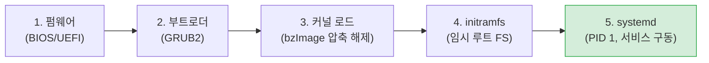
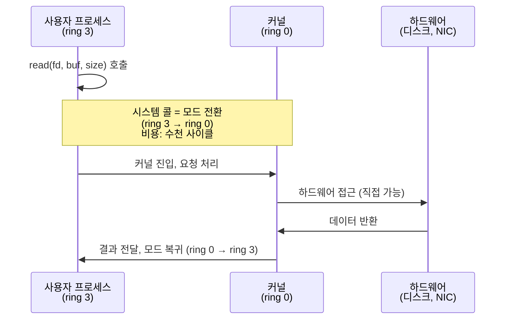

# 01. 시스템 아키텍처와 실행 모델 — Linux가 켜지고 동작하는 방식

> 이 장은 Linux 시리즈의 첫 장이다. 서버가 전원이 들어와 부팅되는 순간부터, 프로세스가 커널과 대화하는 방식(시스템 콜), 하드웨어 이벤트를 다루는 방식(인터럽트)까지 다룬다. 인프라 튜닝값 대부분은 결국 "이 실행 모델 위에서 동작한다"는 것을 이 장이 보여준다.

## 이 장의 목표

운영자가 `/etc/default/grub`에 `transparent_hugepage=never`를 적는 순간, 그 값은 부팅 시점에 커널에 전달되어 시스템 전체의 메모리 동작을 바꾼다. systemd가 `LimitNOFILE`을 읽는 순간, 그 값은 서비스 데몬의 fd 한계가 된다. 이런 "설정이 어디서 어떻게 적용되는가"를 이해하지 못하면, 설정은 주술로 변한다. 이 장은 부팅·시스템 콜·인터럽트라는 세 기둥을 세워, 뒤에 오는 모든 장(프로세스·메모리·파일시스템·네트워크)이 그 위에 올라섬을 보인다.

## 이 장에서 다루지 않는 것 (깊이 경계)

- 부트로더(GRUB2) 내부 구조, initramfs의 cpio 아카이브 포맷 상세
- 시스템 콜 디스패치 테이블, vDSO/vsyscall 구현, syscall 명령어 인코딩
- 인터럽트 컨트롤러(APIC/GIC) 레지스터, MSI-X 매커니즘
- systemd unit 파일의 모든 디렉티브, target/dependency 그래프 전체

이런 것은 시스템 프로그래머의 영역이다. TA는 "부팅 → systemd → 서비스 한계 적용" 흐름과 "시스템 콜은 비싸다"는 사실, "패킷 수신은 인터럽트→softirq→커널 스레드로 이어진다"는 것을 이해하면 충분하다.

---

## 1. 부팅 — 전원에서 systemd(PID 1)까지

### 1.1 도입: "부팅"이란 무엇인가

서버 전원을 넣는 순간, CPU는 아무것도 모르는 상태다. RAM은 비어 있고, 디스크의 OS도 아직 읽히지 않았다. 그럼에도 불구하고 수 초 후 수많은 서비스가 떠서 요청을 받기 시작한다. 이 마술 같은 과정을 **부팅(bootstrapping)**이라고 부른다. "자기 부츠의 끈을 당겨 자신을 들어 올린다"는 은유에서 왔다 — 아무것도 없는 상태에서 스스로를 메모리에 올린다는 뜻.

TA가 부팅을 이해해야 하는 이유는, **모든 커널 동작의 초기값이 부팅 시점에 결정되기 때문**이다. THP 켜고 끄기, huge page 예약, NUMA 밸런싱 — 이 값들이 부팅 파라미터로 전달된다. 부팅을 모르면 "왜 `/etc/sysctl.conf`를 고쳐도 리부팅하면 THP가 다시 켜지나?"라는 질문에 답할 수 없다.

### 1.2 부팅의 다섯 단계



**1단계 — 펌웨어(BIOS/UEFI).** 전원 투입 시 메인보드의 펌웨어가 가장 먼저 실행된다. CPU를 초기화하고, RAM을 점검(POST)하고, 디스크·NIC 같은 하드웨어를 최소한으로 인식한 뒤, 설정된 부트 디바이스의 첫 섹터(또는 EFI 파티션)에서 부트로더를 찾는다. 이 단계는 인프라 튜닝과 거의 무관하다.

**2단계 — 부트로더(GRUB2).** GRUB2가 메모리에 올라오면, 메뉴를 보여주고(멀티부팅 시) 선택된 커널 이미지를 디스크에서 읽어 메모리에 올린다. **바로 여기가 중요하다** — GRUB는 **커널 명령행 파라미터(kernel cmdline)**를 커널에 전달한다. `transparent_hugepage=never`, `hugepages=1024`, `numa_balancing=disable` 같은 값들이 이 시점에 결정된다. `/etc/default/grub`의 `GRUB_CMDLINE_LINUX`가 바로 이 파라미터를 저장하는 곳이다. 이 값을 바꾸면 `grub2-mkconfig`로 GRUB 설정을 재생성하고 **리부팅**해야 적용된다. THP 영구 설정이 "리부팅 필요"인 이유가 여기 있다.

**3단계 — 커널 로드.** 커널 이미지(bzImage)는 압축되어 있다. 커널은 자기 자신의 압축을 풀고, 메모리에 상주하며, 하드웨어 드라이버(내장된 것)를 초기화한다. 이제 커널 공간(kernel space)이 살아난다.

**4단계 — initramfs(임시 루트 파일시스템).** 커널은 루트 파일시스템을 마운트해야 하는데, 진짜 루트 파티션이 LVM·암호화·RAID 같은 특수 장치 위에 있을 수 있다. 그 드라이버가 커널에 내장되어 있지 않으면 진짜 루트를 못 읽는다. 그래서 **initramfs**(initial RAM filesystem)라는 임시 파일시스템을 메모리에 올려 먼저 마운트한다. initramfs 안에는 그런 특수 드라이버와 마운트 도구가 들어 있다. 커널은 initramfs를 마운트하고 그 안의 스크립트로 진짜 루트를 찾아 마운트한 뒤, `pivot_root`로 진짜 루트로 전환한다.

**5단계 — systemd(PID 1).** 진짜 루트로 전환한 커널은 `/sbin/init`(현대 Linux에서는 거의 항상 systemd)를 실행한다. 이것이 **PID 1** — 시스템의 첫 프로세스이자, 모든 다른 서비스의 조상. systemd는 target(basic.target → sysinit.target → default.target)이라는 단계를 따라 서비스를 병렬로 띄운다. 이때 PostgreSQL·mongod·pgpool·tomcat 같은 서비스 데몬이 시작된다.

### 1.3 왜 systemd가 인프라 튜닝에 결정적인가

systemd는 단순히 서비스를 "실행"하는 게 아니라, **그 서비스의 실행 환경(자원 한계, 디렉토리, 환경변수)을 통제**한다. 그 중 TA에게 가장 중요한 것이 **자원 한계(limit)**다.

systemd 서비스의 `LimitNOFILE`, `LimitNPROC`, `LimitFSIZE`, `LimitCPU` — 이것들이 그 서비스 데몬의 ulimit이 된다. `/etc/security/limits.conf`(PAM 기반)는 **SSH 같은 로그인 세션에만** 적용되고, systemd가 직접 띄운 데몬에는 **적용되지 않는다**. 그래서 "limits.conf를 고쳤는데 서비스가 여전히 fd 부족 에러를 낸다"는 함정이 생긴다(04장에서 fd 한계와 함께 다시).

```ini
# /etc/systemd/system/postgresql-16.service.d/override.conf
[Service]
LimitNOFILE=1048576
LimitNPROC=65536
```

이 override 파일을 두고 `systemctl daemon-reload && systemctl restart postgresql-16`을 해야 데몬에 적용된다. 이 전체 흐름 — GRUB 파라미터 → 커널 → systemd → 서비스 한계 — 가 부팅이 인프라 튜닝과 만나는 지점이다.

> **TA 노트**: 서버 점검 시 "이 서비스의 ulimit이 진짜 얼마인가?"를 확인하려면 `cat /proc/$(pgrep -f postgres | head -1)/limits`를 본다. `Max open files` 값이 실제 한계다. limits.conf가 아니라 systemd unit이 결정한다. 이 확인 습관만으로도 "왜 Too many open files가 나지?"의 절반은 해결된다.

### 1.4 커널 명령행 파라미터 — 부팅 시점의 튜닝

GRUB가 커널에 전달하는 파라미터는 `cat /proc/cmdline`으로 확인할 수 있다. 본 프로젝트에서 가장 자주 쓰는 것:

| 파라미터 | 효과 | 적용 서버 |
|:---|:---|:---|
| `transparent_hugepage=never` | THP 영구 비활성화 | PostgreSQL |
| `transparent_hugepage=always` | THP 영구 활성화 | MongoDB 8.0 |
| `hugepages=N` | 정적 huge page N개 예약 | PostgreSQL(shared_buffers용) |
| `numa_balancing=disable` | NUMA 자동 마이그레이션 끔 | 대형 DB 서버 |
| `ipv6.disable=1` | IPv6 완전 비활성화 | 보안 정책 시 |

이 값들은 `/etc/default/grub`의 `GRUB_CMDLINE_LINUX`에 추가하고 `grub2-mkconfig -o /boot/grub2/grub.cfg`(또는 `grubby --update-kernel=ALL --args=...`)로 적용, 리부팅. 본 프로젝트는 이 작업이 root 권한·리부팅 필요라 "IT ONE을 통해 IT 운영실에 변경 요청" 절차를 따른다(`reports/final/*.md` §1.2).

---

## 2. 커널 공간과 사용자 공간 — 왜 시스템 콜은 비싼가

### 2.1 두 세계의 분리

Linux는 메모리와 CPU 실행 모드를 두 영역으로 나눈다.

- **사용자 공간(user space)**: 일반 프로세스가 실행되는 곳. 제한된 권한. 하드웨어 직접 접근 불가, 다른 프로세스 메모리 침범 불가. 응용 프로그램(WAS, DB 클라이언트 등)은 여기서 실행.
- **커널 공간(kernel space)**: 커널이 실행되는 곳. 모든 권한. 하드웨어·메모리·모든 프로세스에 접근 가능.

CPU는 이 권한을 **링(ring)**으로 구분한다. x86은 ring 0~3이 있는데, Linux는 실질적으로 ring 0(커널)과 ring 3(사용자)만 쓴다. 사용자 프로세스가 "디스크에서 읽고 싶다"거나 "네트워크로 보내고 싶다"면, 직접 못 하고 **커널에게 대신해 달라고 요청**해야 한다. 이 요청 메커니즘이 **시스템 콜(system call)**이다.

### 2.2 시스템 콜 — 사용자에서 커널로의 문



프로세스가 `read()`를 호출하면, CPU는 ring 3에서 ring 0으로 전환(supervisor mode 진입)한다. 이 **모드 전환 자체가 비용**이다 — 레지스터 저장, 스택 교체, TLB 일부 무효화, 명령어 파이프라인 플러시. 현대 CPU에서 한 번의 시스템 콜은 수천 사이클(약 1~2마이크로초)을 소모한다. 일반 연산(수십 사이클)에 비해 수십~수백 배.

### 2.3 왜 이 비용이 인프라에 중요한가

이 비용이 쌓이면 서비스 지연이 된다. 예를 들어:

- **커넥션 1개 처리** = accept() + read() 여러 번 + write() 여러 번 + close() = 수십 회 시스템 콜. 동시 커넥션 수천 개면 초당 수백만 회 시스템 콜. CPU의 상당 부분을 모드 전환에 쓴다.
- **파일 읽기** = read() 반복. 작은 chunk로 자주 읽으면 시스템 콜 횟수가 폭발. 그래서 버퍼링(page cache)이 중요 — 한 번 크게 읽어 캐싱.
- **select/poll의 문제** = 감시할 fd마다 매번 커널에 묻는 시스템 콜. fd 1만 개면 1만 회. 그래서 **epoll**이 등장 — 한 번의 시스템 콜로 "준비된 fd만" 받아옴. 현대 웹 서버(nginx, Tomcat NIO)가 epoll을 쓰는 이유.

> **TA 노트**: "왜 커넥션 풀을 쓰는가"에 시스템 콜 비용이 답의 일부다. 새 연결을 맺을 때마다 connect()·accept() 시스템 콜 + TCP handshake. 풀에 미리 만들어 둔 연결을 재사용하면 이 비용을 반복하지 않는다. HikariCP `minimumIdle=maxPoolSize`(고정 풀)가 "풀 축소/확장 오버헤드 제거"라는 근거 외에, 시스템 콜 비용 회피라는 측면도 있다.

### 2.4 vDSO — 시스템 콜을 속이는 트릭

모든 시스템 콜이 비싼 건 아니다. 커널은 자주 쓰는 일부(gettimeofday, clock_gettime 같은 시간 조회)를 **vDSO(virtual Dynamic Shared Object)**라는 특수 메커니즘으로 사용자 공간에 매핑해, 모드 전환 없이 빠르게 처리한다. TA가 이 구현까지 알 필요는 없다. 다만 "시스템 콜은 원칙적으로 비싸지만, 커널이 자주 쓰는 것은 최적화해 둔다"는 정도로 이해하면 충분하다.

---

## 3. 인터럽트와 softirq — 하드웨어 이벤트를 다루는 방식

이 절은 05장(네트워크 스택)의 핵심 기반이지만, 개념이 범용적이라 여기서 다룬다. "네트워크 패킷이 들어오면 누가 처리하는가"의 답이 여기 있다.

### 3.1 인터럽트 — 하드웨어가 CPU를 부르는 방식

CPU가 혼자 열심히 일하고 있는데, 하드웨어(NIC, 디스크, 타이머)가 "나 지금 뭔가 했어, 봐 줘"라고 CPU를 끊는다. 이것이 **인터럽트(interrupt)**다. CPU는 하던 일을 멈추고, 커널의 인터럽트 핸들러를 실행한 뒤, 원래 일로 돌아간다.

인터럽트는 하드웨어→CPU의 비동기 알림이다. 디스크 I/O 완료, NIC에 패킷 도착, 타이머 만료 같은 이벤트가 전부 인터럽트로 온다.

### 3.2 top half와 bottom half — 급한 것과 미룰 수 있는 것

문제는 인터럽트 핸들러가 **다른 인터럽트를 막거나**(또는 우선순위가 꼬이거나), 너무 오래 걸리면 시스템이 멈춘다는 것이다. 그래서 Linux는 인터럽트 처리를 둘로 나눈다.

- **top half(상위반)**: 인터럽트가 들어온 직후 **즉시**, 하드웨어에서 최소한의 데이터만 빼내고(예: NIC의 패킷을 큐에 올리고), 나머지 처리는 뒤로 미룬다. 매우 짧게 실행. 인터럽트가 꺼진 상태로 돌아가, 다른 인터럽트를 잠깐 막는다.
- **bottom half(하위반)**: 미뤄둔 무거운 처리. 인터럽트를 다시 켜고 실행. **softirq**(소프트웨어 인터럽트)와 커널 스레드(**ksoftirqd**)가 담당.


### 3.3 NET_RX softirq와 NAPI — 네트워크 수신의 핵심

네트워크 패킷이 들어오면 NIC가 인터럽트를 건다. top half는 패킷을 큐에 올리고 NET_RX softirq를 예약. softirq(ksoftirqd 또는 인터럽트를 받은 CPU)가 패킷을 TCP/IP 스택으로 올려보내고, 결국 소켓 큐에 담아 앱이 읽을 수 있게 한다.

현대 고속 NIC은 **NAPI(New API)**를 쓴다. 패킷이 폭주할 때 매 패킷마다 인터럽트를 걸면 CPU가 인터럽트 처리만 하다 막힌다(인터럽트 폭풍). NAPI는 첫 패킷엔 인터럽트를 쓰고, 이후 폭주 시 **폴링(polling)**으로 전환 — 인터럽트 대신 커널이 주기적으로 NIC을 확인해 한 번에 여러 패킷을 긁어온다. 인터럽트 오버헤드를 획기적으로 줄인다.

### 3.4 인프라 튜닝과의 연결

이 메커니즘이 인프라 튜닝과 만나는 지점들:

- **IRQ 핀닝(affinity)**: 어느 CPU가 어느 NIC의 인터럽트를 받을지 지정. 고속 네트워크 서버에서 `irqbalance` 데몬을 끄고 수동으로 NIC 인터럽트를 특정 CPU 코어에 고정하면, 캐시 지역성이 좋아지고 지연이 줄어든다.
- **RPS/RFS(Receive Packet/Flow Steering)**: 인터럽트는 한 CPU가 받되, softirq 처리를 여러 CPU로 분산. 다중 코어 활용.
- **`net.core.netdev_max_backlog`**: NIC에서 커널로 올라오기 전 큐. 폭주 시 이 큐가 차면 패킷 드랍. 고속 네트워크 서버에서 상향.
- **CPU 사용률의 `si`(softirq) 비율**: `top` 명령에서 `%si`가 높으면 네트워크(또는 다른 softirq) 처리에 CPU를 많이 쓰는 것. 트래픽이 CPU 병목일 때의 신호.

> **TA 노트**: 본 프로정트의 4 Core / 1Gbps 추정 환경에서는 IRQ 핀닝·RPS/RFS가 큰 효과가 없을 수 있다. 단, 25Gbps+ 고속 NIC이나 다소켓 고부하 서버에서는 결정적이다. `reports/final/`에 아직 이 값들이 명시되지 않았다면, 향후 고부하 서버 도입 시 검토 대상이다. 05장 네트워크 스택에서 다시 다룬다.

### 3.5 타이머 인터럽트와 HZ

인터럽트의 또 다른 중요한 종류는 **타이머 인터럽트**다. 커널은 주기적으로(`HZ`라는 값, 보통 250 또는 1000회/초) 타이머 인터럽트를 받아, 스케줄링·타임아웃·keepalive 재전송 타이밍 등을 관리한다. TCP keepalive가 "정확히 300초 후"가 아니라 "다음 타이머 틱에 확인"으로 동작하는 것도 이 때문. `nohz_full`(tickless)은 유휴 CPU의 타이머 인터럽트를 줄여 전력·지연을 개선하는 심화 기능이지만, TA는 "타이머가 주기적으로 깨어나 커널 일을 한다" 정도로 알면 된다.

---

## 4. cgroup과 namespace — 자원 통제와 격리의 기반

이 절은 02장(프로세스)·06장(통합 점검)과 이어진다. 현대 Linux에서 자원 제한의 표준 수단이다.

### 4.1 cgroup — 프로세스를 그룹으로 묶어 자원을 제한

**cgroup(control group)**은 프로세스들을 계층적 그룹으로 묶어, 그 그룹에 CPU·메모리·I/O 자원을 할당하거나 제한하는 메커니즘이다. 예를 들어 "PostgreSQL 서비스 그룹에 메모리 16GB 상한을 두자"하면, postgres 프로세스들이 16GB를 넘기면 커널이 그 그룹 내부에서 OOM을 발동시켜 postgres만 영향을 받고 다른 서비스는 안전하다.

cgroup v2는 단일 계층 구조(모든 cgroup이 `/sys/fs/cgroup/` 아래 하나의 트리), pressure tracking(cpu.pressure, memory.pressure로 자원 부족 정도를 정량화) 같은 개선이 있다. systemd는 각 서비스를 자동으로 전용 cgroup(slice)에 배치한다. 그래서 `systemd`의 `MemoryMax`, `CPUQuota` 디렉티브가 사실은 cgroup v2 인터페이스를 통해 동작한다.

### 4.2 cgroup으로 뭘 할 수 있는가 (인프라 튜닝 관점)

| 제어 대상 | 예 | 인프라 활용 |
|:---|:---|:---|
| 메모리 | `MemoryMax=16G` | DB 컨테이너가 RAM을 독점하지 못하게 제한. OOM 국지화 |
| CPU | `CPUQuota=200%`(2코어) | WAS가 CPU를 다 쓰지 못하게. 다른 서비스 보호 |
| I/O | `IOWeight` | 백업·배치가 디스크 대역폭을 독점 못 하게 |
| PID | `TasksMax=1000` | Fork Bomb 방지(nproc 대안) |

이것이 본 프로젝트의 "70% Ceiling Rule"을 커넥션 풀뿐 아니라 **자원 단위로도** 강제할 수 있는 기반이다. 단, 주의: `vm.overcommit_memory`처럼 커널 전역값은 cgroup으로 분리되지 않는다(03장 §5). cgroup은 "그룹별 자원량"은 통제하지만, "커널 전역 정책"은 통제 못 한다.

### 4.3 namespace — 컨테이너 격리의 기반

**namespace**는 프로세스에게 "자기만의 시스템 뷰"를 준다. PID namespace(자기가 PID 1인 것처럼), NET namespace(자기만의 네트워크 스택), MNT namespace(자기만의 파일시스템 트리) 등. 이것들을 조합하면 한 호스트 안에 격리된 "컨테이너"를 만들 수 있다 — Docker·Podman·LXC의 기반.

본 프로젝트는 베어메탈/VM에 서비스를 직접 띄우는 구조로 보이므로, namespace를 깊이 다루지는 않는다. 다만 "컨테이너화하면 격리되는 게 무엇인가?"라는 질문에는 namespace(보기 격리) + cgroup(자원 제한)의 조합으로 답한다.

> **TA 노트**: 누군가 "PostgreSQL과 MongoDB를 컨테이너로 격리하면 한 호스트에 올릴 수 있나요?"라고 물으면, 정확한 답은 "부분적으로. THP는 namespace + prctl로 프로세스별 제어가 가능하지만, overcommit_memory는 커널 전역이라 컨테이너로도 분리 안 됩니다. 결국 한쪽이 희생되므로 프로덕션에서는 호스트 분리가 정답입니다." 03장 §5·§6과 연결되는 핵심 판단이다.

---

## 5. 인프라 파라미터 다리 — 이 장이 가리키는 튜닝값

| 메커니즘 (이 장) | 파라미터 | 왜 이 값인가 (한 줄) |
|:---|:---|:---|
| 부팅 파라미터 (§1) | GRUB `transparent_hugepage=never`(PG)/`=always`(Mongo) | 부팅 시점에 THP 영구 설정. 리부팅 필요 |
| 부팅 파라미터 (§1) | GRUB `hugepages=N` | 정적 huge page 예역(PostgreSQL shared_buffers용) |
| systemd 자원 한계 (§1.3) | `LimitNOFILE`, `LimitNPROC` | limits.conf(PAM)가 데몬에 안 먹힘. systemd drop-in 필수 |
| 네트워크 인터럽트 (§3.4) | `net.core.netdev_max_backlog` | NIC→커널 큐. 폭주 시 패킷 드랍 방지(고속 NIC) |

표준값 자체는 06장 통합 매트릭스에, 값의 메커니즘 근거는 이 장(그리고 03장 THP 절)에 있다.

## 6. TA 점검 포인트

1. `/etc/security/limits.conf`에 `nofile 1048576`을 적었는데 PostgreSQL 서비스가 여전히 "Too many open files" 에러를 낸다. 이유와 해결책을 설명하라. (§1.3)
2. `/etc/sysctl.conf`에서 THP를 끄는 설정을 했는데 리부팅 후 다시 켜진다. 왜 그런가? 영구 설정 방법은? (§1.2, §1.4)
3. "시스템 콜은 비싸다"가 인프라 설계에 미치는 영향을 두 가지(버퍼링, 커넥션 풀)로 설명하라. (§2.3)
4. 네트워크 패킷이 들어와서 앱이 읽기까지의 경로를 top half → softirq → ksoftirqd로 서술하라. (§3.2)
5. cgroup과 namespace의 차이를 "자원 제한 vs 보기 격리"로 설명하라. (§4.2, §4.3)
6. 컨테이너로 PostgreSQL·MongoDB를 격리해 한 호스트에 올리자는 제안. overcommit과 THP 관점에서 답하라. (§4.3, 03장 연결)

---

### 참고 출처

- kernel.org — The kernel's command-line parameters: https://www.kernel.org/doc/html/latest/admin-guide/kernel-parameters.html
- kernel.org — Using the initial RAM disk (initrd): https://www.kernel.org/doc/html/latest/admin-guide/initrd.html
- freedesktop systemd — bootup(7): https://www.freedesktop.org/software/systemd/man/latest/bootup.html
- freedesktop systemd — systemd.exec(LimitNOFILE 등): https://www.freedesktop.org/software/systemd/man/latest/systemd.exec.html
- freedesktop systemd — systemd.resource-control(cgroup): https://www.freedesktop.org/software/systemd/man/latest/systemd.resource-control.html
- kernel.org — Control Group v2: https://www.kernel.org/doc/html/latest/admin-guide/cgroup-v2.html
- man7 syscalls(2): https://man7.org/linux/man-pages/man2/syscalls.2.html
- kernel.org — Documentation/networking(NAPI, softirq): https://www.kernel.org/doc/html/latest/networking/index.html
