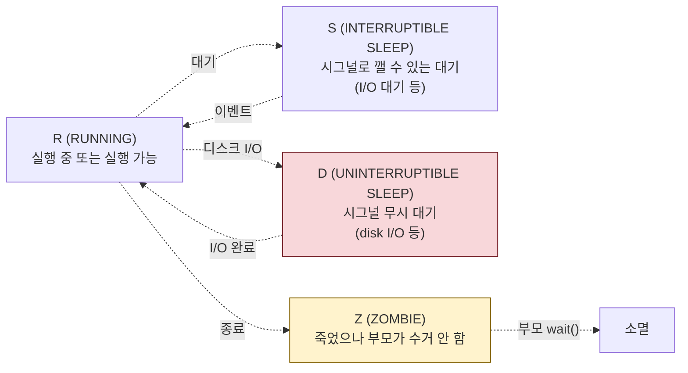
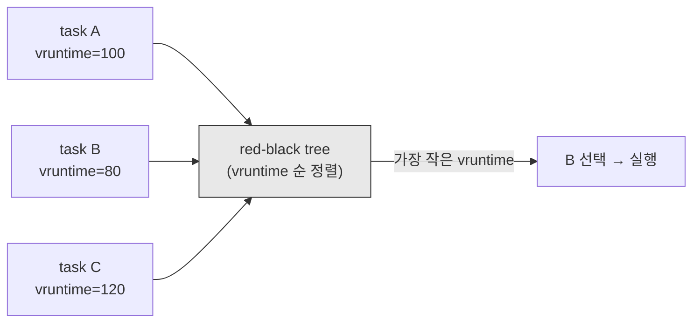
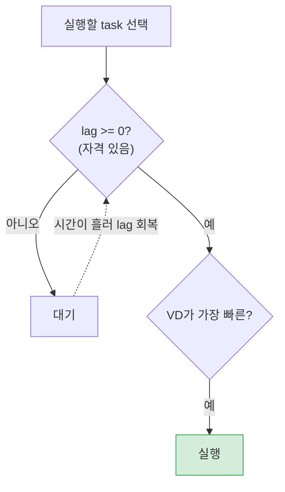

# 02. 프로세스와 스케줄링 — 누가 CPU를 언제 쓰는가

> 이 장은 Linux가 "동시에" 돌아가는 수많은 프로세스를 어떻게 관리하는지를 다룬다. 특히 2023년 Linux 6.6부터 스케줄러가 CFS에서 EEVDF로 바뀐 역사적 전환을 설명한다. 그리고 fork의 비용, 시그널, 좀비 프로세스, PgPool·PostgreSQL이 쓰는 System V 세마포어까지.

## 이 장의 목표

PostgreSQL이 커넥션마다 프로세스를 fork하는 이유, PgPool이 `kernel.sem` 상향을 요구하는 이유, `kill -9`가 왜 위험한지, 새 서버에서 "좀비 프로세스가 쌓인다"는 현상의 원인 — 이 모든 것이 이 장에 있다. 프로세스와 스케줄링을 이해하면, 왜 어떤 워크로드는 스레드가 유리하고 어떤 워크로드는 프로세스가 유리한지도 보인다.

## 이 장에서 다루지 않는 것 (깊이 경계)

- CFS/EEVDF의 red-black tree 구조, lag/VD 수학 공식
- 스케줄러 클래스(SCHED_FIFO/SCHED_RR/SCHED_NORMAL)의 내부 디스패치
- RT(실시간) 스케줄링, PREEMPT_RT, EAS(Energy Aware Scheduling)
- futex의 내부 구현(atomic ops, futex_wait 디자인)
- System V IPC의 커널 자료구조(semid_ds 등)

TA는 "EEVDF가 지연 민감 태스크를 우선시한다", "fork는 비싸다", "세마포어는 동기화 도구이고 PgPool이 많이 쓴다" 정도를 이해하면 충분하다.

---

## 1. 프로세스와 스레드 — Linux에서는 사실 같은 것

### 1.1 도입: "프로세스 vs 스레드"는 Linux에서 흐릿하다

전통적 정의로 프로세스는 "자기만의 메모리 공간을 가진 실행 단위"이고, 스레드는 "한 프로세스 안에서 메모리를 공유하는 실행 단위"다. 이 구분은 개념적으로 유효하지만, **Linux 커널 내부에서는 둘 다 같은 구조체(`task_struct`)**로 표현된다. Linux에게 스레드는 그냥 "메모리를 공유하는 특별한 프로세스"일 뿐이다.

이 관점을 이해하면 많은 것이 설명된다. PostgreSQL은 커넥션마다 별도 프로세스를 fork(메모리 따로), WAS(Tomcat)는 요청마다 스레드(메모리 공유). 두 모델 모두 Linux에서는 task들의 묶음이고, 스케줄러는 이 task들을 CPU에 배정한다. 차이는 "메모리를 공유하느냐 따로 쓰느냐"에서 오는 자원 소모·동기화 비용이다.

### 1.2 프로세스의 생김새 — task_struct

커널은 각 task를 `task_struct`라는 거대한 구조체로 관리한다. 여기엔 PID, 상태, 스케줄링 정보(우선순위, vruntime), 메모리 공간 포인터, 열린 파일 목록, 시그널 핸들러, 부모/자식 포인터 등이 들어 있다. TA가 이 구조체의 필드를 외울 필요는 없다. 다만 "커널은 task마다 이런 정보를 들고 있고, 스케줄링·시그널·자원 제한의 대상이 된다"는 것만 기억하라.

### 1.3 프로세스 상태 — R, S, D, Z의 의미

`ps`나 `top`에서 프로세스 상태가 한 글자로 표시된다. 이 글자들이 장애 진단의 단서다.



- **R(Running)**: CPU에서 실행 중이거나, 실행 대기 중.
- **S(Sleeping, Interruptible)**: I/O 대기, 이벤트 대기. 시그널로 깨울 수 있다. 대부분의 대기 상태.
- **D(Disk wait, Uninterruptible)**: 주로 디스크 I/O 대기. **시그널조차 무시**한다 — `kill -9`도 안 먹힌다. D 상태가 많으면 디스크 병목의 신호. NFS 마운트가 끊겨도 프로세스가 D에 걸려 안 죽는 사태가 벌어진다.
- **Z(Zombie)**: 프로세스가 종료했으나 부모가 아직 `wait()`로 수거하지 않은 상태. 뒤에 §4에서 다시.

> **TA 노트**: 장애 시 `top`에서 D 상태 프로세스가 많으면 디스크 I/O 병목을 의심하라. "프로세스가 kill이 안 됩니다"라는 문의의 80%는 D 상태(보통 디스크/NFS 문제)다. 그때는 kill을 반복하지 말고 원인(디스크 지연, NFS 서버)을 찾아야 한다.

---

## 2. fork(), CoW, 그리고 exec() — 새 생명의 비용

### 2.1 fork() — 자기 복제

새 프로세스를 만드는 기본 수단이 `fork()`다. fork를 부른 프로세스(부모)는 자기와 거의 동일한 복사본(자식)을 하나 만든다. 자식은 부모의 메모리·열린 파일·환경을 물려받는다. fork 직후 부모와 자식은 fork 시점부터 각자 다른 경로로 실행을 이어간다(반환값으로 부모/자식을 구분).

### 2.2 copy-on-write — 복사를 미루는 트릭

03장 메모리 절에서 자세히 다뤘지만, 여기서 요점만. fork 시 부모의 모든 물리 페이지를 당장 복사하면 비싸다(수 GB 프로세스면 수 GB 복사). 그래서 Linux는 **페이지 테이블만 복사**하고 물리 페이지는 부모·자식이 공유하되 읽기 전용으로 표시. 누군가 쓰려는 순간(page fault) 그때 비로소 그 페이지를 복사(copy-on-write). 덕분에 fork 직후엔 복사 비용이 거의 0.

PostgreSQL이 커넥션마다 fork를 쓸 수 있는 이유가 이것이다. fork 직후 백엔드는 곧 쿼리를 처리하느라 일부 페이지만 쓰므로, CoW 덕에 fork 비용이 작다. 그래도 0은 아니라서, **수백~수천 커넥션을 fork로 만들면 비용이 쌓인다** — 이것이 PgPool(연결 재사용)이 존재하는 근본 이유(study/03 PostgreSQL 장·study/04 PgPool 장 참조).

### 2.3 exec() — 다른 프로그램으로 교체

fork만 하면 부모와 똑같은 프로그램이 두 개 도는 셈이다. 보통은 fork 후 곧 `exec()`을 불러 자식의 메모리를 **완전히 새 프로그램으로 교체**한다. 쉘에서 명령을 칠 때 쉘이 fork하고 자식이 exec하는 구조. exec 직후 자식의 코드·데이터·스택이 새 프로그램으로 교체되므로, fork 시 물려받은 메모리는 거의 다 버려진다 — 그래서 CoW로 복사해 둔 페이지가 실제로 쓰일 일이 적고, fork는 더욱 빠르다.

> **TA 노트**: PostgreSQL은 fork 후 exec하지 않고(같은 postgres 바이너리 계속 실행), fork만으로 백엔드를 만든다. 즉 백엔드는 postmaster와 같은 프로그램이지만 별도 프로세스. 이 점이 PostgreSQL의 "프로세스-퍼-커넥션" 아키텍처의 핵심이다.

### 2.4 clone() — 스레드를 만드는 진짜 시스템 콜

Linux에서 "스레드"를 만드는 실제 시스템 콜은 `clone()`이다. fork도 clone의 특수한 경우(메모리 공유 안 함). clone에 "메모리 공유(VM), 파일 테이블 공유(FD), 시그널 핸들러 공유" 플래그를 주면 그것이 스레드가 된다. 즉 Linux에서 스레드는 "거의 모든 것을 공유하는 task"다. JVM의 스레드, Tomcat의 요청 스레드가 전부 이 방식.

---

## 3. 스케줄링 — CFS에서 EEVDF로 (2023년의 큰 전환)

이 절은 이 장의 가장 중요한 부분이다. Linux 스케줄러가 2023년에 바뀌었고, 많은 구문서가 아직 "CFS"만 다룬다. TA는 EEVDF 전환을 알아야 시대착오가 되지 않는다.

### 3.1 스케줄러가 하는 일

CPU 코어는 한 번에 하나의 task만 실행한다(동시에 여러 코어가 있으면 그 수만큼 병렬). 그런데 실행할 task는 수백~수천 개다. 그러면 누구를 먼저, 얼마나 오래 실행할까를 결정하는 것이 **스케줄러(scheduler)**다. 스케줄러는 각 task에 CPU 시간을 배분하고, 현재 실행 중인 task를 중단(preempt)하고 다른 task로 교체(context switch)한다.

### 3.2 공정성의 목표 — "모두에게 CPU를 골고루"

여러 task가 있을 때, 어느 하나가 CPU를 독점하면 안 된다. 그렇다고 매우 짧게 번갈아 실행하면 context switch 비용이 폭발. 그래서 스케줄러는 "공정(fair)"하게, 그러면서도 "지연(latency)을 너무 길게 안 만들게" 배분해야 한다. 이 두 목표가 서로 트레이드오프.

### 3.3 CFS (Completely Fair Scheduler) — 2007~2023까지의 주인공



Linux 2.6.23(2007)부터 쓰인 CFS의 아이디어. 각 task에 **가상 런타임(vruntime)**이라는 값을 둔다. task가 CPU를 쓸 때마다 vruntime이 증가. 스케줄러는 **vruntime이 가장 작은 task**를 선택해 실행. 그러면 "CPU를 적게 쓴 task"가 항상 우선되므로, 결국 모두에게 비슷한 CPU 시간이 배분 — 공정.

vruntime은 우선순위(nice)에 따라 증가 속도가 달라진다. nice가 낮으면(높은 우선순위) vruntime이 천천히 올라 자주 선택. CFS는 이 vruntime을 red-black tree로 정렬해 "가장 작은 것"을 빠르게 찾았다. (TA는 tree 구조까지 몰라도 된다. "vruntime 작은 것 우선"만 기억.)

CFS는 약 16년간 잘 작동했다. 하지만 한계가 있었다. "공정"에는 집중했지만, **특정 task의 지연(latency)을 보장하는 데는 약했다**. 지연에 민감한 작업(오디오, 실시간 통신, 짧은 요청을 처리하는 웹 서버)이 더 빠른 응답을 원할 때, CFS는 "공정"의 원칙 때문에 특별한 배려를 잘 안 해줬다.

### 3.4 EEVDF (Earliest Eligible Virtual Deadline First) — 2023년의 새 주인공

2023년, Linux 6.6에서 CFS를 **EEVDF**로 교체했다. EEVDF는 두 가지 개념을 추가한다.

- **lag(래그)**: 각 task가 "이만큼은 CPU를 받았어야 했는데, 실제로는 이만큼 받았다"의 편차. lag ≥ 0이면 "할당을 받을 자격(eligible) 있는 상태", lag < 0이면 "이미 충분히 받아서 대기해야 함".
- **가상 마감 시간(virtual deadline, VD)**: 각 task가 다음 번 CPU 배분을 받아야 할 시점. 짧은 타임슬라이스를 원하는 task(지연 민감)가 더 가까운 VD를 갖는다.

EEVDF의 선택 규칙: **lag ≥ 0(자격 있)인 task 중, VD가 가장 빠른 것**을 먼저 실행.



이 규칙의 결과: 지연에 민감하고 짧은 타임슬라이스를 원하는 task(예: 짧은 HTTP 요청을 처리하는 웹 스레드)가 VD가 가까워 자주 우선 선택된다. 긴 배치 작업은 밀린다. 즉, CFS의 "공정"에 "지연 민감성"이 더해진 것.

### 3.5 EEVDF가 인프라에 미치는 영향

TA가 EEVDF의 수학까지 알 필요는 없다. 다음 두 가지를 이해하면 된다.

**첫째, "CFS만 암기"하면 시대착오.** 구문서·오래된 블로그가 "Linux는 CFS를 쓴다"라고 쓴 것은 커널 6.6(2023) 이전 기준이다. RHEL 9(커널 5.14)은 아직 CFS지만, 최신 배포판·커널은 EEVDF. 본 프로젝트가 최신 커널을 쓴다면 EEVDF다.

**둘째, nice·cgroup cpu.shares가 여전히 유효.** EEVDF도 nice 값과 cgroup `cpu.weight`/`cpu.max`를 lag/VD 계산에 반영한다. 그래서 "WAS 서비스의 CPU를 더 주자(cgroup `CPUQuota`)" 같은 튜닝은 CFS든 EEVDF든 동일하게 동작. TA는 스케줄러 내부보다 이런 제어 인터페이스를 알면 된다.

**셋째, context switch 비용은 스케줄러 무관.** 어떤 스케줄러든 task를 교체할 때(context switch) 레지스터·TLB·캐시가 오염되어 비용이 든다. 그래서 "스레드 수를 무한정 늘리면 context switch 비용이 처리량을 잡아먹는다"는 원칙은 EEVDF에서도 동일. 이것이 WAS `maxThreads`를 무한정 올리면 안 되는 근본 이유(study/02 WAS/JVM 장의 Little's Law 절 참조).

> **TA 노트**: EEVDF의 실용적 의미 — 짧은 요청을 많이 처리하는 웹 서비스(WAS)에서 응답 지연이 개선될 수 있다. 반면, CPU를 길게 쓰는 배치 워크로드는 약간 밀릴 수 있다. WAS·배치를 같은 서버에 올릴 때 이 경향을 염두에 두되, 대부분은 cgroup `CPUQuota`/`cpu.weight`로 충분히 통제 가능하다.

---

## 4. 시그널과 좀비 — 프로세스의 죽음과 그 부작용

### 4.1 시그널 — 커널이 프로세스에게 보내는 비동기 메시지

**시그널(signal)**은 커널(또는 다른 프로세스)이 특정 프로세스에게 보내는 비동기 알림이다. 프로세스는 시그널을 받으면 하던 일을 멈추고 시그널 핸들러(또는 기본 동작)를 실행한다. TA가 자주 만나는 시그널:

| 시그널 | 번호 | 의미 | 기본 동작 |
|:---|:---:|:---|:---|
| `SIGTERM` | 15 | "정상 종료해 줘" | 종료(핸들링 가능 → 정리 후 종료) |
| `SIGKILL` | 9 | "즉시 죽어" | **즉시 종료(차단 불가, 정리 기회 없음)** |
| `SIGINT` | 2 | Ctrl+C | 종료 |
| `SIGHUP` | 1 | "설정 다시 읽어" | 보통 설정 리로드로 핸들링 |
| `SIGCHLD` | 17 | "자식이 죽었어/멈췄어" | 무시(부모가 wait하도록 유도) |

### 4.2 SIGTERM과 SIGKILL의 차이 — 우아한 종료 vs 강제 사살

`SIGTERM`은 "지금 끝내 줘, 단 정리할 시간은 줘"라는 요청이다. 프로세스는 이를 잡아(catch) 커넥션 정리, 진행 중 트랜잭션 커밋/롤백, 임시 파일 삭제 등을 수행한 뒤 스스로 종료한다. 우아한 종료(graceful shutdown).

`SIGKILL`(`kill -9`)은 "당장 죽어"라는 즉시 사살. 커널이 강제로 프로세스를 제거. **차단 불가, 정리 기회 없음.** 진행 중이던 쓰기가 디스크에 안 기록될 수 있고, DB 트랜잭션이 롤백되지 않은 채 끊긴다.

인프라 운영의 기본 원칙: **먼저 SIGTERM을 보내고 grace period를 준 뒤, 그래도 안 끝나면 SIGKILL.** systemd의 `TimeoutStopSec`(기본 90초)이 바로 이 흐름을 자동화 — `SIGTERM` 보내고 대기, 시간 초과 시 `SIGKILL`.

> **TA 노트**: `kill -9`를 습관적으로 쓰는 운영자가 있다면 위험하다. DB·WAS는 SIGTERM으로 정리할 시간을 줘야 데이터 손상·복구 시간을 줄일 수 있다. "안 죽어서 -9 썼다"면 그것은 보통 D 상태(§1.3, 디스크 I/O 대기)거나 시그널 핸들러가 없는 경우. 원인을 먼저 보라.

### 4.3 좀비(Zombie)와 고아(Orphan)

자식 프로세스가 종료하면, 커널은 그 자식을 즉시 없애지 않는다. 부모가 `wait()`로 자식의 종료 코드를 수거할 때까지 **좀비 상태**로 남겨둔다. 좀비는 메모리를 거의 안 쓰지만(종료 정보만 보관) PID 하나를 점유. 부모가 계속 wait하지 않고 자식만 계속 만들면 좀비가 쌓이고, 결국 PID가 고갈(`kernel.pid_max` 도달)되어 새 프로세스를 못 만든다.

부모가 자식보다 먼저 죽으면 자식은 **고아(orphan)**가 된다. 고아는 init(systemd, PID 1)에게 재부양되고, systemd는 자동으로 `wait()`을 해 좀비가 안 생기게 한다(reaping). 그래서 좀비 문제는 보통 "부모가 살아 있지만 wait을 안 하는" 잘못 짠 프로그램에서 생긴다.

> **가상 시나리오**: WAS가 fork로 자식 프로세스를 만들어 작업을 맡기는데, 작업 끝난 자식을 wait로 수거하는 로직이 빠져 있다. 시간이 지나 `ps`에 좀비가 수천 개. 결국 PID 고갈로 WAS가 새 커넥션 처리를 못 하고 멈춘다. 해결: 부모의 wait 로직 수정, 또는 systemd의 `Restart=on-failure`로 부모 재시작. 이런 일이 없게 fork를 쓰는 측(PG·PgPool)은 정상적으로 reaping하도록 설계되어 있지만, 사내 애플리케이션이 fork를 직접 쓴다면 이 점을 점검하라.

---

## 5. 동기화와 System V 세마포어 — PgPool이 kernel.sem을 요구하는 이유

이 절은 `kernel.sem`이 왜 PgPool 서버에만 특별히 들어가는지를 설명한다. study/04 PgPool 장과 직결.

### 5.1 왜 동기화가 필요한가

여러 프로세스(또는 스레드)가 **같은 자원**(공유 메모리, 파일)에 동시에 접근하면 충돌이 난다. 두 프로세스가 동시에 같은 메모리 위치에 쓰면 데이터가 꼬인다. 그래서 "한 번에 하나만 접근하게" 조율하는 메커니즘이 필요하다 — 그것이 **동기화 원시자(primitive)**. 대표적으로 뮤텍스(mutex), 세마포어(semaphore), futex.

### 5.2 세마포어(Semaphore) — 카운터로 자원을 배분

세마포어는 정수 카운터다. 프로세스가 자원을 쓰려면 카운터를 1 줄이고(wait/P), 다 쓰면 1 늘린다(signal/V). 카운터가 0이면 더 이상 못 줄이므로 대기. 이것으로 "N개 자원을 M개 프로세스에게 배분"이 가능(N=1이면 뮤텍스와 같음).

### 5.3 System V IPC 세마포어 — 오래된 동기화 메커니즘

Linux에는 두 가지 세마포어 API가 있다. **POSIX 세마포어**(현대적, 단순)와 **System V IPC 세마포어**(오래됐지만 여전히 널리 쓰임). PostgreSQL과 PgPool-II는 공유 메모리 동기화에 **System V 세마포어**를 쓴다(또는 최신 버전은 POSIX로 전환 추세지만, 여전히 System V 의존이 흔함).

System V 세마포어는 커널 자원이다 — 생성하면 커널이 세마포어 셋을 유지하고, 상한이 있다. 상한을 나타내는 커널 파라미터가 `kernel.sem`이다.

### 5.4 kernel.sem의 네 값

```
kernel.sem = 250 32000 250 128
              |    |     |   |
              |    |     |   SEMMNI: 시스템 전체 세마포어 셋 최대 수
              |    |     SEMOPM: semop 한 번에 처리 가능한 최대 연산 수
              |    SEMMNS: 시스템 전체 세마포어 최대 수
              SEMMSL: 세마포어 셋당 최대 세마포어 수
```

본 프로젝트 PgPool 서버 표준값 `250 32000 250 128`의 핵심은 세 번째 값 **SEMOPM=250**(기본 32에서 상향). PgPool이 `num_init_children=120`으로 자식 프로세스를 많이 띄우면, 각 자식이 세마포어를 소모하고 한 번에 처리해야 할 연산 수도 늘어난다. 기본 SEMOPM(32)으로는 부족해 **"could not create semaphore set"** 에러가 나며 PgPool 구동이 실패한다. SEMOPM을 250으로 올리면 해결.

PostgreSQL도 max_connections를 올리면 백엔드 프로세스가 많아져 세마포어 소모가 증가. 본 프로젝트는 max_connections=100 고정이라 기본 kernel.sem으로 충분하지만, PgPool이 같은 서버에 있으면 PgPool 기준(250 32000 250 128)을 따른다.

> **TA 노트**: "PgPool 구동 시 could not create semaphore set 에러"가 떴다면 100% kernel.sem 문제다. 바로 `kernel.sem = 250 32000 250 128` 적용. 이것은 본 프로젝트 `reports/final/pgpool-ii.md` §1.2의 핵심 항목이자, study/04 PgPool 장의 검증 체크리스트 첫 번째 항목이다.

---

## 6. cgroup v2로 자원 통제하기 — systemd와 함께

이 절은 01장 cgroup 절(§4)과 06장 점검(§4.3)을 이어, 프로세스 자원 통제의 실전을 다룬다.

### 6.1 systemd가 cgroup을 관리한다

현대 Linux에서 cgroup을 직접 만지기보다, **systemd가 서비스 단위로 cgroup을 자동 관리**한다. 서비스 unit 파일의 `MemoryMax`, `CPUQuota`, `TasksMax` 같은 디렉티브가 cgroup v2 인터페이스로 번역되어 적용된다.

```ini
# /etc/systemd/system/postgresql-16.service.d/override.conf
[Service]
MemoryMax=16G           # 메모리 상한. 초과 시 이 그룹 내부 OOM
MemoryHigh=14G          # 상한 아래 스로틀 시작점
CPUQuota=200%           # 최대 2코어(200%)
TasksMax=2000           # 최대 task(스레드+프로세스) 수. nproc 대안
```

### 6.2 왜 cgroup 제한이 인프라 튜닝인가

서버 한 대에 여러 서비스(WAS, 백업 스크립트, 모니터링)가 올라갈 때, 한 서비스가 메모리·CPU를 독점하면 다른 서비스가 굶어 죽는다. cgroup으로 각 서비스의 상한을 두면, 하나의 폭주가 전체 서버 장애로 번지지 않는다. OOM도 전체 서버가 아니라 **해당 cgroup 내부**에서 일어나, postgres만 죽고 mongod는 살아있는 식으로 격리된다.

이것이 본 프로젝트의 "70% Ceiling Rule"을 자원 단위로도 강제하는 기반이다. 단, `vm.overcommit_memory`(03장 §5)처럼 커널 전역값은 cgroup으로 분리되지 않으므로, "cgroup으로 PG·Mongo를 한 호스트에 올리자"는 overcommit 충돌 앞에서는 무력하다(01장 §4.3, 03장 §5 재참조).

### 6.3 pressure tracking — 자원 부족을 정량화

cgroup v2의 또 다른 강점. 각 cgroup의 `cpu.pressure`, `memory.pressure`, `io.pressure` 파일이 "이 그룹이 자원 부족으로 얼마나 기다렸나"를 정량화해 준다. 모니터링 시스템이 이를 읽어 "WAS 서비스가 메모리 부족으로 대기 중"을 사전에 감지. 장애 전 조치의 근거.

---

## 7. 인프라 파라미터 다리 — 이 장이 가리키는 튜닝값

| 메커니즘 (이 장) | 파라미터 | 왜 이 값인가 (한 줄) |
|:---|:---|:---|
| 프로세스 수 제한 (§1) | `ulimit -u`/`LimitNPROC=65536` | Fork Bomb 방지. 스레드도 task로 카운트 |
| PID 고갈 방지 (§4.3) | `kernel.pid_max`(대형 서버 상향) | 좀비·다수 프로세스 시 PID 고갈 |
| 세마포어 (§5) | `kernel.sem = 250 32000 250 128` | PgPool 자식 다수. SEMOPM 32→250 상향 |
| 자원 상한 (§6) | systemd `MemoryMax`, `CPUQuota`, `TasksMax` | 서비스 폭주 격리. OOM 국지화 |
| 스케줄러 가중치 (§3) | cgroup `cpu.weight`/`cpu.max` | EEVDF/CFS 모두 반영. WAS 우선순위 조정 |

표준값은 06장 통합 매트릭스에, 값의 메커니즘 근거는 이 장에 있다. PgPool 서버의 `kernel.sem`만이 역할별 특수값이고, 나머지는 서버 공통 또는 cgroup 설정으로.

## 8. TA 점검 포인트

1. PostgreSQL이 "프로세스-퍼-커넥션"인데, 이것이 max_connections를 무한정 올리면 안 되는 이유를 fork 비용·세마포어로 설명하라. (§2.2, §5)
2. 2023년 이후 Linux 스케줄러가 CFS에서 EEVDF로 바뀌었다. TA가 이 전환을 알아야 하는 실용적 이유를 설명하라. (§3.5)
3. 서버에 좀비 프로세스가 수천 개 쌓였다. 원인과 해결책을 서술하라. (§4.3)
4. PgPool 구동 시 "could not create semaphore set" 에러. 원인과 해결값을 말하라. (§5.4)
5. 운영자가 습관적으로 `kill -9`를 쓴다. 왜 위험한가? 올바른 종료 흐름을 설명하라. (§4.2)
6. 한 서버에서 백업 배치가 메모리를 폭주시켜 WAS가 OOM에 죽는다. cgroup `MemoryMax`로 어떻게 해결하는가? (§6.2)

---

### 참고 출처

- kernel.org — EEVDF Scheduler: https://www.kernel.org/doc/html/latest/scheduler/sched-eevdf.html
- kernel.org — CFS Scheduler(참고): https://www.kernel.org/doc/html/latest/scheduler/sched-design-CFS.html
- kernel.org — Scheduler Nice Design: https://www.kernel.org/doc/html/latest/scheduler/sched-nice-design.html
- man7 fork(2): https://man7.org/linux/man-pages/man2/fork.2.html
- man7 clone(2): https://man7.org/linux/man-pages/man2/clone.2.html
- man7 signal(7): https://man7.org/linux/man-pages/man7/signal.7.html
- man7 ps(1) — PROCESS STATE CODES: https://man7.org/linux/man-pages/man1/ps.1.html
- kernel.org — Control Group v2: https://www.kernel.org/doc/html/latest/admin-guide/cgroup-v2.html
- kernel.org — System V IPC(semget, semop): https://man7.org/linux/man-pages/man2/semget.2.html
- LWN EEVDF 분석(2023): https://lwn.net/Articles/969062/
