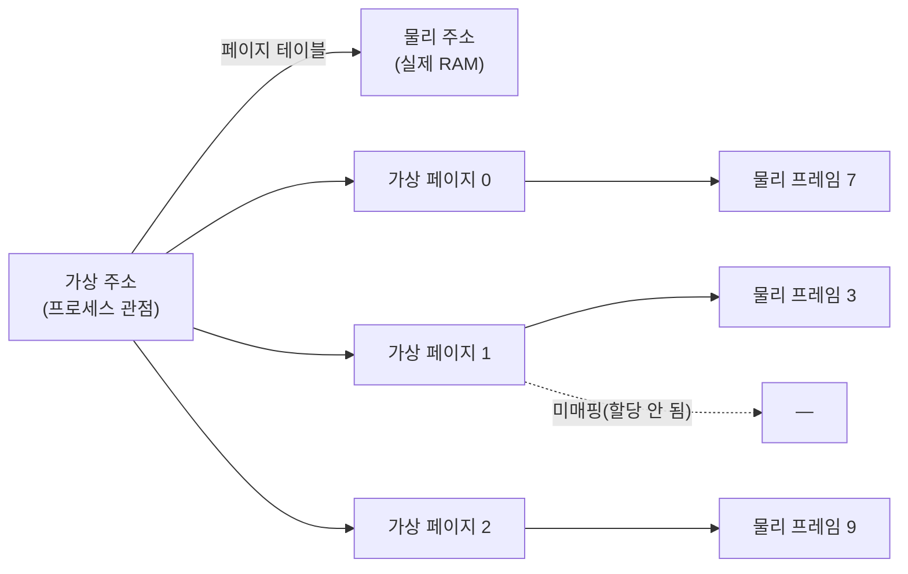
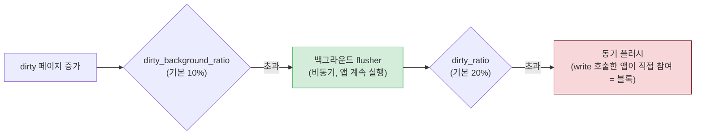
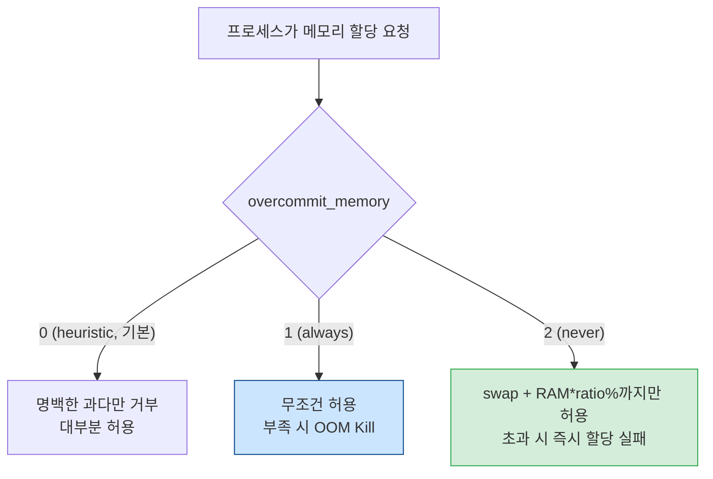

# 03. 메모리 관리 — 인프라 튜닝의 심장

> 인프라 튜닝값의 절반 이상이 메모리 파라미터다. `swappiness`, `overcommit_memory`, `dirty_ratio`, Transparent Huge Pages, `min_free_kbytes`, `zone_reclaim_mode` — 이 모든 것이 Linux의 메모리 관리 메커니즘 위에 있다. 이 장은 그 메커니즘을 처음부터 따라간다. 본 시리즈에서 가장 길고 가장 중요한 장이다.

## 이 장이 왜 가장 중요한가

PostgreSQL이 `shared_buffers = RAM * 0.25`를 쓰는 이유, MongoDB가 `cacheSizeGB = 0.5 * (RAM - 1)`을 쓰는 이유, 두 DB가 같은 호스트에 못 올라가는 이유, `swappiness=0`이 안전해 보이지만 위험한 이유 — 이 모든 질문의 답이 이 장에 있다. 메모리 관리를 이해하지 못하면, 앞으로 보게 될 모든 도메인 장(WAS·PostgreSQL·MongoDB)의 설정값이 외워야 할 숫자로만 남는다.

이 장을 읽고 나면 "이 값을 올리면 커널이 무슨 짓을 할까"를 머릿속에서 시뮬레이션할 수 있어야 한다. 그 수준에 도달하면, 본 프로젝트의 `reports/final/`에 적힌 어떤 값도 "왜?"에 답할 수 있다.

## 이 장에서 다루지 않는 것 (깊이 경계)

- 페이지 테이블 엔트리의 비트 구조(P/D/R/W), 4단계 워크의 단계별 계산
- Buddy allocator의 할당 알고리즘, migrate type, PCP(per-CPU page)
- Slab/Slub의 내부 자료구조(partial/full list)
- LRU 리스트의 회전 알고리즘, active/inactive 비율 계산
- NUMA의 SLIT/node distance 수학, autuma 마이그레이션 로직

이런 것들은 커널 개발자의 영역이다. TA는 "이런 메커니즘이 존재하고, 이것이 튜닝값에 이렇게 영향을 준다"는 선에서 멈춘다.

---

## 1. 가상 메모리 — 왜 모든 프로세스가 자기가 4GB(또는 그 이상)를 혼자 쓴다고 착각하는가

### 1.1 도입: 물리 메모리를 직접 쓰면 무슨 일이 벌어지는가

가상 메모리가 없는 세상을 상상해 보자. 두 프로세스가 동시에 물리 RAM의 주소 `0x1000`에 데이터를 쓰려 한다. 서로의 데이터를 덮어쓴다. 프로그램은 충돌하고, 운영체제는 이를 막을 수단이 없다. 그래서 현대 OS는 모든 프로세스에게 **자기만의 가상 주소 공간**을 준다. 각 프로세스는 `0x0`부터 시작하는 연속된 주소 공간을 혼자 쓴다고 착각하지만, 실제로는 커널이 그 가상 주소를 **물리 RAM의 적당한 빈칸**으로 번역해 준다.

이 번역을 담당하는 것이 **페이지 테이블(page table)**이다.

### 1.2 페이지와 페이지 테이블

메모리를 다루는 기본 단위를 **페이지(page)**라고 한다. x86-64에서 기본 페이지는 4KB다. 가상 주소 공간은 이 4KB 페이지 수천~수백만 개로 쪼개져 있고, 각 가상 페이지는 페이지 테이블을 통해 물리 페이지(프레임)에 대응된다.



페이지 테이블은 "가상 페이지 N → 물리 프레임 M"의 거대한 매핑 표다. 단, 이 표를 단일 테이블로 두면 너무 커진다(64비트 주소 공간을 4KB로 쪼개면 항목이 2^52개). 그래서 Linux는 **다단계 페이지 테이블**을 쓴다(PGD→PUD→PMD→PTE, 4단계). 이 구조의 핵심 이점: 실제로 쓰는 주소 영역만 표를 유지하고, 안 쓰는 영역은 상위 단계에서 "없음"으로 표시해 하위 표를 아예 만들지 않는다. 메모리를 아끼기 위한 페이지 테이블 자체의 트릭이다.

### 1.3 TLB — 번역을 빠르게 하는 캐시

페이지 테이블을 매번 RAM에서 읽으면 너무 느리다(주소 변환마다 4번의 메모리 접근). 그래서 CPU는 **TLB(Translation Lookaside Buffer)**라는 작지만 매우 빠른 캐시에 "자주 쓰는 가상→물리 매핑"을 보관한다. TLB에 있으면 한 번에 변환, 없으면(=TLB 미스) 페이지 테이블을 직접 뒤진다(page table walk, 비용 발생).

여기서 huge page의 가치가 드러난다. 기본 4KB 페이지면 2MB 영역을 매핑하려면 512개의 TLB 엔트리가 필요하다. 하지만 2MB huge page를 쓰면 **1개의 TLB 엔트리**로 같은 2MB를 커버한다. TLB 엔트리는 귀한 자원이라(수십~수백 개), 대용량 메모리를 다루는 DB에서 huge page가 TLB 미스를 획기적으로 줄여준다. 이것이 PostgreSQL이 `huge_pages=on`을, MongoDB 8.0이 THP 활성화를 원하는 근본 배경이다(뒤에 §6에서 다시).

> **TA 노트**: "TLB 미스가 왜 느린가"를 외울 필요는 없다. 핵심은 "huge page는 TLB 엔트리를 아껴서 대용량 메모리 접근을 빠르게 한다"는 것. 그리고 그 huge page를 자동으로 만들어 주는 THP가, 부작용(compaction 스톨) 때문에 DB마다 요구가 엇갈린다는 것. 이 두 가지만 기억해도 충분하다.

---

## 2. page cache — Linux의 가장 중요한 발명

### 2.1 도입: 파일을 읽는다는 것

PostgreSQL이 데이터 파일에서 한 페이지(8KB)를 읽는다고 하자. 가장 단순한 구현은 "디스크에서 메모리로 바로 복사"다. 하지만 같은 페이지를 1초 뒤에 또 읽으면? 또 디스크를 간다. 느리다. 그래서 Linux는 한 번 읽은 파일 내용을 **버리고 버리지 않는다**. 메모리의 빈칸에 올려두고, 다음에 또 읽으면 디스크 대신 메모리에서 준다. 이것이 **page cache(페이지 캐시)**다.

페이지 캐시는 Linux 성능의 숨은 공로자다. DB든 WAS든, 파일 I/O의 대부분은 실제로는 디스크가 아니라 이 캐시에서 처리된다. free 명령을 쳤을 때 `cached`로 표시되는 영역이 바로 이것이다.

### 2.2 read()와 write()의 실제 경로

```mermaid
graph TD
    APP["앱이 read(fd) 호출"] --> SYSCALL["시스템 콜<br/>(커널 진입)"]
    SYSCALL --> CACHE{"page cache에 있나?"}
    CACHE -->|"있음 (cache hit)"--> COPY1["캐시 → 앱 버퍼 복사"]
    CACHE -->|"없음 (cache miss)"--> DISK["디스크 → page cache"]
    DISK --> COPY2["캐시 → 앱 버퍼 복사"]
    APPW["앱이 write(fd) 호출"] --> SYSCALL2["시스템 콜"]
    SYSCALL2 --> CACHEW["page cache 페이지를 dirty 표시"]
    CACHEW --> RETURN["즉시 앱으로 복귀 (비동기)"]
    CACHEW -.나중에.-> WB["writeback 스레드가 디스크에 기록"]
    style CACHE fill:#d4edda,stroke:#28a745
    style RETURN fill:#fff3cd,stroke:#856404
```

여기서 중요한 두 가지.

**read()는 두 번 복사된다.** 디스크 → page cache, 그리고 page cache → 앱의 버퍼. 복사가 두 번이라 비효율적으로 들겠지만, cache hit 시(디스크 안 감)에는 두 번째 복사만 일어나므로 빠르다. hit율이 높을수록 이득.

**write()는 즉시 반환한다.** 앱이 `write()`를 호출하면, 커널은 page cache의 해당 페이지를 "수정됨(dirty)"으로 표시만 하고 **즉시 앱으로 돌아간다**. 실제 디스크 기록은 나중에 writeback 스레드가 한다. 그래서 write는 read보다 빠르게 느껴진다. 하지만 이것이 위험을 품고 있다 — 디스크에 아직 안 썼는데 앱은 "썼다"고 착각한다. 정전이 나면 dirty 페이지는 사라진다. 이것이 DB가 `fsync()`로 "진짜 디스크에 지금 써"를 강제하는 이유다(04장 파일시스템 참조).

### 2.3 mmap() — 복사를 한 번으로 줄이는 트릭

`mmap()`은 파일을 프로세스의 가상 주소 공간에 **직접 매핑**한다. 그러면 read/write가 page cache와 앱 주소 공간이 같은 물리 페이지를 가리키므로, 복사가 한 번 줄어든다. 또한 여러 프로세스가 같은 파일을 mmap하면 page cache를 공유해 메모리가 절약된다.

PostgreSQL은 shared_buffers를 shared memory로 mmap 기반으로 매핑한다. MongoDB WiredTiger도 내부적으로 메모리 매핑을 활용한다. 따라서 "DB가 자체 캐시를 관리한다"는 말은, 정확히는 "DB가 page cache 위에(또는 그것을 공유해) 자체 버퍼를 둔다"는 뜻이다.

### 2.4 double buffering — DB와 page cache의 이중 구조

여기서 인프라 튜닝의 가장 중요한 개념 중 하나가 나온다. PostgreSQL은 `shared_buffers`(자체 버퍼)를 두지만, 그 아래 Linux page cache도 존재한다. 같은 데이터가 **두 군데** 메모리에 올라갈 수 있다. 이것을 **double buffering(이중 버퍼링)**이라고 한다.


왜 이렇게 비효율적으로 두었을까? PostgreSQL은 자체 교체 정책(LRU 변형)과 더티 플러시 제어를 원하기 때문이다. page cache에만 맡기면 DB가 원하는 시점에 페이지를 비우거나 기록할 수 없다. 그래서 자체 버퍼를 두고 double buffering을 감수한다.

이것이 `effective_cache_size`가 등장하는 이유다. PostgreSQL 플래너는 "이 쿼리가 디스크를 갈까, 캐시에서 처리될까"를 판단해야 실행 계획을 짠다. 근데 캐시가 shared_buffers(25%)와 page cache(나머지) 양쪽에 있다. 그래서 플래너에게 "총 캐시 가능량은 대략 RAM의 75%"라고 알려주는 힌트가 `effective_cache_size`다.

> **이것이 "effective_cache_size를 올리면 메모리를 더 할당한다"는 최대 오해의 원인이다.** 실제로는 아무것도 할당하지 않는다. 그냥 플래너에게 "이 정도 캐시될 거라고 상정해 줘"라고 속삭이는 숫자다. 실제 할당은 shared_buffers뿐이다. 이 차이를 모르는 운영자가 effective_cache_size를 올려서 성능이 안 좋아지면 "왜 안 돼?"라고 묻지만, 당연하다 — 그 값은 메모리에 영향을 안 주니까.

`shared_buffers = RAM * 0.25`와 `effective_cache_size = RAM * 0.75`는 double buffering 구조에서 나온 짝이다. 25%는 PG가 직접 통제하는 버퍼, 나머지는 OS page cache가 알아서 채운다. 둘을 합친 추정 캐시량이 75%라는 설계.

MongoDB WiredTiger도 자체 `cacheSizeGB`(RAM의 약 50%)를 둔다. 같은 double buffering 구조. 그래서 cacheSizeGB를 RAM에 가깝게 올리면 OS page cache가 깔 곳이 없어져 스와핑이 발생한다. "cacheSizeGB는 RAM의 절반"이라는 권장값의 근거다.

---

## 3. dirty 페이지와 writeback — I/O 스파이크의 원인

### 3.1 도입: write()가 즉시 반환하는 대가

앞서 write()는 page cache에 dirty 표시만 하고 즉시 반환한다고 했다. 그러면 dirty 페이지는 언제 실제 디스크에 기록될까? 커널의 **writeback 스레드**(과거 pdflush, 현재 flush/kworker)가 주기적으로 깨어나 dirty 페이지를 디스크로 보낸다.

문제는 이 writeback이 한 번에 몰리면 I/O가 폭주한다는 것이다. 수 GB의 dirty 페이지가 한꺼번에 디스크로 쏟아지면, 그 순간 디스크 대역폭을 다 써버려 다른 I/O가 줄을 선다. 쿼리가 멈추고, 응답 지연이 튄다. 이것이 **I/O 스파이크(버스트)**다.

### 3.2 dirty_ratio와 dirty_background_ratio — 스파이크를 평탄화하는 두 임계값

Linux는 두 개의 임계값으로 이 스파이크를 평탄화한다.



- **dirty_background_ratio(기본 10%)**: dirty 페이지가 시스템 가용 메모리의 이 비율을 넘으면, 백그라운드 flusher 스레드가 **조용히** 디스크에 기록을 시작한다. 애플리케이션은 계속 실행된다. 이것이 이상적 — 미리미리 조금씩 flush해서 큰 덩어리가 안 생기게.
- **dirty_ratio(기본 20%)**: dirty가 여기까지 쌓이면 상황이 심각하다. 이제부터 `write()`를 호출한 프로세스 **자신**이 디스크 기록에 동원된다. 즉 앱이 블록된다. 동기식 플러시. 지연 버스트의 직접 원인.

### 3.3 DB 서버는 왜 이 값을 낮추는가

DB(PostgreSQL, MongoDB)는 자체 WAL/checkpoint 스케줄로 디스크에 기록한다. 이 schedule은 DB가 통제한다. 그런데 커널이 갑자기 수 GB의 dirty 페이지를 한 번에 flush하면, DB의 디스크 스케줄과 충돌해 I/O가 마비된다. 예측 가능해야 할 DB 쓰기가 커널 버스트에 밟힌다.

그래서 DB 서버는 두 값을 낮춘다. PostgreSQL은 `dirty_background_ratio=5`, `dirty_ratio=10`. MongoDB는 `dirty_background_ratio=5`, `dirty_ratio=15`(WiredTiger가 자체 스케줄링을 하므로 PG보다 약간 여유). 낮추면 백그라운드 flusher가 더 일찍, 더 자주, 조금씩 기록한다. 큰 덩어리가 안 생기고 I/O가 평탄해진다. 대신 flush가 잦아지면 약간의 오버헤드가 생기지만, DB 안정성에는 그것이 훨씬 이득이다.

WAS 서버는 dirty 페이지가 많지 않으므로(쓰기가 많지 않음) 기본값에 가깝게 둬도 무방하다. 그래서 본 프로젝트에서 WAS 서버에는 이 값들이 명시되어 있지 않다.

> **TA 노트**: "dirty_ratio를 낮춘다 = I/O를 평탄하게 만든다 = DB 지연 버스트를 막는다." 이 한 줄이 전부다. 수학(가용 메모리 대비 비율 계산)까지 파고들 필요는 없다. 다만 "낮췄더니 flush가 너무 잦아졌다"면 너무 낮게 간 것(예: dirty_background_ratio=1)이니 서비스 쓰기 부하에 맞춰 조정.

---

## 4. 페이징, 스와핑, OOM Killer — 메모리가 부족할 때 무슨 일이 벌어지는가

이 절은 인프라 장애의 가장 흔한 원인을 다룬다. "갑자기 서버가 느려졌다"거나 "프로세스가 죽었다"의 80%는 이 절의 메커니즘으로 설명된다.

### 4.1 page fault — 메모리 접근의 실제 순간

프로세스가 가상 주소에 접근할 때, 그 주소가 물리 RAM에 매핑되어 있지 않으면 **page fault**가 발생한다. CPU가 커널로 전환하고, 커널이 매핑을 설정한다. 두 종류가 있다.

- **minor fault**: 매핑만 설정하면 된다(예: page cache에 이미 있는 파일 페이지). 디스크 I/O 없음. 빠르다.
- **major fault**: 디스크에서 페이지를 읽어와야 한다. 느리다(수천 배). 스와핑이 일어나면 대부분 major fault다.

장애 시 `sar -B`로 major fault 비율이 치솟는 것을 보면, 그 서버는 스와핑 지옥에 빠진 것이다.

### 4.2 kswapd와 direct reclaim — 누가 메모리를 비우는가

물리 RAM이 가득 차면, 커널은 누군가의 페이지를 디스크로 쫓아내야(=회수해야) 새 할당을 받을 수 있다. 이 회수를 담당하는 두 가지 경로.

- **kswapd(백그라운드 커널 스레드)**: 메모리가 특정 watermark 아래로 내려가면 깨어나, 여유가 확보될 때까지 페이지를 회수한다. 이것은 앱에 영향을 덜 준다 — kswapd가 알아서 백그라운드에서 한다.
- **direct reclaim(동기 회수)**: kswapd가跟不上메모리 할당 요청이 몰리면, **할당을 요청한 앱 스레드 자신**이 회수 작업에 동원된다. 앱이 블록된다. 응답 지연이 폭발한다.

이것이 메모리 부족 장애의 전형적 패턴이다. 처음엔 kswapd가 버티지만, 부하가 지속되면 direct reclaim이 시작되고, 그 순간부터 서비스 응답 시간이 수백 ms~수 초로 튄다. 사용자는 "갑자기 느려졌다"고 느낀다. 실제로는 커널이 앱을 시키며 메모리를 비우고 있었던 것이다.

### 4.3 스와핑 — 익명 페이지를 디스크로 쫓기

회수할 페이지는 두 종류. 파일 기반 페이지(page cache)와 익명 페이지(Heap, 스택 — 어디에도 속하지 않는 순수 프로세스 메모리). 파일 기반 페이지는 그냥 버리면 된다(필요하면 다시 디스크에서 읽음). 하지만 익명 페이지는 버리면 데이터가 사라지므로, **디스크의 swap 영역에 기록**해야 한다(swap out). 나중에 다시 쓸 때 디스크에서 읽어온다(swap in). 둘 다 느리다.

여기서 `vm.swappiness`가 등장한다. 이 값은 "회수할 때 익명 페이지를 얼마나 적극적으로 swap out할까, 아니면 파일 페이지를 우선 버릴까"를 정한다. 0에 가까울수록 익명 페이지를 메모리에 붙잡고 파일 캐시를 우선 회수, 100에 가까울수록 익명 페이지를 적극 스왑.

```
값 ↑ : 익명 페이지(Heap/스택)를 적극 디스크로 → 프로세스는 살지만 접근 시 지연 폭발
값 ↓ : 익명 페이지를 메모리에 붙임 → 하지만 파일 캐시가 줄어 I/O 증가, 극단(0)은 OOM
```

### 4.4 왜 swappiness=0이 위험한가 (Red Hat 공식 경고)

"스왑을 안 쓰면 안전하겠지"라는 직관은 틀렸다. swappiness=0(정확히는 극단적 낮은 값)이면, 메모리 압박 시 커널이 익명 페이지를 절대 쫓아내지 않으려 한다. 그러면 회수할 수 있는 건 파일 캐시뿐인데, 그것마저 부족하면 결국 **할당 자체가 실패**하고 OOM Killer가 발동한다(§4.5). 즉 "스왑을 안 해서 안전"이 아니라 "스왑 완충이 없어서 곧바로 프로세스 사살"이 된다.

Red Hat은 공식 문서에서 "vm.swappiness를 0으로 설정하면 OOM Killer가 프로세스를 죽일 가능성이 높아진다"고 경고한다. 그래서 DB·JVM 전용 서버는 0이 아니라 **1**(DB)이나 **10**(WAS)을 쓴다. 1은 "사실상 스왑 안 함이지만 극단 압력 때 최소한의 스왑으로 OOM을 회피"라는 의미.

> **TA 노트**: 운영 중 `vm.swappiness=0`을 발견하면 위험 신호다. "메모리 여유가 충분해서 0이어도 안전하다"는 주장은, 메모리 압박이 오는 순간 무너진다. 1~10으로 올리라고 권고하라. 단, DB 캐시(shared_buffers, WiredTiger)가 swap되면 성능이 급락하므로 DB는 1로, JVM Heap은 어느 정도 스왑을 감당할 수 있으므로 WAS는 10으로. 이것이 본 프로젝트의 역할별 차이가 된다.

### 4.5 OOM Killer — 마지막 수단의 사살

swap까지 썼는데도 메모리가 부족하면, 커널은 **OOM(Out-Of-Memory) Killer**를 발동한다. 이것은 "메모리를 가장 많이 쓰는 프로세스 하나를 죽여서 위기를 넘기자"는 폭력적 최후 수단이다.

OOM Killer는 각 프로세스의 `oom_score`를 계산한다. 이 점수는 주로 "이 프로세스(와 자식)가 쓰는 메모리 양"에 기반하되, root 권한 프로세스에 약간의 페널티 감면, 커널 스레드는 보호 같은 휴리스틱이 더해진다. 점수가 가장 높은 프로세스가 `SIGKILL`을 받는다. `SIGKILL`은 차단 불가능한 즉시 사살 — 프로세스는 정리(DB 트랜잭션 롤백 등)할 기회도 없다.

운영자는 `oom_score_adj`(-1000~1000)로 특정 프로세스의 점수를 수동으로 조정할 수 있다. 핵심 데몬(postgres, mongod)은 -1000으로 두어 OOM 대상에서 제외하는 것이 정석. 반대로 위험한 프로세스는 양수로 올려 먼저 죽게 유도할 수 있다.

> **가상 시나리오**: 새벽 3시, PostgreSQL 서버가 응답 불능. 로그를 보니 "Out of memory: Kill process 12345 (postgres)". OOM Killer가 postmaster(메인 프로세스)를 죽였다. postmaster가 죽으면 모든 백엔드가 연쇄 종료돼 DB 전체가 다운된다. 원인을 조사하니, 다른 인스턴스의 배치 작업이 메모리를 폭주시켰고, postmaster의 oom_score_adj가 기본값(0)이어서 가장 큰 메모리 사용자로 찍힌 것. 교훈: 핵심 데몬은 `oom_score_adj=-1000`으로 보호하고, `vm.overcommit_memory`로 사전에 할당을 막아 OOM 자체를 예방한다. 이것이 다음 절(overcommit)로 이어진다.

---

## 5. overcommit과 fork+CoW — 왜 DB마다 overcommit 값이 다른가

이 절은 PostgreSQL(2)과 MongoDB 8.0(1)이 같은 호스트에 못 올라가는 **첫 번째 이유**를 다룬다.

### 5.1 fork()와 copy-on-write

Linux에서 새 프로세스를 만들려면 `fork()`를 부른다. fork는 부모 프로세스의 복사본(자식)을 만든다. 단순하게 생각하면 부모의 모든 메모리를 복사해야 한다 — 수 GB를 쓰는 프로세스면 fork마다 수 GB 복사, 끔찍하게 느리겠지.

그래서 Linux는 **copy-on-write(CoW)**를 쓴다. fork 시 부모의 물리 페이지를 복사하지 않고, **페이지 테이블만 복사**하고 모든 페이지를 읽기 전용으로 표시한다. 자식이 읽기만 하면 부모와 같은 물리 페이지를 공유(비용 0). 자식이 **쓰려고 하는 순간** page fault가 나고, 그때 커널이 비로소 그 페이지를 복사한다. "쓸 때 복사"라 지연 복사기 같다.

대부분의 fork 후 곧바로 `exec()`(새 프로그램으로 교체)가 일어나므로, 실제로 복사되는 페이지는 거의 없다. 그래서 fork는 빠르다. CoW의 승리.

### 5.2 CoW가 만드는 overcommit의 가능성

하지만 CoW에는 함정이 있다. fork 직후, 자식은 부모의 모든 가상 주소 공간을 "쓸 수 있다"고 선언한다(페이지 테이블엔 있으니까). 부모 8GB + 자식 8GB = 16GB 가상 메모리를 요청한 셈인데, 물리 RAM은 8GB다. **가상 메모리 합이 물리 메모리를 초과**한다. 이것을 **overcommit(초과 할당)**이라고 한다.

CoW 덕분에 이것은 대개 문제가 안 된다(둘 다 같은 페이지를 다 쓰진 않으니까). 하지만 만약 부모와 자식이 **동시에 다른 페이지를 잔뜩 쓰기 시작하면**? 그때 물리 메모리가 부족해지고 OOM이 발생한다. fork bomb(무한 fork)이 시스템을 먹통으로 만드는 것도 이 원리.

### 5.3 overcommit_memory — 세 가지 정책

커널은 이 overcommit을 어떻게 다룰까? `vm.overcommit_memory` 세 모드가 그 답이다.



- **0 (heuristic, 기본값)**: 커널이 경험적 판단으로 "이건 좀 너무한 거 아닌가" 싶은 과다만 거부. 일반 서버용.
- **1 (always overcommit)**: 무조건 허용. 부족해지면 OOM Killer가 처리. 희소 배열(sparse array)을 크게 잡는 과학용 앱에 유리.
- **2 (never overcommit)**: 엄격. 전체 시스템의 커밋 총량이 `swap + RAM * overcommit_ratio%`를 넘으면, 그 이상의 할당 요청은 **즉시 실패**(malloc이 NULL 반환). OOM Kill이 아니라 할당 단계에서 미리 막힌다.

### 5.4 왜 PostgreSQL은 2, MongoDB 8.0은 1인가

**PostgreSQL이 2를 선호하는 이유**. PostgreSQL은 커넥션마다 fork로 백엔드 프로세스를 만든다(study/03 PostgreSQL 장). 그리고 큰 shared_buffers를 공유 메모리로 잡는다. overcommit=2(엄격)로 두면, 시스템이 감당할 수 없는 할당은 **미리 실패**시킨다. 앱은 그 실패를 잡아 정상적으로 에러 처리할 수 있다. 반면 overcommit=0이나 1로 두면, 나중에 진짜 부족해졌을 때 OOM Killer가 postmaster를 죽일 수 있다 — postmaster가 죽으면 DB 전체가 다운되는 재앙. 그래서 PostgreSQL은 "늦게 사살당하는 것보다 일찍 실패하는 게 낫다"며 2를 택한다. 단, 2가 제대로 동작하려면 `vm.overcommit_ratio`가 충분히 높아야(본 프로젝트는 90) 커밋 한도가 너무 낮아 정상 할당마저 실패하는 일이 없다.

**MongoDB 8.0이 1을 선호하는 이유**. MongoDB 8.0은 메모리 할당자를 **TCMalloc의 per-CPU cache 버전**으로 바꿨다(7.1+ 도입). 이 할당자는 성능을 위해 **가상 주소 공간을 넉넉히 미리 예약**하는 패턴을 쓴다(실제 물리 사용은 적어도 가상 예약은 큼). overcommit=2(엄격)로 두면, 이 예약 자체가 "과다 할당"으로 취급되어 **정상 동작임에도 할당이 거부**된다. 그래서 MongoDB 8.0은 overcommit=1(always)을 원한다 — 가상 예약은 자유롭게 허용하고, 실제 물리 사용 시점에 메모리를 확보.

### 5.5 충돌 — 왜 병설이 불가한가

`overcommit_memory`는 **커널 전역값**이다. 한 호스트에서 하나만 설정할 수 있다. PostgreSQL이 있는 호스트는 2, MongoDB 8.0이 있는 호스트는 1. **같은 호스트에 두 DB를 올리면 이 값이 충돌한다.** 어느 한쪽의 최적값이 다른 쪽에는 해가 된다.

해결책은 단순하다. **물리적으로 분리된 서버**에 운영. 이것이 본 프로젝트의 하드 제약이다. 컨테이너(cgroup)로 격리해도 overcommit은 커널 전역이라 우회 불가(06장 §4.3 참조).

> **TA 노트**: overcommit=2를 쓸 때 주의. `overcommit_ratio`가 낮으면(기본 50) 정상적인 DB 할당도 실패할 수 있다. 본 프로젝트는 90으로 높여 총 커밋 한도 = swap + RAM의 90%를 확보. 2를 쓸 거면 ratio 점검이 필수다. `/proc/meminfo`의 `CommitLimit`(한도)과 `Committed_AS`(현재 커밋량)을 비교해 한도가 충분한지 확인하라.

---

## 6. huge pages와 THP — 같은 huge page인데 왜 DB마다 요구가 정반대인가

이 절은 PostgreSQL·MongoDB 병설 불가의 **두 번째 이유**를 다룬다. §1.3에서 huge page가 TLB 미스를 줄인다고 했다. 그 huge page를 얻는 두 가지 방법과, 그 부작용이 여기서 갈라진다.

### 6.1 정적 huge page (hugetlbfs)

전통적 방법. 부팅 시 `vm.nr_hugepages`로 huge page 개수를 예약한다. 예약된 huge page는 해당 목적으로만 쓰이고 일반 앱은 못 쓴다. PostgreSQL은 `huge_pages=on`으로 이 정적 huge page를 shared_buffers에 매핑한다. 예측 가능하고 부작용이 없지만, "예약"이라 유연성이 떨어진다(안 쓰면 낭비).

### 6.2 Transparent Huge Pages (THP) — 자동화의 야망과 부작용

THP는 "앱이 huge page를 의식하지 않게, 커널이 알아서 4KB 페이지들을 2MB로 합쳐 주자"는 야심찬 기능이다. 백그라운드 데몬 `khugepaged`가 돌면서, 4KB 페이지 512개가 모여 있는 영역을 2MB huge page로 **병합(collapse)**한다.

문제는 병합하려면 **2MB 정렬된 연속 물리 메모리**가 필요하다는 것이다. 메모리가 단편화되어 있으면 연속 영역이 없다. 그래서 커널은 **compaction(조각모음)**을 한다 — 다른 페이지들을 옮겨서 2MB짜리 빈칸을 만든다. 이 compaction이 동기적으로(앱을 멈추고) 일어나면, 그 순간 앱은 **수십~수백 ms 동안 멈춘다**. STW(Stop-The-World)급 지연 스파이크.

OLTP 데이터베이스는 쿼리 지연이 일정해야 한다. "보통 5ms인 쿼리가 가끔 300ms가 된다"는 것은 서비스 품질에 치명적이다. 그래서 PostgreSQL은 THP를 끈다(never). 대신 정적 huge page를 직접 쓴다(§6.1). THP의 compaction 스파이크를 피하기 위해서.

### 6.3 defrag 모드 — compaction을 언제 할까

THP에는 `defrag` 설정이 있어 compaction 시점을 조절한다(06장 §4.2와 함께).

- `always`: huge page 할당이 필요한데 연속 영역이 없으면, **즉시 동기 compaction**. 앱 스톨. 가장 위험.
- `defer`(또는 `defer+madvise`): 동기 compaction 대신 백그라운드 kcompactd에 위임. 앱은 블록 안 함. 현대적 기본값 추세.
- `madvise`: `MADV_HUGEPAGE`를 명시한 영역만 huge page 시도. 일반 영역은 건드리지 않음.
- `never`: THP 비활성화.

PostgreSQL 서버는 `enabled=never`, `defrag=never`로 완전히 끈다. MongoDB 8.0 서버는 `enabled=always`로 켠다. 왜 방향이 정반대인가 — 다음 절.

### 6.4 왜 MongoDB 8.0은 THP를 켜는가

이것이 본 프로젝트의 정확성 보정 포인트 중 하나다. **MongoDB는 전통적으로 THP를 끄라고 권장했다.** 7.0 이하 문서는 "disable THP"가 표준이었다. 그런데 8.0에서 권장이 **반전**되어 "enable THP"가 되었다.

이유는 메모리 할당자의 교체다. MongoDB 8.0은 TCMalloc을 **per-CPU cache** 버전으로 업그레이드했다(7.1+ 도입, 8.0 기본). per-CPU cache는 스레드가 아니라 CPU별로 메모리 캐시를 두어 락 경합을 줄이고 단편화를 감소시킨다. 그런데 이 새 TCMalloc은 **huge page를 적극 활용하도록 설계**되었다. THP가 켜져 있어야 per-CPU cache가 제 성능을 낸다. 그래서 MongoDB 8.0 공식 문서는 "If you are running MongoDB 8.0, enable Transparent Hugepages"로 권장을 바꿨다.

단, 조건이 있다. 커널 4.18+, THP 활성화, 그리고 **glibc rseq 비활성**(`GLIBC_TUNABLES=glibc.pthread.rseq=0`). TCMalloc이 rseq(restartable sequences)를 선점해야 per-CPU cache가 작동하기 때문이다. 이 조건이 빠지면 THP를 켜도 효과가 반감된다.

### 6.5 충돌 — 병설 불가의 두 번째 축

THP도 `overcommit_memory`처럼 **시스템 전역 설정**이다. PostgreSQL 서버는 never, MongoDB 8.0 서버는 always. 같은 호스트에 올리면 한쪽 요구를 만족시킬 수 없다. overcommit 충돌(§5)과 THP 충돌, 이 두 가지가 합쳐져 PostgreSQL과 MongoDB 8.0은 **반드시 물리적으로 분리된 서버**에서 운영해야 한다.

이것이 본 프로젝트의 가장 중요한 하드 제약 중 하나다. `reports/final/postgresql.md`와 `reports/final/mongodb.md` 양쪽 §1에 "PostgreSQL과 MongoDB는 동일 호스트 병설 금지"로 명시되어 있고, 그 아래에 overcommit(2 vs 1)과 THP(never vs always) 두 충돌이 나열되어 있다.

> **TA 노트**: 때때로 누군가 "컨테이너로 격리하면 같이 올릴 수 있나요?"라고 묻는다. 답: 부분적으로. `transparent_hugepage=madvise` 모드 + 프로세스별 `prctl(PR_SET_THP_DISABLE)`로 PostgreSQL만 THP를 끌 수는 있다. 하지만 overcommit은 커널 전역이라 컨테이너로도 분리 안 된다. 결국 한쪽이 희생되어야 한다. 운영 복잡도와 사고 리스크를 고려하면, 프로덕션에서는 그냥 호스트 분리가 정답이다. 이것을 "비용 절감을 위해 병설하자"는 제안이 들어오면, overcommit + THP 두 충돌로 단호히 반대하는 것이 TA의 역할이다.

### 6.6 최신 동향 — mTHP (multi-size THP)

최신 커널에서는 THP의 단점(compaction 스톨)을 완화하려 **mTHP(multi-size THP)**가 도입되었다. 2MB뿐 아니라 16KB/32KB/64KB 등 더 작은 huge page도 PTE 수준에서 제공한다. 작을수록 compaction 부담이 적어 스톨이 줄어든다. 이 기능은 여전히 발전 중이므로, 본 프로젝트의 표준값(never/always)에는 아직 반영되지 않았다. 향후 검토 대상(`harness/vendor-research.md` 갱신 후).

---

## 7. NUMA와 zone reclaim — 다소켓 서버의 숨은 변수

이 절은 4 Core 단일 소켓 서버에는 크게 해당 없지만, 32GB 이상 대형 서버(보통 2소켓 이상)에서는 결정적이 된다. 본 프로젝트에 32GB 서버가 등장하므로 다룬다.

### 7.1 NUMA 토폴로지

CPU가 여러 소켓이면, 각 소켓은 **자기에게 가장 가까운(local) 메모리**를 갖는다. 다른 소켓의 메모리(remote)에 접근하면 더 느리다. 이 구조를 **NUMA(Non-Uniform Memory Access)**라고 한다.

```mermaid
graph LR
    CPU0["CPU 소켓 0<br/>(코어 0-3)"] -->|"로컬 (빠름)"| RAM0["메모리 0-16GB"]
    CPU1["CPU 소켓 1<br/>(코어 4-7)"] -->|"로컬 (빠름)"| RAM1["메모리 16-32GB"]
    CPU0 -.|"원격 (느림)"| RAM1
    CPU1 -.|"원격 (느림)"| RAM0
```

DB 프로세스가 두 소켓에 걸쳐 실행되면, 그 메모리 접근의 절반은 원격이 되어 느려진다. 특히 shared_buffers처럼 큰 공유 메모리가 한 노드에 몰리면, 다른 노드의 CPU가 그 메모리를 읽을 때마다 원격 접근 비용을 치른다.

### 7.2 zone_reclaim_mode — 로컬 부족 시 원격 vs 회수

`vm.zone_reclaim_mode`는 "로컬 노드의 메모리가 부족할 때, 원격 노드에서 할당할까(0), 아니면 로컬에서 억지로 회수할까(1)"를 정한다.

- `=0`: 로컬 부족 시 원격에서 할당. 단순하지만 원격 접근 지연.
- `=1`: 로컬에서 회수 시도. 공유 메모리(shared_buffers) 접근 시 성능 저하가 크므로 DB는 보통 0 권장.

본 프로젝트 PostgreSQL 서버는 `zone_reclaim_mode=0`. shared_buffers가 원격 회수 때문에 지연되는 것을 막기 위해서.

### 7.3 실전 대응 — numactl과 numa_balancing

DB를 다소켓 서버에 올릴 때 권장:
- MongoDB: `numactl --interleave=all`로 메모리를 노드에 균등 분산(공식 권장).
- PostgreSQL: 일반적으로 기본 정책으로 무방하나, 대형 인스턴스는 노드 바인딩 검토.
- `kernel.numa_balancing`(자동 마이그레이션)은 DB에서 오히려 지연을 만들 수 있어 비활성화 검토.

> **TA 노트**: 단일 소켓(4 Core) 서버에서는 NUMA가 사실상 무의미(노드가 1개). 본 프로젝트의 4GB~16GB 서버는 이 절을 가볍게 넘겨도 된다. 다만 32GB 서버가 보통 2소켓이라면, `zone_reclaim_mode=0`과 numactl 점검이 의미 있다. "대형 서버에서 갑자기 성능이 불규칙하다"면 NUMA locality를 의심하라.

---

## 8. 인프라 파라미터 다리 — 이 장이 가리키는 튜닝값

이 장에서 배운 메커니즘이 어떤 파라미터로 연결되는지 정리한다. 표준값 자체는 06장 통합 매트릭스에, 역할별 차이의 근거는 이 장에 있다.

| 메커니즘 (이 장) | 파라미터 | 왜 이 값인가 (한 줄) |
|:---|:---|:---|
| page cache + double buffering (§2) | PostgreSQL `shared_buffers=RAM*0.25`, `effective_cache_size=RAM*0.75` | 자체 버퍼 25% + OS 캐시 75% 추정. ECS는 할당 아님 |
| dirty writeback (§3) | `vm.dirty_background_ratio=5`, `vm.dirty_ratio=10`(PG)/`15`(Mongo) | DB의 동기 플러시 스톨 회피. I/O 평탄화 |
| 스와핑 + OOM (§4) | `vm.swappiness=1`(DB)/`10`(WAS) | 0은 OOM 즉사 위험. DB 캐시 스왑 치명적 |
| OOM 직전 여유 (§4) | `vm.min_free_kbytes=102400`(PG) | direct reclaim 회피용 커널 최소 여유 |
| overcommit + fork+CoW (§5) | `vm.overcommit_memory=2`(PG)/`1`(Mongo 8.0) | PG는 사전 실패, Mongo TCMalloc은 예약 허용. **충돌** |
| overcommit_ratio (§5) | `vm.overcommit_ratio=90`(PG, 모드 2 전용) | 총 커밋 한도 = swap + RAM*90% |
| huge page + THP (§6) | THP `never`(PG)/`always`(Mongo 8.0) | PG는 compaction 스톨 회피, Mongo는 TCMalloc per-CPU. **충돌** |
| NUMA (§7) | `vm.zone_reclaim_mode=0`(PG) | shared_buffers 원격 회수 지연 회피 |

이 표의 "충돌" 표시가 두 줄인 것(overcommit, THP)이 PostgreSQL·MongoDB 병설 불가의 두 축이다. 두 값 모두 커널 전역이라 한 호스트에서 양립 불가능하다.

## 9. TA 점검 포인트

이 장을 읽고 스스로 답할 수 있어야 할 질문들.

1. 운영자가 "effective_cache_size를 48GB에서 64GB로 올려달라"고 한다. 이 요청의 오해를 설명하고, 진짜 조치를 제안하라. (§2.4)
2. 새벽에 PostgreSQL 서버가 응답 불능. 로그에 "Out of memory: Kill process (postgres)". 두 가지 예방 조치를 서술하라. (§4.5, §5)
3. `vm.swappiness=0`으로 설정된 서버를 발견했다. 왜 위험한가? (§4.4)
4. "PostgreSQL과 MongoDB를 한 호스트에 올리면 비용이 절약된다"는 제안. 두 가지 커널 전역 충돌로 반대하라. (§5, §6)
5. MongoDB 8.0 서버에 THP가 비활성화되어 있다. 성능에 미치는 영향과 활성화 조건을 설명하라. (§6.4)
6. 32GB 2소켓 서버의 PostgreSQL 인스턴스. `zone_reclaim_mode=1`인 경우 공유 메모리 접근에 생길 일을 설명하라. (§7)

---

### 참고 출처

- kernel.org — Documentation for /proc/sys/vm (swappiness, overcommit_*, dirty_*, min_free_kbytes, zone_reclaim_mode): https://www.kernel.org/doc/html/latest/admin-guide/sysctl/vm.html
- kernel.org — Overcommit Accounting: https://www.kernel.org/doc/html/latest/mm/overcommit-accounting.html
- kernel.org — Transparent Hugepage Support: https://www.kernel.org/doc/html/latest/admin-guide/mm/transhuge.html
- kernel.org — HugeTLB Pages: https://www.kernel.org/doc/html/latest/admin-guide/mm/hugetlbpage.html
- kernel.org — NUMA memory policy: https://www.kernel.org/doc/html/latest/admin-guide/mm/numa_memory_policy.html
- Red Hat RHEL 튜닝 가이드(메모리): https://docs.redhat.com/en/documentation/red_hat_enterprise_linux/
- PostgreSQL 16 §19.4 kernel-resources(huge pages): https://www.postgresql.org/docs/16/kernel-resources.html
- MongoDB 8.0 Production Notes(THP enable): https://www.mongodb.com/docs/v8.0/administration/production-notes/
- MongoDB TCMalloc per-CPU cache: https://www.mongodb.com/docs/manual/administration/tcmalloc-performance/
