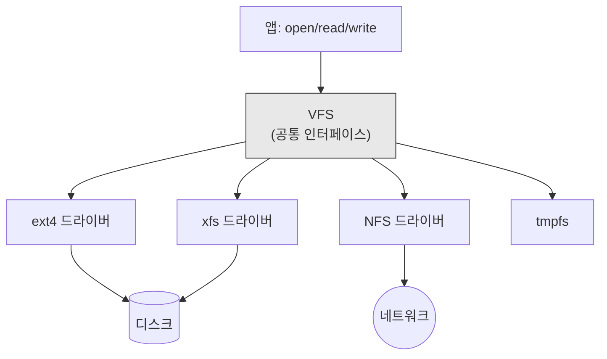
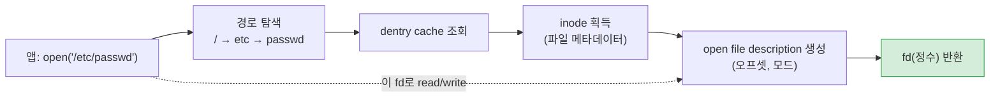
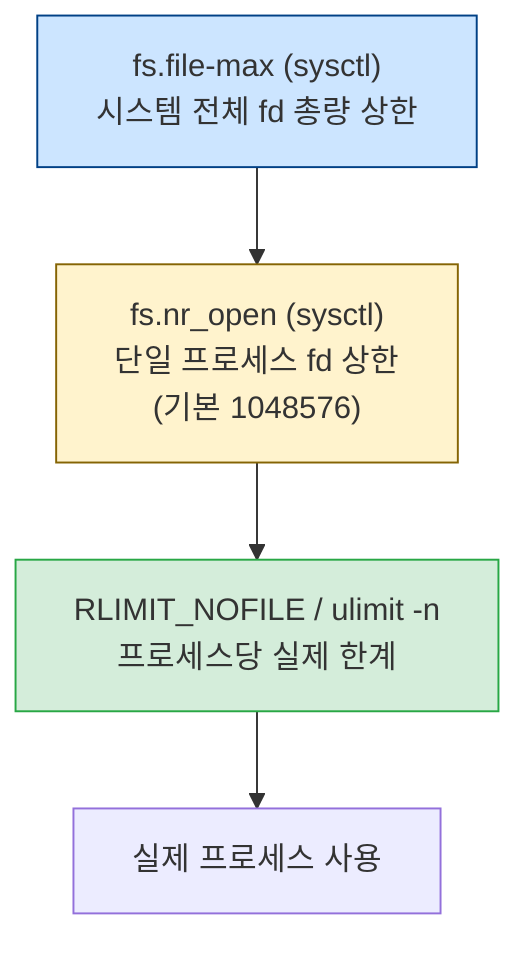
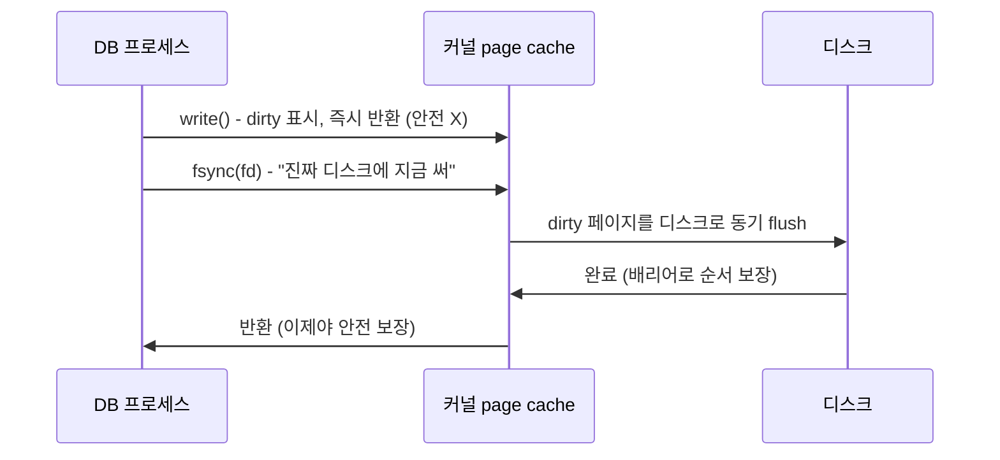

# 04. 파일 시스템과 I/O — "모든 것은 파일"이라는 철학

> Linux에는 유명한 원칙이 있다: "모든 것은 파일(file)이다." 일반 파일은 물론, 디렉토리, 장치(디스크, 터미널), 소켓, 파이프까지 전부 "파일"로 표현된다. 이 장은 그 철학이 실제로 어떻게 구현되는지, 그리고 왜 인프라 튜닝에서 "fd 한계"가 반복적으로 등장하는지를 다룬다.

## 이 장의 목표

PostgreSQL이 디스크에 데이터를 쓰는 경로, MongoDB WiredTiger가 데이터를 저장하는 방식, WAS가 "Too many open files" 에러를 내는 이유, `fsync()`가 DB 내구성의 마지막 보루인 까닭 — 이 모든 것이 파일 시스템과 I/O 계층에 있다. 이 장을 읽으면 왜 `fs.file-max`와 `ulimit -n`을 함께 올려야 하는지, 왜 ext4 저널링 모드가 DB에 중요한지를 운영체제 수준에서 이해하게 된다.

## 이 장에서 다루지 않는 것 (깊이 경계)

- ext4/xfs의 디스크 포맷 상세(inode 비트 필드, 블록 그룹 배치, B+tree extent)
- VFS의 내부 자료구조(super_block, dentry cache 해시)
- blk-mq의 소프트웨어 큐/하드웨어 큐 디스패치
- DAX(Direct Access), fsverity, overlayfs 같은 특수 파일시스템

TA는 "fd 3계층 한계", "저널링 3모드의 트레이드오프", "buffered vs direct I/O 차이", "fsync가 보장하는 것" 정도를 이해하면 충분하다.

---

## 1. VFS — 모든 파일시스템의 공통 인터페이스

### 1.1 도입: 왜 "모든 것은 파일"인가

Unix 설계자들은 1970년대에 통찰 하나를 내놓았다. "디스크 파일, 터미널, 프린터, 네트워크 연결을 각각 다른 방식으로 다루면 복잡하니, 전부 **열고(open), 읽고(read), 쓰고(write), 닫는(close)** 통일된 인터페이스로 다루자." 이 통일이 바로 "모든 것은 파일"이라는 철학이다.

그 결과, 프로그램은 디스크 파일이든 네트워크 소켓이든 같은 `read()`/`write()` 시스템 콜로 다룬다. PostgreSQL 데이터 파일도, WAS가 맺는 TCP 소켓도, 모두 "파일 디스크립터(fd)"라는 정수 하나로 표현된다. 이 추상화를 가능하게 하는 커널 계층이 **VFS(Virtual File System)**다.

### 1.2 VFS의 역할

Linux는 여러 파일시스템(ext4, xfs, btrfs, NFS, tmpfs...)을 동시에 지원한다. 각각 디스크 포맷이 다르다. 그런데 사용자 프로그램은 "어떤 파일시스템인지" 알 필요 없이 같은 `open()`/`read()`를 쓴다. VFS가 그 사이에서 **공통 인터페이스를 제공**하기 때문이다.



VFS 아래 각 파일시스템 드라이버가 실제 디스크 포맷을 처리한다. TA가 드라이버 내부까지 알 필요는 없다. "VFS가 위에는 동일하게 보이게, 아래는 각 파일시스템이 알아서"라는 것만 기억.

---

## 2. inode, dentry, fd — 파일을 여는 순간 무슨 일이 일어나는가

이 절은 인프라 튜닝에서 가장 자주 등장하는 "fd 한계"의 근원을 설명한다.

### 2.1 파일의 세 가지 표현

"파일"이라고 하나로 부르지만, 커널 내부에서는 세 가지 다른 객체로 파일을 표현한다. 이해하면 "fd가 왜 그렇게 동작하는가"가 보인다.

- **inode(아이노드)**: 파일의 **정체성**. 디스크에 저장되는 메타데이터(크기, 권한, 소유자, 생성 시간, 데이터 블록 위치). 파일 이름은 여기에 없다 — inode는 번호로 식별.
- **dentry(디렉토리 엔트리)**: **이름 → inode 매핑**. 디렉토리 계층(`/etc/passwd`)을 탐색할 때, 각 경로 구성요소가 dentry. 커널은 자주 쓰는 dentry를 캐시(dcache)에 보관해 반복 탐색을 빠르게.
- **fd(파일 디스크립터)**: 프로세스가 파일을 **열었을 때** 받는 작은 정수(0, 1, 2, ...). "이 프로세스가 이 파일을 이렇게(읽기/쓰기) 열어 두었다"는 핸들.

핵심 구분: inode는 파일 자체(디스크 상, 전역), fd는 "누군가가 그 파일을 열어 둔 상태"(프로세스별). 한 inode를 여러 프로세스가 동시에 열 수 있고, 그때마다 fd가 각각 생긴다.

### 2.2 open()의 실제 경로



프로세스가 `open()`을 부르면, 커널은 경로를 따라 dentry를 찾고, inode를 얻고, "열린 파일 기술(open file description)"을 만들어(오프셋·열기 모드 포함), 그것을 가리키는 **fd 번호**를 프로세스에게 돌려준다. 이후 프로세스는 이 fd 정수로 `read()`/`write()`를 한다.

### 2.3 fd = 자원이다

여기서 인프라 튜닝의 핵심 통찰: **fd는 자원이다.** 커널은 프로세스마다 fd 테이블을 유지해야 하고, 각 fd는 open file description, 그 아래 inode 참조 등을 유지한다. 무한히 만들 수 없다.

그리고 "모든 것이 파일"이므로, **네트워크 소켓도 fd**다. WAS가 DB에 커넥션을 맺을 때마다 소켓 = fd 1개 소모. WAS 커넥션 풀 20개 + 로그 파일 fd + DB 연결 fd... 가 누적. 동시 커넥션 수천 개 서버는 fd를 수만 개 쓴다. 이것이 "Too many open files" 에러가 인프라의 단골 문제인 이유다.

---

## 3. fd 한계의 3계층 — 왜 한 값을 올려도 안 되는가

이 절은 본 프로젝트 `reports/final/*.md` §1의 가장 흔한 함정을 다룬다. 운영자가 "fd를 올렸는데도 에러가 난다"면 이 절이 답이다.

### 3.1 세 계층의 한계



fd 한계는 세 단계로 존재하며, **세 값이 모두 커야** 실제 한계가 올라간다.

- **fs.file-max**(sysctl): 시스템 전체가 만들 수 있는 fd 총량. 모든 프로세스의 fd 합.
- **fs.nr_open**(sysctl): **단일 프로세스**가 가질 수 있는 fd 상한. 기본 1048576. 이 값의 의미: `RLIMIT_NOFILE`(아래)을 이보다 높게 못 올린다 — 안전 장치.
- **RLIMIT_NOFILE**(`ulimit -n`): 각 프로세스의 **실제** fd 한계. 서비스 데몬은 systemd `LimitNOFILE`로 설정.

### 3.2 왜 한 계층만 올리면 안 되는가

만약 `fs.file-max=2097152`만 올리고 `ulimit -n`(RLIMIT_NOFILE)이 기본 1024라면, 프로세스는 여전히 1024에서 막힌다. 반대로 `ulimit -n=1048576`만 올려도, `fs.nr_open`(기본 1048576)이 상한이라 그 이상 못 올림. 그리고 시스템 전체 fd 합이 `fs.file-max`를 넘으면 커널이 거부.

그래서 "fd를 올려라"는 사실은 "세 값을 모두 점검하라"는 뜻이다. 다행히 본 프로젝트 표준값(`fs.file-max=2097152`, `ulimit -n=1048576`)은 세 계층이 정렬되어 있다. 하지만 운영 중 "여전히 fd 부족"이 나온다면 어느 계층이 빠졌는지 확인해야 한다.

### 3.3 함정: systemd 서비스는 PAM을 안 탄다

여기가 가장 큰 함정. `/etc/security/limits.conf`에 다음을 적었다고 하자.

```
*  soft  nofile  1048576
*  hard  nofile  1048576
```

이것은 **PAM(pluggable authentication module)을 거치는 로그인 세션**(SSH 접속 등)에만 적용된다. 그런데 PostgreSQL·mongod·pgpool·tomcat 서비스는 systemd가 **직접** 띄운다. PAM을 안 거친다. 그래서 이 limits.conf는 서비스 데몬에 **전혀 영향을 안 준다**. 서비스는 여전히 컴파일 시점 기본값(보통 1024)으로 동작.

해결은 systemd drop-in override.

```ini
# /etc/systemd/system/postgresql-16.service.d/override.conf
[Service]
LimitNOFILE=1048576
LimitNPROC=65536
```

`systemctl daemon-reload && systemctl restart postgresql-16`. 그리고 `/proc/$(pgrep -f postgres | head -1)/limits`로 `Max open files`가 1048576인지 확인. 이 전체 절차가 빠지면 "limits.conf를 고쳤는데도 Too many open files" 함정에 빠진다.

### 3.4 infinity는 왜 위험한가

`LimitNOFILE=infinity`로 두면 안 된다. 커널은 "무한 fd"를 의미 있게 처리하려 fd 테이블에 대해 약 8.6GB의 메모리를 예약할 수 있다(Red Hat Bug 2394600). 메모리 낭비. 그래서 명시적 큰 값(`1048576`)이 안전하다. "무한"은 인프라 튜닝에서 거의 항상 함정이다.

> **TA 노트**: 서버 점검 첫 단추. 각 핵심 서비스(postgres, mongod, pgpool, tomcat)의 실제 fd 한계를 `/proc/<pid>/limits`로 확인하라. `Max open files`가 1048576이면 OK, 1024면 systemd drop-in이 빠진 것. 이 점검 하나로 "간헐적 Too many open files" 장애의 상당수가 예방된다. 본 프로젝트 `reports/final/*.md` §1.1이 바로 이 점검을 강제하는 절이다.

---

## 4. ext4와 xfs, 그리고 저널링 — 왜 DB는 이 값을 신경 쓰는가

### 4.1 도입: 정전 때 디스크는 무슨 일이 일어나는가

PostgreSQL이 데이터 페이지를 디스크에 쓰는 도중 정전이 났다고 하자. 페이지 절반만 기록되었을 수 있다(torn page). 이대로 재부팅하면 파일시스템 메타데이터(이 파일이 어디 블록에 있는가)마저 불일치하면, 파일 시스템 전체가 깨져 마운트조차 안 될 수 있다. 이 재앙을 막는 것이 **저널링(journaling)**이다.

### 4.2 저널링의 원리 — 변경을 먼저 로그에

저널링 파일시스템(ext4, xfs)은 실제 데이터·메타데이터를 디스크에 쓰기 **전에**, 그 변경 내역을 **저널(log)**이라는 별도 영역에 먼저 기록한다. 정전 후 복구 시, 저널을 재생(replay)해 일관성을 복원. DB의 WAL(Write-Ahead Log, study/03 PostgreSQL 장)과 같은 원리 — "진짜 쓰기 전에 로그를 먼저"를 파일시스템 수준에서 하는 것.

### 4.3 ext4의 세 저널링 모드

ext4는 데이터를 얼마나 엄격하게 저널링할지 세 모드를 제공한다.

| 모드 | 무엇을 저널링 | 속도 | 안전성 | 비고 |
|:---|:---|:---|:---|:---|
| `data=ordered`(기본) | 메타데이터만. 단, 데이터를 메타데이터 **이전**에 디스크에 기록 | 빠름 | 높음(최신 데이터 보존) | 대부분의 배포판 기본값 |
| `data=writeback` | 메타데이터만. 데이터 순서 보장 안 함 | 가장 빠름 | 낮음(크래시 직전 쓰기에 구형 데이터 노출 위험) | 성능 극대화 시 |
| `data=journal` | 데이터 + 메타데이터 모두 저널링 | 가장 느림 | 최고 | 읽기+쓰기 혼합 시 역설적 우수 |

이 차이를 이해하면 왜 DB 서버의 파일시스템 선택이 중요한지 보인다. PostgreSQL·MongoDB는 자체 WAL/checkpoint로 데이터 내구성을 보장하므로, 파일시스템은 `data=ordered`(기본)로 충분. `data=writeback`은 성능은 좋지만 정전 시 구형 데이터가 보일 수 있어 DB에는 권장 안 함. `data=journal`은 DB의 자체 로그와 이중으로 저널링해 느려지므로 오히려 역효과.

### 4.4 barrier — 디스크 쓰기 캐시와의 싸움

현대 디스크는 쓰기 캐시를 가진다. 커널이 "이 데이터를 디스크에 써"라고 보내도, 디스크가 캐시에만 담아두고 "썼다"고 보고할 수 있다(거짓 완료). 그 상태서 정전이 나면 데이터가 날아간다. 이것을 막기 위해 커널은 **배리어(barrier)**라는 명령을 보내 "이전 쓰기가 진짜 디스크에 닿았음을 보장해"라고 강제.

ext4 기본은 `barrier=1`(배리어 켬). 안전하지만 약간 느림. 배터리 백업(BBU)이 있는 디스크 컨트롤러라면 `barrier=0`(=nobarrier)으로 성능 향상 가능 — 정전 시 배터리가 캐시를 보호하므로. 하지만 BBU가 없는데 `nobarrier`를 쓰면 정전 시 데이터 손상 위험이 크다.

> **TA 노트**: DB 서버에서 파일시스템 튜닝은 조심. `data=ordered`(기본) + `barrier=1`(기본)이 가장 안전. 성능을 위해 `nobarrier`를 쓰려면 디스크가 BBU 또는 정전 보호 기능이 있는지 **확인 후**. 그리고 DB는 자체 fsync로 내구성을 보장하므로, 파일시스템이 "거짓 완료"를 보고하면 DB 데이터가 손상 — 신뢰할 수 있는 저장소가 DB의 전제다.

### 4.5 xfs는 왜 다른가

xfs는 ext4와 함께 가장 널리 쓰이는 저널링 파일시스템. ext4보다 **대용량 파일·병렬 I/O**에 강하다. RHEL 7부터 기본 파일시스템이 xfs. PostgreSQL·MongoDB 데이터 볼륨에도 자주 선택. xfs는 metadata journaling만(metatdata 무결성 보장, 데이터는 보장 안 함 — ext4 `data=ordered`와 유사 선에서 안전). 성능 특성상 대용량 DB에 유리. TA는 "ext4든 xfs든 DB에는 기본 저널링 모드로 충분, 대용량이면 xfs가 유리할 수 있다" 정도로 이해.

---

## 5. buffered I/O vs O_DIRECT — DB의 double buffering 딜레마

### 5.1 두 가지 I/O 경로

03장(메모리)에서 page cache를 다뤘다. 일반 `read()`/`write()`는 항상 page cache를 거친다(buffered I/O). 이것은 대부분의 앱에 좋다 — 자주 읽는 파일은 캐시에서 빠르게 처리.

그런데 DB는 자체 캐시(PostgreSQL shared_buffers, MongoDB WiredTiger cacheSizeGB)를 둔다. 그런데 커널 page cache도 같은 데이터를 또 캐싱하면 **double buffering**(이중 캐싱)이 된다. 메모리 낭비. 그래서 DB는 가끔 page cache를 우회하는 **`O_DIRECT`** 모드를 쓴다.

### 5.2 O_DIRECT — page cache 건너뛰기

`open()`에 `O_DIRECT` 플래그를 주면, 그 파일의 I/O는 page cache를 **거치지 않고** 앱 버퍼와 디스크 사이 직접 전송. DB가 자체 캐시로 충분할 때, 커널 page cache에 이중으로 올리지 않아 메모리 절약.

단점. `O_DIRECT`는 **버퍼 정렬·크기 제약**(섹터 배수, 보통 512바이트 또는 4KB 정렬)이 있어 까다롭다. 그리고 page cache의 read-ahead(미리 읽기) 이득을 못 받아, 순차 읽기가 느려질 수 있다. 또한 캐시 적중 이득이 사라지므로, 작은 임의 읽기가 많으면 느려질 수 있다. 그래서 "무조건 O_DIRECT가 빠르다"는 오해 — 워크로드에 따라 다르다.

### 5.3 DB의 선택

- PostgreSQL: 기본 buffered I/O. shared_buffers 별도 관리. `O_DIRECT`는 12+에서 direct I/O 실험적 지원(대세화 전).
- MongoDB WiredTiger: 자체 캐시 + 내부적으로 direct I/O 유사 전략을 쓰지만, 설정은 `wiredTiger.engineConfig`로 일부 제어.

본 프로젝트에서는 이 값을 명시적으로 튜닝하지 않는다(기본 동작 신뢰). 다만 "DB 메모리가 double buffering으로 낭비된다"는 문제를 발견하면, shared_buffers/cacheSizeGB 크기를 조정(03장 §2.4)하는 것이 정석. `O_DIRECT` 강제는 신중한 벤치마크 후.

> **TA 노트**: "데이터베이스가 RAM을 다 쓰는데 어디 갔나요?" 질문의 답은 종종 double buffering. PostgreSQL shared_buffers(25%) + Linux page cache(나머지)에 같은 데이터가 중복. 해결은 shared_buffers를 너무 크게 잡지 않는 것(25%가 정석)과, OS에 page cache를 위한 여유를 두는 것. effective_cache_size(75%)가 이 균형을 반영하는 힌트값.

---

## 6. I/O 스케줄러와 fsync — 디스크 쓰기의 마지막 관문

### 6.1 I/O 스케줄러 — 디스크 요청을 재정렬하는 도우미

디스크(특히 HDD)는 헤드가 이동해야 해서 임의 접근이 느리다. 그래서 Linux는 블록 계층에서 I/O 요청을 모으고 재정렬해 디스크 부담을 줄인다. 이것이 **I/O 스케줄러**.

현대는 **blk-mq(블록 멀티큐)** 위에 스케줄러를 얹는다. 주요 스케줄러:
- `none`: 재정렬 없음. **NVMe/SSD 기본**. SSD는 임의 접근이 빨라 재정렬 이득이 작음.
- `mq-deadline`: 각 요청에 지연 한계(deadline)를 두어 기아(계속 밀림) 방지.
- `kyber`: 큐 깊이 기반 튜닝.
- `bfq`: 공정 대역폭 분배. 데스크탑/단일 큐 장치에 적합.

DB 서버(보통 SSD/NVMe)는 `none` 또는 `mq-deadline`이 일반적. HDD 서버면 `mq-deadline`이 임의 접근 재정렬로 유리. 본 프로젝트는 SSD 환경(`random_page_cost=1.1` 근거)으로 보이므로 `none` 또는 `mq-deadline`.

### 6.2 fsync() — DB 내구성의 최종 단계



DB가 데이터를 디스크에 "확실히" 기록하려면, 단순 `write()`로는 안 된다 — write는 page cache에 dirty 표시만 하고 즉시 반환(03장 §2.2). 정전 시 날아간다. 그래서 DB는 `fsync(fd)`로 **"이 파일의 dirty 페이지를 디스크에 지금 동기적으로 다 써라, 다 쓰기 전에 반환하지 마라"**라고 강제. fsync가 반환하면 그 데이터는 디스크에 있음이 보장된다(배리어와 디스크가 정직하다는 전제 하에).

PostgreSQL WAL 기록, MongoDB 저널 기록이 전부 이 fsync에 의존. 그래서 디스크가 fsync 완료를 **거짓**으로 보고하면(쓰기 캐시에만 담고 "다 했다"고), DB는 "안전하다"고 착각하지만 실제로는 정전 시 손상. 이것이 DB 저장소에 "신뢰할 수 있는 디스크(정직한 fsync)"가 필수인 이유.

### 6.3 fdatasync — 더 빠른 사촌

`fdatasync(fd)`는 fsync의 가벼운 버전. 메타데이터 중 접근 시간(atime) 같은 불필요한 것은 제외하고, 데이터와 "크기 변경" 정도만 보장. 그래서 fsync보다 빠르다. DB는 메타데이터 전체가 필요 없으면 fdatasync로 최적화. PostgreSQL 내부적으로도 상황에 따라 fdatasync를 쓴다.

> **TA 노트**: DB 장애 중 "정전 후 복구했더니 데이터가 손상되었다"면 의심 순서: (1) 파일시스템 `barrier`가 꺼져 있었는가, (2) 디스크 BBU 없이 `nobarrier`를 썼는가, (3) 디스크가 fsync를 거짓 보고했는가(저급 디스크/가상화). "데이터베이스는 자체 WAL로 안전하다"는 전제가 "파일시스템·디스크가 정직하다" 위에 서 있다. 이 기반이 무너지면 DB 안전도 무의미.

---

## 7. 인프라 파라미터 다리 — 이 장이 가리키는 튜닝값

| 메커니언 (이 장) | 파라미터 | 왜 이 값인가 (한 줄) |
|:---|:---|:---|
| fd 3계층 (§3) | `fs.file-max=2097152`, `ulimit -n=1048576` | 시스템 전체·프로세스별 한계 정렬 |
| systemd 서비스 한계 (§3.3) | `LimitNOFILE=1048576`, `LimitNPROC=65536` | limits.conf(PAM)가 데몬에 안 먹힘. drop-in 필수 |
| fd 상한 안전장치 (§3.2) | `fs.nr_open`(기본 1048576) | RLIMIT_NOFILE을 이 이상 못 올림. 명시적 값 안전 |
| 저널링 (§4) | ext4 `data=ordered`(기본), `barrier=1`(기본) | DB는 기본 모드로 충분. nobarrier는 BBU 확인 후 |
| I/O 스케줄러 (§6.1) | SSD: `none` 또는 `mq-deadline` | SSD는 재정렬 이득 작음. HDD는 mq-deadline |
| 내구성 (§6.2) | fsync/fdatasync | DB WAL/저널의 내구성 보장. 신뢰 디스크 전제 |

표준값은 06장 통합 매트릭스에, 값의 메커니즘 근거는 이 장에 있다. 특히 fd 3계층 + systemd drop-in은 본 프로젝트 검증 체크리스트의 단골 항목이다.

## 8. TA 점검 포인트

1. WAS가 "Too many open files" 에러. 운영자는 `/etc/security/limits.conf`를 올렸는데도 해결 안 됨. 이유와 해결책을 설명하라. (§3.3)
2. `LimitNOFILE=infinity`로 둔 서버. 왜 위험한가? (§3.4)
3. PostgreSQL 서버의 ext4가 `data=writeback` + `nobarrier`로 설정되어 있다. 정전 시 위험을 서술하라. (§4.3, §4.4)
4. "DB는 자체 WAL로 안전하다"는 주장. 파일시스템·디스크 관점에서 이 전제가 성립하는 조건을 설명하라. (§6.2)
5. `O_DIRECT`를 쓰면 항상 빠르다는 주장. 왜 틀렸는가? (§5.2)
6. 동시 커넥션 5000개를 받는 서버. fd 한계를 어떻게 설계해야 하는가? 세 계층으로 서술하라. (§3)

---

### 참고 출처

- kernel.org — Documentation for /proc/sys/kernel (file-max, nr_open, pid_max): https://www.kernel.org/doc/html/latest/admin-guide/sysctl/kernel.html
- man7 open(2)(O_DIRECT 절): https://man7.org/linux/man-pages/man2/open.2.html
- man7 getrlimit(2)(RLIMIT_NOFILE): https://man7.org/linux/man-pages/man2/getrlimit.2.html
- man7 fsync(2): https://man7.org/linux/man-pages/man2/fsync.2.html
- freedesktop systemd — systemd.exec(LimitNOFILE): https://www.freedesktop.org/software/systemd/man/latest/systemd.exec.html
- kernel.org — ext4 Data Mode(저널링): https://www.kernel.org/doc/html/latest/admin-guide/ext4.html
- kernel.org — XFS: https://www.kernel.org/doc/html/latest/admin-guide/xfs.html
- kernel.org — Block layer(I/O 스케줄러): https://www.kernel.org/doc/html/latest/block/index.html
- Red Hat Bug 2394600(unlimited ulimit 메모리 할당): https://bugzilla.redhat.com/
