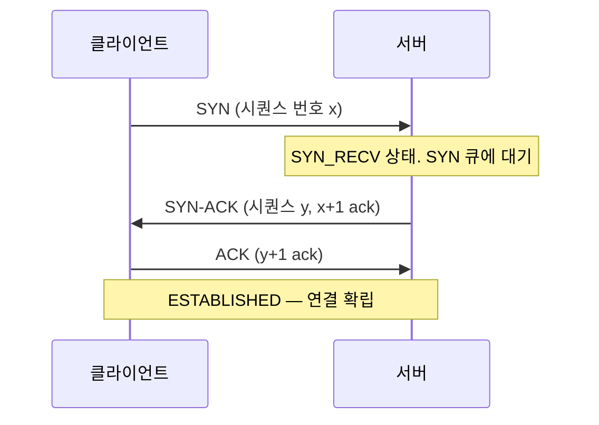
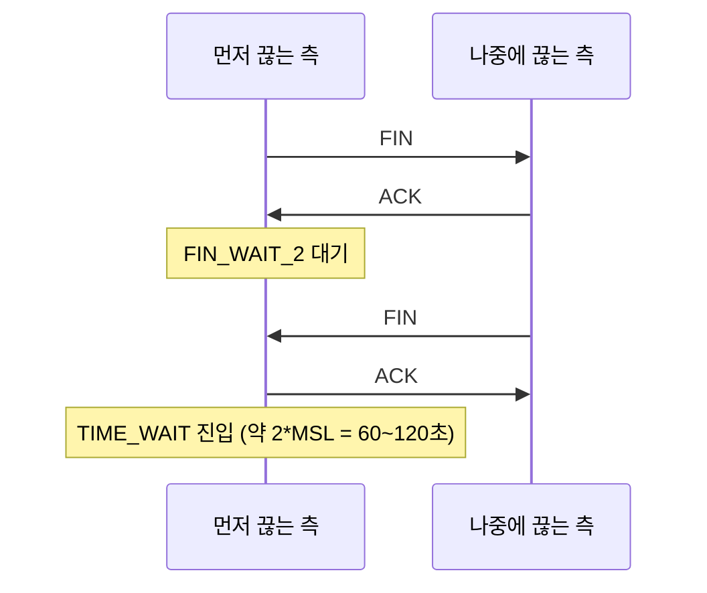
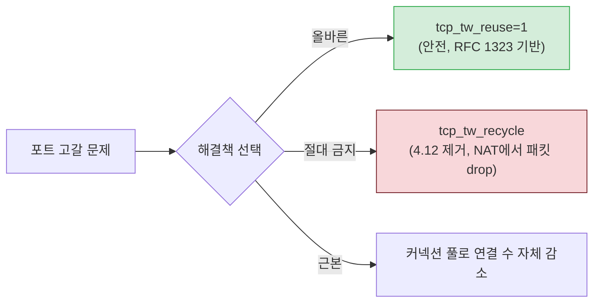
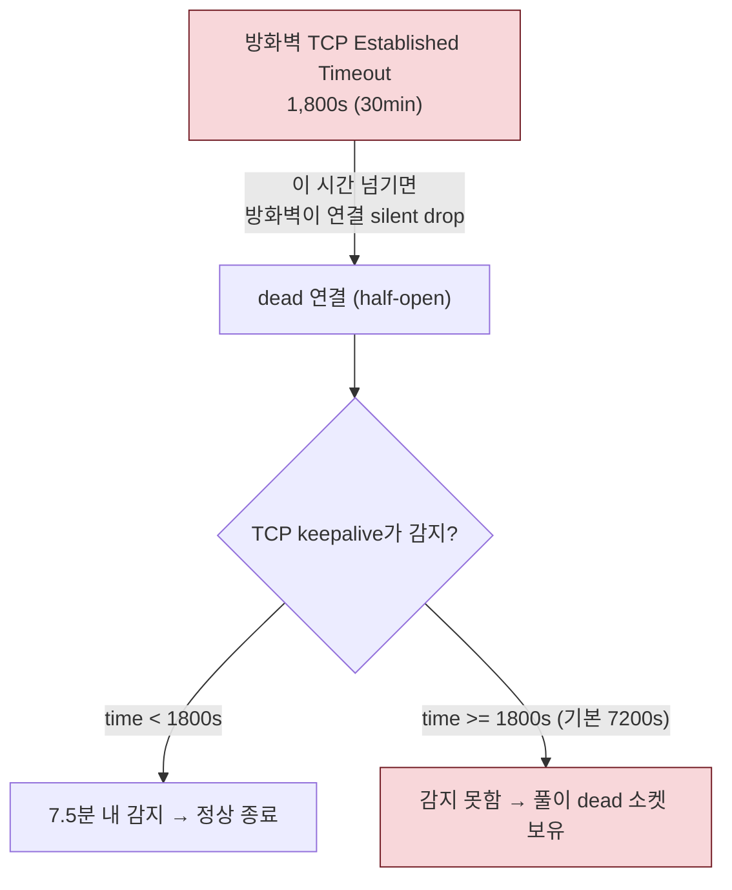

# 05. 네트워킹 스택 — TCP가 연결을 맺고 끊는 이야기

> 이 장은 WAS가 DB에 커넥션을 맺을 때부터 끊을 때까지, 그 사이에 커널에서 무슨 일이 일어나는지를 따라간다. 본 프로젝트의 가장 중요한 불변량인 "방화벽 30분 타임아웃"과 "타임아웃 캐스케이드"가 모두 이 장 위에 있다. 새벽 장애의 상당수가 네트워크 타임아웃에서 온다 — 이 장이 그 원인을 해독하는 열쇠다.

## 이 장의 목표

운영자가 묻는다. "WAS에서 DB로 간헐적으로 Connection reset 에러가 납니다." 이 질문에 답하려면 TCP 상태 머신, TIME_WAIT, keepalive, 그리고 방화벽의 동작을 알아야 한다. 이 장을 끝내면 "방화벽이 30분 유휴 연결을 끊는다"는 단순한 사실이 왜 `tcp_keepalive_*`, `somaxconn`, `tcp_tw_reuse` 같은 파라미터들과 연결되는지, 그리고 왜 `tcp_tw_recycle`을 절대 쓰면 안 되는지가 한 줄로 설명된다.

## 이 장에서 다루지 않는 것 (깊이 경계)

- TCP 혼잡 제어 알고리즘의 수식(Reno/CUBIC/BBR의 CWND 계산)
- RTT/RTO 측정 알고리즘, 재전송 타이머의 세부 동작
- IP 단편화, 라우팅 테이블(fib_trie), netfilter 훅 체인 전체
- TLS/SSL 핸드셰이크, 인증서 검증(app 계층)
- DDoS 방어(synproxy, XDP), eBPF 프로그래밍

TA는 "TCP 상태 머신", "SYN/accept 큐", "TIME_WAIT 포트 고갈", "keepalive가 방화벽과 싸우는 구조" 정도를 이해하면 충분하다.

---

## 1. TCP의 기본 — 왜 "연결"이라 부르는가

### 1.1 도입: IP만으로는 부족하다

IP(Internet Protocol)는 패킷을 한 쪽에서 다른 쪽으로 보낸다. 하지만 "이 패킷이 순서대로 갔는가", "중간에 빠졌는가", "상대방이 받았는가"는 보장 못 한다. 그래서 그 위에 **TCP(Transmission Control Protocol)**가 올라간다. TCP는 "신뢰성 있는 연결"을 만들어 — 순서 보장, 손실 시 재전송, 흐름 제어, 혼잡 제어. "연결 지향(connection-oriented)"이라 부르는 이유다.

"연결"이라고 해서 물리적 선을 의미하는 게 아니다. 두 컴퓨터가 **상태(state)를 공유**하며 "우리 지금 연결되어 있어, 다음엔 이 시퀀스 번호를 기대해"라고 합의한 논리적 관계다. 이 상태를 관리하는 것이 **TCP 상태 머신**이다.

### 1.2 소켓 — 네트워크의 파일 디스크립터

04장에서 "모든 것은 파일"이라 했다. 네트워크 연결도 마찬가지 — **소켓(socket)**이라는 특수 파일로 표현되며, fd 번호를 받는다. 그래서 소켓도 fd 한계(04장 §3)에 포함된다. 동시 커넥션 5000개 = fd 5000개. 이것이 WAS·PgPool 서버에서 fd가 중요한 이유 중 하나.

`socket()` 시스템 콜로 소켓을 만들고, `bind()`로 포트에 묶고, `listen()`으로 접속을 기다리고, `accept()`로 실제 연결을 받는다. 이 흐름이 서버 측의 기본.

---

## 2. 3-way handshake와 4-way handshake — 연결을 맺고 끊는 의식

### 2.1 연결 맺기 — 3-way handshake

TCP 연결은 **3-way handshake**로 시작된다. 세 단계의 패킷 교환.



1. 클라이언트가 `SYN`(synchronize) 패킷 보냄. "연결 시작하자, 내 시퀀스 번호는 x야".
2. 서버가 `SYN-ACK`로 응답. "좋아, 내 시퀀스는 y야, 네 x 받았어(x+1)".
3. 클라이언트가 `ACK`. "네 y 받았어(y+1)". 이제 연결 확립(ESTABLISHED).

이 세 단계가 끝나야 비로소 데이터를 주고받을 수 있다. 왜 3단계나? 양쪽이 서로의 시퀀스 번호를 확인하고, "과거의 지연된 패킷이 새 연결에 섞이는 것"을 막기 위해서. 견고한 설계.

### 2.2 SYN 큐와 accept 큐 — 서버의 두 단계 대기

여기서 인프라 튜닝의 핵심. 서버 소켓에는 연결을 받는 **두 단계 큐**가 있다.

```mermaid
graph LR
    C1["클라이언트 SYN"] --> SYN["SYN 큐<br/>(tcp_max_syn_backlog)<br/>SYN_RECV 상태"]
    SYN -->|3-way 완료| ACC["accept 큐<br/>(somaxconn, 앱 backlog)<br/>ESTABLISHED, 미수락"]
    ACC -->|앱이 accept()| APP["앱에 전달"]
    style SYN fill:#fff3cd,stroke:#856404
    style ACC fill:#cce5ff,stroke:#004085
```

- **SYN 큐**: SYN은 받았지만 아직 3-way handshake가 완료되지 않은 연결(SYN_RECV 상태). 상한 = `tcp_max_syn_backlog`.
- **accept 큐**: 3-way handshake는 끝났으나(ESTABLISHED), 애플리케이션이 아직 `accept()`로 가져가지 않은 연결. **실제 크기 = `min(somaxconn, 앱의 listen backlog)`**.

이 두 큐가 차면 새 연결은 버려진다. 클라이언트는 타임아웃이나 "Connection refused"를 겪는다.

### 2.3 somaxconn과 backlog — 왜 min인가

`somaxconn`은 커널 시스템 전역 accept 큐 상한. 애플리케이션은 `listen()` 호출 시 `backlog` 인자를 준다(Tomcat `acceptCount`, Spring Boot `server.tomcat.accept-count`). **실제 accept 큐 크기는 둘의 min이다.** somaxconn이 4096인데 앱 backlog가 100이면, 큐는 100. 반대로 앱이 8192를 원해도 somaxconn이 4096이면 4096.

이것이 본 프로젝트가 `somaxconn=4096`과 WAS `acceptCount=100`을 **함께** 설정하는 이유다. 어느 한쪽이 작으면 그 값이 전체 한계가 된다. WAS 튜닝 시 "acceptCount만 올렸는데 효과 없다"면, somaxconn을 확인하라.

> **참고**: `somaxconn` 기본값은 커널 5.4부터 **4096**(이전엔 128). 최신 커널이라면 기본값이 이미 4096이지만, 구형 커널에서는 128이라 트래픽 버스트에 취약. 본 프로젝트 표준값 4096은 이를 명시적으로 보장.

### 2.4 SYN flood와 syncookies

악의적인 클라이언트가 SYN만 보내고 ACK를 안 보내면(가짜 출처), 서버의 SYN 큐가 가득 찬다(SYN flood 공격). 정상 연결이 못 들어온다. 방어가 **tcp_syncookies**(기본 1). SYN 큐가 가득 찰 때, 서버가 SYN-ACK에 "암호화된 쿠키"를 실어 보내, 큐에 보관하지 않고도 ACK에서 쿠키로 정상 연결임을 확인. 큐를 안 쓰니 가득 찰 수 없다.

단, syncookies는 "TCP 프로토콜을 심각하게 위반"(kernel.org 표현)하는 폴백이지 근본 해결이 아니다. 정상 튜닝(`tcp_max_syn_backlog` 충분히 크게)이 우선이고, syncookies는 최후의 방어선.

### 2.5 연결 끊기 — 4-way handshake와 TIME_WAIT

연결을 끊을 때는 양쪽이 각각 `FIN`(finished)을 보내는 **4-way handshake**가 일어난다.



먼저 끊는 측이 마지막 ACK를 보낸 뒤 **TIME_WAIT** 상태로 진입한다. 왜? 두 가지 이유. 첫째, 내 마지막 ACK가 유실되면 상대가 재전송할 수 있도록(그때 다시 ACK 보내려고). 둘째, 이 연결의 지연된 패킷이 네트워크에 남아 있다가 같은 포트 쌍으로 새 연결이 맺어지면 섞이는 것을 막기 위해(2×MSL, 약 60~120초 대기 후 소켓 완전 폐기).

이 TIME_WAIT이 인프라 장애의 단골 원인이다 — 다음 절에서.

---

## 3. TIME_WAIT과 포트 고갈 — WAS 서버의 새벽 장애

### 3.1 도입: 새벽 3시, 갑자기 연결이 안 된다

가상 시나리오. WAS 서버가 PostgreSQL에 짧은 쿼리를 매우 자주 보낸다. 초당 수백~수천 연결. 한동안 잘 되다가 새벽 피크에 갑자기 "Cannot assign requested address" 에러가 폭발. 재부팅하면 잠시 괜찮다가 다시.

원인은 **ephemeral port(임시 포트) 고갈**. WAS가 DB에 연결할 때 클라이언트 역할로, 매 연결마다 임시 포트(`ip_local_port_range` 범위에서 할당) 하나를 쓴다. 연결을 끊어도 TIME_WAIT 상태로 그 포트를 60~120초간 점유. 연결 속도가 TIME_WAIT 만료 속도를 넘어서면, 가용 임시 포트가 바닥나 새 연결을 못 맺는다.

### 3.2 임시 포트 범위 — ip_local_port_range

```ini
net.ipv4.ip_local_port_range = 32768 65535
```

기본 범위. 32768~65535 = 약 33,000개. 하나의 목적지(같은 IP+포트)에 대해, 이 범위 내에서 각 포트가 TIME_WAIT 동안 점유되므로, 동시에 활성+TIME_WAIT 연결이 33,000개를 넘으면 고갈. 본 프로젝트 표준값도 이 범위지만, 아주 빈번한 아웃바운드 서버는 범위를 넓힌다(예: `1024 65535` = 약 64,000개).

### 3.3 해결책 1: tcp_tw_reuse — 안전하고 권장

```ini
net.ipv4.tcp_tw_reuse = 1
```

TIME_WAIT 소켓을 **아웃바운드(클라이언트가 새 연결을 시작할 때)** 재사용 허용. 안전한 이유 — TCP 타임스탬프(RFC 1323, PAWS)로 구연결의 지연 패킷과 새 연결을 구분. 그래서 TIME_WAIT의 두 번째 목적(지연 패킷 보호)을 타임스탬프로 대체 달성. WAS·PgPool처럼 아웃바운드가 많은 서버에서 포트 고갈 해소의 정석.

### 3.4 해결책 아님: tcp_tw_recycle — 제거됨, 절대 사용 금지

과거에 `tcp_tw_recycle=1`이라는 옵션이 있었다. TIME_WAIT을 빨리 회수해 포트 고갈을 푼다는 취지. 하지만 **치명적 부작용**이 있었다 — NAT 뒤의 여러 클라이언트가 같은 공인 IP로 서버에 올 때, 각 클라이언트의 TCP 타임스탬프가 단조성을 위반하면 패킷을 drop. 즉 로드밸런서/NAT 환경에서 일부 클라이언트의 연결이 신비롭게 끊기는 사태. 그래서 **Linux 커널 4.12(2017)에서 완전히 제거**되었다.

본 프로젝트에서 절대 금지. 서버 점검 시 `tcp_tw_recycle=1`이 남아 있다면 제거하라(4.12 미만 커널에서는 동작하지만 위험, 4.12+에서는 무시됨).



### 3.5 근본 해결: 커넥션 풀

tcp_tw_reuse는 증상 완화다. 근본은 **연결 수 자체를 줄이는 것** — 커넥션 풀(HikariCP 등). 풀이 연결을 재사용하면 새로 맺고 끊는 횟수가 줄어 TIME_WAIT 자체가 적게 생긴다. 본 프로젝트가 WAS에 커넥션 풀(인스턴스당 maxPoolSize=20)을 표준으로 삼는 이유 중 하나. study/02 WAS/JVM 장의 "커넥션 풀 경제학" 절과 연결.

> **TA 노트**: "포트 고갈 장애" 진단 순서. (1) `netstat -an | grep TIME_WAIT | wc -l`로 TIME_WAIT 수 확인. 수만 개면 고갈 의심. (2) `sysctl net.ipv4.ip_local_port_range`로 범위 확인. (3) `tcp_tw_reuse=1` 적용. (4) 근본으로 커넥션 풀 점검(짧은 연결을 반복 맺고 있지 않은가). (5) `tcp_tw_recycle`이 켜져 있으면 즉시 제거. 이 5단계가 "새벽 포트 고갈" 사고의 표준 대응.

---

## 4. TCP keepalive와 half-open — 방화벽과의 싸움

이 절은 본 프로젝트의 **가장 중요한 불변량**인 "방화벽 30분 타임아웃"을 설명한다. 이것을 이해 못 하면 타임아웃 캐스케이드를 이해 못 한다.

### 4.1 half-open — 상대가 떠났는데 나만 모르는 상태

TCP 연결이 ESTABLISHED 상태라고 해서 상대방이 정말 살아 있는 건 아니다. 상대 서버가 갑자기 죽었거나(전원 차단), 중간 방화벽이 연결을 끊었거나(유휴 timeout), 네트워크 경로가 끊겼을 수 있다. 이때 내 쪽 소켓은 여전히 ESTABLISHED로 표시되지만, 사실은 **상대가 없는 dead 연결**이다. 이것을 **half-open**(반쯤 열린) 상태라 부른다.

이 상태에서 데이터를 보내면, 처음엔 아무 응답이 없다가 재전송 타이머가 돌고, 결국 TCP 타임아웃(기본 약 15분, 재전송 시도 후)으로 연결이 죽는다. 그 사이 애플리케이션은 "연결된 줄 알고" 큐에 쿼리를 쌓고 멈춘다. 장애의 원인.

### 4.2 TCP keepalive — "너 아직 살아 있어?"

이 half-open을 빨리 감지하려고 TCP keepalive가 있다. 연결이 한동안 조용하면(idle), 커널이 상대에게 작은 탐침(probe) 패킷을 보내 "아직 살아 있어?"라고 확인. 응답이 오면 정상, 안 오면 재시도하고, 결국 dead로 판정해 연결을 끊는다.

세 파라미터가 이 동작을 제어한다(본 프로젝트 표준값).

```ini
net.ipv4.tcp_keepalive_time = 300      # 5분 idle 후 첫 탐침
net.ipv4.tcp_keepalive_intvl = 30      # 탐침 재전송 간격 30초
net.ipv4.tcp_keepalive_probes = 5      # 5번 실패 시 dead 판정
```

의미: "마지막 데이터 후 **300초(5분)** 동안 조용하면 탐침 시작. 응답 없으면 **30초 간격**으로 **5번** 재시도. 전부 실패하면(300 + 30×5 = 450초, 7.5분) dead 확정하고 연결 종료."

기본값(`time=7200`, `intvl=75`, `probes=9`)은 감지에 **약 2시간 11분**이 걸린다. 너무 느리다. 특히 방화벽이 30분만에 연결을 끊는 환경에서는 무의미 — 방화벽이 이미 끊은 연결을 2시간이 지나서야 알아차린다. 그래서 본 프로젝트는 300/30/5로 단축해 7.5분 내 감지.

### 4.3 방화벽 30분 — 본 프로젝트의 최상위 타임아웃



본 프로젝트 인프라의 방화벽은 TCP Established 연결이 **30분(1,800초) 동안 유휴**하면 연결을 자동으로 끊는다(silent drop — 양쪽에 알리지 않고 조용히 폐기). 이것은 TA가 바꿀 수 없는 환경 제약이다.

중요한 점: 방화벽이 끊은 뒤에도 양쪽 소켓은 여전히 ESTABLISHED로 보인다. 아무도 알려주지 않으니까. 이것이 half-open의 전형적 사례. TCP keepalive가 방화벽 timeout보다 **짧게** 설정되어 있어야, 방화벽이 끊기 전에(또는 직후에) keepalive 탐침이 dead를 감지한다. keepalive 기본 2시간은 방화벽 30분보다 길어 무용지물. 그래서 300초(5분)로 단축.

### 4.4 keepalive는 소켓 옵션을 켜야 동작한다

주의: `tcp_keepalive_*` 값은 **`SO_KEEPALIVE` 소켓 옵션이 켜진 연결에만** 적용된다. 모든 소켓에 기본 적용이 아니다. HikariCP·JDBC 드라이버가 이 옵션을 켜는지 확인해야 한다. 애플리케이션 단에서 명시적 설정이 필요할 수 있다.

### 4.5 타임아웃 캐스케이드 — keepalive에서 시작되는 연쇄

이제 본 프로젝트의 핵심 불변량인 **타임아웃 캐스케이드**가 왜 등장하는지 이해할 수 있다. 방화벽 30분은 못 바꾼다. 그러면 애플리케이션 계층이 "방화벽이 끊기 전에 내가 먼저 커넥션을 정리해야" 장애를 피한다. 그래서 모든 타임아웃을 방화벽 30분보다 짧게, 위계적으로 둔다.

```
WAS HikariCP maxLifetime (27min)
    < PgPool child_life_time (28min)
        < PostgreSQL/MongoDB idle_session_timeout (30min)
            < 방화벽 TCP timeout (30min)
```

엄격한 부등호(`<`). 각 계층이 다음 계층보다 1~2분 먼저 커넥션을 폐기해, 방화벽이 끊기 전에 애플리케이션이 미리 정리. 등호(`<=`)를 쓰면 두 계층이 동시에 동작해 레이스 컨디션(Connection reset)이 간헐 발생.

이 캐스케이드의 **최상위가 "방화벽 30분"**이고, 그 바로 아래가 DB idle_session_timeout(30분), 그 아래 PgPool(28분), 그 아래 WAS(27분). keepalive(본 프로젝트 5분)는 이보다 훨씬 짧아 dead 연결을 조기 감지. 이 모든 값이 "방화벽 30분"이라는 환경 제약에서 파생된 것이다.

> **TA 노트**: "방화벽 30분"은 본 프로젝트의 가장 자주 인용되는 불변량이다. 모든 타임아웃 튜닝의 출발점. 누군가 "maxLifetime을 29분으로 올려도 되나요?"라고 물으면, 답은 "안 됩니다. PgPool child_life_time(28분)보다 길어져 캐스케이드가 깨집니다. 27분을 유지하거나, 세 값을 함께 재조정해야 합니다." 이런 식으로 한 값을 바꾸면 계층 전체를 재정렬하는 사고가 TA의 핵심 역량이다.

---

## 5. conntrack과 netfilter — 방화벽/NAT 서버의 숨은 병목

### 5.1 conntrack — 연결 추적 테이블

Linux의 netfilter(iptables/nftables)가 방화벽·NAT 역할을 할 때, 통과하는 모든 연결을 **추적(tracking)**한다 — "이 패킷은 저 연결의 일부다"라고 기억해, 상태 기반(stateful) 규칙을 적용. 이 추적 정보를 담는 테이블이 **conntrack**(connection tracking).

conntrack은 유한한 테이블(`nf_conntrack_max`)을 갖는다. 연결이 너무 많아 테이블이 가득 차면, **새 연결을 drop**한다. 로그에 "nf_conntrack: table full, dropping packet"이 찍힌다. 방화벽/NAT 역할을 하는 서버(LB, 게이트웨이)의 전형적 병목.

### 5.2 인프라 튜닝 관점

본 프로젝트의 WAS·DB 서버 자체가 방화벽/NAT 역할을 하지는 않으므로, conntrack 튜닝이 직접 필요하진 않다. 다만 네트워크 경로의 방화벽 장비가 conntrack 한계에 도달하면 서버 쪽에서는 "간헐적 연결 실패"로 보인다. 원인이 서버가 아님을 아는 것이 중요. `dmesg | grep conntrack`으로 서버 자체 로그를 확인하고, 없다면 네트워크팀에 방화벽 장비 점검을 요청.

---

## 6. softirq, NAPI, IRQ 핀닝 — 고속 네트워크의 세계

이 절은 01장(아키텍처)의 softirq/NAPI를 네트워크 관점에서 구체화한다. 1Gbps 환경에서는 가볍게 넘겨도 되지만, 10Gbps+에서는 결정적.

### 6.1 패킷 수신의 전체 경로

```mermaid
graph LR
    NIC["NIC에 패킷 도착"] -->|하드웨어 인터럽트| IRQ["top half<br/>(인터럽트 핸들러)"]
    IRQ -->|패킷 큐에 올리고 softirq 예약| SIRQ["NET_RX softirq"]
    SIRQ -->|NAPI 폴링으로 여러 패킷 긁음| KSOFT["ksoftirqd 또는 인터럽트 받은 CPU"]
    KSOFT -->|TCP/IP 스택 처리| SK["소켓 큐"]
    SK -->|앱이 read()로 소비| APP["애플리케이션"]
    style IRQ fill:#f8d7da,stroke:#721c24
    style KSOFT fill:#d4edda,stroke:#28a745
```

01장에서 다뤘듯, NIC 패킷 도착 → 하드웨어 인터럽트 → top half(최소 처리 후 softirq 예약) → NET_RX softirq(ksoftirqd 또는 CPU가 처리) → TCP/IP 스택 → 소켓 큐 → 앱. 이 전체가 한 패킷의 여정.

### 6.2 NAPI — 인터럽트 폭풍 막기

고속 NIC에 패킷이 폭주할 때, 매 패킷마다 인터럽트를 걸면 CPU가 인터럽트 처리만 하다 다른 일을 못 한다(인터럽트 폭풍). **NAPI**는 첫 패킷엔 인터럽트, 이후 폭주 시 **폴링**(커널이 주기적으로 NIC을 긁어 여러 패킷을 한 번에 가져옴)으로 전환. 인터럽트 수를 획기적으로 줄인다. 현대 고속 NIC은 모두 NAPI 지원.

### 6.3 IRQ 핀닝, RPS/RFS — 멀티코어 활용

NIC의 인터럽트는 기본적으로 한 CPU 코어가 받는다. 그러면 네트워크 처리가 한 코어에 몰려 다른 코어는 놀고, 한 코어는 100% 포화. 해결:
- **IRQ 핀닝(affinity)**: 어느 코어가 어느 NIC 큐의 인터럽트를 받을지 지정(`/proc/irq/<N>/smp_affinity`). `irqbalance` 데몬을 끄고 수동으로 배분. 멀티큐 NIC(blk-mq와 유사)와 다수 코어에서 효과.
- **RPS(Receive Packet Steering)**: 인터럽트는 한 코어가 받되, softirq 처리를 여러 코어로 분산.
- **RFS(Receive Flow Steering)**: 같은 연결의 패킷은 항상 같은 코어로(캐시 지역성).

### 6.4 netdev_max_backlog — NIC→커널 큐

```ini
net.core.netdev_max_backlog = <값>
```

NIC에서 커널로 올라오기 전 큐. 폭주 시 이 큐가 차면 패킷 드랍. 고속 네트워크 서버에서 상향. 본 프로젝트에는 명시값이 없지만, 10Gbps+ 환경 도입 시 검토 대상.

### 6.5 본 프로젝트 환경에서의 적용

본 프로젝트는 4 Core / 1Gbps 추정 환경. 이 환경에서는 IRQ 핀닝·RPS/RFS의 효과가 제한적일 수 있다. 다만 향후 고부하·고속 NIC 서버(10Gbps+, 다소켓) 도입 시 이 절의 튜닝이 결정적이다. TA는 "네트워크 처리량이 CPU 한 코어 포화에 막혀 있다"면 IRQ 핀닝·RPS를 의심하는 기본 소양을 갖추면 된다. `top`에서 `%si`(softirq)가 한 코어만 100%면 전형적 신호.

> **TA 노트**: 1Gbps에서 `top`의 `%si`가 높고 처리량이 안 오른다면, 우선 NIC가 다중 큐를 지원하는지(`ethtool -l eth0`), IRQ가 한 코어에 몰려 있는지(`cat /proc/interrupts | grep eth0`)를 확인. 다중 큐 NIC + IRQ 핀닝이 고속 네트워크 튜닝의 첫 단계.

---

## 7. 인프라 파라미터 다리 — 이 장이 가리키는 튜닝값

| 메커니즘 (이 장) | 파라미터 | 왜 이 값인가 (한 줄) |
|:---|:---|:---|
| SYN/accept 큐 (§2) | `somaxconn=4096`, `tcp_max_syn_backlog=4096` | 트래픽 버스트 시 연결 Drop 방지. 앱 backlog와 min |
| TIME_WAIT/포트 고갈 (§3) | `tcp_tw_reuse=1`, `ip_local_port_range=32768 65535` | 아웃바운드 빈번 서버의 포트 고갈 해소. recycle은 금지 |
| keepalive/half-open (§4) | `tcp_keepalive_time=300`, `intvl=30`, `probes=5` | 방화벽 30분보다 짧게 dead 연결 감지(450초) |
| 타임아웃 캐스케이드 (§4.5) | (애플리케이션 계층) maxLifetime 27 < child_life 28 < idle_session 30 | 방화벽 30분이라는 환경 제약에서 파생된 위계 |
| 방화벽/NAT 병목 (§5) | `nf_conntrack_max`(방화벽 서버) | 테이블 고갈 시 패킷 drop. LB/게이트웨이 점검 |
| 고속 네트워크 (§6) | `netdev_max_backlog`, IRQ 핀닝, RPS/RFS | 10Gbps+ 멀티코어 환경. 1Gbps에선 효과 제한적 |

표준값은 06장 통합 매트릭스에, 값의 메커니즘 근거는 이 장에 있다. 특히 keepalive 300/30/5 + tcp_tw_reuse=1 + "방화벽 30분" 불변량은 본 프로젝트 네트워크 튜닝의 핵심 삼각형이다.

## 8. TA 점검 포인트

1. WAS에서 PostgreSQL로 간헐적 "Connection reset" 에러가 난다. 방화벽 30분 타임아웃과 keepalive 관점에서 원인과 조치를 설명하라. (§4.3, §4.5)
2. 새벽 피크에 WAS 서버가 "Cannot assign requested address" 에러를 낸다. 원인과 해결 순서를 5단계로 서술하라. (§3.5)
3. 서버에 `tcp_tw_recycle=1`이 설정되어 있다. 왜 제거해야 하는가? (§3.4)
4. WAS `acceptCount=100`, `somaxconn=4096`. 트래픽 버스트 시 실제 accept 큐 크기는? (§2.3)
5. 한 도메인의 maxLifetime을 27분에서 29분으로 올리자는 제안. PgPool·DB·방화벽 관점에서 왜 위험한가? (§4.5)
6. 10Gbps NIC 서버에서 한 CPU 코어만 100%이고 처리량이 안 오른다. 의심 포인트와 점검 명령을 설명하라. (§6.5)

---

### 참고 출처

- kernel.org — IP Sysctl(somaxconn, tcp_max_syn_backlog, tcp_keepalive_*, tcp_tw_reuse, ip_local_port_range): https://www.kernel.org/doc/html/latest/networking/ip-sysctl.html
- kernel.org — Netfilter conntrack sysctl: https://www.kernel.org/doc/html/latest/networking/nf_conntrack-sysctl.html
- RFC 9293 — TCP 규격(793 후속): https://www.rfc-editor.org/rfc/rfc9293.html
- RFC 1323 — TCP 확장(타임스탬프, PAWS): https://www.rfc-editor.org/rfc/rfc1323.html
- man7 tcp(7)(SO_KEEPALIVE): https://man7.org/linux/man-pages/man7/tcp.7.html
- man7 listen(2)(backlog): https://man7.org/linux/man-pages/man2/listen.2.html
- kernel.org — Documentation/networking(NAPI, softirq): https://www.kernel.org/doc/html/latest/networking/index.html
- Red Hat 네트워크 튜닝 가이드: https://docs.redhat.com/en/documentation/red_hat_enterprise_linux/
