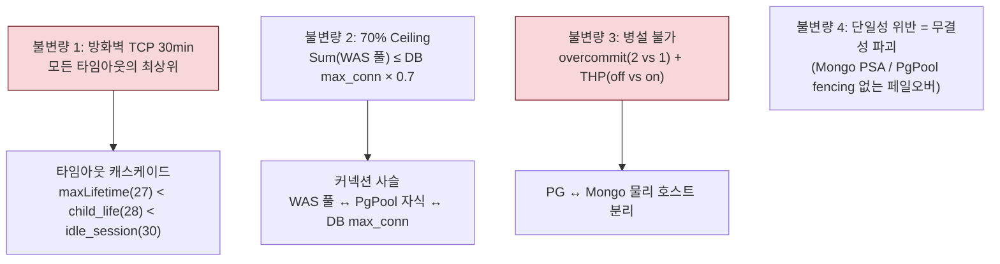
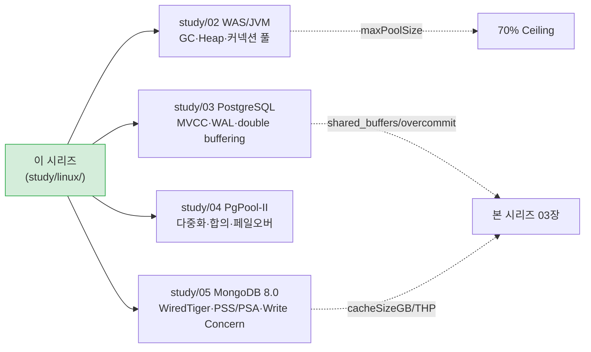

# 06. 통합 튜닝 매트릭스와 점검 체크리스트

> 이 장은 01~05에서 배운 운영체제 메커니즘을 하나로 모아, **실제 서버에 적용할 튜닝값**으로 종합한다. 앞 장들이 "왜"를 다뤘다면, 이 장은 "무엇을, 어디에"를 다룬다. 본 프로젝트 산출물 `reports/final/*.md` §1의 근거가 되는 장이다.

## 이 장을 읽기 전에

01~05장을 읽지 않고 이 장만 펼친 독자가 있을 수 있다. 그래도 표 자체는 이해될 것이다. 하지만 "왜 MongoDB 서버는 `vm.overcommit_memory=1`이고 PostgreSQL 서버는 `=2`인가"라는 질문에 답하려면 03장(메모리 관리)의 fork+CoW와 OOM Killer 절로 돌아가야 한다. 이 장의 표는 결과이고, 원인은 앞 장들에 있다. 표를 외우지 말고, 표가 가리키는 장으로 거슬러 올라가 읽는 습관이 TA의 기본 소양이다.

## 왜 "통합" 매트릭스인가

인프라 튜닝값은 고립되어 있지 않다. 한 서버의 WAS 커넥션 풀 값을 바꾸면, 그 서버가 연결하는 DB의 `max_connections`와 `70% Ceiling`을 역산해야 한다. PostgreSQL 서버의 `overcommit_memory`를 바꾸면, 같은 호스트에 올라갈 수 있는 다른 DB의 종류가 바뀐다. 이것이 본 프로젝트가 "도메인 공통 불변량"이라는 개념을 중시하는 이유다.

따라서 이 장은 세 층위로 구성된다. 첫째, 모든 서버에 공통으로 들어가는 **기반 파라미터**. 둘째, 서버 역할(WAS·PostgreSQL·MongoDB·PgPool)에 따라 달라지는 **역할별 파라미터**와 그 차이의 메커니즘. 셋째, 어느 한 값을 바꾸면 연쇄 재검증이 필요한 **도메인 불변량**.

## 1. 모든 서버 공통 — 기반 파라미터

이 값들은 서버가 어떤 역할을 하든 동일하게 적용된다. 이유는 단순하다. 모든 서버는 파일 디스크립터를 쓰고(fd), TCP 연결을 맺으며(somaxconn/backlog), 죽은 커넥션을 감지해야 한다(keepalive). 이 기반 위에 역할별 튜닝이 얹혀진다.

### 1.1 파일 디스크립터 한계 (04장 연결)

```ini
# /etc/sysctl.d/99-infra-common.conf
fs.file-max = 2097152
```

```bash
# /etc/security/limits.d/99-infra-common.conf (PAM 기반)
*  soft  nofile  1048576
*  hard  nofile  1048576
*  soft  nproc   65536
*  hard  nproc   65536
```

```ini
# systemd drop-in (서비스 데몬 필수)
[Service]
LimitNOFILE=1048576
LimitNPROC=65536
```

04장에서 보았듯, fd 한계는 세 계층으로 존재한다. `fs.file-max`는 시스템 전체, `fs.nr_open`(기본 1048576)은 단일 프로세스 상한, `RLIMIT_NOFILE`(`ulimit -n`)은 프로세스당 실제 한계다. 세 값이 모두 커야 의미가 있다. 한 계층만 올리면 그 위나 아래 계층에서 막힌다.

여기서 가장 흔한 함정이 있다. `/etc/security/limits.conf`를 올렸는데도 서비스가 여전히 "Too many open files" 에러를 낸다면, 그것은 systemd가 관리하는 데몬이 PAM을 거치지 않기 때문이다(01장 부팅·systemd 절 참조). 따라서 systemd drop-in override를 반드시 별도로 작성해야 한다. 서비스 이름은 설치 방법에 따라 다르다 — `tomcat9.service`, `postgresql-16.service`, `mongod.service`, `pgpool-II.service` 등. 각 서비스 디렉토리 아래에 `override.conf`를 둔다.

`nofile=infinity`로 두면 안 되는 이유도 04장에서 설명했다. 커널이 무한 fd 테이블에 대해 약 8.6GB의 메모리를 예약하는 Red Hat Bug 2394600이 있다. 명시적인 큰 값(1048576)이 안전하다.

| 파라미터 | 표준값 | 역할 |
|:---|:---|:---|
| `fs.file-max` | 2,097,152 | 시스템 전체 fd 상한 |
| `ulimit -n` / `LimitNOFILE` | 1,048,576 | 프로세스당 fd 한도 |
| `ulimit -u` / `LimitNPROC` | 65,536 | 프로세스/스레드 수 상한. Fork Bomb 방지 |

### 1.2 TCP 기반 — 연결 수락과 죽은 커넥션 감지 (05장 연결)

```ini
# /etc/sysctl.d/99-infra-common.conf
net.core.somaxconn = 4096
net.ipv4.tcp_max_syn_backlog = 4096
net.ipv4.tcp_keepalive_time = 300
net.ipv4.tcp_keepalive_intvl = 30
net.ipv4.tcp_keepalive_probes = 5
```

이 값들은 05장의 TCP 상태 머신 이야기를 요약한다. `somaxconn`과 `tcp_max_syn_backlog`는 각각 accept 큐와 SYN 큐의 상한이다(05장 §SYN 큐 vs accept 큐). 트래픽이 몰릴 때 이 큐가 작으면 패킷이 버려진다. 단, 애플리케이션의 `listen()` backlog(예: Tomcat `acceptCount`)도 같이 올려야 한다 — 실제 accept 큐 크기는 `min(somaxconn, 앱 backlog)`이기 때문이다.

TCP keepalive 세 값의 의미를 05장에서 길게 다뤘다. `tcp_keepalive_time=300`은 "마지막 패킷 후 5분 동안 조용하면 탐침을 보내기 시작한다", `tcp_keepalive_intvl=30`은 "탐침 재전송 간격 30초", `tcp_keepalive_probes=5`는 "5번 연속 실패하면 연결이 죽었다고 판정한다"는 뜻이다. 합치면 300 + 30×5 = 450초(7.5분) 안에 dead 커넥션을 확정한다. 기본값(2시간 + 9×75초)은 너무 느리다. 특히 본 프로젝트의 방화벽 TCP idle timeout이 30분이므로, keepalive가 방화벽보다 빨라야 커넥션 풀이 dead 소켓을 붙잡고 있지 않다.

| 파라미터 | 표준값 | 역할 |
|:---|:---|:---|
| `net.core.somaxconn` | 4,096 | accept 큐 상한. 앱 backlog와 min 적용 |
| `net.ipv4.tcp_max_syn_backlog` | 4,096 | SYN 큐 상한. somaxconn과 세트 |
| `net.ipv4.tcp_keepalive_time` | 300 (5min) | half-open 첫 탐침까지 대기 |
| `net.ipv4.tcp_keepalive_intvl` | 30 | 탐침 재전송 간격 |
| `net.ipv4.tcp_keepalive_probes` | 5 | 실패 횟수. 450초 내 dead 판정 |

## 2. 서버 역할별 튜닝 — 왜 값이 다른가

이제 흥미로운 부분이다. 같은 Linux인데 서버가 WAS 역할을 하느냐, PostgreSQL 역할을 하느냐에 따라 같은 파라미터의 값이 달라진다. 그 차이는 외우는 것이 아니라, 앞 장에서 배운 메커니즘으로 설명된다.

### 2.1 역할별 파라미터 비교

| 파라미터 | WAS | PostgreSQL | MongoDB 8.0 | PgPool-II | 차이의 메커니즘 근거 |
|:---|:---:|:---:|:---:|:---:|:---|
| `vm.swappiness` | 10 | 1 | 1 | 10 | JVM Heap은 익명 메모리. DB 캐시는 스왑되면 치명적 |
| `vm.overcommit_memory` | — | **2** | **1** | — | PG는 fork 예측·postmaster 보호(2). Mongo TCMalloc은 느슨한 예약(1). 충돌 |
| `vm.dirty_background_ratio` | — | 5 | 5 | — | DB는 백그라운드 플러시 일찍 시작(I/O 평탄화) |
| `vm.dirty_ratio` | — | 10 | 15 | — | PG는 더 낮게(동기 스톨 회피). Mongo는 WT 자체 스케줄링 존재로 여유 |
| THP | — | **never** | **always** | — | PG는 compaction 스파이크 회피. Mongo 8.0은 TCMalloc per-CPU cache가 THP 활용. 충돌 |
| `tcp_fin_timeout` | 15 | — | — | 15 | 단기 커넥션 빈번 → TIME_WAIT 빠른 정리 |
| `tcp_tw_reuse` | 1 | — | — | 1 | 아웃바운드 TIME_WAIT 재사용 → 포트 고갈 방지 |
| `ip_local_port_range` | 32768 65535 | — | — | 32768 65535 | 아웃바운드 임시 포트 확보 |
| `kernel.sem` | — | — | — | 250 32000 250 128 | 자식 프로세스 다수 → 세마포어 상향(02장) |

### 2.2 vm.swappiness — 왜 WAS는 10, DB는 1인가 (03장 연결)

이 값은 03장에서 가장 길게 다룬 주제 중 하나다. `swappiness`는 "익명 메모리(Heap, 프로세스 스택)를 얼마나 적극적으로 디스크로 쫓아낼까"를 정한다. 값이 낮을수록 익명 메모리를 메모리에 붙잡고, 파일 캐시를 우선 회수한다.

WAS 서버에서 `swappiness=10`을 쓰는 이유. JVM Heap은 익명 메모리다. JVM이 자체 GC로 Heap을 관리하는데, 커널이 Heap 페이지를 스왑으로 쫓아내면 GC가 그 페이지를 다시 불러오면서 긴 pause가 발생한다. 그렇다고 `swappiness=0`으로 두면 안 된다. 03장에서 보았듯, 0은 사실상 스왑 금지라 메모리 압박 시 OOM Killer가 즉시 프로세스를 죽인다(Red Hat 공식 경고). 약간의 스왑(10)을 허용해 완충을 두는 것이 안전하다.

DB 서버(PostgreSQL, MongoDB)에서 `swappiness=1`을 쓰는 이유. DB는 자체 버퍼 캐시(PostgreSQL `shared_buffers`, MongoDB WiredTiger `cacheSizeGB`)를 운영한다. 이 캐시가 디스크로 내려가면 쿼리 지연이 수십~수백 배로 뛴다. 그래서 스왑을 거의 허용하지 않는다(1). 단, 완전 0이 아닌 이유는 같다 — OOM 즉사를 피하기 위해 1이라는 최소한의 스왑을 둔다.

이것이 "DB는 1, WAS는 10"이라는 단순한 암기가 아니라, "DB 캐시는 스왑에 극도로 취약하고 JVM Heap은 약간의 스왑을 감당할 수 있다"는 메커니즘에서 나온 판단임을 이해해야 한다.

### 2.3 vm.overcommit_memory와 THP — 병설 불가의 두 축 (03장 연결)

이 두 값은 PostgreSQL과 MongoDB 8.0이 **같은 호스트에 올라갈 수 없는** 근본 원인이다. 03장에서 길게 설명했으니 여기서는 요약만 한다.

`vm.overcommit_memory`는 커널 전역값이다. PostgreSQL은 `=2`(never overcommit)를 원한다. fork로 백엔드 프로세스를 만들 때 할당을 엄격하게 보장받아 postmaster가 OOM Killer에 죽는 재앙을 막기 위해서다. MongoDB 8.0은 `=1`(always overcommit)을 원한다. 8.0의 새 TCMalloc per-CPU cache가 가상 주소 공간을 넉넉히 예약하는 패턴으로 동작하는데, 엄격 모드(2)에서는 정상 동작임에도 할당이 거부되기 때문이다. 한 호스트에서 이 값은 하나만 설정할 수 있다. 양쪽을 만족시킬 수 없다.

THP(Transparent Huge Pages)도 같은 구조다. PostgreSQL은 THP를 끈다(never). khugepaged의 동기 compaction이 OLTP 쿼리에 수백 ms 지연 스파이크를 만들기 때문이다. 반대로 MongoDB 8.0은 THP를 켠다(always). TCMalloc per-CPU cache가 huge page를 적극 활용하도록 설계되었기 때문이다. THP 역시 시스템 전역 설정이라 양립할 수 없다.

결론은 단순하다. PostgreSQL과 MongoDB는 **물리적으로 분리된 서버**에서 운영한다. 이것이 본 프로젝트의 하드 제약이며, `reports/final/postgresql.md`와 `reports/final/mongodb.md` 양쪽 §1에 명시되어 있다.

> **참고**: 이론적으로는 `transparent_hugepage=madvise` 모드 + 프로세스별 `prctl(PR_SET_THP_DISABLE)`로 정밀 제어하면 양립이 가능하다. 하지만 운영 복잡도가 급증하고, 새 프로세스마다 설정을 잊으면 장애로 이어지므로, 프로덕션에서는 호스트 분리가 표준이다.

### 2.4 kernel.sem — PgPool만의 특별한 요구 (02장 연결)

PgPool-II 서버에만 `kernel.sem = 250 32000 250 128`이 들어간다. 이유는 02장에서 보았듯 PgPool이 PostgreSQL처럼 프로세스 기반으로 동작하기 때문이다. 자식 프로세스가 공유 메모리에 접근할 때 System V 세마포어로 동기화하는데, `num_init_children=120`으로 자식을 많이 띄우면 세마포어 소모가 커진다. 기본 세마포어 상한으로는 "could not create semaphore set" 에러가 나며 구동 자체가 실패한다.

값의 형식은 `SEMMSL SEMMNS SEMOPM SEMMNI`다(02장 세마포어 절). SEMOPM(세 번째 값)을 32에서 250으로 올리는 것이 핵심이다. 4GB RAM 독립 서버에서 `num_init_children=120` 구동 시 프로세스 메모리 점유율이 약 1GB로 안정 범위지만, 이 kernel.sem 설정이 선행되어야 함을 잊지 말라.

## 3. 도메인 불변량 — 한 값을 바꾸면 어디까지 재검증해야 하는가

이 절이 이 장의 결론이자, 본 프로젝트 전체를 관통하는 핵심이다. 아래 네 가지는 "도메인 공통 불변량"이다. 어느 한 도메인에서 값을 바꾸면 이 불변량이 깨지지 않는지 다른 도메인까지 확인해야 한다. `harness/gotchas.md`가 바로 이것을 다루는 파일이다.



### 3.1 방화벽 30분과 타임아웃 캐스케이드

본 프로젝트 인프라의 방화벽은 TCP Established 연결이 30분(1,800초) 동안 유휴하면 연결을 자동으로 끊는다(silent drop). 이것은 TA가 바꿀 수 없는 환경 제약이다. 따라서 **모든 타임아웃 값은 방화벽 30분보다 짧아야 한다**. 그래야 방화벽이 끊기 전에 애플리케이션 계층이 먼저 커넥션을 정리한다.

```
WAS HikariCP maxLifetime (27min)
    < PgPool child_life_time (28min)
        < PostgreSQL/MongoDB idle_session_timeout (30min)
            < 방화벽 TCP timeout (30min)
```

엄격한 부등호(`<`)로 계층을 겹친다. 등호(`<=`)를 쓰면 레이스 컨디션이 생겨 간헐적으로 Connection reset이 발생한다. WAS maxLifetime을 27분에서 29분으로 바꾸면? PgPool child_life_time(28분)보다 길어져 순서가 깨진다. 그러면 PgPool이 회수하기 전에 WAS가 폐기하는 레이스가 생긴다. 한 값을 바꾸면 세 계층 모두 재정렬해야 한다.

이 캐스케이드의 최상위가 "방화벽 30분"인 것도 03장(메모리)·05장(네트워크)의 개념으로 설명된다. 방화벽이 idle 연결을 끊는 현상이 바로 "half-open"이고, 이것을 감지하는 TCP keepalive가 존재하는 이유다(05장). keepalive 값을 30분 이내로 두지 않으면, 방화벽이 끊은 dead 커넥션을 풀이 계속 잡고 있어 장애가 된다.

### 3.2 70% Ceiling Rule과 커넥션 사슬

```
Sum(모든 WAS 인스턴스 maxPoolSize) <= DB max_connections * 0.7
```

DB `max_connections`의 70%만 애플리케이션이 쓰고, 나머지 30%는 관리자·모니터링·긴급 접속이 쓴다는 규칙이다. WAS 인스턴스당 표준 `maxPoolSize=20`은 이 역산에서 나온다. DB `max_connections=100`이면 70개까지만 앱이 쓸 수 있고, 인스턴스당 20이면 최대 3~4개 인스턴스까지 허용된다.

WAS 커넥션 풀을 바꾸면? DB `max_connections`와의 관계를 역산해 70%를 위반하는지 확인해야 한다. 이것이 WAS(02~05의 02장)와 DB(03·05장)를 묶는 사슬이다. PgPool이 중간에 끼면 다중화로 수학이 바뀌지만(04장), 여전히 백엔드 연결이 DB 한계를 넘지 않는지 모니터링해야 한다.

### 3.3 단일성 위반의 재앙

마지막 불변량은 "단일성"이다. MongoDB Replica Set은 과반수 합의로 하나의 Primary만 인정한다(study/05 참조). PSA 구성에서 Secondary가 손실되면 과반수가 안 나와 `w:majority` 쓰기가 영구 정지(stall)한다. PgPool 페일오버도 마찬가지다 — fencing(옛 Primary 격리) 없이 자동 전환하면 dual-primary가 되어 데이터가 분기한다(study/04 참조).

이 두 사례는 도메인이 다르지만 같은 교훈을 준다. "합의로 단일성을 보장하는 시스템에서, 단일성이 깨지면 데이터 무결성이 파괴된다." TA는 이 원리를 PostgreSQL·PgPool·MongoDB에 동일하게 적용해 사고를 예방할 수 있다.

## 4. systemd / cgroup / GRUB 점검 실전

이 절은 서버에 설정을 적용할 때 반드시 점검해야 할 "함정 3종"을 다룬다. 값이 맞아도 적용 경로가 틀리면 동작하지 않는다.

### 4.1 systemd 서비스 ulimit (01장·04장 연결)

가장 흔한 실수. `/etc/security/limits.conf`에 `nofile 1048576`을 적었는데 서비스가 여전히 기본값(1024)으로 동작한다. 이유는 systemd가 PAM을 거치지 않기 때문이다. 해결은 각 서비스 디렉토리에 drop-in을 두는 것이다.

```bash
# 예: PostgreSQL
mkdir -p /etc/systemd/system/postgresql-16.service.d
cat > /etc/systemd/system/postgresql-16.service.d/override.conf << 'EOF'
[Service]
LimitNOFILE=1048576
LimitNPROC=65536
EOF

systemctl daemon-reload
systemctl restart postgresql-16
```

적용 확인은 `cat /proc/$(pgrep -f postgres | head -1)/limits`로 한다. `Max open files`이 1048576이어야 한다. 서비스 이름은 설치 방법·버전에 따라 다르므로 `systemctl list-units --type=service | grep -E 'postgres|mongod|pgpool|tomcat'`으로 먼저 확인하라.

### 4.2 GRUB 커널 파라미터로 THP 영구 설정 (01장·03장 연결)

THP는 `echo never > /sys/kernel/mm/transparent_hugepage/enabled`로 즉시 바꿀 수 있지만, **리부팅하면 초기화된다**. 영구 설정은 GRUB 커널 명령행에 넣거나 TuneD 프로파일을 쓴다. 이 작업은 root 권한과 리부팅이 필요하므로, 본 프로젝트에서는 "IT ONE을 통해 IT 운영실에 변경 요청"이라는 절차를 따른다(`reports/final/*.md` §1.2 참조).

```bash
# 방법 1 (권장): GRUB 커널 파라미터
grubby --update-kernel=ALL --args="transparent_hugepage=never"   # PostgreSQL 서버
grubby --update-kernel=ALL --args="transparent_hugepage=always"  # MongoDB 8.0 서버

# 방법 2: TuneD 프로파일
# /etc/tuned/<profile>/tuned.conf 에 [vm] transparent_hugepages=never
```

리부팅 후 확인: `cat /sys/kernel/mm/transparent_hugepage/enabled`. `[never]` 또는 `[always]`가 괄호로 표시된 항목이 현재 값이다.

### 4.3 cgroup으로 메모리 격리 (02장 연결)

이론적으로 PG와 Mongo를 한 호스트에 올리되 cgroup으로 격리하면 overcommit 충돌을 완화할 수 있다고 했다. 실제로 이렇게 한다.

```ini
# /etc/systemd/system/postgresql-16.service.d/override.conf
[Service]
MemoryMax=16G
MemoryHigh=14G

# /etc/systemd/system/mongod.service.d/override.conf
[Service]
MemoryMax=16G
MemoryHigh=14G
```

하지만 `overcommit_memory`는 커널 전역값이라 cgroup으로 분리되지 않는다. 이 값 하나는 여전히 양립할 수 없다. 따라서 cgroup 접근은 THP에만 부분적으로 유효하고, overcommit에는 무력하다. 결국 프로덕션에서는 **호스트 분리가 정답**이라는 결론이 강화될 뿐이다. cgroup은 컨테이너 환경에서 자원 경쟁을 제어하는 일반적 수단으로 이해하라.

## 5. 종합 점검 체크리스트

아래는 새 서버를 인프라 표준에 맞춰 세팅할 때, 또는 기존 서버를 점검할 때 사용하는 체크리스트다. 각 항목은 이 장 또는 앞 장의 특정 절로 돌아가는 링크 역할을 한다. 항목 자체를 외우지 말고, 위반 시 "무슨 일이 일어나는가"를 앞 장에서 배운 메커니즘으로 설명할 수 있어야 한다.

### 5.1 모든 서버 공통

- [ ] `fs.file-max = 2097152`, `ulimit -n = 1048576` 동시 설정 (04장)
- [ ] 각 서비스 systemd `LimitNOFILE`/`LimitNPROC` drop-in 적용, `/proc/<pid>/limits`로 확인 (§4.1)
- [ ] `somaxconn=4096`, `tcp_max_syn_backlog=4096`. 앱 backlog도 같이 상향 (05장)
- [ ] TCP keepalive 300/30/5. 방화벽 30분보다 짧은지 확인 (05장)
- [ ] `tcp_tw_recycle` 설정이 **없는지** 확인 (4.12에서 제거됨, 남아 있으면 제거) (05장)

### 5.2 WAS 서버

- [ ] `vm.swappiness=10` (0 아님) (§2.2)
- [ ] `tcp_fin_timeout=15`, `tcp_tw_reuse=1`, `ip_local_port_range=32768 65535` (05장)

### 5.3 PostgreSQL 서버

- [ ] `vm.swappiness=1`, `vm.overcommit_memory=2`, `vm.overcommit_ratio=90` (§2.3)
- [ ] `vm.dirty_background_ratio=5`, `vm.dirty_ratio=10` (§2.1)
- [ ] `vm.min_free_kbytes=102400`, `vm.zone_reclaim_mode=0` (03장)
- [ ] THP `never`, GRUB 영구 설정 완료 (§4.2)
- [ ] MongoDB와 **동일 호스트 병설 금지** 확인 (§2.3)

### 5.4 MongoDB 8.0 서버

- [ ] `vm.swappiness=1`, `vm.overcommit_memory=1` (§2.3)
- [ ] `vm.dirty_background_ratio=5`, `vm.dirty_ratio=15` (§2.1)
- [ ] THP `always`, GRUB 영구 설정 완료. glibc rseq 비활성 검토 (§4.2)
- [ ] PostgreSQL과 **동일 호스트 병설 금지** 확인 (§2.3)

### 5.5 PgPool-II 서버

- [ ] `kernel.sem = 250 32000 250 128` (§2.4)
- [ ] `vm.swappiness=10` (PG와 병설 시 DB 기준 1 우선)
- [ ] `num_init_children`과 세마포어 상한 관계 확인 (02장)

## 6. 다음 단계 — 도메인 장으로

이제 운영체제 기초를 닦았다. 다음은 이 기초 위에 올라가는 도메인 설정이다. 본 프로젝트의 `study/` 최상위에 있는 장들이 그 다음이다.



각 도메인 장은 이 Linux 시리즈의 개념을 전제로 쓰였다. 예를 들어 study/03 PostgreSQL 장의 "double buffering"(shared_buffers vs OS page cache)은 본 시리즈 03장(메모리)의 page cache 절을 모른 채 읽으면 얕게 지나간다. study/05 MongoDB 장의 "THP 전환 근거"는 본 시리즈 03장의 THP 절과 §2.3 없이는 완전히 이해되지 않는다.

따라서 권장 순서는 이 시리즈(01~06)를 먼저 끝낸 뒤, `study/02~05`로 넘어가는 것이다. 그러면 도메인 장의 설정값이 "외움"이 아니라 "도출됨"이 된다. 그것이 본 학습서의 목표다.

## 이 장의 요약

- 모든 서버에 공통되는 **기반 파라미터**(fd, TCP 큐, keepalive)가 있고, 그 위에 역할별 튜닝이 얹혀진다.
- 역할별 차이는 메커니즘에서 온다. swappiness(WAS 10 vs DB 1)는 JVM Heap vs DB 캐시의 스왑 민감도 차이, overcommit/THP 충돌은 fork+CoW·OOM Killer·TCMalloc의 동작에서 온다.
- 네 가지 **도메인 불변량**(방화벽 30min·70% Ceiling·병설 불가·단일성)은 한 값을 바꾸면 연쇄 재검증을 강제한다.
- 값이 맞아도 **적용 경로**가 틀리면 동작하지 않는다(systemd limit, GRUB THP, cgroup).
- 이 장은 끝이 아니라 `study/02~05` 도메인 장으로 가는 다리다.

---

### 참고 출처

- kernel.org Documentation(`/proc/sys/vm`, ip-sysctl, transhuge, kernel-parameters): https://www.kernel.org/doc/html/latest/admin-guide/
- Red Hat RHEL 튜닝 가이드: https://docs.redhat.com/en/documentation/red_hat_enterprise_linux/
- freedesktop systemd resource-control: https://www.freedesktop.org/software/systemd/man/latest/systemd.resource-control.html
- 본 프로젝트 산출물 정본: `reports/final/{was,postgresql,pgpool-ii,mongodb}.md`
- 도메인 불변량 사전: `harness/gotchas.md`
