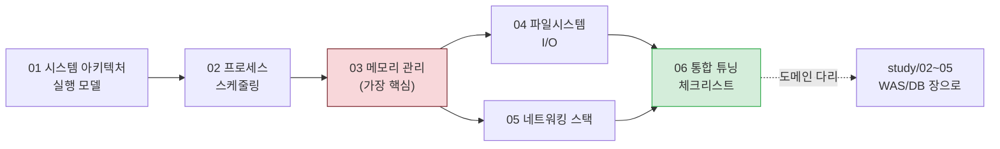
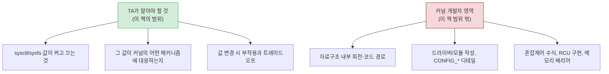

# Linux OS 심화 — TA 기본 소양 학습서

> 이 폴더는 "Linux 커널 파라미터가 왜 존재하는가"를 **운영체제 메커니즘 수준에서** 이해하려는 TA(Technical Advisor) 후보자를 위한 학습서다.
> 단순한 sysctl 사전이 아니다. 책을 읽듯이, 운영체제가 어떻게 동작하는지를 따라가며 인프라 튜닝값에 담긴 의사결정을 스스로 도출할 수 있게 하는 것이 목표다.

## 왜 별도의 Linux 심화서인가

본 프로젝트의 `study/02~05`(WAS/JVM, PostgreSQL, PgPool-II, MongoDB)는 각 도메인의 **설정값**을 다룬다. 하지만 그 값들은 모두 **Linux 커널 위에서** 동작한다. "PostgreSQL은 `vm.overcommit_memory=2`를, MongoDB 8.0은 `=1`을 원한다"는 사실을 외우는 것과, **왜 두 DB가 같은 호스트에 올라갈 수 없는지를 fork+copy-on-write와 OOM Killer의 동작으로 설명하는 것**은 전혀 다른 수준의 이해다.

전자는 외운 값이 시대에 뒤떨어지면 무력해진다. 후자는 메커니즘을 알기 때문에 새 버전·새 환경에서도 스스로 올바른 값을 도출할 수 있다. 이 학습서는 후자를 목표로 한다.

따라서 본 시리즈는 다른 도메인 장(02~05)의 **프리퀄(전편)**이다. WAS/DB 설정을 공부하기 전에, 그 아래에 있는 운영체제를 먼저 읽는다.

## 이 책의 읽는 법

각 장은 "왜 이 메커니즘이 존재하는가"라는 질문에서 출발해, 내부 동작을 따라가고, 마지막에 인프라 튜닝 파라미터와 연결된다. 읽는 순서는 의존성 방향을 따른다.

왜 이 순서인가. 메모리 관리(03)는 모든 것의 기반이라 가장 먼저 깊이 읽어야 한다 — 페이지 캐시를 이해 못 하면 PostgreSQL의 double buffering을 이해 못 하고, OOM Killer를 이해 못 하면 overcommit 충돌을 이해 못 한다. 프로세스(02)는 메모리를 소비하는 주체로서 메모리 장보다 먼저 오지만, 그 핵심(fork, 스케줄링)은 메모리 개념(page fault, CoW)과 맞닿아 있어 양쪽을 오가며 읽게 된다. 파일시스템(04)과 네트워크(05)는 각각 페이지 캐시·소켓(=fd)을 통해 메모리 장에 의존한다. 마지막 06장은 이 모든 개념을 인프라 튜닝값으로 종합하는 결론장이다.

## 장 구성

| 장 | 다루는 것 | 인프라 파라미터로의 다리 |
|:---:|:---|:---|
| 01 | 시스템 아키텍처, 부팅(GRUB→initramfs→systemd), 커널/사용자 공간, 시스템 콜, 인터럽트/softirq, cgroup/namespace 개요 | GRUB 커널 파라미터(`transparent_hugepage=`) |
| 02 | 프로세스/스레드, fork+CoW, EEVDF/CFS 스케줄러, 시그널, 좀비, System V 세마포어, cgroup v2 | `ulimit -u`, `kernel.sem`, cgroup 제한 |
| 03 | 가상 메모리, 페이지/TLB, page cache, dirty writeback, OOM Killer, overcommit, huge page(static/THP), NUMA | `vm.swappiness`, `overcommit_*`, `dirty_*`, THP, `zone_reclaim_mode` |
| 04 | VFS, inode/fd 3계층, ext4/xfs 저널링, buffered/direct I/O, I/O 스케줄러, fsync, mmap | `fs.file-max`, `nr_open`, `ulimit -n` |
| 05 | TCP 상태머신, SYN/accept 큐, TIME_WAIT/포트 고갈, keepalive/방화벽, conntrack, softirq/NAPI | `somaxconn`, `tcp_*`, `ip_local_port_range` |
| 06 | 전체 표준값 매트릭스, 서버 역할별(WAS/PG/Mongo/PgPool) 차이, systemd/cgroup 점검, 도메인 불변량 다리 | (모든 파라미터 통합) |

## 학습서의 깊이 경계

이 책은 **TA(인프라 기술 자문)** 를 위한 책이지, **커널 개발자**를 위한 책이 아니다. 두 역할의 경계를 명확히 한다.

판단 기준은 세 가지 질문이다. 어떤 지식을 다루기 전에 스스로에게 물어보라.

1. 이 지식 없이도 튜닝값을 판단할 수 있는가? — 그렇다면 과잉이다.
2. 운영 중 마주치는 로그/에러/증상을 해독하는 데 필요한가? — 아니라면 과잉이다.
3. 튜닝값 변경의 부작용을 예측하는 데 필요한가? — 아니라면 과잉이다.

예를 들어 CFS 스케줄러가 red-black tree로 구현된다는 사실은 TA에게 쓸모없다. 하지만 "EEVDF가 지연 민감 태스크를 우선시한다"는 것은 WAS 응답 지연을 이해하는 데 필요하므로 다룬다. 각 장에는 이 경계를 명시하는 "이 장에서 다루지 않는 것" 박스가 있다.

## 산출물과의 관계

- 이 학습서는 `reports/final/*.md`(운영자 배포 정본)와 `study/02~05`(도메인 장)의 **"왜"를 보충**하는 Explanation 자료다.
- 값의 정확성·시효성은 `harness/vendor-research.md`(리서치 근거)와 `.claude/skills/verify-standards`(검증 절차)가 담당한다.
- 이 학습서가 권위 있는 산출물은 아니다. 설정 적용 시에는 항상 `reports/final/` 정본을 따른다.
- 모든 기술 주장은 kernel.org Documentation, man pages, RHEL 공식 가이드, RFC에 근거하며, 각 장 말미에 출처를 명시한다.

## 학습 후 도달할 지점

이 시리즈를 끝내면 다음 질문에 스스로 답할 수 있어야 한다. 이것이 이 책의 완료 기준이다.

- 왜 PostgreSQL과 MongoDB 8.0을 같은 호스트에 올리면 안 되는가? (overcommit + THP, 두 축으로)
- 왜 `vm.swappiness=0`이 안전해 보이지만 실제로는 위험한가?
- 왜 `/etc/security/limits.conf`를 올려도 systemd 서비스에는 적용되지 않는가?
- 왜 WAS→DB 호출이 잦은 서버에서 ephemeral port가 고갈되며, `tcp_tw_recycle`은 왜 해결책이 아닌가?
- 왜 MongoDB 8.0은 THP를 켜라고 하는데, 같은 THP를 PostgreSQL은 끄라고 하는가?
- 왜 한 도메인의 커넥션 풀 값을 바꾸면 다른 도메인까지 재검증해야 하는가?

이 질문들은 06장의 결론에서 모두 연결된다. 지금은 답을 몰라도 좋다. 01장부터 천천히 읽어 내려가면, 마지막에는 이 모든 것이 하나의 그림으로 보일 것이다.
